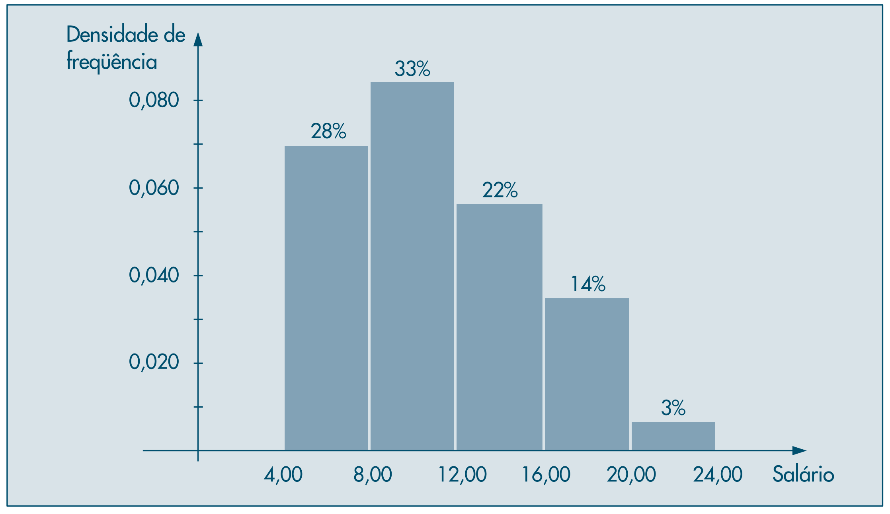
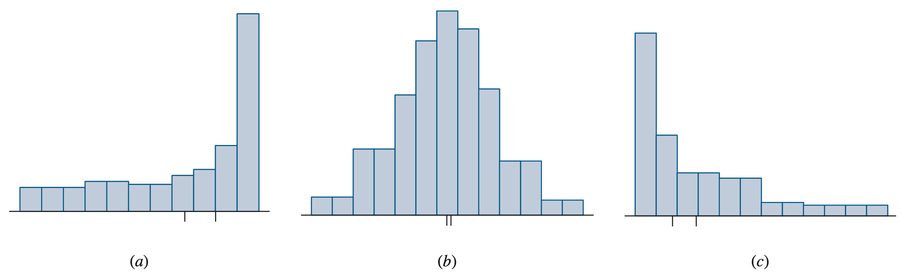
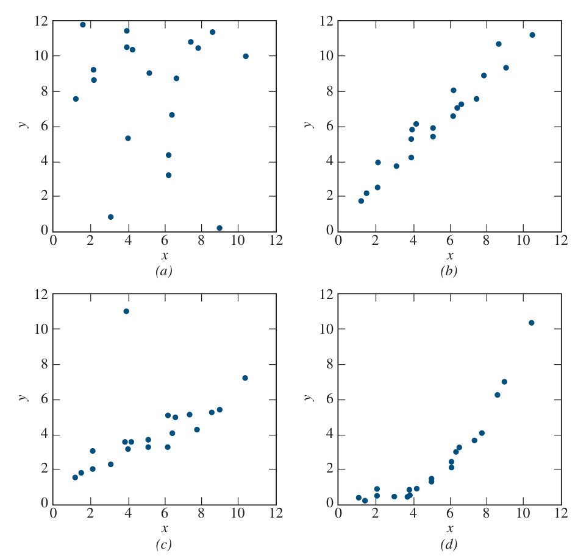
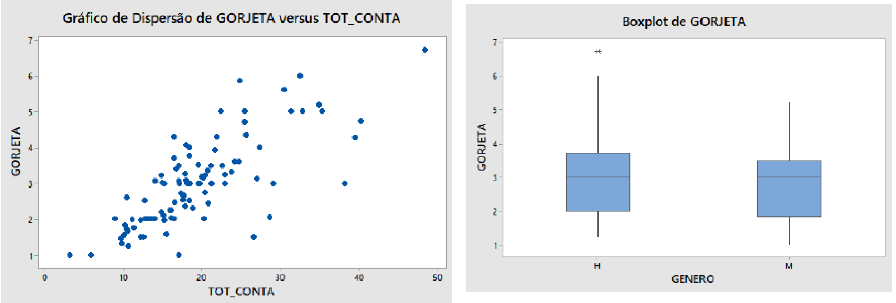
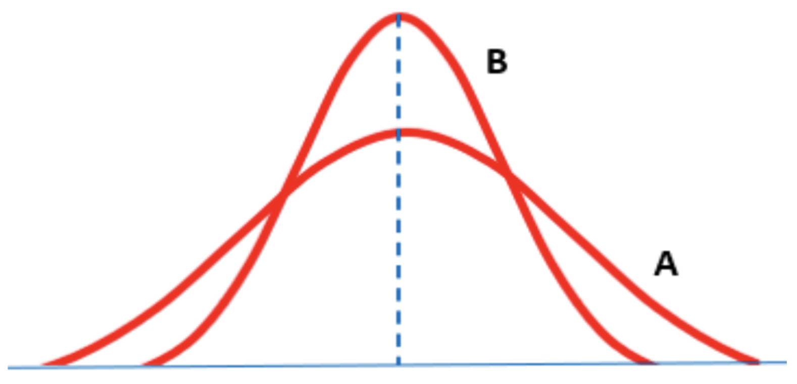
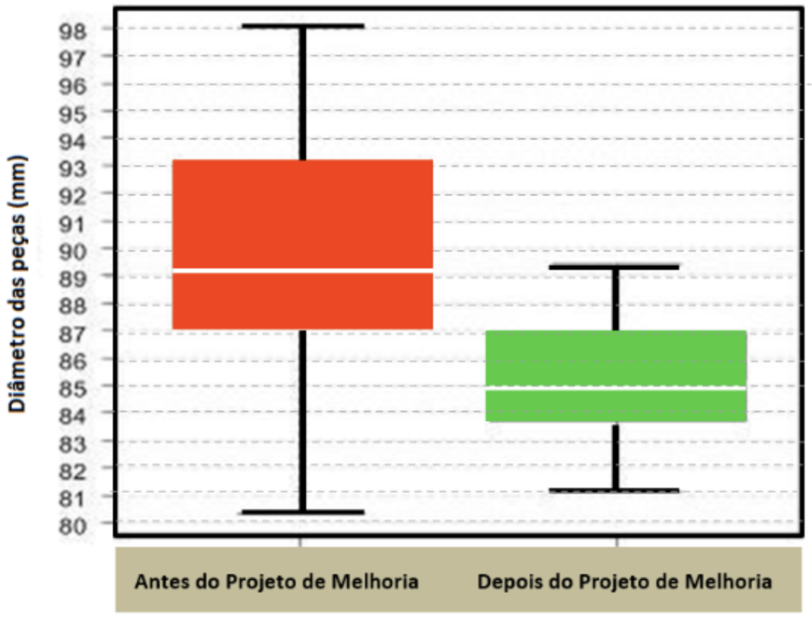

# Prova Modelo ENADE - Métodos Quantitativos

Curso: Ciência da Computação e Engenharias afins  
Valor total: **7,0 pontos**  
Tema: **Estatística descritiva**, com uso permitido de **análise visual não formal** em gráficos de dispersão e outras representações exploratórias.  
Observação: a prova inclui, adicionalmente, **uma questão específica sobre correlação formal**, inserida por adaptação direta de fonte do banco de questões.

## Instruções

- Leia cada item com atenção.
- Todas as questões são objetivas e possuem **5 alternativas**, com apenas **1 correta**.
- A pontuação de cada questão aparece ao lado do número do item, sempre em incrementos de `0,5`.
- Em alguns itens aparecem termos técnicos de Computação ou Engenharia. Quando isso ocorrer, o próprio enunciado traz uma explicação curta para manter a prova acessível a turmas diferentes.
- Quando houver gráfico ou imagem, a interpretação deve ser feita apenas com base nas informações visíveis no item.

## Fórmulas

As fórmulas abaixo podem ser usadas como apoio nas questões desta prova.

### Média aritmética

$$
\bar{x} = \frac{\sum x_i}{n}
$$

em que:
- $\bar{x}$ = média aritmética;
- $x_i$ = $i$-ésimo valor observado;
- $n$ = número total de observações.

### Média aritmética com frequências

$$
\bar{x} = \frac{\sum x_i f_i}{\sum f_i}
$$

em que:
- $\bar{x}$ = média aritmética;
- $x_i$ = valor da variável;
- $f_i$ = frequência do valor $x_i$;
- $\sum f_i$ = total de observações.

Essa expressão corresponde a uma **média ponderada**, em que as frequências $f_i$ atuam como pesos dos valores $x_i$.

### Frequência relativa

$$
f_{r_i} = \frac{f_i}{n}
$$

em que:
- $f_{r_i}$ = frequência relativa da classe ou valor $i$;
- $f_i$ = frequência absoluta da classe ou valor $i$;
- $n$ = número total de observações.

### Frequência relativa acumulada

$$
F_{r_k} = \frac{\sum_{i=1}^{k} f_i}{n}
$$

em que:
- $F_{r_k}$ = frequência relativa acumulada até a classe $k$;
- $f_i$ = frequência absoluta da classe $i$;
- $n$ = número total de observações.

### Mediana para dados não agrupados

Se os dados estiverem ordenados:

$$
Md = x_{\left(\frac{n+1}{2}\right)} \quad \text{(para $n$ ímpar)}
$$

$$
Md = \frac{x_{\left(\frac{n}{2}\right)} + x_{\left(\frac{n}{2}+1\right)}}{2} \quad \text{(para $n$ par)}
$$

em que:
- $Md$ = mediana;
- $x_{(j)}$ = valor na posição ordenada $j$;
- $n$ = número total de observações.

### Moda

$$
Mo = \text{valor com maior frequência}
$$

em que:
- $Mo$ = moda.

### Variância amostral

$$
s^2 = \frac{\sum (x_i-\bar{x})^2}{n-1}
$$

em que:
- $s^2$ = variância amostral;
- $x_i$ = $i$-ésimo valor observado;
- $\bar{x}$ = média aritmética da amostra;
- $n$ = número total de observações.

### Variância amostral com frequências

$$
s^2 = \frac{\sum f_i(x_i-\bar{x})^2}{\sum f_i - 1}
$$

em que:
- $s^2$ = variância amostral;
- $x_i$ = valor da variável;
- $f_i$ = frequência do valor $x_i$;
- $\bar{x}$ = média aritmética;
- $\sum f_i$ = total de observações.

### Desvio-padrão amostral

$$
s = \sqrt{s^2}
$$

em que:
- $s$ = desvio-padrão amostral;
- $s^2$ = variância amostral.

### Posição geral das medidas de posição (separatrizes)

$$
P(M_j) = \frac{j(n+1)}{m}
$$

em que:
- $P(M_j)$ = posição da medida de posição de ordem $j$;
- $j$ = ordem da medida de posição;
- $n$ = número total de observações;
- $m$ = número de partes iguais da divisão adotada.

### Amplitude interquartil

$$
IQR = Q_3 - Q_1
$$

em que:
- $IQR$ = amplitude interquartil;
- $Q_1$ = primeiro quartil;
- $Q_3$ = terceiro quartil.

## Questões

### Questão 1 (`0,5` ponto)

Uma equipe monitora a **latência** de uma API, isto é, o tempo entre o envio de uma requisição e a chegada da resposta. Em um lote de `40` medições, os tempos foram agrupados na tabela a seguir.

| Faixa de latência (ms) | Frequência |
| --- | ---: |
| 80 a 99 | 6 |
| 100 a 119 | 10 |
| 120 a 139 | 14 |
| 140 a 159 | 7 |
| 160 a 179 | 3 |
| Total | 40 |

Qual alternativa apresenta corretamente a **frequência relativa acumulada** até `139 ms`?

A. A frequência relativa acumulada até `139 ms` é `0,75`, pois `30` das `40` observações estão nas três primeiras classes.

B. A frequência relativa acumulada até `139 ms` é `0,60`, porque as duas primeiras classes somam menos observações do que a classe `120 a 139`.

C. A frequência relativa acumulada até `139 ms` é `0,65`, pois a distribuição dentro de cada faixa pode ser assumida como uniforme.

D. A frequência relativa acumulada até `139 ms` é `0,50`, porque a classe `120 a 139` ocupa posição aproximadamente central na distribuição.

E. A frequência relativa acumulada até `139 ms` não pode ser determinada sem conhecer os valores individuais observados em cada faixa.

**Feedback Geral**  
O conceito exigido aqui é frequência relativa acumulada. Primeiro somam-se as frequências até a classe solicitada; depois esse total é dividido pelo número total de observações. Como o limite pedido coincide com o limite superior de uma das classes, basta usar diretamente as frequências da tabela. Não é necessário conhecer os valores individuais dentro de cada faixa, nem assumir distribuição uniforme no interior das classes para calcular esse acumulado.

**Feedback Específico**  
- A. Correta. `(6 + 10 + 14) / 40 = 30 / 40 = 0,75`.
- B. Incorreta. Comparar a frequência de uma classe com a soma das anteriores não substitui o cálculo da frequência acumulada.
- C. Incorreta. Não é necessário assumir distribuição uniforme dentro das faixas para somar frequências por classe.
- D. Incorreta. A posição central de uma classe na tabela não implica frequência acumulada de `0,50`.
- E. Incorreta. Os valores individuais não são necessários para calcular o acumulado até o limite superior de uma classe.

### Questão 2 (`0,5` ponto)

Uma equipe de suporte registrou, em `20` turnos de atendimento, o número de **falhas críticas** detectadas por turno. Os dados foram resumidos na tabela:

| Falhas por turno | Frequência |
| --- | ---: |
| 0 | 4 |
| 1 | 5 |
| 2 | 7 |
| 3 | 3 |
| 5 | 1 |
| Total | 20 |

Com base nessa distribuição, assinale a alternativa correta.

A. Média `= 1,65`, mediana `= 2`, moda `= 1`.

B. Média `= 1,65`, mediana `= 2`, moda `= 2`.

C. Média `= 1,80`, mediana `= 2`, moda `= 2`.

D. Média `= 1,65`, mediana `= 3`, moda `= 2`.

E. Média `= 1,80`, mediana `= 1`, moda `= 2`.

**Feedback Geral**  
Esta questão articula três medidas de posição. A média precisa considerar os valores ponderados por suas frequências. A mediana depende da posição central quando os dados são ordenados. A moda identifica o valor com maior frequência. Em distribuições discretas, é importante não confundir o valor mais frequente com o valor central nem com a média.

**Feedback Específico**  
- A. Incorreta. Média e mediana estão corretas, mas a moda não é `1`.
- B. Correta. A média é `1,65`, a mediana é `2` e a moda também é `2`.
- C. Incorreta. Mediana e moda estão corretas, mas a média foi superestimada.
- D. Incorreta. Média e moda estão corretas, mas a mediana não é `3`.
- E. Incorreta. A média foi superestimada e a mediana não é `1`.

### Questão 3 (`0,5` ponto)

Em uma empresa de tecnologia, a equipe de dados precisa investigar falhas intermitentes em um sistema. Para isso, os analistas definem o problema, planejam a coleta, registram dados, organizam os resultados em tabelas e gráficos e, por fim, analisam e interpretam os resultados para apoiar decisões.

Com base nos conceitos básicos de estatística e nas fases do método estatístico, analise as afirmativas a seguir.

I. A estatística descritiva resume e organiza dados, enquanto a estatística inferencial busca apoiar generalizações da amostra para a população, quando isso é metodologicamente justificável.

II. O uso de aplicativos e softwares reduz erros operacionais e, por isso, torna secundária a avaliação crítica da qualidade e da representatividade dos dados.

III. Uma sequência coerente do método estatístico é: definição do problema, planejamento, coleta dos dados, organização, apresentação, análise e interpretação.

IV. A apresentação tabular e gráfica pode anteceder a definição do problema, desde que o banco de dados já exista.

V. A estatística inferencial pode apoiar generalizações e, por isso, independe da forma como os dados foram coletados.

Está correto o que se afirma em:

A. I e II, apenas.

B. II, III e IV, apenas.

C. I e III, apenas.

D. III e V, apenas.

E. I, III e V.

**Feedback Geral**  
Esta questão avalia se o estudante distingue corretamente estatística descritiva, estatística inferencial e as fases do método estatístico. Em termos metodológicos, o processo estatístico começa pela definição do problema, passa pelo planejamento e pela coleta de dados, segue para a organização e apresentação desses dados e só então chega à análise e à interpretação. Também é essencial compreender que ferramentas computacionais apoiam o trabalho, mas não substituem julgamento crítico.

**Feedback Específico**  
- A. Incorreta. A afirmativa II é falsa, pois softwares não tornam secundária a análise crítica dos dados.
- B. Incorreta. As afirmativas II e IV são falsas.
- C. Correta. As afirmativas I e III estão corretas.
- D. Incorreta. As afirmativas II e V são falsas.
- E. Incorreta. A afirmativa V torna a combinação incorreta.

### Questão 4 (`0,5` ponto)

Em uma fábrica, o salário por hora de operadores foi resumido em um histograma. A figura abaixo mostra a distribuição agrupada desses valores.

Fonte: MORETTIN, P. A.; BUSSAB, W. O. *Estatística básica*. 2010.

Assinale a alternativa que melhor descreve a distribuição mostrada.

A. A maior concentração está nas classes intermediárias, com cauda mais longa à direita.

B. A maior concentração está nas classes intermediárias, com distribuição aproximadamente uniforme entre as classes.

C. A distribuição é aproximadamente simétrica, pois as barras centrais são mais altas que as extremas.

D. A maior concentração está nas classes mais altas, com cauda mais longa à esquerda.

E. A distribuição apresenta concentração intermediária, mas não permite inferir assimetria.

**Feedback Geral**  
Um histograma permite descrever concentração, dispersão e forma da distribuição. A leitura correta depende de identificar onde estão as barras mais altas e para qual lado a distribuição se prolonga mais. Nesta figura, a massa principal está em classes intermediárias, enquanto há uma cauda se estendendo para valores mais altos.

**Feedback Específico**  
- A. Correta. A figura indica concentração no miolo e prolongamento à direita.
- B. Incorreta. Há concentração intermediária, mas as classes não têm comportamento aproximadamente uniforme.
- C. Incorreta. Barras centrais mais altas não bastam para caracterizar simetria.
- D. Incorreta. A concentração principal não está nas classes mais altas.
- E. Incorreta. O histograma permite, sim, inferir assimetria de forma visual.

### Questão 5 (`0,5` ponto)

Os histogramas abaixo ilustram três padrões de forma para distribuições: assimetria à esquerda, simetria aproximada e assimetria à direita.

Fonte: NAVIDI, W. *Statistics for engineers and scientists*. 2024.

Em distribuições com **assimetria à direita**, qual relação entre média e mediana costuma ser observada?

A. A média tende a ser menor que a mediana, porque a cauda direita desloca a posição central da distribuição.

B. A média tende a ser maior que a mediana, porque valores altos extremos influenciam mais a média do que a mediana.

C. A média e a mediana tendem a permanecer muito próximas, porque a assimetria à direita altera principalmente a amplitude total.

D. A mediana tende a ser maior que a média, pois é mais sensível à presença de observações altas.

E. A relação entre média e mediana não pode ser discutida em distribuições assimétricas sem conhecer os dados individuais.

**Feedback Geral**  
Em distribuições com assimetria à direita, há uma cauda formada por valores altos. Esses valores extremos puxam mais fortemente a média do que a mediana. Por isso, a média tende a ficar à direita da mediana. A mediana é mais resistente porque depende da posição central dos dados.

**Feedback Específico**  
- A. Incorreta. Em assimetria à direita, a média tende a ficar acima da mediana.
- B. Correta. Valores altos extremos elevam mais a média do que a mediana.
- C. Incorreta. A assimetria à direita tende justamente a afastar média e mediana.
- D. Incorreta. A mediana é mais resistente, não mais sensível, a valores altos extremos.
- E. Incorreta. A relação conceitual entre média e mediana pode ser discutida pela forma da distribuição.

### Questão 6 (`0,5` ponto)

O gráfico a seguir compara a quantidade absorvida de um fármaco por duas formulações: `Brand name` e `Generic`. O boxplot resume posição, dispersão e valores discrepantes por meio de quartis, mediana e pontos fora do padrão central.

Fonte: NAVIDI, W. *Statistics for engineers and scientists*. 2024.

Com base apenas no boxplot, assinale a alternativa correta.

A. A mediana da formulação `Brand name` é maior que a da `Generic`, assim como ambas as classes possuem dispersões interquartis similares e observações discrepantes.

B. A formulação `Generic` apresenta mediana maior que a `Brand name`, e ambas as formulações apresentam observações discrepantes.

C. Nenhuma das formulações apresenta observações discrepantes, pois todos os pontos observados estão dentro dos bigodes.

D. A formulação `Brand name` apresenta mediana menor e a mesma dispersão interquartil da `Generic`.

E. O boxplot permite concluir que a formulação utilizada é a causa da diferença observada na absorção.

**Feedback Geral**  
O boxplot resume a distribuição de cada grupo por quartis, mediana, bigodes e possíveis outliers. Ele permite comparar posição central e dispersão entre grupos. Nesta figura, a mediana da formulação genérica aparece acima da mediana da formulação de marca. Além disso, há observações discrepantes em ambas as formulações, embora em lados diferentes da distribuição.

**Feedback Específico**  
- A. Incorreta. A figura mostra outliers, mas a mediana da marca está abaixo da da genérica.
- B. Correta. A linha da mediana da genérica está visivelmente mais alta, e ambas as formulações exibem observações discrepantes.
- C. Incorreta. Há observações discrepantes marcadas fora dos bigodes.
- D. Incorreta. As medianas diferem e as caixas não indicam a mesma dispersão interquartil.
- E. Incorreta. O boxplot não permite concluir causalidade.

### Questão 7 (`0,5` ponto)

Na figura abaixo, cada histograma da linha superior deve ser associado a um boxplot da linha inferior.

Fonte: NAVIDI, W. *Statistics for engineers and scientists*. 2024.

Assinale a alternativa que apresenta uma associação coerente com a forma visual dos gráficos.

A. O histograma `(b)`, concentrado em valores altos e com cauda à esquerda, é compatível com o boxplot `(2)`, que apresenta mediana alta, cauda inferior mais longa e ponto discrepante inferior.

B. O histograma `(d)`, aproximadamente simétrico, é compatível com o boxplot `(4)`, pois ambos indicam equilíbrio entre quartis e ausência de assimetria.

C. O histograma `(a)`, com cauda à direita, é compatível com o boxplot `(2)`, porque ambos sugerem mediana baixa e valor discrepante inferior.

D. O histograma `(c)`, com concentração crescente à direita, é compatível com o boxplot `(4)`, pois ambos indicam concentração em valores altos e simetria.

E. O histograma `(b)` é compatível com o boxplot `(3)`, porque ambos sugerem cauda à esquerda sem observações discrepantes.

**Feedback Geral**  
Para associar histograma e boxplot, é preciso comparar forma, assimetria e presença de possíveis outliers. Um histograma concentrado em valores altos com cauda à esquerda tende a gerar boxplot com mediana situada em faixa mais elevada do eixo, cauda inferior mais longa e, às vezes, outlier inferior. O boxplot também informa assimetria, embora de modo mais resumido que o histograma.

**Feedback Específico**  
- A. Correta. O padrão de `(b)` combina com um boxplot assimétrico à esquerda e com ponto baixo isolado.
- B. Incorreta. O boxplot `(4)` não representa adequadamente uma distribuição aproximadamente simétrica.
- C. Incorreta. `(a)` não combina com um boxplot de cauda à esquerda e ponto discrepante inferior.
- D. Incorreta. `(c)` não corresponde a um boxplot simétrico em valores altos.
- E. Incorreta. `(b)` sugere observação discrepante e não corresponde ao boxplot `(3)`.

### Questão 8 (`0,5` ponto)

Um **gráfico de dispersão** mostra pares de valores `(x, y)` para duas variáveis medidas conjuntamente. Seu uso aqui é apenas **descritivo e visual**, sem cálculo de correlação formal.

Observe os quatro diagramas a seguir.

Fonte: NAVIDI, W. *Statistics for engineers and scientists*. 2024.

Qual alternativa descreve corretamente um dos padrões mostrados?

A. O gráfico `(a)` mostra tendência linear positiva, sem valores discrepantes aparentes.

B. O gráfico `(b)` mostra tendência positiva, mas com dispersão suficiente para impedir qualquer associação visual entre as variáveis.

C. O gráfico `(c)` mostra tendência aproximadamente linear positiva, com um ponto mais afastado do padrão principal.

D. O gráfico `(d)` mostra tendência crescente, porém predominantemente linear, sem indicação de curvatura.

E. O conjunto representado em `(c)` não sugere associação visual, pois um ponto discrepante invalida a análise do padrão geral.

**Feedback Geral**  
Nesta questão, o objetivo é ler padrões visuais em gráficos de dispersão sem recorrer a medida formal de associação. Um conjunto pode sugerir tendência linear, tendência curvilínea, ausência de padrão ou influência de ponto afastado. No gráfico `(c)`, há tendência positiva aproximadamente linear, mas um ponto se destaca do padrão principal, o que exige leitura qualitativa cuidadosa.

**Feedback Específico**  
- A. Incorreta. O gráfico `(a)` não é o que melhor representa uma tendência linear positiva clara.
- B. Incorreta. O gráfico `(b)` ainda sugere associação visual, apesar da dispersão.
- C. Correta. Há padrão positivo com um ponto afastado da nuvem principal.
- D. Incorreta. O gráfico `(d)` sugere crescimento com curvatura, não padrão predominantemente linear.
- E. Incorreta. Um ponto discrepante não impede, por si só, a identificação do padrão geral.

### Questão 9 (`0,5` ponto)

Considere os seguintes resumos estatísticos para dois conjuntos de dados, `A` e `B`, que representam tempos de processamento de duas rotinas computacionais.

| Estatística | A | B |
| --- | ---: | ---: |
| Mínimo | 0,066 | -2,235 |
| Primeiro quartil | 1,42 | 5,27 |
| Mediana | 2,60 | 8,03 |
| Terceiro quartil | 6,02 | 9,13 |
| Máximo | 10,08 | 10,51 |

Com base nesses resumos, assinale a alternativa correta.

A. O conjunto `B` tem amplitude interquartil maior que `A`, embora sua mediana também seja maior.

B. O conjunto `A` tem amplitude interquartil maior que `B`, apesar de ter mediana menor.

C. Os dois conjuntos têm a mesma dispersão central, pois ambos apresentam os cinco números-resumo.

D. O conjunto `B` apresenta quartis mais altos e, por isso, necessariamente maior dispersão.

E. Como os mínimos e máximos são próximos, não é possível distinguir a dispersão central entre `A` e `B`.

**Feedback Geral**  
Quartis permitem comparar a dispersão central mesmo sem acessar todos os dados brutos. A amplitude interquartil é dada por `Q3 - Q1` e mede a largura da metade central da distribuição. Quando essa amplitude é maior, a parte central dos dados está mais espalhada. Portanto, basta calcular os dois intervalos interquartis e compará-los.

**Feedback Específico**  
- A. Incorreta. `B` não tem IQR maior, embora tenha mediana maior.
- B. Correta. `A` tem `6,02 - 1,42 = 4,60`, maior que `3,86` de `B`.
- C. Incorreta. Ter os cinco números-resumo não implica mesma dispersão central.
- D. Incorreta. Quartis mais altos indicam posição maior, não necessariamente maior dispersão.
- E. Incorreta. A dispersão central pode ser comparada diretamente pelos quartis.

### Questão 10 (`0,5` ponto)

Considere as seguintes variáveis observadas em um estudo com estudantes:

`idade`, `ano de escolaridade`, `sexo`, `nota em Métodos Quantitativos`, `tempo gasto diariamente no estudo`, `distância de casa à instituição`, `local de estudo` e `número de irmãos`.

Com base na classificação estatística dessas variáveis, analise as afirmativas a seguir.

I. `sexo` e `local de estudo` são variáveis qualitativas nominais.

II. `idade`, `tempo gasto diariamente no estudo` e `distância de casa à instituição` são variáveis quantitativas discretas.

III. `ano de escolaridade` e `número de irmãos` podem ser tratados como variáveis quantitativas discretas.

IV. `nota em Métodos Quantitativos` é uma variável qualitativa nominal, pois pode ser associada a categorias de desempenho.

V. Todas as variáveis listadas são quantitativas, pois podem receber representação numérica.

Está correto o que se afirma em:

A. I e II, apenas.

B. II, III e IV, apenas.

C. I e III, apenas.

D. III e V, apenas.

E. I, III e V.

**Feedback Geral**  
Esta questão exige classificar variáveis segundo sua natureza. Variáveis qualitativas descrevem atributos ou categorias; variáveis quantitativas descrevem contagens ou medições numéricas. Entre as quantitativas, as discretas assumem valores contáveis, como número de irmãos, enquanto as contínuas resultam de mensuração, como tempo, distância e idade. A classificação correta da variável é decisiva para escolher tabelas, gráficos e medidas-resumo adequadas.

**Feedback Específico**  
- A. Incorreta. A afirmativa II é falsa, pois idade, tempo e distância são tratadas como contínuas.
- B. Incorreta. As afirmativas II e IV são falsas.
- C. Correta. As afirmativas I e III estão corretas.
- D. Incorreta. A afirmativa V é falsa, porque há variáveis qualitativas no conjunto.
- E. Incorreta. A afirmativa V torna a combinação incorreta.

### Questão 11 (`0,5` ponto)

Uma estudante de Engenharia de Software compromete parte de sua bolsa mensal com três grupos de despesas: `25%` com alimentação, `10%` com moradia e `20%` com transporte. No ano seguinte, sem mudança de renda nem de quantidades consumidas, os preços desses grupos variaram conforme a tabela:

| Grupo | Variação de preços (%) | Peso no orçamento total (%) |
| --- | ---: | ---: |
| Alimentação | 25,0 | 25 |
| Moradia | 7,0 | 10 |
| Transporte | 4,5 | 20 |

Considerando apenas esses três grupos, qual proporção da renda mensal passou a ser comprometida com essas despesas após os reajustes?

A. `36,50%`

B. `47,25%`

C. `55,00%`

D. `62,85%`

E. `91,50%`

**Feedback Geral**  
Esta questão combina proporção e ponderação. O gasto inicial com os três grupos corresponde a `55%` da renda. Como não houve mudança na renda nem nas quantidades consumidas, cada parcela do orçamento deve ser reajustada pelo índice de preço do respectivo grupo. Em seguida, somam-se os novos compromissos para obter a nova fração da renda comprometida. O raciocínio é equivalente ao uso de pesos em uma média ponderada aplicada a variações de preços.

**Feedback Específico**  
- A. Incorreta. Subestima o novo comprometimento total da renda.
- B. Incorreta. O valor fica abaixo do gasto original de `55%`, o que contradiz os reajustes positivos.
- C. Incorreta. Ignora o efeito dos aumentos de preço.
- D. Correta. `25×1,25 + 10×1,07 + 20×1,045 = 31,25 + 10,70 + 20,90 = 62,85`.
- E. Incorreta. Superestima fortemente o efeito dos reajustes.

### Questão 12 (`0,5` ponto)

Em um estudo sobre atendimento em um restaurante universitário, deseja-se avaliar se o **valor total da conta** influencia o **valor da gorjeta** e se o **gênero do cliente** está associado a diferenças no valor pago de gorjeta. Para isso, foram usados dois recursos:

- um **gráfico de dispersão** entre valor da conta e valor da gorjeta;
- um **gráfico comparativo por grupos** entre gênero e valor da gorjeta.

Fonte: ARAÚJO, C. C. *Banco de questões: provas e exercícios*. 2026. Adaptado de material citado na questão 62.

Analise as afirmações a seguir:

I. O gráfico de dispersão é apropriado para investigar a relação entre duas variáveis numéricas.

II. O boxplot permite comparar mediana, dispersão e possíveis valores discrepantes do valor da gorjeta entre os grupos.

III. O boxplot mostra que mulheres pagam gorjetas maiores que homens.

IV. A partir apenas da existência de associação, pode-se concluir causalidade entre valor da conta e valor da gorjeta.

Está correto o que se afirma em:

A. I e III, apenas.

B. I e II, apenas.

C. II e III, apenas.

D. I, II e IV, apenas.

E. I, II, III e IV.

**Feedback Geral**  
Esta questão articula leitura de gráfico de dispersão e boxplot. O gráfico de dispersão é adequado para duas variáveis numéricas e permite perceber padrão de associação. O boxplot, por sua vez, resume mediana, dispersão e possíveis outliers em grupos distintos. Contudo, ele não autoriza conclusões categóricas do tipo “um grupo sempre paga mais que o outro”, pois mostra distribuição resumida, não uma regra absoluta para todos os indivíduos. Além disso, associação observada em gráficos não implica causalidade.

**Feedback Específico**  
- A. Incorreta. A afirmação III é forte demais e não é sustentada pelo boxplot.
- B. Correta. I e II são corretas; III e IV são incorretas.
- C. Incorreta. A afirmação III não pode ser aceita como conclusão absoluta.
- D. Incorreta. A afirmação IV é metodologicamente falsa.
- E. Incorreta. III e IV não devem ser aceitas.

### Questão 13 (`0,5` ponto)

Em uma análise econômica, dois setores do PIB cearense tiveram seus valores mensais comparados ao longo de um mesmo período. As distribuições dos registros foram resumidas pelas curvas `A` e `B` abaixo.

Fonte: Adaptado de ENADE 2015 apud FIEC. In: ARAÚJO, C. C. *Banco de questões: provas e exercícios*. 2026.

Com base na figura, assinale a alternativa correta.

A. O desvio-padrão de `A` é menor que o de `B`, embora as duas distribuições indiquem a mesma média.

B. As distribuições `A` e `B` apresentam médias diferentes, pois a curva `A` ocupa uma faixa horizontal mais ampla.

C. O desvio-padrão da distribuição `A` é maior que o da distribuição `B`, e as médias são iguais.

D. A distribuição `B` apresenta maior concentração em torno do centro, mas isso impede qualquer comparação entre as dispersões.

E. As duas distribuições têm o mesmo desvio-padrão, pois ambas são aproximadamente simétricas.

**Feedback Geral**  
Esta questão explora a interpretação conjunta de centro e dispersão em distribuições aproximadamente simétricas. As duas curvas sugerem a mesma média, pois estão centradas aproximadamente no mesmo valor. No entanto, a curva `A` é mais espalhada e achatada, enquanto `B` é mais concentrada e alta. Em distribuições com mesmo centro, a curva mais larga tende a ter maior desvio-padrão. O coeficiente de variação não pode ser inferido apenas pela figura sem conhecer explicitamente a escala e o valor numérico da média.

**Feedback Específico**  
- A. Incorreta. As médias parecem iguais, mas `A` é mais dispersa, não menos.
- B. Incorreta. A maior faixa horizontal de `A` indica maior dispersão, não média diferente.
- C. Correta. `A` é mais espalhada e `B` mais concentrada, com mesma média aparente.
- D. Incorreta. Maior concentração em torno do centro permite, sim, comparar dispersões.
- E. Incorreta. Simetria não implica igualdade de desvio-padrão.

### Questão 14 (`0,5` ponto)

Em uma indústria metalúrgica, foi implementado um projeto de melhoria no processo de fabricação de peças cilíndricas. Para comparar os diâmetros produzidos **antes** e **depois** da intervenção, utilizou-se um **boxplot**, gráfico que resume a distribuição por meio do mínimo, `Q1`, mediana, `Q3` e máximo.

Fonte: ARAÚJO, C. C. *Banco de questões: provas e exercícios*. 2026. Adaptado da questão 49.

Analise as afirmações a seguir.

I. Antes do projeto, a mediana do diâmetro era maior do que após o projeto.

II. Antes do projeto, pelo menos `25%` das peças apresentavam diâmetro igual ou superior a `93 mm`.

III. Após o projeto, a metade central dos diâmetros ficou aproximadamente entre `84 mm` e `87 mm`.

IV. O boxplot, por si só, permite concluir que o projeto de melhoria foi a causa da mudança observada no processo.

Está correto o que se afirma em:

A. I e IV, apenas.

B. I, II e III, apenas.

C. II e IV, apenas.

D. III e IV, apenas.

E. I, II, III e IV.

**Feedback Geral**  
Esta questão exige leitura de medidas de posição em boxplot. A mediana é a linha interna da caixa; `Q1` e `Q3` delimitam a metade central dos dados, isto é, os `50%` centrais da distribuição. Assim, quando se afirma que ao menos `25%` dos valores estão acima de `Q3`, a interpretação é adequada. Já conclusões causais não podem ser sustentadas apenas por um gráfico descritivo, porque a figura mostra o comportamento dos dados, mas não prova, sozinha, a causa da mudança.

**Feedback Específico**  
- A. Incorreta. I é correta, mas IV não pode ser concluída apenas pelo boxplot.
- B. Correta. I, II e III são compatíveis com a leitura do gráfico; IV é indevida.
- C. Incorreta. II é correta, mas IV é metodologicamente indevida.
- D. Incorreta. III é correta, mas IV continua incorreta.
- E. Incorreta. A afirmação IV não é sustentada pelo gráfico.

## Gabarito

| Questão | Resposta |
| --- | --- |
| 1 | A |
| 2 | B |
| 3 | C |
| 4 | A |
| 5 | B |
| 6 | B |
| 7 | A |
| 8 | C |
| 9 | B |
| 10 | C |
| 11 | D |
| 12 | B |
| 13 | C |
| 14 | B |

## Fontes Principais Utilizadas

- `exs/und1/morettin_bussab_2010_exercicios_cap_1_2_3.md`
- `exs/und1/navidi_2024_exercicios_cap_1.md`
- `exs/und1/pinheiro_2009_exercicios_cap_1.md`
- `apostilas/Apostila 1 - Métodos Quantitativos V2.pdf`
- `apostilas/2026.1 - Banco de Questões - Provas e Exercícios.pdf`
