 
<b>

    Disciplina: Métodos Quantitativos

</b>

**Orientador: Prof. Me. Ricardo Carubbi**  
*Docente da Graduação e Pós-Graduação em Ciência de Dados e Inteligência Artificial* 
*Laboratório de Ciência de Dados e Inteligência Artificial* 
*Universidade de Fortaleza* 

# Guia de estudos para a AV3

Este guia orienta sua preparação para uma avaliação objetiva com tabelas, distribuições discretas, dados pareados e interpretações estatísticas. O foco não é decorar fórmulas isoladas, mas reconhecer o tipo de dado apresentado, escolher o procedimento correto e interpretar alternativas.

As orientações seguem a bibliografia-base da disciplina e os padrões de exercícios esperados para a avaliação, mas este material não substitui as aulas, listas e anotações.

## 1. O que esperar da AV3

A prova pode apresentar:

- tabelas de probabilidade de uma variável aleatória;
- tabelas de distribuição acumulada;
- tabelas de frequência;
- tabelas conjuntas de duas variáveis;
- pequenos conjuntos de dados com pares $(x,y)$;
- perguntas de interpretação sobre correlação, regressão, resíduos, $R^2$, extrapolação e outliers.

Em questões objetivas, muitas alternativas erradas parecem plausíveis porque usam a fórmula certa no lugar errado. Antes de calcular, identifique que tipo de dado você recebeu.

## 2. Roteiro geral de resolução

Use esta sequência antes de olhar as alternativas:

1. Identifique o tipo de dado: função de massa de probabilidade (PMF, do inglês *Probability Mass Function*), função de distribuição acumulada (CDF, do inglês *Cumulative Distribution Function*), frequência, tabela conjunta, densidade ou pares $(x,y)$.
2. Identifique o que a pergunta pede: probabilidade, média, variância, correlação, previsão ou interpretação.
3. Marque no enunciado quais são as variáveis: $X$, $Y$, $x_i$, $y_i$, $p_i$, $n_i$.
4. Escolha a fórmula mínima.
5. Verifique se o resultado tem sentido: probabilidade entre 0 e 1, correlação entre -1 e 1, variância não negativa.
6. Só depois compare com as alternativas.

## 3. Variáveis aleatórias

Antes de calcular, classifique a variável: se $X$ assume valores contáveis, use ferramentas de variáveis discretas; se $X$ assume valores em intervalos, use ferramentas de variáveis contínuas.

### 3.1 Variáveis aleatórias discretas

Variáveis aleatórias discretas assumem valores isolados, como contagens, número de sucessos, número de defeitos ou resultado de uma tentativa.

#### 3.1.1 Função de massa de probabilidade (PMF)

Use quando a tabela informa valores possíveis de $X$ e suas probabilidades $P(X=x)$. A função de massa de probabilidade (PMF, do inglês *Probability Mass Function*) associa cada valor discreto $x_i$ à probabilidade $P(X=x_i)$.

**Validade da PMF:**

$$
p_i=P(X=x_i), \quad p_i\ge0,
\qquad
\sum_i p_i=1
\tag{3.1}
$$

**Probabilidade de um evento:**

$$
P(X\in A)=\sum_{x_i\in A}P(X=x_i)
\tag{3.2}
$$

**Probabilidade acumulada a partir da PMF:**

$$
P(X\le c)=\sum_{x_i\le c}P(X=x_i)
\tag{3.3}
$$

Variáveis: $x_i$ são valores possíveis, $p_i$ são probabilidades, $A$ é o conjunto de interesse e $c$ é um ponto de corte.

Erro comum: calcular média simples dos valores $x_i$ sem usar as probabilidades $p_i$.

#### 3.1.2 Bernoulli

Use quando há uma única tentativa com dois resultados possíveis.

$$
P(X=1)=p,\qquad P(X=0)=1-p
\tag{3.4}
$$

Uso típico: sucesso/fracasso, sim/não ou defeituoso/não defeituoso. O ponto central é definir claramente qual resultado será tratado como sucesso.

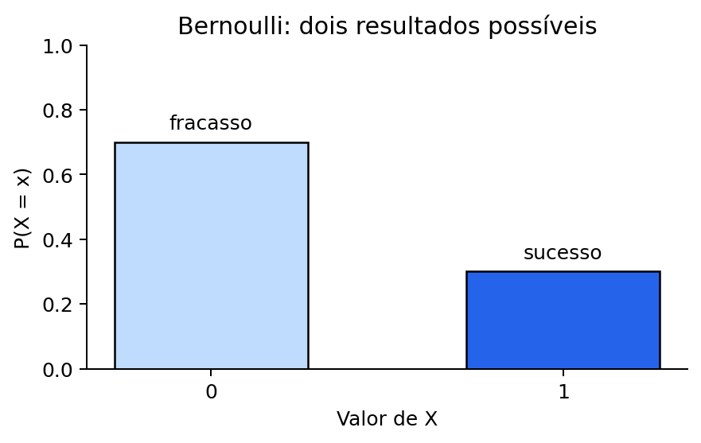

**Figura 1 - Função de massa de probabilidade da distribuição Bernoulli.** A figura apresenta dois resultados possíveis para $X$, evidenciando que toda a probabilidade se concentra em fracasso ou sucesso. A leitura correta é identificar qual resultado foi definido como sucesso e qual valor de $p$ foi atribuído a ele. Fonte: Carubbi, 2026.

#### 3.1.3 Binomial

Use quando se conta o número de sucessos em $n$ tentativas independentes, todas com a mesma probabilidade $p$ de sucesso.

$$
P(X=x)=\binom{n}{x}p^x(1-p)^{n-x},
\qquad x=0,1,\ldots,n
\tag{3.5}
$$

Restrição essencial: as tentativas precisam ser independentes e $p$ deve permanecer constante.

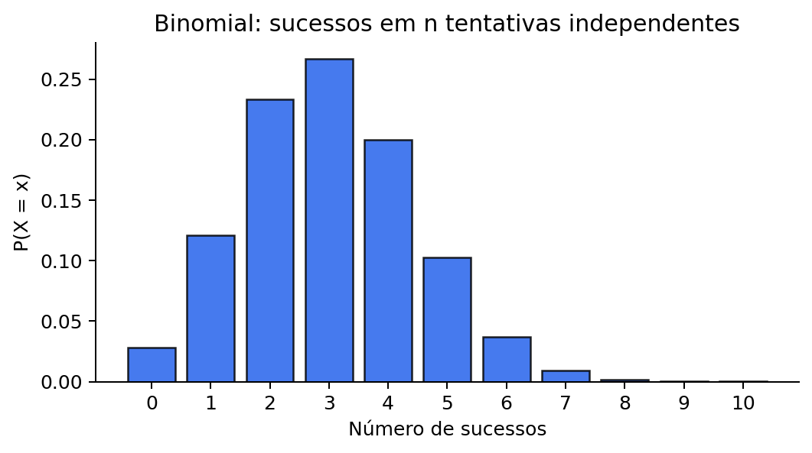

**Figura 2 - Função de massa de probabilidade da distribuição binomial.** A figura mostra a distribuição do número de sucessos em tentativas independentes com probabilidade constante $p$. A interpretação central é localizar onde a massa de probabilidade se concentra e lembrar que cada barra representa $P(X=x)$, não uma frequência absoluta. Fonte: Carubbi, 2026.

#### 3.1.4 Poisson

Use quando $X$ representa uma contagem de ocorrências em intervalo de tempo, área ou espaço, dada uma taxa média $\lambda$.

$$
P(X=x)=\frac{e^{-\lambda}\lambda^x}{x!},
\qquad x=0,1,2,\ldots
\tag{3.6}
$$

Restrição essencial: Poisson é modelo de contagem. Não deve ser usado para proporções, medidas contínuas ou contagens com taxa claramente variável.

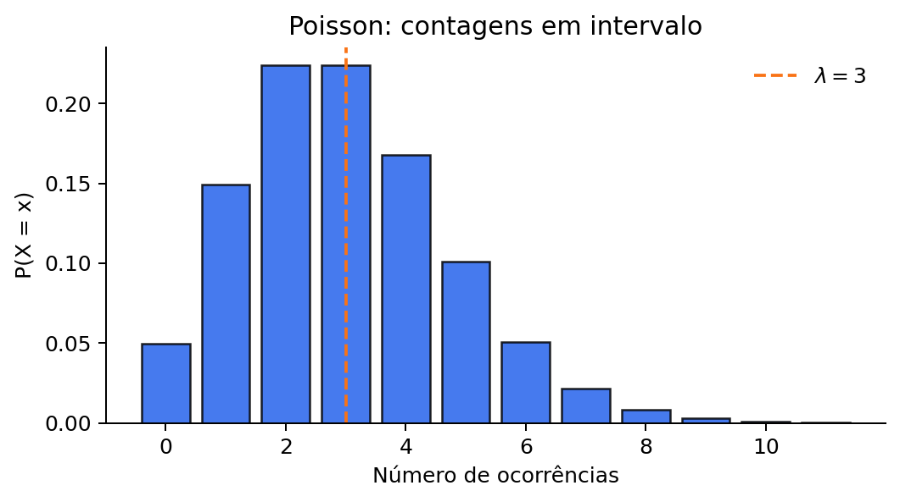

**Figura 3 - Função de massa de probabilidade da distribuição de Poisson.** A figura representa uma contagem discreta governada por uma taxa média $\lambda$. A concentração das barras em torno da taxa ajuda a reconhecer situações de número de ocorrências em intervalo de tempo, área ou espaço. Fonte: Carubbi, 2026.

#### 3.1.5 Uniforme discreta

Use quando todos os $k$ valores possíveis têm a mesma probabilidade.

$$
P(X=x_i)=\frac{1}{k},
\qquad i=1,2,\ldots,k
\tag{3.7}
$$

Restrição essencial: é preciso contar corretamente quantos valores são possíveis.

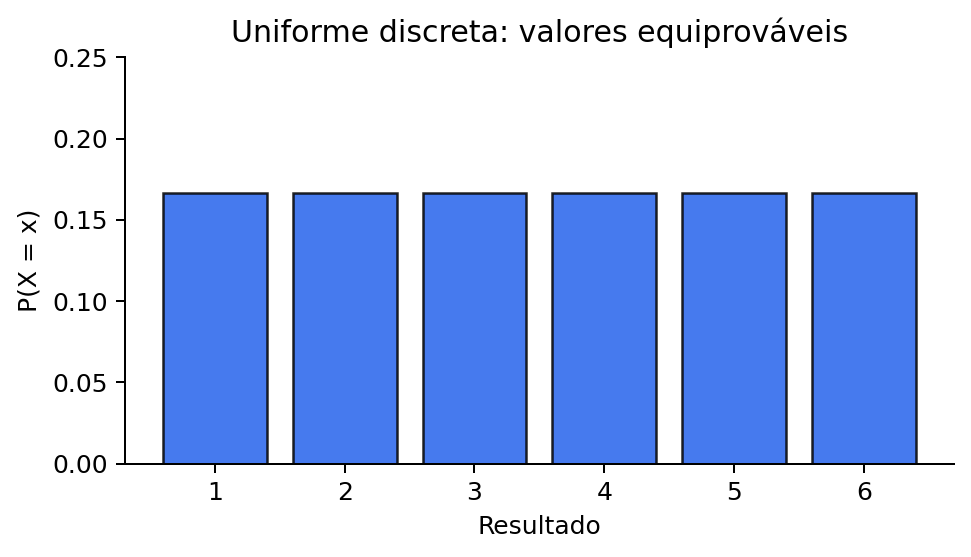

**Figura 4 - Função de massa de probabilidade da distribuição uniforme discreta.** A figura exibe barras com a mesma altura, indicando valores discretos equiprováveis. A interpretação correta depende de contar o número de valores possíveis e atribuir probabilidade $1/k$ a cada um. Fonte: Carubbi, 2026.

#### 3.1.6 Hipergeométrica

Use quando a amostragem é sem reposição em uma população finita.

$$
P(X=x)=\frac{\binom{K}{x}\binom{N-K}{n-x}}{\binom{N}{n}}
\tag{3.8}
$$

Variáveis: $N$ é o tamanho da população, $K$ é o número de sucessos na população, $n$ é o tamanho da amostra e $x$ é o número de sucessos observados na amostra.

Os valores possíveis de $x$ devem respeitar simultaneamente o número de sucessos disponíveis e o número de fracassos disponíveis. Assim, $x$ não pode ser maior que $K$, não pode ser maior que $n$ e também não pode exigir mais fracassos do que existem na população.

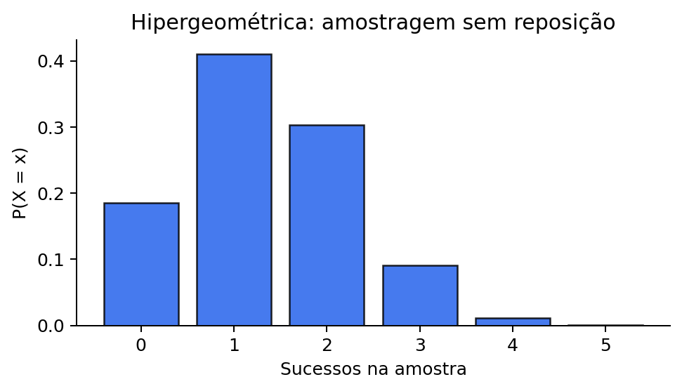

**Figura 5 - Função de massa de probabilidade da distribuição hipergeométrica.** A figura representa a contagem de sucessos em uma amostra retirada sem reposição de uma população finita. A leitura deve considerar os limites possíveis de $x$, definidos pelo número de sucessos e fracassos disponíveis na população. Fonte: Carubbi, 2026.

#### 3.1.7 Geométrica

Use quando $X$ representa a tentativa em que ocorre o primeiro sucesso.

$$
P(X=x)=(1-p)^{x-1}p,
\qquad x=1,2,3,\ldots
\tag{3.9}
$$

Restrição essencial: esta convenção conta a tentativa do primeiro sucesso, não o número de fracassos antes do sucesso.

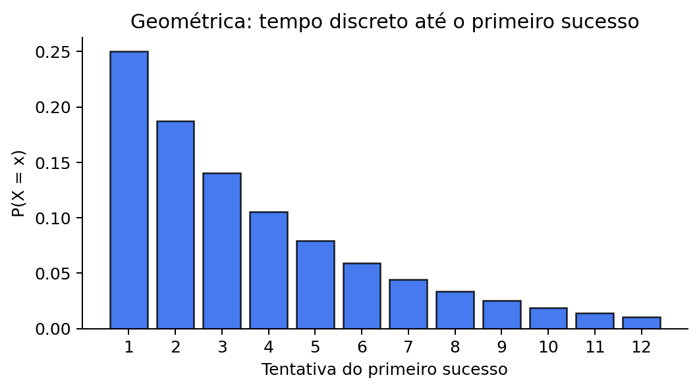

**Figura 6 - Função de massa de probabilidade da distribuição geométrica.** A figura mostra probabilidades decrescentes para a tentativa em que ocorre o primeiro sucesso. O padrão visual reforça que valores menores de $X$ são mais prováveis quando a probabilidade de sucesso em cada tentativa é fixa. Fonte: Carubbi, 2026.

#### 3.1.8 Função de distribuição acumulada discreta (CDF)

Use quando a tabela informa valores acumulados da forma $F(x)=P(X\le x)$. A função de distribuição acumulada é indicada por CDF, sigla derivada do inglês *Cumulative Distribution Function*.

$$
F(x)=P(X\le x)
\tag{3.10}
$$

**Probabilidade pontual por salto da CDF:**

$$
P(X=x_i)=F(x_i)-F(x_i^-)
\tag{3.11}
$$

Em uma tabela discreta ordenada:

$$
P(X=x_i)=F(x_i)-F(x_{i-1})
$$

quando $x_{i-1}$ é o valor imediatamente anterior a $x_i$.

**Probabilidade em intervalo discreto:**

$$
P(a<X\le b)=F(b)-F(a)
\tag{3.12}
$$

Não confunda $F(1)$ com $P(X=1)$. A expressão $F(1)$ significa $P(X\le1)$.

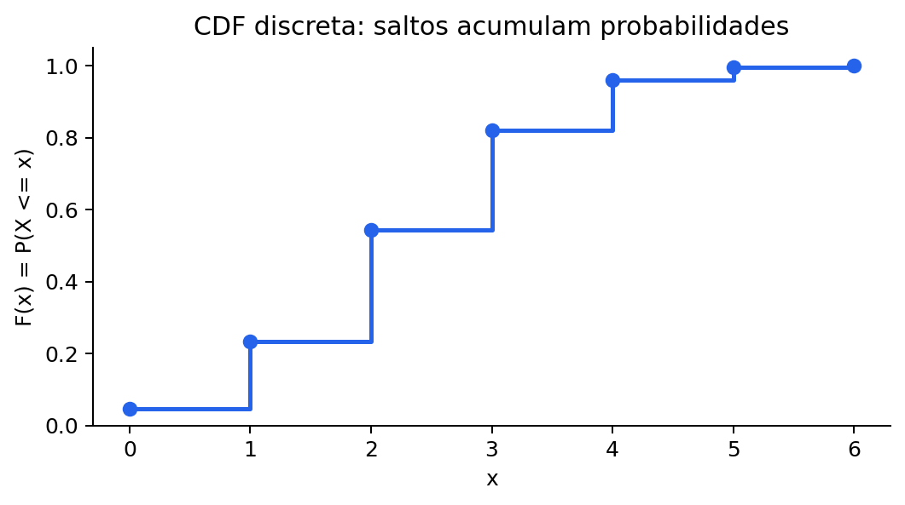

**Figura 7 - Função de distribuição acumulada discreta em degraus.** A figura ilustra que a função de distribuição acumulada (CDF) cresce por saltos nos valores possíveis de uma variável discreta. Cada salto corresponde a uma probabilidade pontual $P(X=x)$, enquanto os trechos planos indicam ausência de nova massa de probabilidade no intervalo. Fonte: Carubbi, 2026.

#### 3.1.9 Frequências e PMF empírica

Use quando a tabela apresenta contagens observadas, e não probabilidades prontas. A PMF empírica é uma função de massa de probabilidade estimada pelas frequências relativas.

$$
n=\sum_i n_i
\tag{3.13}
$$

$$
\hat{p}_i=\frac{n_i}{n}
\tag{3.14}
$$

$$
\hat{P}(X\in A)=\sum_{x_i\in A}\hat{p}_i
\tag{3.15}
$$

Frequências absolutas não são probabilidades. Em prova objetiva, uma alternativa pode errar por usar $n_i$ diretamente no lugar de $\hat{p}_i$.

#### 3.1.10 Esperança, variância e desvio-padrão

Use quando a pergunta pede valor esperado, média teórica, variância, dispersão, desvio-padrão ou comparação de risco.

Nesta seção, $DP(X)$ indica o desvio-padrão da variável aleatória $X$.

$$
E(X)=\sum_i x_iP(X=x_i)
\tag{3.16}
$$

$$
E(X^2)=\sum_i x_i^2P(X=x_i)
\tag{3.17}
$$

$$
Var(X)=E(X^2)-[E(X)]^2
\tag{3.18}
$$

$$
DP(X)=\sqrt{Var(X)}
\tag{3.19}
$$

$E(X)$ não precisa ser um valor possível de $X$. Ele é uma média teórica ponderada pelas probabilidades. Erro comum: esquecer o quadrado em $E(X^2)$ ou calcular $Var(X)=E(X^2)-E(X)$.

#### 3.1.11 Transformação linear de variável aleatória

Use quando uma nova variável é definida por uma expressão linear, como ganho, custo, receita ou escala convertida.

$$
Y=a+bX
\tag{3.20}
$$

$$
E(Y)=a+bE(X)
\tag{3.21}
$$

$$
Var(Y)=b^2Var(X)
\tag{3.22}
$$

$$
DP(Y)=|b|DP(X)
\tag{3.23}
$$

A constante $a$ altera a média, mas não altera a variabilidade. O fator $b$ altera a variância pelo quadrado $b^2$.

#### 3.1.12 Distribuição conjunta, marginais e independência

Use quando a tabela apresenta probabilidades para pares $(X,Y)$.

$$
p(x,y)=P(X=x,Y=y)
\tag{3.24}
$$

$$
P(X=x)=\sum_y P(X=x,Y=y)
\tag{3.25}
$$

$$
P(Y=y)=\sum_x P(X=x,Y=y)
\tag{3.26}
$$

$$
P(X=x,Y=y)=P(X=x)P(Y=y)
\tag{3.27}
$$

para todos os pares relevantes $(x,y)$.

$$
E[g(X,Y)]=\sum_x\sum_y g(x,y)P(X=x,Y=y)
\tag{3.28}
$$

Em tabelas conjuntas, "marginal" significa somar linhas ou colunas. Para independência, não basta uma célula funcionar; a relação precisa valer para todos os pares relevantes.

### 3.2 Variáveis aleatórias contínuas

Variáveis aleatórias contínuas assumem valores em intervalos. Nelas, probabilidade é área sob uma curva, não altura da curva em um ponto.

Nesta seção, os modelos contínuos trabalhados são: uniforme contínua, normal e exponencial.

#### 3.2.1 Densidade, CDF e probabilidade em intervalo

$$
f(x)\ge0,
\qquad
\int_{-\infty}^{\infty} f(x)\,dx=1
\tag{3.29}
$$

$$
P(a<X<b)=\int_a^b f(x)\,dx
\tag{3.30}
$$

$$
F(x)=P(X\le x)=\int_{-\infty}^{x}f(t)\,dt
\tag{3.31}
$$

$$
P(a<X\le b)=F(b)-F(a)
\tag{3.32}
$$

$$
P(X=a)=0
\tag{3.33}
$$

Densidade pode ser maior que 1 em alguns pontos; isso não é erro. O que precisa somar 1 é a área total. Para a AV3, priorize a interpretação operacional: densidade representa altura da curva, probabilidade representa área e CDF fornece probabilidades acumuladas.

#### 3.2.2 Uniforme contínua

Use quando todos os intervalos de mesmo comprimento têm a mesma probabilidade dentro de um intervalo permitido $(a,b)$.

$$
f(x)=\frac{1}{b-a},
\qquad a<x<b
\tag{3.34}
$$

$$
P(c<X<d)=\frac{d-c}{b-a},
\qquad a\le c<d\le b
\tag{3.35}
$$

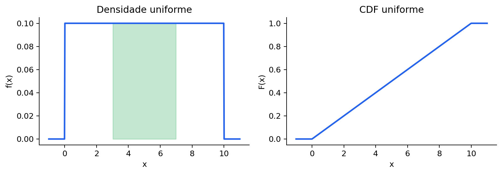

**Figura 8 - Densidade e função de distribuição acumulada da distribuição uniforme contínua.** A figura mostra uma densidade constante no intervalo permitido e a respectiva função acumulada crescente. A interpretação essencial é que probabilidades são proporcionais ao comprimento do intervalo, e não ao valor da densidade em um único ponto. Fonte: Carubbi, 2026.

#### 3.2.3 Normal

Use quando a variável é contínua, aproximadamente simétrica em torno de uma média e com dispersão descrita por desvio-padrão.

$$
X\sim N(\mu,\sigma^2)
\tag{3.36}
$$

$$
Z=\frac{X-\mu}{\sigma}
\tag{3.37}
$$

$$
P(a<X<b)=P\left(\frac{a-\mu}{\sigma}<Z<\frac{b-\mu}{\sigma}\right)
\tag{3.38}
$$

A padronização exige $\sigma>0$. A normal é adequada para medidas contínuas aproximadamente simétricas; não é modelo natural para contagens pequenas ou valores sempre positivos muito assimétricos.

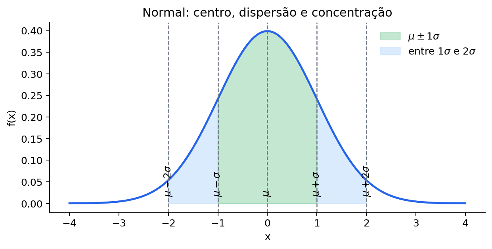

**Figura 9 - Distribuição normal com marcações em torno da média.** A figura representa a curva normal com destaque para $\mu$, $\mu\pm\sigma$ e $\mu\pm2\sigma$. A leitura adequada é associar $\sigma$ ao espalhamento dos dados e reconhecer que a maior concentração de probabilidade ocorre em torno da média. Fonte: Carubbi, 2026.

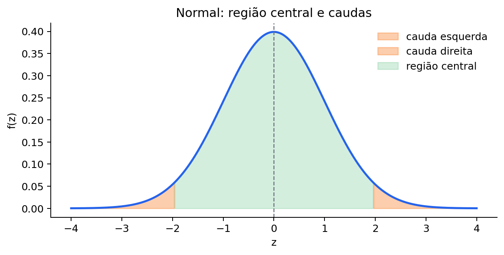

**Figura 10 - Distribuição normal com região central e caudas.** A figura destaca que probabilidades extremas ficam nas caudas da curva, enquanto a região central concentra a maior parte da massa de probabilidade. Em questões objetivas, a interpretação depende de identificar se a área solicitada está à esquerda, à direita ou entre dois valores. Fonte: Carubbi, 2026.

#### 3.2.4 Exponencial

Use quando a variável representa tempo de espera até uma ocorrência, com taxa constante $\lambda$.

$$
X\sim Exp(\lambda)
\tag{3.39}
$$

$$
f(x)=\lambda e^{-\lambda x}, \quad x>0
\tag{3.40}
$$

$$
F(x)=P(X\le x)=1-e^{-\lambda x}, \quad x>0
\tag{3.41}
$$

$$
P(X>x)=e^{-\lambda x}
\tag{3.42}
$$

No modelo exponencial, $x>0$ e $\lambda>0$. O erro mais comum é confundir $P(X\le x)$ com $P(X>x)$.

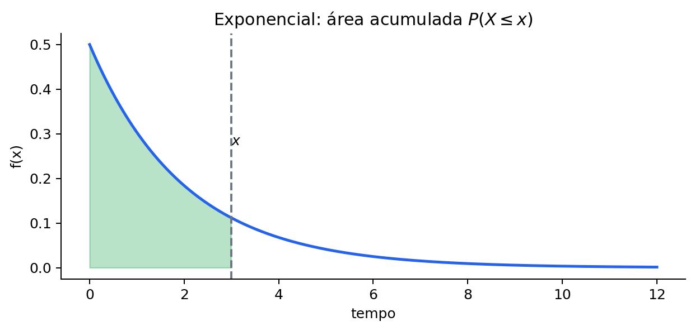

**Figura 11 - Distribuição exponencial com área acumulada.** A figura mostra $P(X\le x)$ como a área sob a curva desde a origem até o ponto $x$. Esse gráfico é adequado para interpretar tempos de espera em que a pergunta pede a probabilidade de ocorrência até determinado tempo. Fonte: Carubbi, 2026.

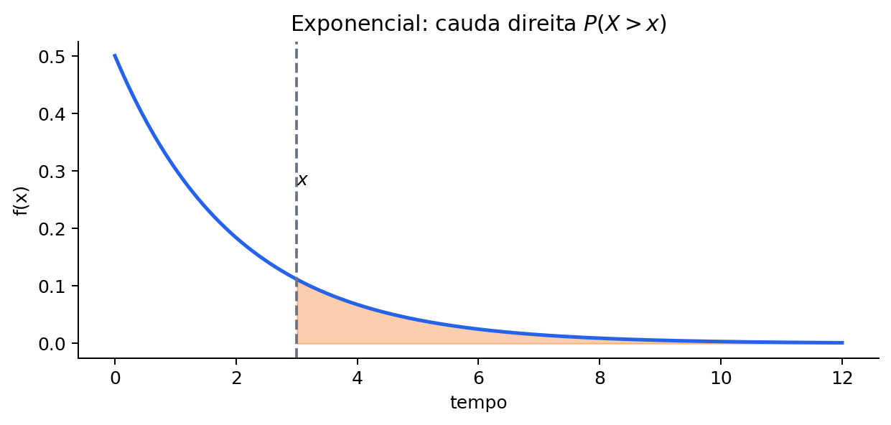

**Figura 12 - Distribuição exponencial com cauda direita.** A figura mostra $P(X>x)$ como a área à direita do ponto $x$. A interpretação central é distinguir a probabilidade acumulada $P(X\le x)$ da probabilidade de sobrevivência $P(X>x)=1-P(X\le x)$. Fonte: Carubbi, 2026.

### 3.3 Resumo visual dos modelos de distribuição

| Modelo | Figura | Sinal visual principal |
| --- | --- | --- |
| Bernoulli |  | dois valores possíveis |
| Binomial |  | número de sucessos em tentativas repetidas |
| Poisson |  | contagem concentrada perto de uma taxa média |
| Uniforme discreta |  | barras com mesma altura |
| Hipergeométrica |  | contagem de sucessos sem reposição |
| Geométrica |  | barras decrescentes até o primeiro sucesso |
| Uniforme contínua |  | densidade constante em um intervalo |
| Normal |  | curva simétrica, centro em $\mu$ e caudas |
| Exponencial |   | curva decrescente com cauda direita |

## 4. Correlação linear de Pearson

### Quando usar

Use esta ficha quando há dados pareados $(x_i,y_i)$ e a pergunta pede direção ou intensidade da associação linear.

### Roteiro operacional com dados pareados

Quando a questão apresentar uma tabela com pares $(x_i,y_i)$, organize uma tabela auxiliar antes de calcular:

| Coluna | Uso |
| --- | --- |
| $x_i$ | valores da variável explicativa ou primeira variável observada |
| $y_i$ | valores da variável resposta ou segunda variável observada |
| $x_i^2$ | cálculo de $\sum x_i^2$ |
| $y_i^2$ | cálculo de $\sum y_i^2$ |
| $x_iy_i$ | cálculo de $\sum x_iy_i$ |

Esse roteiro reduz erros aritméticos e ajuda a identificar o sinal da associação antes de calcular $r$.

### Fórmulas

**Médias amostrais:**

$$
\bar{x}=\frac{1}{n}\sum_{i=1}^n x_i,
\quad
\bar{y}=\frac{1}{n}\sum_{i=1}^n y_i
\tag{4.1}
$$

**Correlação linear de Pearson:**

$$
r=\frac{\sum_{i=1}^n (x_i-\bar{x})(y_i-\bar{y})}
{\sqrt{\sum_{i=1}^n (x_i-\bar{x})^2\sum_{i=1}^n (y_i-\bar{y})^2}}
\tag{4.2}
$$

**Limites da correlação:**

$$
-1\le r\le 1
\tag{4.3}
$$

**Forma computacional da correlação:**

$$
r=
\frac{n\sum x_iy_i-\sum x_i\sum y_i}
{\sqrt{\left[n\sum x_i^2-(\sum x_i)^2\right]\left[n\sum y_i^2-(\sum y_i)^2\right]}}
\tag{4.4}
$$

### Variáveis e definições

- $x_i$: valor observado da primeira variável.
- $y_i$: valor observado da segunda variável.
- $\bar{x}$: média dos valores de $x$.
- $\bar{y}$: média dos valores de $y$.
- $n$: número de pares observados.
- $r$: coeficiente de correlação linear.
- $\sum x_iy_i$: soma dos produtos dos pares observados.

### Restrições e limites

- Exige dados pareados.
- Não pode haver variância zero em $X$ ou em $Y$.
- Mede associação linear, não associação curvilínea.
- Correlação não prova causalidade.
- A forma computacional exige cuidado com arredondamentos; quando possível, mantenha mais casas decimais nos cálculos intermediários.

### Observações didáticas

O sinal de $r$ indica direção. O módulo $|r|$ indica força linear. Se $r$ é próximo de zero, pode não haver relação linear forte, mas ainda pode existir uma relação não linear.

Erro comum: interpretar $r=0{,}8$ como "80% explicado". Essa interpretação é de $R^2$, não de $r$.

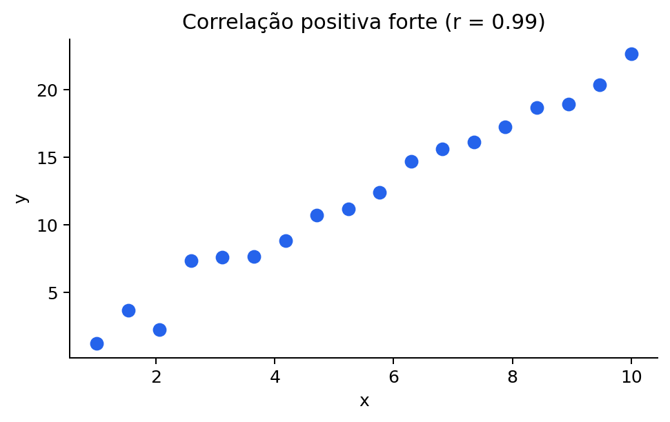

**Figura 13 - Nuvem de pontos com correlação positiva.** A figura mostra uma associação linear ascendente: valores maiores de $x$ tendem a ocorrer com valores maiores de $y$. Esse padrão visual antecipa um coeficiente de correlação $r$ positivo. Fonte: Carubbi, 2026.

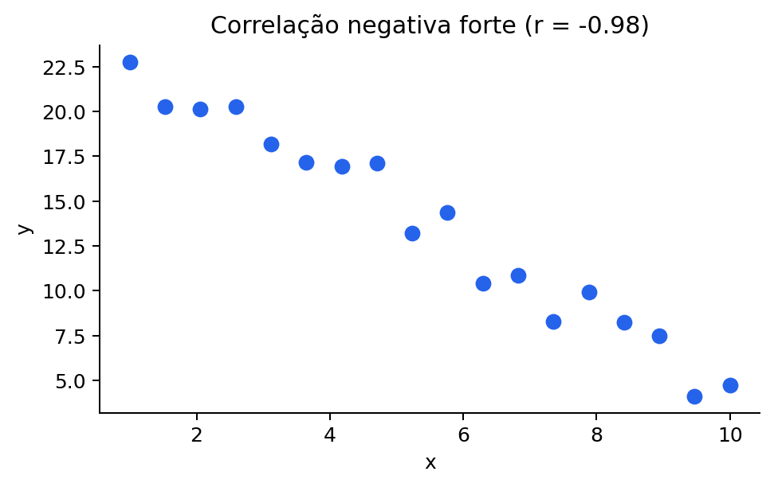

**Figura 14 - Nuvem de pontos com correlação negativa.** A figura mostra uma associação linear descendente: valores maiores de $x$ tendem a ocorrer com valores menores de $y$. Esse padrão visual antecipa um coeficiente de correlação $r$ negativo. Fonte: Carubbi, 2026.

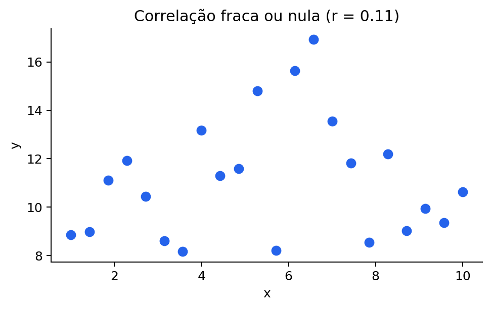

**Figura 15 - Nuvem de pontos com correlação linear fraca.** A figura apresenta pontos sem direção linear clara, indicando correlação próxima de zero. A interpretação correta é que não há associação linear forte, embora isso não elimine a possibilidade de outro tipo de relação. Fonte: Carubbi, 2026.

## 5. Regressão linear simples

### Quando usar

Use esta ficha quando o objetivo é prever ou explicar uma variável resposta $Y$ a partir de uma variável explicativa $X$.

### Fórmulas

**Modelo ajustado:**

$$
\hat{y}=a+bx
\tag{5.1}
$$

**Inclinação da reta:**

$$
b=\frac{\sum_{i=1}^n (x_i-\bar{x})(y_i-\bar{y})}
{\sum_{i=1}^n (x_i-\bar{x})^2}
\tag{5.2}
$$

**Intercepto da reta:**

$$
a=\bar{y}-b\bar{x}
\tag{5.3}
$$

**Valor previsto:**

$$
\hat{y}_i=a+bx_i
\tag{5.4}
$$

**Inclinação pela forma computacional:**

$$
b=\frac{n\sum x_iy_i-\sum x_i\sum y_i}{n\sum x_i^2-(\sum x_i)^2}
\tag{5.5}
$$

**Intercepto pela média dos dados:**

$$
a=\frac{\sum y_i-b\sum x_i}{n}
\tag{5.6}
$$

### Variáveis e definições

- $x_i$: valor observado da variável explicativa.
- $y_i$: valor observado da variável resposta.
- $\bar{x}$: média dos valores de $x$.
- $\bar{y}$: média dos valores de $y$.
- $a$: intercepto da reta.
- $b$: inclinação da reta.
- $\hat{y}_i$: valor previsto para $y_i$.
- $\sum x_i$, $\sum y_i$, $\sum x_i^2$, $\sum x_iy_i$: somas obtidas na tabela auxiliar dos dados pareados.

### Restrições e limites

- A variável $X$ precisa variar; se todos os $x_i$ forem iguais, não há reta ajustável.
- A reta resume uma tendência linear; ela não garante que a relação seja realmente linear.
- Previsões fora da faixa dos $x_i$ observados são extrapolações.
- A reta ajustada depende da escolha da variável explicativa. Trocar $X$ e $Y$ muda o problema.

### Observações didáticas

A inclinação $b$ responde: "quanto $\hat{y}$ muda, em média, quando $x$ aumenta uma unidade?". O intercepto $a$ só tem interpretação prática se $x=0$ fizer sentido no contexto.

Erro comum: inverter explicativa e resposta. A reta para prever $Y$ a partir de $X$ não é a mesma coisa que prever $X$ a partir de $Y$.

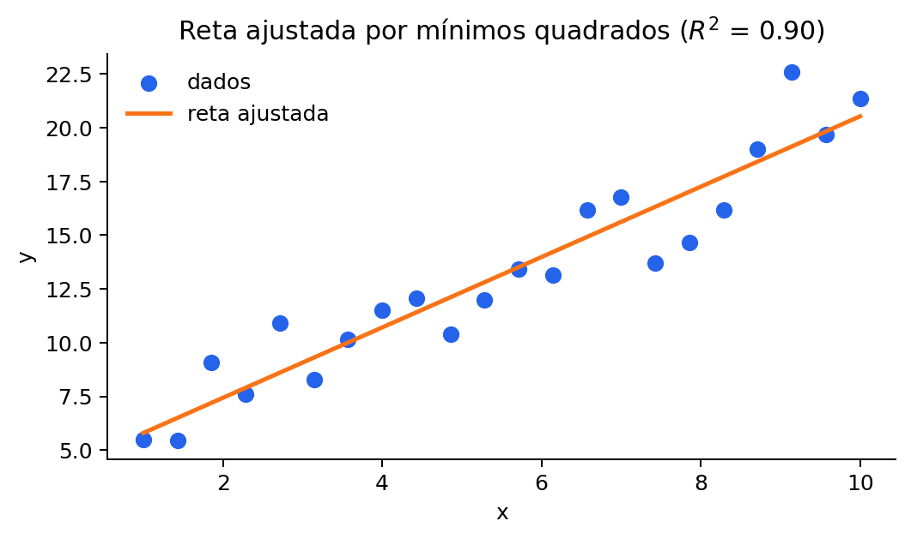

**Figura 16 - Reta ajustada por regressão linear simples.** A figura apresenta uma nuvem de pontos e a reta estimada por mínimos quadrados. A interpretação deve conectar a inclinação $b$ à variação média prevista em $\hat{y}$ para cada aumento unitário em $x$. Fonte: Carubbi, 2026.

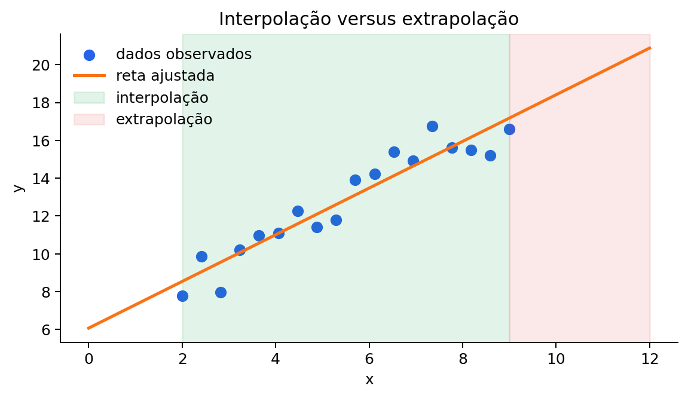

**Figura 17 - Interpolação e extrapolação em regressão linear simples.** A figura distingue a região de interpolação, situada dentro da faixa observada de $x$, da região de extrapolação, situada fora dessa faixa. A interpretação central é que previsões fora do domínio observado exigem maior cautela, mesmo quando a reta ajusta bem os dados disponíveis. Fonte: Carubbi, 2026.

## 6. Resíduos, $R^2$, extrapolação e outliers

### Quando usar

Use esta ficha quando a pergunta pede interpretação do ajuste da reta, qualidade da previsão ou cuidado com pontos incomuns. $R^2$ é o coeficiente de determinação.

### Fórmulas

**Resíduo:**

$$
e_i=y_i-\hat{y}_i
\tag{6.1}
$$

**Soma dos quadrados dos resíduos (SQRes):**

$$
SQRes=\sum_{i=1}^n e_i^2
\tag{6.2}
$$

**Coeficiente de determinação com soma total dos quadrados (SQTotal):**

$$
R^2=1-\frac{SQRes}{SQTotal}
\tag{6.3}
$$

quando $SQTotal=\sum_{i=1}^n (y_i-\bar{y})^2$.

**Relação com correlação na regressão simples com intercepto:**

$$
R^2=r^2
\tag{6.4}
$$

### Variáveis e definições

- $e_i$: resíduo da observação $i$.
- $y_i$: valor observado.
- $\hat{y}_i$: valor previsto pela reta.
- $SQRes$: soma dos quadrados dos resíduos.
- $SQTotal$: soma total dos quadrados em torno de $\bar{y}$.
- $R^2$: proporção da variação de $Y$ explicada pela reta.

### Restrições e limites

- $0\le R^2\le1$ em regressão linear com intercepto.
- $R^2$ alto não prova causalidade.
- $R^2$ alto não garante que a reta seja adequada; resíduos e outliers ainda importam.
- Um outlier pode alterar fortemente a inclinação.

### Observações didáticas

Se $e_i>0$, o ponto ficou acima da reta. Se $e_i<0$, ficou abaixo. Em questões objetivas, observe se a alternativa confunde valor observado $y_i$, valor previsto $\hat{y}_i$ e resíduo $e_i$.

Extrapolação ocorre quando se usa a reta para prever fora da faixa dos valores de $x$ observados. Mesmo uma reta com bom ajuste pode falhar fora dessa faixa.

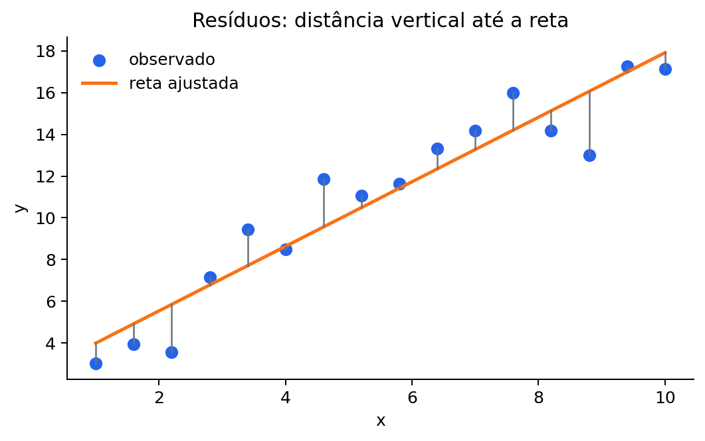

**Figura 18 - Resíduos em regressão linear simples.** A figura representa os resíduos como distâncias verticais entre os pontos observados e a reta ajustada. A interpretação correta é $e_i=y_i-\hat{y}_i$, distinguindo valor observado, valor previsto e erro de ajuste. Fonte: Carubbi, 2026.

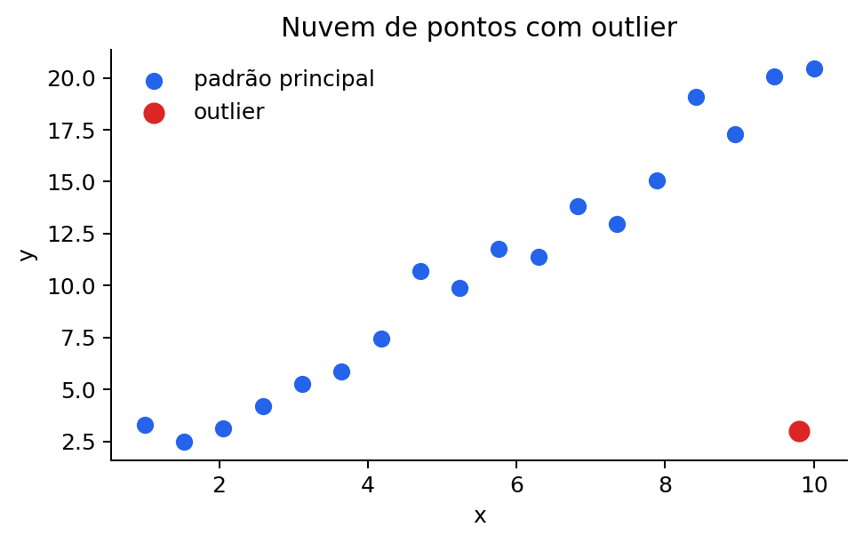

**Figura 19 - Nuvem de pontos com outlier.** A figura destaca um ponto atípico em relação ao padrão principal da nuvem de pontos. A interpretação visual deve verificar se esse ponto está distante da tendência geral antes de aceitar conclusões sobre correlação, ajuste linear ou previsão. Fonte: Carubbi, 2026.

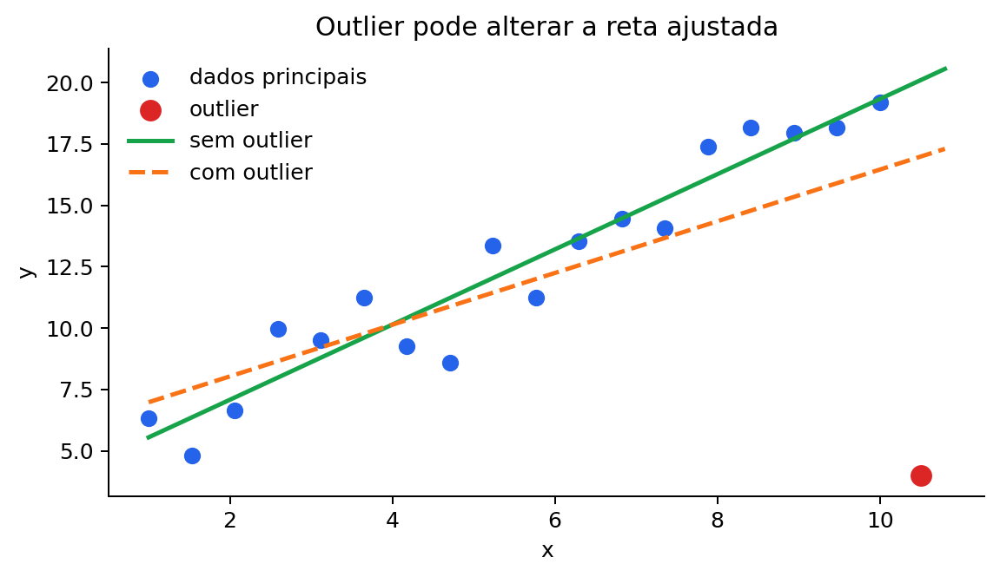

**Figura 20 - Influência de outlier na reta ajustada.** A figura mostra que um ponto atípico pode alterar a inclinação e o intercepto da reta de regressão. A leitura visual deve preceder interpretações de $r$, $R^2$ e previsões, pois um ajuste aparentemente numérico pode estar fortemente influenciado por poucos pontos. Fonte: Carubbi, 2026.

## 7. Como eliminar alternativas erradas

### Em questões de função de massa de probabilidade (PMF)

- probabilidade não pode ser negativa;
- probabilidade não pode passar de 1;
- soma de todas as probabilidades deve dar 1;
- $E(X)$ deve ficar dentro de uma faixa plausível dos valores de $X$.

### Em questões de função de distribuição acumulada (CDF)

- $F(x)$ nunca diminui;
- $F(x)$ deve estar entre 0 e 1;
- $P(X=x)$ vem da diferença entre acumuladas.

### Em questões de correlação

- $r$ sempre está entre $-1$ e $1$;
- o sinal de $r$ deve bater com o sentido da nuvem de pontos;
- $r$ perto de zero não significa ausência total de relação, apenas ausência de relação linear forte.

### Em questões de regressão

- se $b>0$, a reta cresce;
- se $b<0$, a reta decresce;
- previsão fora da faixa observada é extrapolação;
- $R^2$ alto não garante causalidade;
- resíduo é diferença vertical: observado menos previsto.

## 8. Plano de estudo recomendado

### Prioridade 1: função de massa de probabilidade (PMF), função de distribuição acumulada (CDF) e frequências

- ler $P(X=x)$ diretamente;
- calcular $P(X\le x)$;
- recuperar $P(X=x)$ a partir de $F(x)$;
- transformar frequência em proporção;
- verificar se uma tabela é uma distribuição válida;
- reconhecer Bernoulli, binomial, Poisson, uniforme discreta, hipergeométrica e geométrica pelo contexto do enunciado;
- distinguir binomial e hipergeométrica pela presença ou ausência de reposição.

### Prioridade 2: média, variância e transformação

- $E(X)$ por soma ponderada;
- $E(X^2)$;
- $Var(X)=E(X^2)-[E(X)]^2$;
- $DP(X)=\sqrt{Var(X)}$;
- transformações como $Y=a+bX$.

### Prioridade 3: tabelas conjuntas

- somar linhas para obter marginais de $X$;
- somar colunas para obter marginais de $Y$;
- verificar independência;
- calcular esperança de funções simples de $X$ e $Y$.

### Prioridade 4: correlação e regressão

- identificar $x$ e $y$;
- montar tabela auxiliar com $x_i$, $y_i$, $x_i^2$, $y_i^2$ e $x_iy_i$;
- reconhecer associação positiva, negativa ou fraca;
- interpretar $r$;
- interpretar $a$ e $b$ em $\hat{y}=a+bx$;
- fazer previsão com a reta.

### Prioridade 5: interpretação crítica

- a previsão é interpolação ou extrapolação?
- existe possível outlier?
- os resíduos sugerem problema no modelo?
- $R^2$ é alto ou baixo?
- a conclusão fala indevidamente em causalidade?

### Prioridade 6: variáveis contínuas

- diferença entre PMF e densidade;
- probabilidade como área;
- $P(X=a)=0$ no caso contínuo;
- reconhecimento da uniforme contínua;
- padronização normal;
- uso básico da normal e da exponencial quando os parâmetros são dados;
- diferença entre $P(X\le x)$ e $P(X>x)$ na distribuição exponencial.

Não gaste a maior parte do tempo com derivações longas de cálculo. Para a AV3, a prioridade é reconhecer o modelo e interpretar corretamente.

## 9. Mini-checklist final

Antes da prova, você deve conseguir responder:

- Sei identificar o tipo de dado apresentado: PMF, CDF, frequência ou tabela conjunta?
- Sei explicar o significado de PMF, CDF, DP, SQRes e SQTotal?
- Sei diferenciar PMF, CDF e densidade?
- Sei reconhecer Bernoulli, binomial, Poisson, uniforme discreta, hipergeométrica e geométrica pelo contexto?
- Sei verificar as restrições básicas de cada modelo discreto, como independência, reposição, taxa média ou equiprobabilidade?
- Sei distinguir binomial e hipergeométrica em situações de amostragem?
- Sei reconhecer uniforme contínua, normal e exponencial pelo contexto?
- Sei diferenciar probabilidade pontual em variável discreta e em variável contínua?
- Sei calcular $E(X)$ e $Var(X)$ a partir de uma tabela?
- Sei recuperar probabilidades pontuais a partir de uma CDF?
- Sei somar linhas e colunas para obter marginais?
- Sei montar a tabela auxiliar para correlação e regressão com dados pareados?
- Sei interpretar o sinal e a intensidade de $r$?
- Sei usar e interpretar $\hat{y}=a+bx$?
- Sei explicar o que significa $R^2$?
- Sei identificar extrapolação, outlier e resíduo?
- Sei evitar a frase "correlação prova causalidade"?

Se alguma resposta for "não", esse é o ponto que deve ser revisado primeiro.
