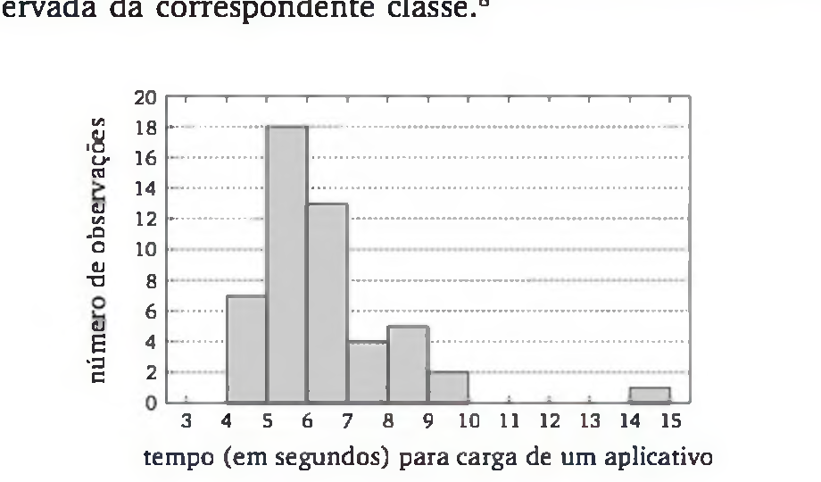
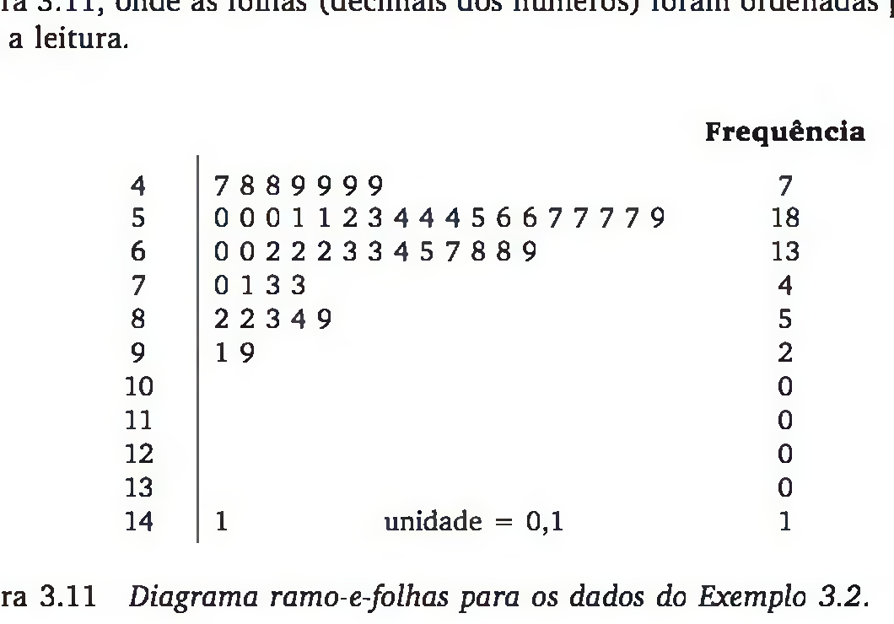
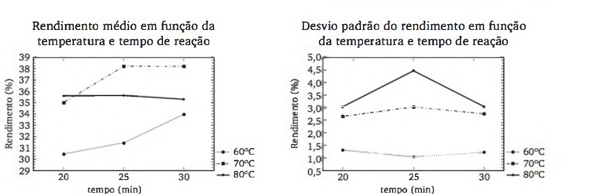
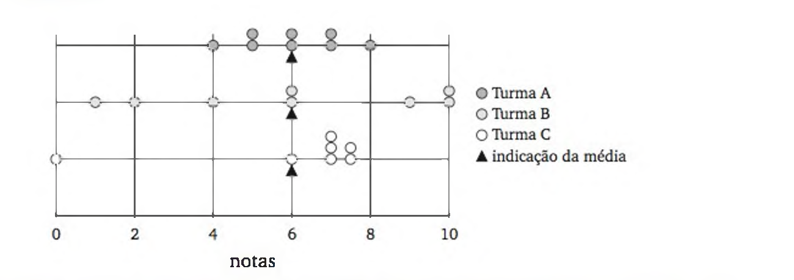
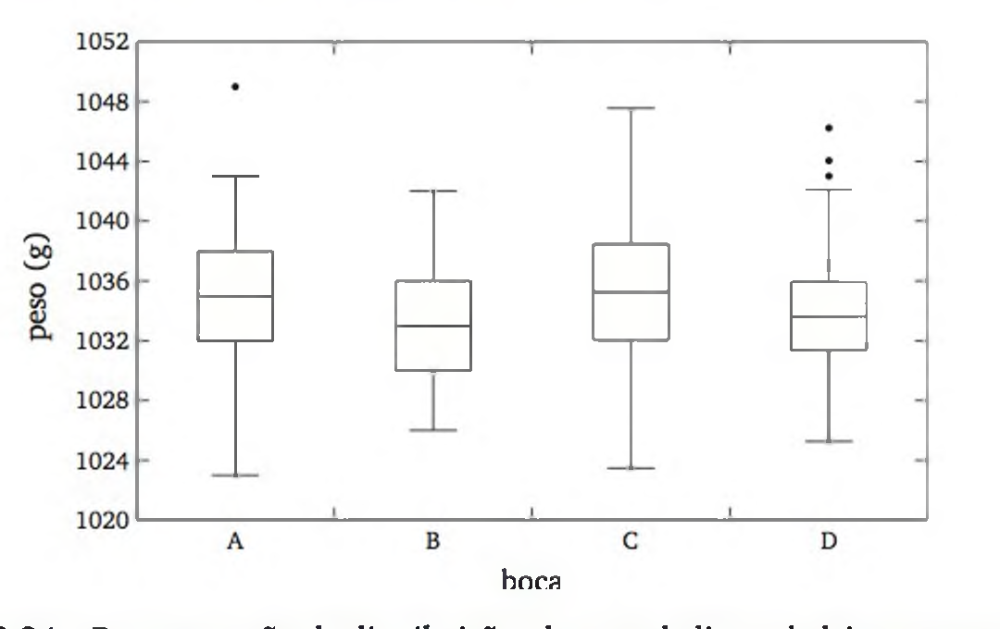
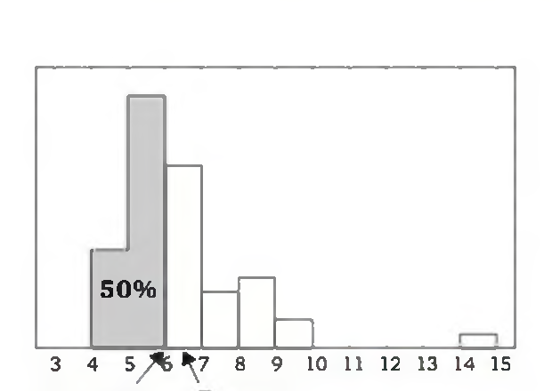
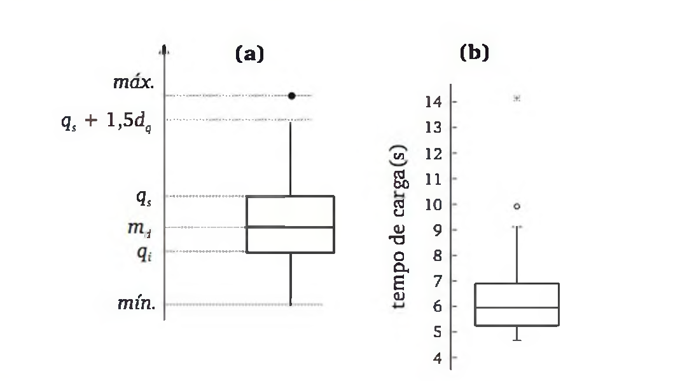
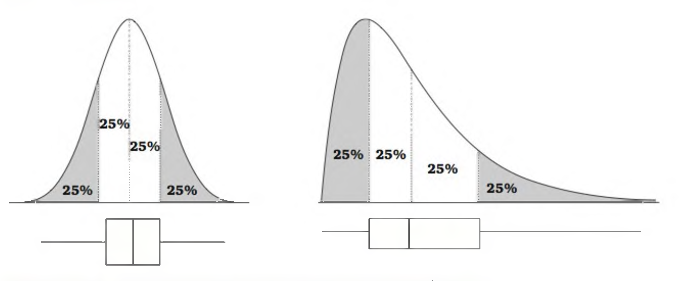
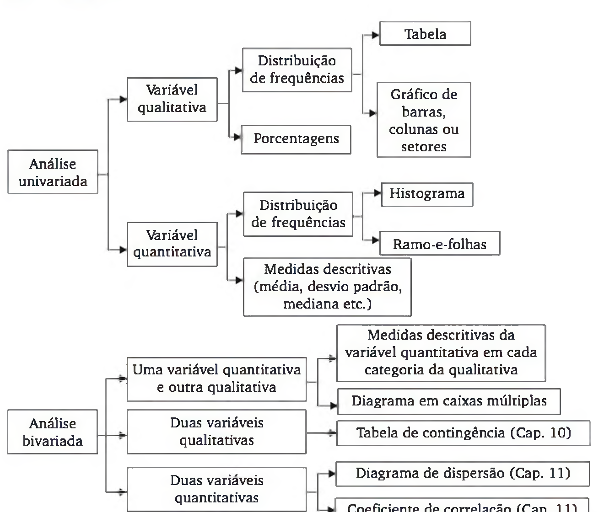
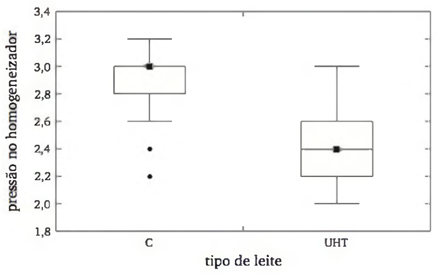

# Exercícios extraídos de Barbetta (2010)

Fonte: `livros/Barbetta_2010  Estatística  para cursos de engenharia e informática.pdf`

## Fórmulas úteis para resolver os exercícios

### Medidas descritivas básicas

- Média amostral:

$$
\bar{x} = \frac{1}{n}\sum_{i=1}^{n} x_i
$$

- Variância amostral:

$$
s^2 = \frac{1}{n-1}\sum_{i=1}^{n}(x_i-\bar{x})^2
$$

- Forma computacional da variância:

$$
s^2 = \frac{\sum_{i=1}^{n} x_i^2 - n\bar{x}^2}{n-1}
$$

- Desvio-padrão:

$$
s = \sqrt{s^2}
$$

- Mediana:

Se $x_{(1)} \le x_{(2)} \le \cdots \le x_{(n)}$ são os dados ordenados,

$$
\text{Mediana} =
\begin{cases}
x_{\left(\frac{n+1}{2}\right)}, & \text{se } n \text{ é ímpar} \\
\frac{x_{\left(\frac{n}{2}\right)} + x_{\left(\frac{n}{2}+1\right)}}{2}, & \text{se } n \text{ é par}
\end{cases}
$$

- Quartis:

$$
Q_1,\quad Q_2 = \text{Mediana},\quad Q_3
$$

- Distância interquartil:

$$
DIQ = Q_3 - Q_1
$$

- Coeficiente de variação:

$$
CV = \frac{s}{\bar{x}}
$$

ou

$$
CV\% = 100\cdot \frac{s}{\bar{x}}
$$

### Freqüências e distribuições

- Freqüência relativa:

$$
fr_i = \frac{f_i}{n}
$$

- Freqüência acumulada:

$$
F_i = \sum_{j=1}^{i} f_j
$$

- Freqüência relativa acumulada:

$$
FR_i = \frac{F_i}{n}
$$

### Dados agrupados em classes

Se $x_j$ é o ponto médio da classe $j$, $f_j$ é a freqüência da classe e $n = \sum_{j=1}^{J} f_j$:

- Média aproximada:

$$
\bar{x} = \frac{\sum_{j=1}^{J} f_j x_j}{n}
$$

- Variância aproximada:

$$
s^2 = \frac{\sum_{j=1}^{J} f_j x_j^2 - n\bar{x}^2}{n-1}
$$

- Desvio-padrão aproximado:

$$
s = \sqrt{s^2}
$$

### Quartis por interpolação em classes

Se o quantil $Q_p$ está em uma classe de limite inferior $L$, amplitude $h$, freqüência da classe $f_{\text{classe}}$ e freqüência acumulada anterior $F_{\text{ant}}$, então:

$$
Q_p = L + h \cdot \frac{pn - F_{\text{ant}}}{f_{\text{classe}}}
$$

Em particular:

$$
Q_1 = Q_{0{,}25}, \qquad Q_2 = Q_{0{,}50}, \qquad Q_3 = Q_{0{,}75}
$$

### Planejamento amostral

- Probabilidade de seleção de um elemento em amostragem aleatória simples:

$$
p = \frac{n}{N}
$$

onde $N$ é o tamanho da população e $n$ o tamanho da amostra.

- Intervalo de seleção na amostragem sistemática:

$$
I = \frac{N}{n}
$$

### Experimentos com um fator

Se $y_{ij}$ é a resposta da $j$-ésima replicação do tratamento $i$:

- Média do tratamento $i$:

$$
\bar{y}_i = \frac{1}{n}\sum_{j=1}^{n} y_{ij}
$$

- Variância no tratamento $i$:

$$
s_i^2 = \frac{1}{n-1}\sum_{j=1}^{n}(y_{ij}-\bar{y}_i)^2
$$

- Variância agregada:

$$
s_p^2 = \frac{\sum_{i=1}^{g}(n-1)s_i^2}{g(n-1)}
$$

Mais geralmente, se os números de replicações forem $n_i$:

$$
s_p^2 = \frac{\sum_{i=1}^{g}(n_i-1)s_i^2}{\sum_{i=1}^{g}(n_i-1)}
$$

- Graus de liberdade da variância agregada:

$$
gl = \sum_{i=1}^{g}(n_i-1)
$$

e, no caso balanceado com $g$ tratamentos e $n$ replicações:

$$
gl = g(n-1)
$$

### Projetos fatoriais $2^k$

- Efeito principal ou interação:

$$
ef = \bar{y}_{+} - \bar{y}_{-}
$$

onde $\bar{y}_{+}$ é a média das respostas nas combinações com sinal positivo na coluna correspondente e $\bar{y}_{-}$ é a média das respostas com sinal negativo.

- Em projetos com replicações, a média em cada condição experimental é:

$$
\bar{y} = \frac{1}{r}\sum_{l=1}^{r} y_l
$$

onde $r$ é o número de replicações da condição.

### Transformações lineares

Se $Y = cX$:

$$
\bar{Y} = c\bar{X}, \qquad s_Y^2 = c^2 s_X^2, \qquad s_Y = |c|s_X
$$

$$
\text{Mediana}(Y) = c\,\text{Mediana}(X), \qquad DIQ(Y) = |c|DIQ(X)
$$

Se $Z = c + X$:

$$
\bar{Z} = c + \bar{X}, \qquad s_Z^2 = s_X^2, \qquad s_Z = s_X
$$

$$
\text{Mediana}(Z) = c + \text{Mediana}(X), \qquad DIQ(Z) = DIQ(X)
$$

### Valores discrepantes

- Critério baseado em quartis:

$$
\text{Limite inferior} = Q_1 - 1{,}5\cdot DIQ
$$

$$
\text{Limite superior} = Q_3 + 1{,}5\cdot DIQ
$$

- Critério baseado em média e desvio-padrão:

$$
|x - \bar{x}| > 3s
$$

### Leituras gráficas

- Histogramas, ramo-e-folhas, diagramas de pontos e box plots são usados para comparar:

$$
\text{posição}, \qquad \text{dispersão}, \qquad \text{assimetria}, \qquad \text{outliers}
$$

## Exemplos dos capítulos 1, 2 e 3

### Capítulo 1

#### Exemplo 1.1

Uma indústria processadora de suco de frutas inspeciona a qualidade de um carregamento de laranjas por meio de uma amostra de cinco caixas selecionadas aleatoriamente.

Ponto central: o exemplo introduz os conceitos básicos de população, amostra, amostragem e amostragem aleatória simples, além da ideia de variáveis observadas nos elementos amostrais.

Variáveis exemplificadas no texto:

- classificação por técnico especializado: `ótima`, `boa`, `regular`, `ruim`, `péssima`;
- número de laranjas não aproveitáveis por caixa;
- peso de cada caixa.

Uma amostra ilustrativa de contagem de laranjas não aproveitáveis por caixa é dada por:

$$
\{4,\ 6,\ 2,\ 3,\ 0\}.
$$

Nesse caso, o texto usa a média

$$
\bar{x} = \frac{4+6+2+3+0}{5} = 3
$$

como estatística descritiva da amostra e como estimativa do parâmetro populacional correspondente.

### Capítulo 2

#### Exemplo 2.1

Considere o problema de operar adequadamente o protótipo reduzido de uma catapulta romana, cujo objetivo é lançar projéteis a uma distância especificada. Os fatores controláveis são:

$$
A = \text{altura do pivô}, \qquad B = \text{comprimento do braço}, \qquad C = \text{ângulo de parada}
$$

Ponto central: o exemplo ilustra como identificar fatores, níveis e resposta em um planejamento experimental, além da necessidade de definir a região experimental e o projeto adequado.

Tabela de níveis apresentada no texto:

| Fator | Nível inferior | Nível intermediário | Nível superior |
| --- | --- | --- | --- |
| $A$ | 6,35 cm | 10,16 cm | 13,97 cm |
| $B$ | 0,81 cm | 5,08 cm | 9,35 cm |
| $C$ | $30^\circ$ | $45^\circ$ | $90^\circ$ |

A resposta sugerida é a distância entre a queda do projétil e o alvo pretendido.

#### Exemplo 2.2

Deseja-se estudar a produção por $m^2$ de uma cultura para três níveis de dosagem de fertilizante, com duas replicações, usando aleatorização dos tratamentos entre seis canteiros.

Ponto central: o exemplo mostra como aleatorizar a alocação de tratamentos com números aleatórios e como reorganizar o experimento quando há blocos relativamente homogêneos.

Projeto aleatorizado sem blocos:

| Tratamento | a | a | b | b | c | c |
| --- | ---: | ---: | ---: | ---: | ---: | ---: |
| Canteiro | 2 | 4 | 5 | 3 | 1 | 6 |

Projeto em blocos:

| Bloco | 1 | 1 | 1 | 2 | 2 | 2 |
| --- | ---: | ---: | ---: | ---: | ---: | ---: |
| Tratamento | a | b | c | a | b | c |
| Canteiro | 2 | 1 | 3 | 4 | 5 | 6 |

#### Exemplo 2.3

Em um processo químico, deseja-se estudar a influência de dois fatores:

$$
A = \text{tipo de catalisador, com 2 níveis}, \qquad B = \text{tempo de reação, com 4 níveis}
$$

sobre o rendimento da reação química $Y$.

Ponto central: o exemplo introduz o projeto fatorial $2 \times 4$, destacando que projetos fatoriais permitem avaliar efeitos principais e interações entre fatores.

Estrutura do experimento:

| Fator | Níveis |
| --- | --- |
| $A$ | tipo de catalisador: $a_1$, $a_2$ |
| $B$ | tempo de reação: $b_1$, $b_2$, $b_3$, $b_4$ |

Número total de tratamentos:

$$
2 \times 4 = 8.
$$

#### Exemplo 2.4

Um experimento foi desenvolvido para estudar a taxa de falhas na transmissão de dados em função de:

$$
A = \text{velocidade da transmissão}, \qquad B = \text{tamanho do arquivo}, \qquad C = \text{comprimento do cabo serial}
$$

com duas replicações por condição experimental.

Ponto central: o exemplo mostra como construir a tabela de sinais de um projeto $2^3$, calcular efeitos principais e interações e interpretar a magnitude desses efeitos.

Resultados apresentados no texto:

$$
\text{média global} = 35{,}000
$$

$$
ef(A)=1{,}275,\quad ef(B)=0{,}400,\quad ef(C)=2{,}775
$$

$$
ef(AB)=-0{,}125,\quad ef(AC)=-0{,}300,\quad ef(BC)=-0{,}175,\quad ef(ABC)=0{,}150
$$

Tabela de sinais do projeto fatorial $2^2$ apresentada como base metodológica:

| Condição experimental | $I$ | $A$ | $B$ | $AB$ | $Y$ |
| ---: | :---: | :---: | :---: | :---: | ---: |
| 1 | + | - | - | + | ? |
| 2 | + | - | + | - | ? |
| 3 | + | + | - | - | ? |
| 4 | + | + | + | + | ? |

### Capítulo 3

#### Exemplo 3.1

Um projetista de páginas da Internet realiza uma pesquisa com visitantes de um site para levantar características como sexo, idade, nível de instrução e provedor utilizado.

Ponto central: o exemplo introduz a análise de variáveis qualitativas por meio de distribuições de frequências, tabelas e gráficos.

Os 40 resultados da variável `provedor` aparecem no texto e levam à seguinte distribuição:

| Provedor | Frequência | Porcentagem |
| --- | ---: | ---: |
| A | 10 | 25,0 |
| B | 17 | 42,5 |
| C | 7 | 17,5 |
| D | 6 | 15,0 |
| Total | 40 | 100,0 |

#### Exemplo 3.2

São observados 50 tempos, em segundos, para a carga de um aplicativo em um sistema compartilhado.

Ponto central: o exemplo ilustra a construção de distribuições de frequências para variáveis quantitativas, incluindo escolha do número de classes, amplitude de classe e convenção de intervalos.

Tabela 3.2 transcrita:

| Classes de tempo | Ponto médio | Número de observações $n_j$ | Porcentagem de observações $100f_j$ | Porcentagem acumulada $100F_j$ |
| --- | ---: | ---: | ---: | ---: |
| $4 \mid\!\!-\! 5$ | 4,5 | 7 | 14 | 14 |
| $5 \mid\!\!-\! 6$ | 5,5 | 18 | 36 | 50 |
| $6 \mid\!\!-\! 7$ | 6,5 | 13 | 26 | 76 |
| $7 \mid\!\!-\! 8$ | 7,5 | 4 | 8 | 84 |
| $8 \mid\!\!-\! 9$ | 8,5 | 5 | 10 | 94 |
| $9 \mid\!\!-\! 10$ | 9,5 | 2 | 4 | 98 |
| $10 \mid\!\!-\! 11$ | 10,5 | 0 | 0 | 98 |
| $11 \mid\!\!-\! 12$ | 11,5 | 0 | 0 | 98 |
| $12 \mid\!\!-\! 13$ | 12,5 | 0 | 0 | 98 |
| $13 \mid\!\!-\! 14$ | 13,5 | 0 | 0 | 98 |
| $14 \mid\!\!-\! 15$ | 14,5 | 1 | 2 | 100 |
| Total | — | 50 | 100 | — |

**Figura 1 - Histograma do tempo de carga de um aplicativo**

Fonte: Barbetta et al. (2010).

**Figura 2 - Diagrama ramo-e-folhas para os dados do tempo de carga**

Fonte: Barbetta et al. (2010).

#### Exemplo 3.3

O rendimento de um processo químico é estudado em função de dois fatores:

$$
\text{tempo de reação} = 20,\ 25,\ 30 \text{ min}
$$

$$
\text{temperatura} = 60,\ 70,\ 80^\circ \text{C}
$$

com seis ensaios por combinação.

Ponto central: o exemplo mostra como a média aritmética e o desvio-padrão permitem resumir e comparar o comportamento dos subgrupos experimentais.

Resultados médios apresentados no texto:

| Temperatura ($^\circ$C) | 20 min | 25 min | 30 min |
| ---: | ---: | ---: | ---: |
| 60 | 30,5 | 31,4 | 34,0 |
| 70 | 35,0 | 38,2 | 38,2 |
| 80 | 35,6 | 35,6 | 35,3 |

Dados brutos apresentados no texto:

| Temperatura ($^\circ$C) | 20 min | 25 min | 30 min |
| ---: | ---: | ---: | ---: |
| 60 | 29,7 28,7 30,2 31,3 31,2 31,7 | 31,0 30,6 32,8 31,9 31,2 31,2 | 32,9 32,7 34,8 34,9 33,8 34,9 |
| 70 | 36,6 35,7 35,3 35,1 30,2 37,2 | 35,7 40,4 41,7 36,9 34,5 40,0 | 34,8 36,8 37,4 38,9 38,7 42,5 |
| 80 | 40,2 33,6 33,4 35,2 38,1 33,0 | 37,0 34,4 29,8 33,9 43,2 35,5 | 36,0 31,3 36,6 32,5 39,2 35,9 |

**Figura 3 - Médias aritméticas e desvios padrões do rendimento por temperatura e tempo de reação**

Fonte: Barbetta et al. (2010).

#### Exemplo 3.4

Considere as notas finais de três turmas, representadas em diagramas de pontos, todas com média igual a 6.

Ponto central: o exemplo mostra que a média, isoladamente, pode não representar adequadamente um conjunto de dados e motiva o uso de medidas de dispersão, mediana e medidas resistentes.

Medidas apresentadas no texto:

| Turma | Número de alunos | Média | Desvio-padrão |
| --- | ---: | ---: | ---: |
| A | 8 | 6,00 | 1,31 |
| B | 8 | 6,00 | 3,51 |
| C | 7 | 6,00 | 2,69 |

Notas das turmas mostradas no texto:

| Turma | Notas dos alunos |
| --- | --- |
| A | 4, 5, 5, 6, 6, 7, 7, 8 |
| B | 1, 2, 4, 6, 6, 9, 10, 10 |
| C | 0, 6, 7, 7, 7, 7,5, 7,5 |

Tabela 3.4 de cálculo auxiliar para a turma A:

| Nota $x_j$ | Frequência $n_j$ | $x_j n_j$ | $x_j^2 n_j$ |
| ---: | ---: | ---: | ---: |
| 4 | 1 | 4 | 16 |
| 5 | 2 | 10 | 50 |
| 6 | 2 | 12 | 72 |
| 7 | 2 | 14 | 98 |
| 8 | 1 | 8 | 64 |
| Total | 8 | 48 | 300 |

**Figura 4 - Distribuições das notas de três turmas e posições das médias aritméticas**

Fonte: Barbetta et al. (2010).

#### Exemplo 3.5

Para avaliação da qualidade, foram pesados 228 sacos de leite tipo C em cada boca de ensacamento durante um mês, com representação dos resultados por diagramas em caixas.

Ponto central: o exemplo ilustra o uso de box plots para comparar distribuições em termos de nível e variabilidade entre diferentes bocas de ensacamento.

Conclusão descrita no texto:

- as bocas B e D apresentam nível de peso e variabilidade levemente menores;
- as bocas A e C apresentam nível e variabilidade um pouco maiores;
- a melhoria da qualidade passa pela redução da variabilidade do processo.

**Figura 5 - Distribuições do peso de litros de leite por boca de ensacamento**

Fonte: Barbetta et al. (2010).

## Capítulo 1: Introdução

### Exercícios

1. Dê um exemplo de uma situação prática em que é mais razoável um modelo empírico do que um modelo determinístico.

2. Apresente, em uma situação prática, qual é a população, uma forma de amostragem e uma possível amostra.

3. Dada a seguinte amostra: $\{7, 8, 6, 5, 9, 4\}$, calcule:
   a) a média;
   b) a variância;
   c) o desvio padrão.

4. Para avaliar a qualidade de três empacotadoras (A, B e C) de uma indústria de torrefação de café, realizou-se uma amostra de dez pacotes de café de cada empacotadora e mediu-se o peso líquido. O valor declarado é de $500\,g$. A empacotadora A apresentou peso médio igual a $500{,}1\,g$ e variância $6{,}2$; a B resultou em peso médio igual a $499{,}9\,g$ e variância $40{,}5$; e a C, peso médio igual a $530{,}3\,g$ e variância $5{,}8$. O que se pode dizer sobre as empacotadoras?

5. Ao calcular a variância de um conjunto de valores, encontrou-se o valor $s^2 = 0$. O que se pode dizer sobre o conjunto de valores?

## Capítulo 2: O Planejamento de uma Pesquisa

### Exercícios

1. Considerando a população apresentada a seguir, extraia uma amostra aleatória simples de $n = 6$ funcionários. Use a segunda linha da tabela de números aleatórios.

   01. Aristóteles
   02. Anastácia
   03. Arnaldo
   04. Bartolomeu
   05. Bernardino
   06. Cardoso
   07. Carlito
   08. Cláudio
   09. Ermílio
   10. Ercílio
   11. Emestino
   12. Endevaldo
   13. Francisco
   14. Felício
   15. Fabrício
   16. Geraldo
   17. Gabriel
   18. Getúlio
   19. Hiraldo
   20. João da Silva
   21. Joana
   22. Joaquim
   23. Joaquina
   24. José da Silva
   25. José de Souza
   26. Josefa
   27. Josefina
   28. Maria José
   29. Maria Cristina
   30. Mauro
   31. Paula
   32. Paulo César

   Tabela-base da população:

   | Código | Nome | Código | Nome |
   | ---: | --- | ---: | --- |
   | 01 | Aristóteles | 17 | Gabriel |
   | 02 | Anastácia | 18 | Getúlio |
   | 03 | Arnaldo | 19 | Hiraldo |
   | 04 | Bartolomeu | 20 | João da Silva |
   | 05 | Bernardino | 21 | Joana |
   | 06 | Cardoso | 22 | Joaquim |
   | 07 | Carlito | 23 | Joaquina |
   | 08 | Cláudio | 24 | José da Silva |
   | 09 | Ermílio | 25 | José de Souza |
   | 10 | Ercílio | 26 | Josefa |
   | 11 | Emestino | 27 | Josefina |
   | 12 | Endevaldo | 28 | Maria José |
   | 13 | Francisco | 29 | Maria Cristina |
   | 14 | Felício | 30 | Mauro |
   | 15 | Fabrício | 31 | Paula |
   | 16 | Geraldo | 32 | Paulo César |

2. Usando a terceira linha da tabela de números aleatórios, extraia uma amostra aleatória simples de quatro letras do alfabeto da língua portuguesa.

3. Os elementos de certa população estão dispostos numa lista, cuja numeração vai de $1.650$ a $8.840$. Descreva como você usaria uma tabela de números aleatórios para obter uma amostra de 100 elementos. Seria necessário efetuar nova numeração?

4. Seja um conjunto de 20 corpos de prova numerados de 1 a 20. Usando uma tabela de números aleatórios, divida aleatoriamente esses corpos de prova em dois grupos de dez elementos.

5. Selecione uma amostra estratificada uniforme, de tamanho $n = 12$, da população do Exercício 1.

6. Considerando a população de funcionários do exercício 1, faça uma amostragem estratificada proporcional de tamanho $n = 8$, usando a variável sexo para a formação dos estratos.

7. Comente os seguintes planos de amostragens, apontando suas incoerências, quando for o caso.
   a) Com a finalidade de estudar o perfil dos consumidores de um supermercado, observaram-se os consumidores que compareceram ao supermercado no primeiro sábado do mês.
   b) Com a finalidade de estudar o perfil dos consumidores de um supermercado, fez-se a coleta de dados durante um mês, tomando a cada dia um consumidor da fila de cada caixa do supermercado, variando sistematicamente o horário da coleta dos dados.
   c) Para avaliar a qualidade dos itens que saem de uma linha de produção, observaram-se todos os itens das 14 às 14h30min.
   d) Para avaliar a qualidade dos itens que saem de uma linha de produção, observou-se um item a cada meia hora, durante todo o dia.
   e) Para estimar a percentagem de empresas que investiram em novas tecnologias no último ano, enviou-se um questionário a todas as empresas. A amostra foi formada pelas empresas que responderam ao questionário.

8. Apresente as 32 combinações de sinais em que os fatores $A$, $B$, $C$, $D$ e $E$ devem ser ensaiados em um projeto $2^5$ completo. Anote os ensaios que devem ser realizados em um projeto $2^{5-1}$, considerando a relação $I = ABCDE$. Repare que você pode construir o mesmo projeto fazendo, inicialmente, um projeto $2^4$ completo e, depois, inserindo a coluna $E$ com a relação $E = ABCD$.

9. Calcule a variância agregada do experimento do Exemplo 2.4. Quantos graus de liberdade estão associados a essa medida?

10. Para avaliar o efeito dos fatores: $(A)$ tempo de hidratação ($14$ dias/$28$ dias), $(B)$ relação água/cimento ($0{,}38$ e $0{,}58$) e $(C)$ tipo de cimento (comum e pozolânico) na resistência à compressão de um concreto ($Y$), realizou-se um experimento cujos resultados da resistência (em MPa) são apresentados a seguir. Calcule os efeitos principais e as interações de segunda ordem.

| Tipo de cimento | Relação água/cimento | 14 dias | 28 dias |
| --- | --- | ---: | ---: |
| comum | 0,38 | 23,1 | 42,2 |
| comum | 0,58 | 12,0 | 27,9 |
| pozolânico | 0,38 | 24,3 | 39,5 |
| pozolânico | 0,58 | 11,1 | 24,3 |

11. Em *Applied Statistics*, $v.\ 42$, nº $4$, $p.\ 671\text{-}681$ ($1993$), M. G. Tuck e J. I. L. Cottrell realizaram vários experimentos para obter uma farinha de pão de melhor qualidade. Misturaram à farinha de trigo pequenas quantidades de ingredientes permitidos. Os fatores correspondem à quantidade de cada ingrediente adicionado à farinha, sendo que o nível inferior corresponde à ausência do ingrediente.

   Parte de um dos experimentos foi realizada sob um projeto $2^{6-2}$, em que os fatores $A$, $B$, $C$ e $E$ formaram um projeto $2^4$ completo. Os sinais do fator $D$ foram obtidos através da relação $D = ABC$ e os sinais do fator $F$ foram obtidos através da relação $F = BCE$. A resposta ($y$) foi o volume médio dos pães. Em cada condição experimental, realizaram-se quatro ensaios. A tabela a seguir apresenta a média $y$ e o desvio padrão $s$ do volume específico nas quatro replicações em cada combinação dos níveis dos fatores.

| Condição experimental | A | B | C | D | E | F | y | s |
| ---: | :---: | :---: | :---: | :---: | :---: | :---: | ---: | ---: |
| 1 | - | - | - | - | - | - | 429,25 | 75,39 |
| 2 | - | - | - | - | + | + | 433,00 | 69,40 |
| 3 | - | - | + | + | - | + | 454,25 | 88,99 |
| 4 | - | - | + | + | + | - | 456,75 | 82,24 |
| 5 | - | + | - | + | - | + | 446,75 | 74,09 |
| 6 | - | + | - | + | + | - | 447,75 | 80,93 |
| 7 | - | + | + | - | - | - | 455,50 | 89,58 |
| 8 | - | + | + | - | + | + | 448,25 | 74,24 |
| 9 | + | - | - | + | - | - | 458,75 | 79,47 |
| 10 | + | - | - | + | + | + | 449,50 | 84,58 |
| 11 | + | - | + | - | - | + | 463,75 | 91,67 |
| 12 | + | - | + | - | + | - | 466,00 | 88,99 |
| 13 | + | + | - | - | - | + | 449,50 | 88,88 |
| 14 | + | + | - | - | + | - | 452,75 | 98,27 |
| 15 | + | + | + | + | - | - | 469,00 | 82,30 |
| 16 | + | + | + | + | + | + | 471,50 | 75,11 |

   a) Calcule os efeitos principais dos seis fatores. Quais provocam maiores variações no nível médio da resposta? Em que níveis eles devem ser fixados para maximizar o volume dos pães?

   b) Calcule os efeitos principais em termos do desvio padrão $s$. Qual fator provoca maior alteração na variabilidade da resposta? Se o objetivo é minimizar a variabilidade, em qual nível este fator deve ser fixado?

### Quadros auxiliares do capítulo 3

Os exercícios do capítulo 3 reutilizam diretamente os seguintes resultados do texto.

#### Mediana e quartis do Exemplo 3.2

Para as 50 observações do tempo de carga:

$$
n = 50,\qquad \text{posição da mediana}=\frac{n+1}{2}=25{,}5,
$$

e o texto obtém:

$$
md = \frac{5{,}9 + 6{,}0}{2} = 5{,}95.
$$

Para os quartis:

$$
\text{posição de } q_i = \frac{n+1}{4} = 12{,}75 \Rightarrow q_i = 5{,}175,
$$

$$
\text{posição de } q_s = \frac{3(n+1)}{4} = 38{,}25 \Rightarrow q_s = 6{,}925.
$$

Assim,

$$
dq = q_s - q_i = 1{,}75.
$$

**Figura 6 - Posição da média e da mediana no histograma do tempo de carga**

Fonte: Barbetta et al. (2010).

#### Tabela 3.5

| Conjunto de valores | $\bar{x}$ | $s$ | $cv$ |
| --- | ---: | ---: | ---: |
| 1) 1, 2, 3 | 2 | 1 | 0,5 |
| 2) 101, 102, 103 | 102 | 1 | 0,01 |
| 3) 100, 200, 300 | 200 | 100 | 0,5 |

Esse quadro sustenta os exercícios sobre coeficiente de variação e comparação de dispersões relativas.

#### Regra do diagrama em caixas

O texto usa o desvio interquartílico

$$
dq = q_s - q_i
$$

e considera:

- valores além de $1{,}5dq$ como discrepantes;
- valores além de $3dq$ como muito discrepantes.

Isso é a base conceitual dos exercícios sobre box plot, assimetria e observações discrepantes.

**Figura 7 - Construção de um diagrama em caixas e boxplot do tempo de carga**

Fonte: Barbetta et al. (2010).

**Figura 8 - Diagrama em caixas e forma da distribuição**

Fonte: Barbetta et al. (2010).

## Capítulo 3: Análise Exploratória de Dados

Observação: na extração do PDF, a lista do capítulo 3 aparece iniciando no exercício $3$; mantive a numeração como está no texto extraído.

**Figura 9 - Esquema geral para a análise exploratória de dados**

Fonte: Barbetta et al. (2010).

### Exercícios

3. Dado o seguinte conjunto de dados: $\{7, 8, 6, 10, 5, 9, 4, 12, 7, 8\}$, calcule:
   a) a média;
   b) o desvio padrão.

4. Calcule a média e o desvio padrão da seguinte distribuição de frequências, a qual se refere ao número de defeitos encontrados em placas de circuito integrado.

| Número de defeitos | Frequência |
| ---: | ---: |
| 0 | 30 |
| 1 | 25 |
| 2 | 10 |
| 3 | 5 |
| 4 | 2 |

5. Considerando o Exercício 2 (seção 3.3), obtenha a mediana e os quartis.

6. Com o objetivo de direcionar campanhas de marketing, uma livraria virtual está registrando o número de acessos diários em algumas de suas páginas da Web, nos últimos três meses. A tabela a seguir mostra medidas descritivas desses registros, em páginas de três categorias de livros.

| Livro | Média | Desvio padrão | Quartil inferior | Mediana | Quartil superior |
| --- | ---: | ---: | ---: | ---: | ---: |
| Romance | 910 | 690 | 412 | 650 | 1.500 |
| Ficção | 220 | 180 | 145 | 398 | 1.023 |
| Técnico | 630 | 480 | 115 | 190 | 1.500 |

   a) Quais as diferenças das três distribuições em termos de posição central e dispersão?

   b) As medidas sugerem distribuições simétricas?

7. Os dados a seguir são leituras da pressão do homogeneizador de um laticínio.

   **Leite tipo C**

   $3{,}0\ 3{,}1\ 3{,}0\ 3{,}0\ 3{,}0\ 2{,}9\ 2{,}9\ 3{,}0\ 3{,}1\ 2{,}9\ 3{,}0\ 3{,}0\ 3{,}0\ 3{,}0\ 3{,}0\ 3{,}0\ 3{,}0\ 3{,}0\ 3{,}0\ 3{,}0\ 2{,}9$

   **Leite UHT**

   $2{,}2\ 2{,}2\ 2{,}3\ 2{,}2\ 2{,}2\ 2{,}2\ 2{,}4\ 2{,}4\ 2{,}2\ 2{,}4\ 2{,}6\ 2{,}6\ 2{,}4\ 2{,}2\ 2{,}2\ 2{,}8\ 2{,}6\ 2{,}2\ 2{,}6\ 2{,}4\ 2{,}0$

   Para cada conjunto de dados, calcule as medidas descritivas que você conhece. Com base nessas medidas, comente as principais diferenças entre os dois conjuntos de valores.

### Exercícios complementares

8. Bernardin (Mestrado Engenharia Mecânica/UFSC, 1994) realizou um experimento que tinha o objetivo de melhorar a qualidade do processo de formulação de massa cerâmica para pavimento. Os corpos de prova eram “biscoitos” que saíam do processo de queima e a qualidade era avaliada por três variáveis:

   - $X_1 =$ retração linear (%)
   - $X_2 =$ resistência mecânica
   - $X_3 =$ absorção de água (%)

   O experimento foi realizado sob 8 condições diferentes (no estudo original eram 18). Foram feitos 5 ensaios em cada uma das 8 condições experimentais. Os dados são apresentados a seguir:

| C | X1 | X2 | X3 | C | X1 | X2 | X3 | C | X1 | X2 | X3 | C | X1 | X2 | X3 |
| ---: | ---: | ---: | ---: | ---: | ---: | ---: | ---: | ---: | ---: | ---: | ---: | ---: | ---: | ---: | ---: |
| 1 | 8,9 | 41,1 | 5,5 | 3 | 9,4 | 50,0 | 0,8 | 5 | 13,4 | 60,6 | 0,5 | 7 | 12,9 | 41,1 | 0,2 |
| 1 | 9,2 | 39,0 | 4,8 | 3 | 9,9 | 48,3 | 0,6 | 5 | 13,4 | 60,0 | 0,5 | 7 | 12,4 | 39,0 | 0,4 |
| 1 | 8,0 | 36,9 | 6,2 | 3 | 9,6 | 50,1 | 0,6 | 5 | 13,6 | 68,4 | 0,2 | 7 | 12,6 | 36,9 | 0,5 |
| 1 | 8,7 | 39,2 | 5,7 | 3 | 9,2 | 49,9 | 0,7 | 5 | 13,4 | 60,8 | 0,7 | 7 | 12,6 | 39,2 | 0,4 |
| 1 | 8,7 | 35,9 | 5,5 | 3 | 9,4 | 56,2 | 0,5 | 5 | 12,4 | 51,4 | 1,0 | 7 | 12,9 | 35,9 | 0,3 |
| 2 | 12,6 | 52,7 | 0,9 | 4 | 6,6 | 31,2 | 9,0 | 6 | 9,6 | 41,2 | 3,9 | 8 | 8,2 | 40,8 | 4,4 |
| 2 | 13,6 | 53,5 | 0,4 | 4 | 6,4 | 25,3 | 10,2 | 6 | 10,6 | 53,0 | 4,5 | 8 | 9,2 | 43,8 | 3,9 |
| 2 | 11,6 | 47,0 | 1,3 | 4 | 5,9 | 22,8 | 10,5 | 6 | 8,9 | 37,0 | 3,3 | 8 | 9,2 | 48,6 | 4,0 |
| 2 | 10,1 | 31,1 | 1,8 | 4 | 5,9 | 27,5 | 10,6 | 6 | 7,5 | 30,1 | 3,0 | 8 | 8,5 | 46,9 | 4,3 |
| 2 | 12,1 | 50,9 | 1,1 | 4 | 6,8 | 31,9 | 9,3 | 6 | 8,9 | 41,6 | 3,5 | 8 | 8,7 | 46,2 | 4,1 |

   a) Como as variáveis $X_1$, $X_2$ e $X_3$ podem ser classificadas (qualitativas, quantitativas discretas ou quantitativas contínuas)?

   b) Apresente a distribuição de frequências de $X_1$ através de um diagrama ramo-e-folhas. Comente a forma da distribuição.

   c) Apresente as distribuições de frequências de $X_2$ e $X_3$ através de histogramas. Comente as formas das distribuições.

   d) Calcule a média e o desvio padrão de $X_3$ para cada condição experimental (por simplicidade, considere apenas as condições 1, 4 e 8). Quais as informações que podem ser extraídas com estas medidas?

   e) Construa diagramas de pontos para $X_3$ nas condições experimentais 1, 4 e 8. As informações fornecidas por esses diagramas são iguais às obtidas no item anterior?

   f) Calcule a mediana e quartis de $X_1$ (sugestão: use o diagrama ramo-e-folhas do item (b)).

   g) Construa um diagrama em caixas para $X_1$.

   h) Considere o objetivo de verificar qual das variáveis ($X_1$, $X_2$ e $X_3$) apresenta maior variabilidade. Qual medida de dispersão você deve usar?

9. Com respeito ao exercício anterior, o estudo da variabilidade natural do processo, em termos das 50 observações de $X_1$, $X_2$ e $X_3$, fica prejudicado, pois os ensaios foram feitos sob 8 condições experimentais diferentes. Considerando, porém, que, para cada variável, a média $X_j$ corresponde a uma estimativa da $j$-ésima condição experimental ($j = 1, 2, \ldots, 8$), então os desvios $d_{ij} = X_{ij} - X_j$ ($i = 1, 2, \ldots, 5$) fornecem informações da variabilidade natural do processo.

   Apresente as distribuições de frequências de $d_1$, $d_2$ e $d_3$ através de histogramas ou ramo-e-folhas. O que você pode dizer da dispersão dessas distribuições comparadas às distribuições construídas no exercício anterior, itens $(b)$ e $(c)$?

10. Os dados abaixo apresentam a distância (em km) entre a residência e o local de trabalho dos funcionários da empresa AAA.

   $1{,}8\ 2{,}5\ 0{,}4\ 1{,}9\ 4{,}4\ 2{,}2\ 3{,}5\ 0{,}2\ 0{,}9\ 1{,}4\ 1{,}1\ 1{,}7\ 1{,}2\ 2{,}3\ 1{,}9\ 0{,}8\ 1{,}5\ 1{,}7\ 1{,}4\ 2{,}1\ 3{,}2\ 15{,}1\ 2{,}1\ 1{,}4\ 0{,}5\ 0{,}9\ 1{,}7\ 0{,}5\ 0{,}8\ 3{,}7\ 1{,}4\ 1{,}8\ 2{,}0\ 1{,}1\ 1{,}0\ 0{,}8$

   a) Apresente esses dados em ramo-e-folhas.

   b) Na empresa BBB, a distância (em km) até a residência de seus 300 funcionários apresenta as seguintes medidas descritivas:

   - Mediana = $2{,}8$
   - Quartil inferior = $1{,}6$
   - Quartil superior = $4{,}2$
   - Extremo inferior = $0{,}4$
   - Extremo superior = $8{,}8$

   Quais as principais diferenças entre as empresas AAA e BBB, em termos da distância entre a residência e o local de trabalho dos funcionários?

11. Apresentam-se, abaixo, algumas medidas descritivas da distribuição de salários, em $R\$$, de três empresas do mesmo ramo.

| Empresa | Média | Desvio padrão | Extremo inferior | Quartil inferior | Mediana | Quartil superior | Extremo superior |
| --- | ---: | ---: | ---: | ---: | ---: | ---: | ---: |
| A | 300 | 100 | 100 | 200 | 302 | 400 | 510 |
| B | 400 | 180 | 100 | 250 | 398 | 550 | 720 |
| C | 420 | 350 | 100 | 230 | 300 | 650 | 10.000 |

   O que se pode dizer sobre a distribuição dos salários nas três empresas? Quais as diferenças em termos da posição central, dispersão e assimetria?

12. Cada diagrama em caixas da figura do livro foi construído com 95 leituras da pressão do homogeneizador. Discuta as diferenças.

**Figura 10 - Diagramas em caixas da pressão do homogeneizador por tipo de leite**

Fonte: Barbetta et al. (2010).
