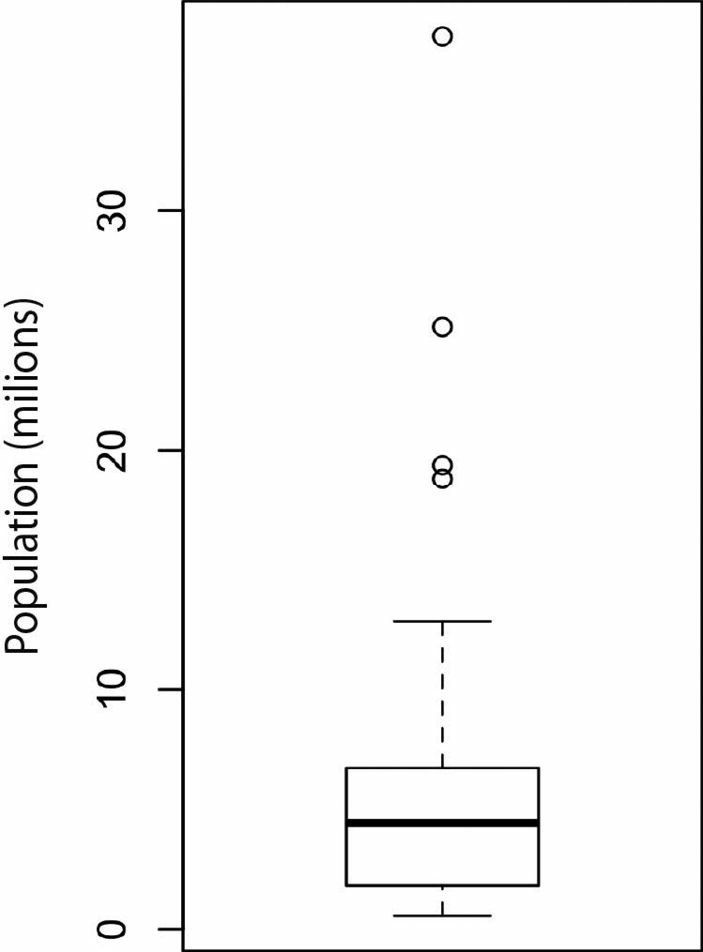
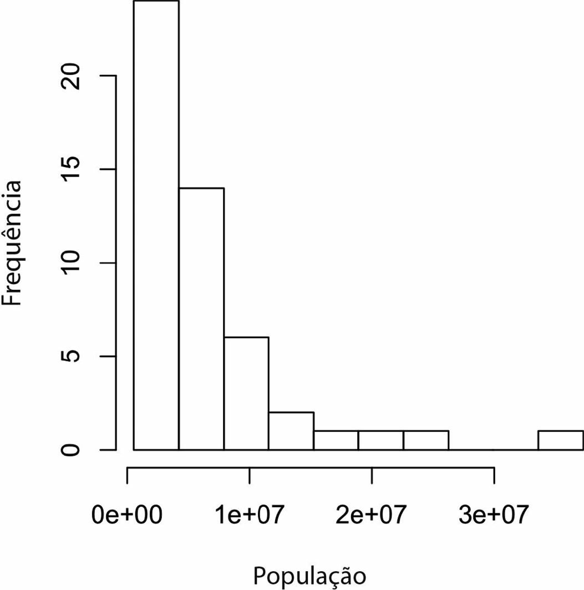
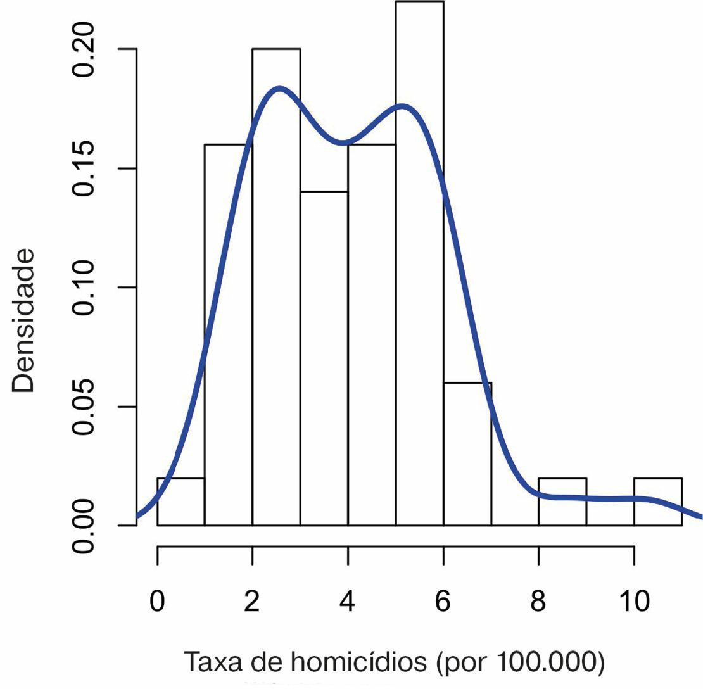
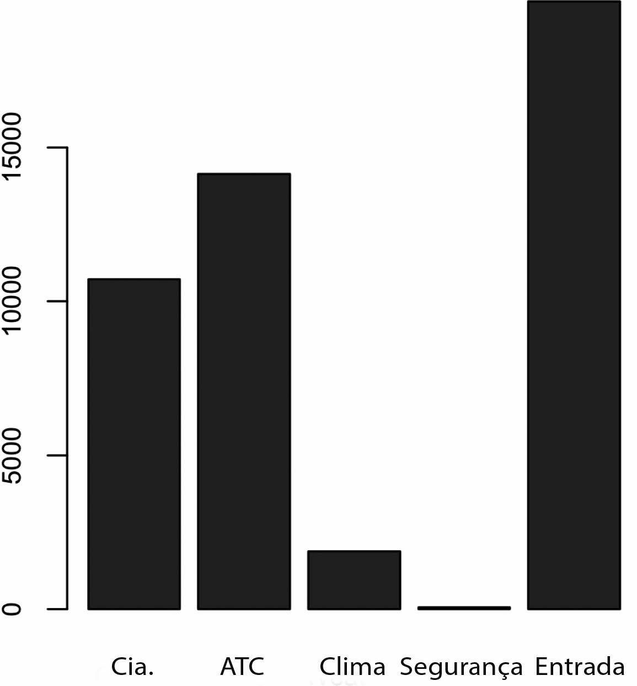

# Bruce et al. (2019) — Capítulo 1

Fonte: `livros/Bruce_2019 Estatistica Cientista Dados.pdf`

Este arquivo reúne uma extração expandida do Capítulo 1, restrita ao trecho que vai de `Elementos de Dados Estruturados` até `Explorando Dados Binários e Categóricos`, com foco em:

- conceitos e terminologia técnica;
- exemplos apresentados ao longo da teoria;
- tabelas e quadros auxiliares;
- fórmulas em notação LaTeX;
- observações úteis para estudo offline.

## Escopo do Recorte

As seções cobertas neste markdown são:

- Elementos de Dados Estruturados;
- Dados Retangulares;
- Quadros de Dados e Índices;
- Estruturas de Dados Não Retangulares;
- Estimativas de Localização;
- Média;
- Mediana e Estimativas Robustas;
- Exemplo: estimativas de localização de população e taxas de homicídio;
- Estimativas de Variabilidade;
- Desvio-padrão e estimativas relacionadas;
- Estimativas baseadas em percentis;
- Exemplo: estimativas de variabilidade de população estadual;
- Explorando a Distribuição de Dados;
- Percentis e boxplots;
- Tabela de frequências e histogramas;
- Estimativas de densidade;
- Explorando Dados Binários e Categóricos.

## Fórmulas e Relações Usadas no Recorte

### Média aritmética

$$
\bar{x} = \frac{1}{n}\sum_{i=1}^{n} x_i
$$

em que:

- $\bar{x}$ é a média amostral;
- $n$ é o número de observações;
- $x_i$ é o valor da $i$-ésima observação;
- $i$ é o índice das observações, variando de $1$ até $n$.

### Média ponderada

$$
\bar{x}_w = \frac{\sum_{i=1}^{n} w_i x_i}{\sum_{i=1}^{n} w_i}
$$

em que:

- $\bar{x}_w$ é a média ponderada;
- $w_i$ é o peso atribuído à $i$-ésima observação;
- $x_i$ é o valor da $i$-ésima observação;
- $n$ é o número de observações;
- $i$ é o índice das observações.

### Média aparada

Se $x_{(1)} \le \cdots \le x_{(n)}$ são os dados ordenados e $p$ observações são removidas de cada extremidade:

$$
\bar{x}_{\text{aparada}} = \frac{1}{n-2p}\sum_{i=p+1}^{n-p} x_{(i)}
$$

em que:

- $\bar{x}_{\text{aparada}}$ é a média aparada;
- $x_{(i)}$ é a $i$-ésima observação após ordenar os dados;
- $n$ é o número total de observações;
- $p$ é o número de observações removidas em cada cauda;
- $i$ é o índice na sequência ordenada.

### Variância amostral

$$
s^2 = \frac{1}{n-1}\sum_{i=1}^{n}(x_i-\bar{x})^2
$$

em que:

- $s^2$ é a variância amostral;
- $n$ é o número de observações;
- $x_i$ é o valor da $i$-ésima observação;
- $\bar{x}$ é a média amostral;
- $i$ é o índice das observações.

### Desvio-padrão amostral

$$
s = \sqrt{s^2}
$$

em que:

- $s$ é o desvio-padrão amostral;
- $s^2$ é a variância amostral.

### Desvio absoluto médio

$$
DAM = \frac{1}{n}\sum_{i=1}^{n} |x_i-\bar{x}|
$$

em que:

- $DAM$ é o desvio absoluto médio;
- $n$ é o número de observações;
- $x_i$ é o valor da $i$-ésima observação;
- $\bar{x}$ é a média amostral;
- $i$ é o índice das observações.

### Desvio absoluto mediano da mediana

$$
MAD = \operatorname{med}\bigl(|x_i-\operatorname{med}(x)|\bigr)
$$

em que:

- $MAD$ é o desvio absoluto mediano;
- $\operatorname{med}(x)$ é a mediana do conjunto de dados $x$;
- $x_i$ é o valor da $i$-ésima observação.

Em muitos pacotes estatísticos, usa-se a versão escalada:

$$
MAD_{\text{esc}} = 1.4826 \cdot MAD
$$

em que:

- $MAD_{\text{esc}}$ é o $MAD$ escalado;
- $1.4826$ é o fator de escala usual para comparabilidade com o desvio-padrão sob normalidade;
- $MAD$ é o desvio absoluto mediano não escalado.

### Amplitude interquartílica

$$
IQR = Q_3 - Q_1
$$

em que:

- $IQR$ é a amplitude interquartílica;
- $Q_1$ é o primeiro quartil;
- $Q_3$ é o terceiro quartil.

### Regra do boxplot para valores discrepantes

Os limites usuais são:

$$
LI = Q_1 - 1.5 \cdot IQR
$$

em que:

- $LI$ é o limite inferior para identificação de potenciais outliers;
- $Q_1$ é o primeiro quartil;
- $IQR$ é a amplitude interquartílica.

$$
LS = Q_3 + 1.5 \cdot IQR
$$

em que:

- $LS$ é o limite superior para identificação de potenciais outliers;
- $Q_3$ é o terceiro quartil;
- $IQR$ é a amplitude interquartílica.

Valores abaixo de $LI$ ou acima de $LS$ são marcados como potenciais outliers.

### Proporção e frequência relativa

$$
\hat{p}_i = \frac{n_i}{n}
$$

em que:

- $\hat{p}_i$ é a proporção ou frequência relativa da categoria $i$;
- $n_i$ é a frequência absoluta da categoria $i$;
- $n$ é o número total de observações;
- $i$ identifica a categoria.

### Valor esperado de variável discreta

Se uma variável categórica/binária for codificada numericamente:

$$
E(X) = \sum_x x \, P(X=x)
$$

em que:

- $E(X)$ é o valor esperado da variável aleatória $X$;
- $x$ representa um valor possível de $X$;
- $P(X=x)$ é a probabilidade de $X$ assumir o valor $x$.

No caso binário com codificação $0/1$:

$$
E(X) = P(X=1)
$$

em que:

- $E(X)$ é a média ou valor esperado da variável binária $X$;
- $P(X=1)$ é a probabilidade de ocorrência da categoria codificada como $1$.

## 1. Elementos de Dados Estruturados

### Termos-chave

- dado contínuo;
- dado discreto;
- dado categórico;
- dado binário;
- dado ordinal.

### Ideias centrais

O capítulo começa distinguindo tipos de dados, pois a natureza da variável condiciona:

- a escolha dos resumos estatísticos;
- a forma de visualização;
- a modelagem;
- o comportamento do software na importação e no armazenamento.

### Da matéria-prima bruta ao dado analisável

O texto abre esta seção lembrando que muitos dados de interesse prático chegam em formato não estruturado:

- imagens como arranjos de pixels;
- textos como sequências de palavras e caracteres;
- clickstreams como sequências de ações do usuário;
- fluxos de sensores e dispositivos da Internet das Coisas.

A análise estatística do livro pressupõe, em geral, que esses dados já tenham sido processados para uma forma estruturada e acionável.

### Tipos de dados

#### Dados contínuos

Dados que podem assumir qualquer valor em um intervalo, como tempo, massa, altura ou temperatura.

#### Dados discretos

Dados que assumem tipicamente valores inteiros contáveis, como número de defeitos, número de acessos ou número de chamadas.

#### Dados categóricos

Dados cujos valores pertencem a um conjunto finito de categorias ou rótulos, como cor, estado civil ou meio de pagamento.

#### Dados binários

Caso particular de dado categórico com apenas duas classes, como `sim/não`, `0/1`, `sucesso/falha`.

#### Dados ordinais

Dados categóricos com ordenação natural entre as categorias, como `baixo`, `médio`, `alto`.

### Observações técnicas

- Em análise estatística e ciência de dados, a tipagem correta afeta o cálculo de medidas, a codificação e a escolha de algoritmos.
- Em `R` e `Python`, variáveis ordinais podem exigir classes específicas para preservar a ordem.
- O texto alerta para problemas comuns de importação, como colunas textuais convertidas para fatores e geração de valores ausentes quando surgem categorias novas não previstas.

### Vantagens explícitas da tipagem categórica

O livro enumera três ganhos práticos quando o software sabe que uma coluna é categórica:

- orientar corretamente gráficos, modelos e procedimentos estatísticos;
- otimizar armazenamento e indexação;
- restringir os valores admissíveis a um conjunto coerente de categorias.

### Ideias-chave da seção

- os dados costumam ser classificados por tipo no software;
- os tipos centrais são contínuo, discreto, categórico, binário e ordinal;
- a tipagem funciona como um sinal para o processamento estatístico adequado.

## 2. Dados Retangulares

### Termos-chave

- quadro de dados;
- característica;
- variável;
- atributo;
- entrada;
- indicador;
- conclusão;
- resposta;
- alvo;
- registro;
- caso;
- instância;
- observação;
- padrão;
- amostra.

### Ideias centrais

A estrutura retangular é o formato mais familiar da análise de dados:

- cada linha representa um registro;
- cada coluna representa uma variável;
- o conjunto forma uma matriz observacional organizada.

Essa estrutura é a base de `data.frame`, `DataFrame` e objetos tabulares equivalentes.

### Quadro terminológico

| Elemento | Terminologia associada |
| --- | --- |
| Coluna | característica, atributo, entrada, indicador, variável |
| Coluna-resposta | conclusão, resposta, alvo |
| Linha | registro, caso, instância, observação, padrão, amostra |

### Exemplo tabular do livro

Tabela-base de um conjunto de leilões on-line:

| Categoria | Moeda | ClassVend | Duração | DiaFinal | PreçoFim | PreçoInício | Competitivo? |
| --- | --- | ---: | ---: | --- | ---: | ---: | ---: |
| Música/Filme/Game | US | 3249 | 5 | Seg | 0.01 | 0.01 | 0 |
| Música/Filme/Game | US | 3249 | 5 | Seg | 0.01 | 0.01 | 0 |
| Automotivo | US | 3115 | 7 | Ter | 0.01 | 0.01 | 0 |
| Automotivo | US | 3115 | 7 | Ter | 0.01 | 0.01 | 0 |
| Automotivo | US | 3115 | 7 | Ter | 0.01 | 0.01 | 1 |

### Leitura estatística do exemplo

- `Categoria`, `Moeda` e `DiaFinal` são variáveis categóricas;
- `ClassVend`, `Duração`, `PreçoFim` e `PreçoInício` são variáveis numéricas;
- `Competitivo?` é variável binária.

### Observação metodológica

O capítulo destaca que muitos dados reais não nascem em formato retangular. Texto, eventos e dados relacionais frequentemente precisam ser:

- agregados;
- limpos;
- transformados;
- consolidados em uma única tabela analítica.

## 3. Quadros de Dados e Índices

### Ideias centrais

O livro relaciona a estrutura retangular com ferramentas computacionais usuais:

- `data.frame` em `R`;
- `DataFrame` em `pandas`;
- tabelas otimizadas para manipulação, como `data.table`.

O índice funciona como identificador de linha e pode carregar:

- ordem;
- chave de busca;
- rótulo de registro.

### Observação prática

Embora o índice seja útil no processamento, ele não deve ser confundido automaticamente com uma variável substantiva do problema. Em muitos casos, é apenas um identificador técnico.

### Diferenças de terminologia entre áreas

O livro chama atenção para a ambiguidade entre estatística, computação e ciência de dados:

- um estatístico fala em variável preditora e variável resposta;
- um cientista de dados fala em característica e alvo;
- em computação, `amostra` pode significar uma única linha;
- em estatística, `amostra` costuma significar um conjunto de observações.

## 4. Estruturas de Dados Não Retangulares

### Tipos destacados

- séries temporais;
- dados espaciais;
- grafos e redes.

### Síntese

Nem todos os dados relevantes em ciência de dados cabem naturalmente em linhas e colunas independentes. O texto destaca estruturas em que:

- a ordem temporal é essencial;
- a localização geográfica é parte do dado;
- as relações entre unidades são tão importantes quanto os atributos das unidades.

### Quadro auxiliar

| Estrutura | Foco principal | Exemplos de uso |
| --- | --- | --- |
| Série temporal | medições sucessivas ao longo do tempo | previsão, sensores, IoT |
| Dado espacial | posição ou região no espaço | mapeamento, localização, imagens |
| Grafo ou rede | conexões entre entidades | redes sociais, logística, recomendação |

### Observação terminológica

O texto ressalta que `gráfico` pode significar coisas diferentes:

- em computação, uma estrutura de conexões entre entidades;
- em estatística, uma visualização de dados.

## 5. Estimativas de Localização

### Termos-chave

- média;
- média ponderada;
- mediana;
- mediana ponderada;
- média aparada;
- robustez;
- outlier.

### Finalidade

Estimativas de localização procuram responder à pergunta: onde está o centro dos dados?

### Média

A média usa todas as observações e é sensível a valores extremos. É eficiente quando a distribuição é relativamente regular e sem observações aberrantes influentes.

Exemplo simples do livro:

$$
\{3,5,1,2\}
$$

Então:

$$
\bar{x} = \frac{3+5+1+2}{4} = \frac{11}{4} = 2.75
$$

### Mediana e estimativas robustas

A mediana é o ponto que divide os dados ordenados em duas metades e é muito menos sensível a outliers. O livro enfatiza que:

- a mediana é robusta;
- a média aparada é um meio-termo entre média e mediana;
- observações extremas podem ser erros, mas também podem ser dados válidos.

### Mediana ponderada

O texto também observa que, quando as observações têm pesos diferentes, é possível definir uma mediana ponderada. Após ordenar os dados, busca-se um ponto em que o peso acumulado abaixo e acima fique equilibrado. Assim como a mediana usual, a mediana ponderada é resistente a valores extremos.

### Outliers e investigação

O capítulo trata os outliers como observações que merecem exame específico:

- podem ser erros de dado, como mistura de unidades ou falhas de sensor;
- podem ser observações válidas e substantivamente importantes;
- afetam fortemente a média, mas menos a mediana.

### Nota sobre detecção de anomalias

O livro faz uma distinção metodológica útil: na análise exploratória tradicional, o outlier pode ser ruído ou informação; já em detecção de anomalias, o próprio outlier passa a ser o objeto central de interesse.

### Quadro comparativo

| Medida | Usa todos os valores? | Sensível a outliers? | Observação |
| --- | --- | --- | --- |
| Média | Sim | Alta | Boa síntese quando não há forte assimetria/extremos |
| Mediana | Não, depende da ordem | Baixa | Medida robusta de localização |
| Média aparada | Parcialmente | Moderada | Remove observações extremas antes da média |
| Média ponderada | Sim, com pesos | Depende dos pesos e dos extremos | Adequada quando unidades têm importâncias diferentes |

### Razões destacadas para usar média ponderada

O capítulo menciona dois motivos centrais:

- algumas observações são intrinsecamente mais confiáveis ou menos variáveis do que outras;
- certos grupos podem estar sub-representados nos dados e exigir reponderação.

## 6. Exemplo: Estimativas de Localização de População e Taxas de Homicídio

### Contexto

O livro usa dados dos estados norte-americanos com duas variáveis principais:

- população;
- taxa de homicídio.

### Tabela-base parcial

| Estado | População | Taxa de homicídio |
| --- | ---: | ---: |
| Alabama | 4.779.736 | 5.7 |
| Alasca | 710.231 | 5.6 |
| Arizona | 6.392.017 | 4.7 |
| Arkansas | 2.915.918 | 5.6 |
| Califórnia | 37.253.956 | 4.4 |
| Colorado | 5.029.196 | 2.8 |
| Connecticut | 3.574.097 | 2.4 |
| Delaware | 897.934 | 5.8 |

### Interpretação central do exemplo

Ao calcular média, média aparada e mediana para a população estadual, o livro destaca a ordem:

$$
\text{média} > \text{média aparada} > \text{mediana}
$$

Isso ocorre porque poucos estados muito populosos puxam a média para cima.

### Leitura metodológica

- A média da população estadual é fortemente influenciada por estados muito grandes.
- A média aparada reduz essa influência ao eliminar valores das caudas.
- A mediana representa melhor o estado “típico” em presença de assimetria.

### Taxa média nacional de homicídios

Para resumir a taxa de homicídios em nível nacional, o livro ressalta que não basta uma média simples das taxas estaduais. O mais adequado é uma média ponderada pela população:

$$
\bar{h}_w = \frac{\sum_{i=1}^{n} P_i h_i}{\sum_{i=1}^{n} P_i}
$$

em que:

- $P_i$ é a população do estado $i$;
- $h_i$ é a taxa de homicídios do estado $i$.

### Comentário técnico

A média ponderada responde melhor à pergunta sobre a taxa nacional média por indivíduo, enquanto a média simples responde à pergunta sobre o estado médio.

### Observação adicional do exemplo

O texto registra ainda que, nesse conjunto, a média ponderada e a mediana ponderada das taxas de homicídio ficam muito próximas entre si, o que sugere relativa estabilidade do resumo ponderado para essa variável específica.

## 7. Estimativas de Variabilidade

### Termos-chave

- desvio;
- variância;
- desvio-padrão;
- desvio absoluto médio;
- desvio absoluto mediano;
- amplitude;
- percentil;
- amplitude interquartílica.

### Finalidade

Estimativas de variabilidade medem o espalhamento dos dados em torno de um centro.

### Exemplo elementar do livro

Para os dados:

$$
\{1,4,4\}
$$

tem-se:

$$
\bar{x} = 3
$$

Desvios em relação à média:

$$
\{-2,1,1\}
$$

Desvio absoluto médio:

$$
\frac{|1-3|+|4-3|+|4-3|}{3}=\frac{2+1+1}{3}=1.33
$$

### Desvio-padrão e estimativas relacionadas

O texto enfatiza:

- a variância usa quadrados dos desvios;
- o desvio-padrão retorna à unidade original dos dados;
- o denominador $n-1$ ajusta a estimativa amostral da variância.

### Observação sobre graus de liberdade

O uso de $n-1$ reflete o fato de que, após estimar $\bar{x}$ com a própria amostra, apenas $n-1$ desvios podem variar livremente.

### Medidas robustas de variabilidade

Como a variância e o desvio-padrão são sensíveis a extremos, o livro destaca:

- $IQR$, baseado em quartis;
- $MAD$, baseado em desvios absolutos em torno da mediana.

### Comparação operacional das medidas

| Medida | Sensibilidade a outliers | Unidade | Uso principal |
| --- | --- | --- | --- |
| Variância | Alta | unidade ao quadrado | modelagem e cálculo inferencial |
| Desvio-padrão | Alta | mesma unidade do dado | dispersão global |
| $DAM$ | Moderada | mesma unidade do dado | interpretação direta dos desvios |
| $MAD$ | Baixa | mesma unidade do dado | dispersão robusta |
| $IQR$ | Baixa | mesma unidade do dado | amplitude da região central |

### Relação entre as medidas

O livro destaca a ordem conceitual usual:

$$
\text{desvio-padrão} > DAM > MAD
$$

em escala comparável, especialmente quando há observações extremas influentes.

### Nota sobre $n$ versus $n-1$

No enquadramento estatístico amostral, dividir por $n$ tende a subestimar a variância populacional. Por isso a fórmula usual adota:

$$
n-1
$$

no denominador, produzindo uma estimativa não enviesada da variância populacional sob o modelo clássico.

## 8. Estimativas Baseadas em Percentis

### Exemplo do livro

Para o conjunto ordenado:

$$
1,\ 2,\ 3,\ 3,\ 5,\ 6,\ 7,\ 9
$$

o texto apresenta:

$$
Q_1 = 2.5, \qquad Q_3 = 6.5
$$

Logo:

$$
IQR = 6.5 - 2.5 = 4
$$

### Interpretação

Percentis e quartis resumem a posição relativa dos dados e são particularmente úteis quando:

- a distribuição é assimétrica;
- há outliers;
- deseja-se um resumo menos dependente da média.

### Observação computacional

O livro chama atenção para dois pontos:

- em amostras pequenas, diferentes softwares podem retornar percentis ligeiramente distintos;
- em bases muito grandes, percentis aproximados são frequentemente usados para reduzir custo computacional.

## 9. Exemplo: Estimativas de Variabilidade de População Estadual

### Contexto

Usando novamente os dados populacionais dos estados, o livro compara:

- desvio-padrão;
- amplitude interquartílica;
- $MAD$.

### Ponto central

O texto destaca que o desvio-padrão fica sensivelmente maior do que uma medida robusta como o $MAD$, pois a distribuição das populações estaduais contém valores extremos altos.

### Leitura estatística

- O desvio-padrão responde fortemente a estados muito populosos.
- O $MAD$ e o $IQR$ descrevem a dispersão de forma mais estável.
- Em distribuições assimétricas, é recomendável examinar medidas clássicas e robustas em conjunto.

### Quadro interpretativo

| Cenário | Medida mais informativa |
| --- | --- |
| distribuição aproximadamente regular e sem extremos relevantes | desvio-padrão |
| distribuição assimétrica com extremos influentes | $MAD$ e $IQR$ |
| comparação entre dispersão global e dispersão robusta | analisar desvio-padrão e $MAD$ em conjunto |

## 10. Explorando a Distribuição de Dados

### Termos-chave

- boxplot;
- tabela de frequências;
- histograma;
- gráfico de densidade.

### Objetivo

Depois de medir centro e dispersão, o próximo passo é descrever a forma da distribuição:

- simetria ou assimetria;
- concentração;
- caudas;
- lacunas;
- multimodalidade;
- valores extremos.

### Como identificar assimetria à esquerda ou à direita

- A assimetria é identificada, em geral, pelo lado da cauda mais longa da distribuição.
- Se a cauda se estende para valores altos, a distribuição tem assimetria à direita.
- Se a cauda se estende para valores baixos, a distribuição tem assimetria à esquerda.
- Como indício numérico, costuma ocorrer:
  - média > mediana em assimetria à direita;
  - média < mediana em assimetria à esquerda.
- Esse critério por média e mediana ajuda, mas não substitui a inspeção visual do histograma, boxplot ou gráfico de densidade.

## 11. Percentis e Boxplots

### Percentis da taxa de homicídio

Tabela transcrita dos percentis apresentados no livro:

| Percentil | Taxa de homicídio |
| ---: | ---: |
| 5% | 1.60 |
| 25% | 2.42 |
| 50% | 4.00 |
| 75% | 5.55 |
| 95% | 6.51 |

### Estrutura do boxplot

No boxplot:

- a base da caixa é $Q_1$;
- o topo da caixa é $Q_3$;
- a linha interna marca a mediana;
- os bigodes vão até o ponto mais extremo ainda dentro dos limites usuais;
- pontos além de $1.5 \cdot IQR$ são desenhados individualmente.

**Figura 1 - Boxplot de populações por estado**

Fonte: Bruce et al. (2019).

### Quadro auxiliar

| Elemento do boxplot | Interpretação |
| --- | --- |
| Base da caixa | primeiro quartil $Q_1$ |
| Linha central | mediana |
| Topo da caixa | terceiro quartil $Q_3$ |
| Altura da caixa | $IQR$ |
| Bigodes | extensão sem outliers segundo a regra usual |
| Pontos isolados | potenciais outliers |

## 12. Tabela de Frequências e Histogramas

### Tabela de frequências da população estadual

O livro constrói uma distribuição em 10 classes. A transcrição expandida é:

| Classe populacional | Frequência | Estados listados no livro |
| --- | ---: | --- |
| 563.626–4.232.658 | 24 | WY, VT, ND, AK, SD, DE, MT, RI, NH, ME, HI, ID, NE, WV, NM, NV, UT, KS, AR, MS, IA, CT e outros da faixa |
| 4.232.659–7.901.691 | 14 | KY, LA, SC, AL, CO, MN, WI, MD, MO, TN, AZ, IN, MA, WA |
| 7.901.692–11.570.724 | 6 | VA, NJ, NC, GA, MI, OH |
| 11.570.725–15.239.757 | 2 | PA, IL |
| 15.239.758–18.908.790 | 1 | FL |
| 18.908.791–22.577.823 | 1 | NY |
| 22.577.824–26.246.856 | 1 | TX |
| 26.246.857–29.915.889 | 0 | — |
| 29.915.890–33.584.922 | 0 | — |
| 33.584.923–37.253.956 | 1 | CA |

### Leituras importantes

- O histograma usa classes contíguas e exaustivas.
- Classes vazias também carregam informação e não devem ser omitidas.
- A distribuição é assimétrica à direita, com poucos estados muito populosos.

### Construção da tabela em 10 classes

O texto explicita o procedimento:

- menor população: Wyoming, com $563.626$ habitantes;
- maior população: Califórnia, com $37.253.956$ habitantes;
- amplitude total:

$$
37.253.956 - 563.626 = 36.690.330
$$

- com $10$ classes de mesma largura, cada classe fica com amplitude aproximada de:

$$
\frac{36.690.330}{10} = 3.669.033
$$

Por isso a primeira classe vai de $563.626$ até $4.232.658$.

### Histograma

O histograma traduz a tabela de frequências em barras contíguas e permite perceber:

- concentração em valores baixos;
- cauda longa à direita;
- desbalanceamento entre a massa central e os extremos.

**Figura 2 - Histograma de populações estaduais**

Fonte: Bruce et al. (2019).

### Regras operacionais destacadas no texto

- as classes devem ter a mesma largura;
- classes vazias precisam ser mostradas;
- o número de classes é uma decisão analítica do usuário;
- barras adjacentes ficam encostadas, salvo quando há classe vazia.

### Nota sobre momentos

O livro menciona a interpretação clássica:

- localização corresponde ao primeiro momento;
- variabilidade corresponde ao segundo momento;
- assimetria e curtose são associados ao terceiro e ao quarto momentos.

Ainda assim, para assimetria e caudas, o texto recomenda priorizar inspeção visual por boxplots e histogramas.

## 13. Estimativas de Densidade

### Ideia central

O gráfico de densidade é uma suavização do histograma. Em vez de classes rígidas, produz uma curva contínua aproximando a distribuição dos dados.

**Figura 3 - Densidade das taxas de homicídio estaduais**

Fonte: Bruce et al. (2019).

### Observações técnicas

- depende de um parâmetro de suavização;
- suavização excessiva esconde estrutura;
- suavização insuficiente gera curva excessivamente irregular.

### Relação com o histograma

Quando o histograma é construído em escala de densidade, a área total sob as barras é igual a $1$, o que o aproxima conceitualmente do gráfico de densidade.

### Observação operacional

O gráfico de densidade troca contagens por proporções suavizadas. Assim, ele é particularmente útil para:

- comparar formas de distribuição;
- perceber multimodalidade;
- suavizar a irregularidade de histogramas muito granulares.

### Ideias-chave da seção de distribuição

- a tabela de frequências é a versão tabular do histograma;
- o boxplot resume rapidamente posição, dispersão e outliers;
- o gráfico de densidade é uma versão suavizada da distribuição empírica.

## 14. Explorando Dados Binários e Categóricos

### Termos-chave

- moda;
- valor esperado;
- gráfico de barras;
- gráfico de pizza.

### Síntese conceitual

Para dados binários e categóricos, os resumos mais importantes são:

- contagens;
- proporções;
- categoria modal.

### Moda

A moda é a categoria mais frequente.

### Valor esperado

Quando uma variável binária é codificada por $0$ e $1$, sua média coincide com a proporção de sucessos:

$$
\bar{x} = \hat{p}
$$

e, em termos probabilísticos,

$$
E(X)=P(X=1)
$$

### Exemplo do livro: atrasos por causa

Percentual de atrasos por causa no aeroporto Dallas/Fort Worth:

| Causa | Percentual |
| --- | ---: |
| Cia. | 23.02 |
| CTA | 30.40 |
| Clima | 4.03 |
| Segurança | 0.12 |
| Entrada | 42.43 |

**Figura 4 - Gráfico de barras de atrasos aéreos no DFW por causador**

Fonte: Bruce et al. (2019).

### Leitura estatística do exemplo

- A moda é `Entrada`, por concentrar a maior parcela dos atrasos.
- A comparação entre categorias é naturalmente feita por proporções ou percentuais.
- O gráfico de barras é a visualização preferencial para esse tipo de dado.

### Observação sobre gráficos

O livro adota a posição técnica usual de que:

- gráficos de barras são mais claros para comparação entre categorias;
- gráficos de pizza, embora populares, em geral são menos precisos para leitura analítica.

### Diferença entre gráfico de barras e histograma

| Aspecto | Gráfico de barras | Histograma |
| --- | --- | --- |
| Eixo $x$ | categorias | intervalos numéricos |
| Barras | separadas | contíguas |
| Finalidade | comparar categorias | descrever distribuição numérica |
| Classe vazia | categoria sem barra ou barra nula | intervalo vazio explicitamente relevante |

### Quadro prático de resumos para variáveis categóricas

| Tipo de variável | Resumo principal | Visualização preferencial |
| --- | --- | --- |
| Binária | proporção de sucessos | gráfico de barras |
| Categórica nominal | contagens e proporções por categoria | gráfico de barras |
| Categórica ordinal | contagens/proporções respeitando a ordem | gráfico de barras ordenado |

## Síntese Final do Recorte

O trecho do Capítulo 1 constrói uma progressão metodológica:

1. definir corretamente o tipo de dado;
2. organizar os dados em estruturas adequadas;
3. resumir centro e variabilidade;
4. examinar a forma da distribuição;
5. adaptar o resumo à natureza numérica, binária ou categórica da variável.

## Observações Editoriais

- Este markdown foi montado para estudo técnico offline, com reorganização didática do conteúdo.
- Em algumas tabelas extensas do livro, manteve-se transcrição parcial ou consolidada quando a página original mostrava apenas parte das linhas ou quando a listagem integral era acessória à interpretação estatística.
- As fórmulas foram padronizadas em LaTeX com `$...$` e `$$...$$`.
