# Morettin e Bussab (2010) — Capítulos 1, 2 e 3

Fonte: `livros/P. A. Morettin, W. de O. Bussab - Estatística Básica-Saraiva (2010).pdf`

Este arquivo reúne uma extração expandida dos capítulos 1, 2 e 3 com foco em:

- exemplos apresentados ao longo da teoria;
- exemplos computacionais;
- problemas e complementos.

## Capítulo 1 — Preliminares

### Exemplos

#### Exemplo 1.1

Estuda-se a relação entre rendimento e gasto de consumo de um conjunto de indivíduos por meio de um diagrama de dispersão. O texto introduz a decomposição

$$
\text{Dados} = \text{Modelo} + \text{Resíduos},
$$

ou, equivalentemente,

$$
D = M + R.
$$

O ponto central do exemplo é que a parte suave $M$ representa a estrutura previsível dos dados, enquanto $R$ representa a parte aleatória. A análise exploratória de dados busca identificar essa decomposição e avaliar se o modelo adotado é adequado por meio dos resíduos.

**Figura 1 - Relação entre consumo e rendimento**

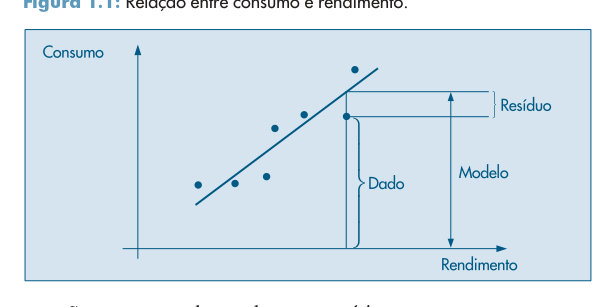

Fonte: Morettin e Bussab (2010).

### Problemas

O capítulo 1, na parte inspecionada do livro, não apresenta uma seção própria de problemas. O conteúdo do capítulo é introdutório e prepara os capítulos seguintes.

## Capítulo 2 — Resumo de Dados

### Exemplos

#### Exemplo 2.1

Levantamento socioeconômico de 36 empregados da seção de orçamentos da Companhia MB. As variáveis observadas são:

- estado civil;
- grau de instrução;
- número de filhos;
- salário;
- idade;
- região de procedência.

O exemplo introduz a distinção entre variáveis qualitativas e quantitativas.

Resumo dos campos observados na Tabela 2.1:

| Variável | Símbolo |
| --- | --- |
| Estado civil | $X$ |
| Grau de instrução | $Y$ |
| Número de filhos | $Z$ |
| Salário | $S$ |
| Idade | $U$ |
| Região de procedência | $V$ |

Tabela 2.1 transcrita em formato tabular:

| No | Estado civil | Grau de instrução | Nº de filhos | Salário | Idade (anos) | Idade (meses) | Região |
| ---: | --- | --- | --- | ---: | ---: | ---: | --- |
| 1 | solteiro | ensino fundamental | — | 4,00 | 26 | 03 | interior |
| 2 | casado | ensino fundamental | 1 | 4,56 | 32 | 10 | capital |
| 3 | casado | ensino fundamental | 2 | 5,25 | 36 | 05 | capital |
| 4 | solteiro | ensino médio | — | 5,73 | 20 | 10 | outra |
| 5 | solteiro | ensino fundamental | — | 6,26 | 40 | 07 | outra |
| 6 | casado | ensino fundamental | 0 | 6,66 | 28 | 00 | interior |
| 7 | solteiro | ensino fundamental | — | 6,86 | 41 | 00 | interior |
| 8 | solteiro | ensino fundamental | — | 7,39 | 43 | 04 | capital |
| 9 | casado | ensino médio | 1 | 7,59 | 34 | 10 | capital |
| 10 | solteiro | ensino médio | — | 7,44 | 23 | 06 | outra |
| 11 | casado | ensino médio | 2 | 8,12 | 33 | 06 | interior |
| 12 | solteiro | ensino fundamental | — | 8,46 | 27 | 11 | capital |
| 13 | solteiro | ensino médio | — | 8,74 | 37 | 05 | outra |
| 14 | casado | ensino fundamental | 3 | 8,95 | 44 | 02 | outra |
| 15 | casado | ensino médio | 0 | 9,13 | 30 | 05 | interior |
| 16 | solteiro | ensino médio | — | 9,35 | 38 | 08 | outra |
| 17 | casado | ensino médio | 1 | 9,77 | 31 | 07 | capital |
| 18 | casado | ensino fundamental | 2 | 9,80 | 39 | 07 | outra |
| 19 | solteiro | superior | — | 10,53 | 25 | 08 | interior |
| 20 | solteiro | ensino médio | — | 10,76 | 37 | 04 | interior |
| 21 | casado | ensino médio | 1 | 11,06 | 30 | 09 | outra |
| 22 | solteiro | ensino médio | — | 11,59 | 34 | 02 | capital |
| 23 | solteiro | ensino fundamental | — | 12,00 | 41 | 00 | outra |
| 24 | casado | superior | 0 | 12,79 | 26 | 01 | outra |
| 25 | casado | ensino médio | 2 | 13,23 | 32 | 05 | interior |
| 26 | casado | ensino médio | 2 | 13,60 | 35 | 00 | outra |
| 27 | solteiro | ensino fundamental | — | 13,85 | 46 | 07 | outra |
| 28 | casado | ensino médio | 0 | 14,69 | 29 | 08 | interior |
| 29 | casado | ensino médio | 5 | 14,71 | 40 | 06 | interior |
| 30 | casado | ensino médio | 2 | 15,99 | 35 | 10 | capital |
| 31 | solteiro | superior | — | 16,22 | 31 | 05 | outra |
| 32 | casado | ensino médio | 1 | 16,61 | 36 | 04 | interior |
| 33 | casado | superior | 3 | 17,26 | 43 | 07 | capital |
| 34 | solteiro | superior | — | 18,75 | 33 | 07 | capital |
| 35 | casado | ensino médio | 2 | 19,40 | 48 | 11 | capital |
| 36 | casado | superior | 3 | 23,30 | 42 | 02 | interior |

#### Exemplo 2.2

Construção da distribuição de frequências da variável qualitativa ordinal `grau de instrução` para os 36 empregados da Companhia MB:

- Fundamental: $12$;
- Médio: $18$;
- Superior: $6$.

Também são apresentadas proporções e porcentagens, com $f_i = n_i/n$.

| Grau de instrução | $n_i$ | $f_i$ | $100f_i$ |
| --- | ---: | ---: | ---: |
| Fundamental | 12 | 0,3333 | 33,33 |
| Médio | 18 | 0,5000 | 50,00 |
| Superior | 6 | 0,1667 | 16,67 |
| Total | 36 | 1,0000 | 100,00 |

#### Exemplo 2.3

Construção da distribuição de frequências da variável contínua `salário` por classes:

- $[4, 8)$;
- $[8, 12)$;
- $[12, 16)$;
- $[16, 20)$;
- $[20, 24)$.

As frequências apresentadas no livro são:

- $10$;
- $12$;
- $8$;
- $5$;
- $1$.

As respectivas porcentagens são:

- $27{,}78\%$;
- $33{,}33\%$;
- $22{,}22\%$;
- $13{,}89\%$;
- $2{,}78\%$.

O exemplo mostra a necessidade de agrupar dados contínuos em faixas para resumir a distribuição e observa a perda de informação individual quando os dados são agregados em classes.

| Classe de salários | $n_i$ | $100f_i$ |
| --- | ---: | ---: |
| $[4,8)$ | 10 | 27,78 |
| $[8,12)$ | 12 | 33,33 |
| $[12,16)$ | 8 | 22,22 |
| $[16,20)$ | 5 | 13,89 |
| $[20,24)$ | 1 | 2,78 |
| Total | 36 | 100,00 |

#### Exemplo 2.4

Representação gráfica da variável `grau de instrução` por:

- gráfico em barras;
- gráfico em setores.

O objetivo é ilustrar gráficos para variáveis qualitativas.

**Figura 2 - Gráfico em barras para o grau de instrução**

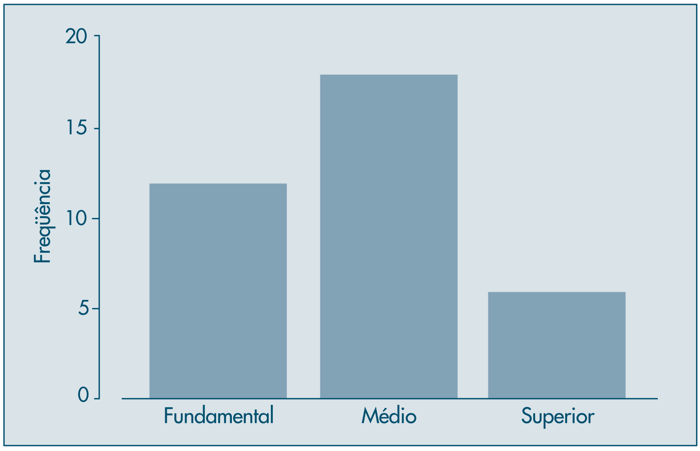

Fonte: Morettin e Bussab (2010).

**Figura 3 - Gráfico em setores para o grau de instrução**

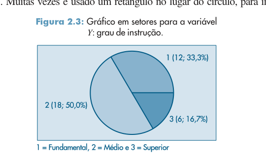

Fonte: Morettin e Bussab (2010).

#### Exemplo 2.5

Construção de gráficos para a variável quantitativa discreta `número de filhos` dos empregados casados, incluindo:

- gráfico em barras;
- gráfico de dispersão unidimensional.

As frequências usadas são:

- $z=0$: $4$;
- $z=1$: $5$;
- $z=2$: $7$;
- $z=3$: $3$;
- $z=5$: $1$.

As porcentagens correspondentes são:

- $20\%$;
- $25\%$;
- $35\%$;
- $15\%$;
- $5\%$.

**Figura 4 - Gráfico em barras para o número de filhos**

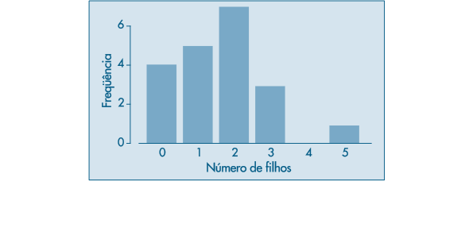

Fonte: Morettin e Bussab (2010).

**Figura 5 - Gráficos de dispersão unidimensionais para o número de filhos**

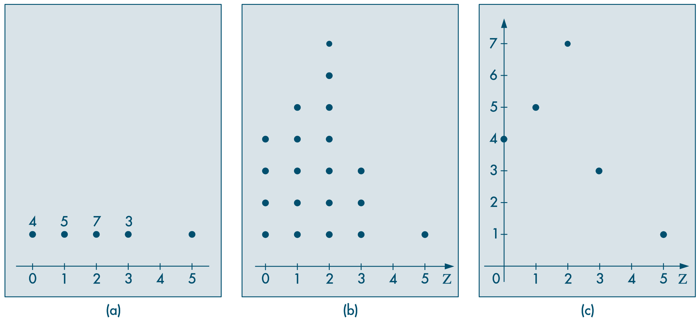

Fonte: Morettin e Bussab (2010).

#### Exemplo 2.6

Representação gráfica da variável contínua `salário` usando pontos médios das classes da distribuição de frequências. O exemplo transforma a tabela de classes em pares $(s_i, n_i)$ ou $(s_i, f_i)$, preparando a passagem para representações gráficas discretizadas.

Os pontos médios das classes são:

- $6$;
- $10$;
- $14$;
- $18$;
- $22$.

| Classe | Ponto médio $s_i$ | $n_i$ | $100f_i$ |
| --- | ---: | ---: | ---: |
| $[4,8)$ | 6 | 10 | 27,78 |
| $[8,12)$ | 10 | 12 | 33,33 |
| $[12,16)$ | 14 | 8 | 22,22 |
| $[16,20)$ | 18 | 5 | 13,89 |
| $[20,24)$ | 22 | 1 | 2,78 |

**Figura 6 - Gráfico em barras para os salários por pontos médios das classes**

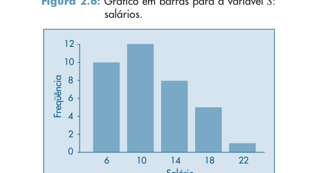

Fonte: Morettin e Bussab (2010).

#### Exemplo 2.7

Construção do histograma da variável `salário`. O texto destaca que:

- a área de cada retângulo deve ser proporcional à frequência;
- a altura é proporcional à densidade de frequência $f_i/\Delta_i$;
- a área total do histograma é igual a $1$.

**Figura 7 - Histograma da variável salário**

Fonte: Morettin e Bussab (2010).

#### Exemplo 2.8

Construção do diagrama ramo-e-folhas para os salários dos 36 empregados da Companhia MB. O exemplo destaca:

- concentração principal entre $4{,}00$ e $19{,}40$;
- destaque para o valor $23{,}30$;
- leve assimetria à direita.

**Figura 8 - Ramo-e-folhas para a variável salário**

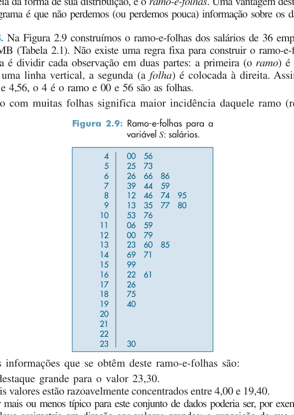

Fonte: Morettin e Bussab (2010).

#### Exemplo 2.9

Ramo-e-folhas para dados de dureza de 30 peças de alumínio. O exemplo também mostra uma versão com ramos duplicados, separando folhas de $0$ a $4$ e de $5$ a $9$.

#### Exemplo 2.10

Exemplo computacional com o conjunto `CD-Notas`, contendo notas de Estatística de 100 alunos. São apresentados:

- histograma;
- gráfico de dispersão unidimensional;
- ramo-e-folhas.

Conclusão principal: distribuição aproximadamente simétrica.

O ramo-e-folhas reproduzido no livro concentra observações sobretudo entre $5$ e $7$, com extremos em $1{,}5$ e $10{,}0$.

**Figura 9 - Histograma do CD-Notas**

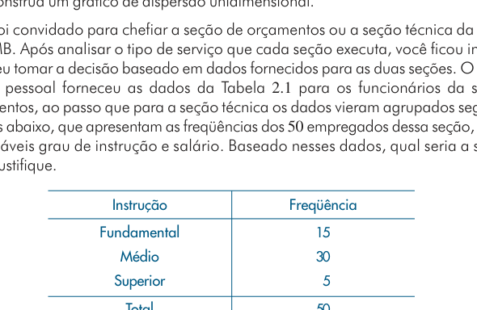

Fonte: Morettin e Bussab (2010).

**Figura 10 - Gráfico de dispersão unidimensional e ramo-e-folhas do CD-Notas**

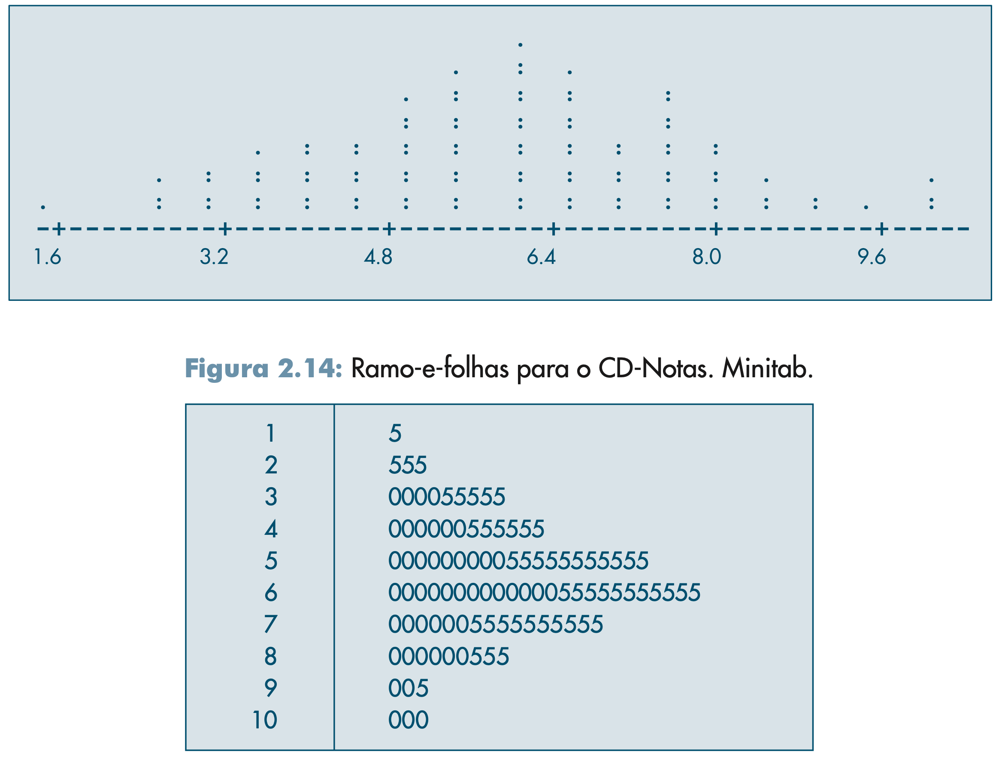

Fonte: Morettin e Bussab (2010).

#### Exemplo 2.11

Exemplo computacional com temperaturas diárias de São Paulo (`CD-Poluição`, 120 observações). São apresentados:

- gráfico temporal;
- histograma;
- gráfico de dispersão unidimensional;
- ramo-e-folhas.

Conclusão principal: distribuição não simétrica, com assimetria à esquerda.

O ramo-e-folhas mostrado no livro concentra temperaturas entre $16^\circ$C e $19^\circ$C, com mínimo $12{,}3$ e máximo $21{,}0$.

**Figura 11 - Série temporal das temperaturas de São Paulo**

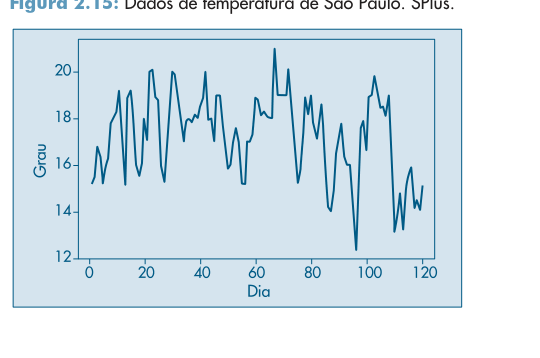

Fonte: Morettin e Bussab (2010).

**Figura 12 - Histograma, gráfico de dispersão unidimensional e ramo-e-folhas das temperaturas**

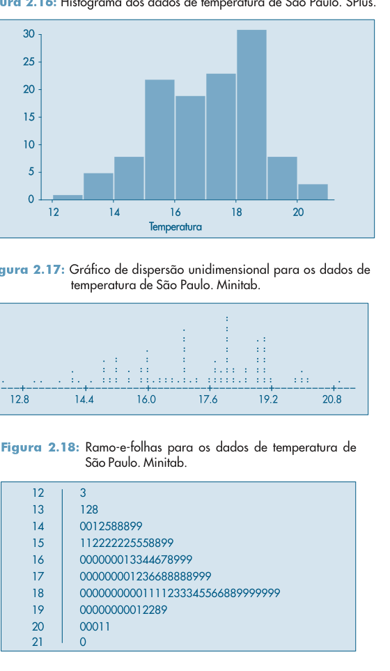

Fonte: Morettin e Bussab (2010).

#### Exemplo 2.12

Introdução da função de distribuição empírica para a variável `salário` dos 36 funcionários:

$$
F_n(x) = \frac{N(x)}{n},
$$

em que $N(x)$ é o número de observações menores ou iguais a $x$. Para os salários da Tabela 2.1, o livro apresenta a f.d.e. como uma função em degraus, começando com

$$
F_{36}(s)=0 \quad \text{se } s < 4{,}00,
$$

e aumentando de $1/36$ em $1/36$ a cada novo salário observado, até atingir

$$
F_{36}(s)=1 \quad \text{se } s \ge 23{,}30.
$$

O gráfico correspondente é apresentado para os salários individuais da Tabela 2.1.

**Figura 13 - Função de distribuição empírica dos salários**

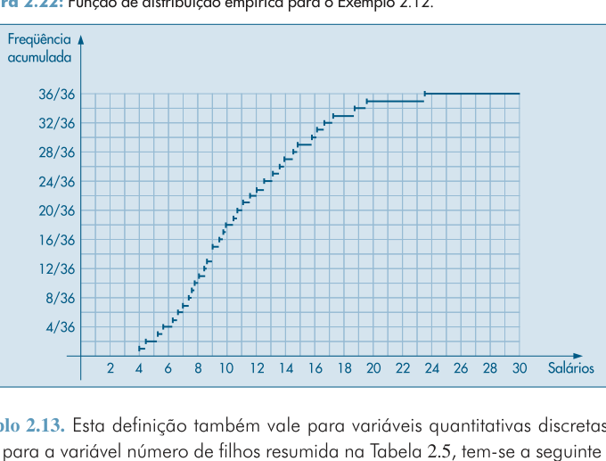

Fonte: Morettin e Bussab (2010).

#### Exemplo 2.13

Aplicação da função de distribuição empírica à variável discreta `número de filhos`, usando a distribuição resumida na Tabela 2.5.

O livro explicita:

$$
F_{20}(x)=
\begin{cases}
0{,}00, & x < 0, \\
0{,}20, & 0 \le x < 1, \\
0{,}45, & 1 \le x < 2, \\
0{,}80, & 2 \le x < 3, \\
0{,}95, & 3 \le x < 5, \\
1{,}00, & x \ge 5.
\end{cases}
$$

**Figura 14 - Função de distribuição empírica do número de filhos**

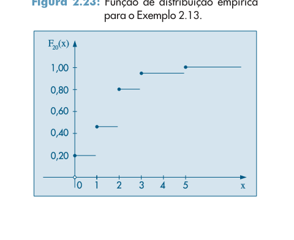

Fonte: Morettin e Bussab (2010).

### Problemas

#### Problemas da Seção 2.2

1. Escalas de medidas. Classificar variáveis segundo as escalas nominal, ordinal, intervalar e razão, discutindo transformações admissíveis e medidas de posição apropriadas.

2. Usando os dados da Tabela 2.1, construir distribuições de frequências para:
   - estado civil;
   - região de procedência;
   - número de filhos dos empregados casados;
   - idade.

3. Para o `CD-Brasil`, construir distribuições de frequências para:
   - população urbana;
   - densidade populacional.

#### Problemas das Seções 2.3 e 2.4

4. Número de erros de impressão na primeira página de um jornal durante 50 dias.
   - representar os dados graficamente;
   - construir histograma;
   - construir ramo-e-folhas.

5. Usando os resultados do Problema 2 e da Tabela 2.3:
   - construir um histograma para a variável idade;
   - propor uma representação gráfica para a variável grau de instrução.

6. Taxas médias geométricas de incremento anual dos 30 maiores municípios do Brasil.
   - construir um histograma;
   - construir um gráfico de dispersão unidimensional.

7. Comparação entre a seção de orçamentos e a seção técnica da Companhia MB com base em:
   - distribuição de grau de instrução;
   - distribuição de salários.

Pede-se uma decisão justificada sobre qual seção seria preferível chefiar.

8. Construir:
   - histograma;
   - ramo-e-folhas;
   - gráfico de dispersão unidimensional

para o conjunto `CD-Municípios`.

#### Problemas e Complementos da Seção 2.6

9. Curso experimental para 25 funcionários da MB Indústria e Comércio. A tabela inclui:
   - seção de origem;
   - notas em Administração, Direito, Redação, Estatística, Política e Economia;
   - conceitos em Inglês e Metodologia.

Pede-se:
   - classificar as 9 variáveis;
   - comparar distribuições de Direito, Política e Estatística;
   - construir histograma de Redação;
   - construir distribuição de frequências e gráfico para Metodologia;
   - calcular probabilidades associadas ao conceito $A$ em Metodologia;
   - analisar o desempenho em Estatística por seção.

Tabela-base do Problema 9:

| Func. | Seção | Administr. | Direito | Redação | Estatíst. | Inglês | Metodologia | Política | Economia |
| ---: | --- | ---: | ---: | ---: | ---: | --- | --- | ---: | ---: |
| 1 | P | 8,0 | 9,0 | 8,6 | 9,0 | B | A | 9,0 | 8,5 |
| 2 | P | 8,0 | 9,0 | 7,0 | 9,0 | B | C | 6,5 | 8,0 |
| 3 | P | 8,0 | 9,0 | 8,0 | 8,0 | D | B | 9,0 | 8,5 |
| 4 | P | 6,0 | 9,0 | 8,6 | 8,0 | D | C | 6,0 | 8,5 |
| 5 | P | 8,0 | 9,0 | 8,0 | 9,0 | A | A | 6,5 | 9,0 |
| 6 | P | 8,0 | 9,0 | 8,5 | 10,0 | B | A | 6,5 | 9,5 |
| 7 | P | 8,0 | 9,0 | 8,2 | 8,0 | D | C | 9,0 | 7,0 |
| 8 | T | 10,0 | 9,0 | 7,5 | 8,0 | B | C | 6,0 | 8,5 |
| 9 | T | 8,0 | 9,0 | 9,4 | 9,0 | B | B | 10,0 | 8,0 |
| 10 | T | 10,0 | 9,0 | 7,9 | 8,0 | B | C | 9,0 | 7,5 |
| 11 | T | 8,0 | 9,0 | 8,6 | 10,0 | C | B | 10,0 | 8,5 |
| 12 | T | 8,0 | 9,0 | 8,3 | 7,0 | D | B | 6,5 | 8,0 |
| 13 | T | 6,0 | 9,0 | 7,0 | 7,0 | B | C | 6,0 | 8,5 |
| 14 | T | 10,0 | 9,0 | 8,6 | 9,0 | A | B | 10,0 | 7,5 |
| 15 | V | 8,0 | 9,0 | 8,6 | 9,0 | C | B | 10,0 | 7,0 |
| 16 | V | 8,0 | 9,0 | 9,5 | 7,0 | A | A | 9,0 | 7,5 |
| 17 | V | 8,0 | 9,0 | 6,3 | 8,0 | D | C | 10,0 | 7,5 |
| 18 | V | 6,0 | 9,0 | 7,6 | 9,0 | C | C | 6,0 | 8,5 |
| 19 | V | 6,0 | 9,0 | 6,8 | 4,0 | D | C | 6,0 | 9,5 |
| 20 | V | 6,0 | 9,0 | 7,5 | 7,0 | C | B | 6,0 | 8,5 |
| 21 | V | 8,0 | 9,0 | 7,7 | 7,0 | D | B | 6,5 | 8,0 |
| 22 | V | 6,0 | 9,0 | 8,7 | 8,0 | C | A | 6,0 | 9,0 |
| 23 | V | 8,0 | 9,0 | 7,3 | 10,0 | C | C | 9,0 | 7,0 |
| 24 | V | 8,0 | 9,0 | 8,5 | 9,0 | A | A | 6,5 | 9,0 |
| 25 | V | 8,0 | 9,0 | 7,0 | 9,0 | B | A | 9,0 | 8,5 |

Convenção: $P$ = departamento pessoal, $T$ = seção técnica e $V$ = seção de vendas.

10. Intervalos de classes desiguais. Com uma tabela de 250 empresas classificadas segundo o número de empregados:
   - construir amplitudes $\Delta_i$;
   - obter densidades $n_i/\Delta_i$ e $f_i/\Delta_i$;
   - interpretar corretamente a concentração dos dados;
   - construir o histograma adequado.

Tabela-base do Problema 10:

| Número de empregados | $n_i$ | $\Delta_i$ | $n_i/\Delta_i$ | $f_i$ | $f_i/\Delta_i$ |
| --- | ---: | ---: | ---: | ---: | ---: |
| $[0,10)$ | 5 | 10 | 0,50 | 0,02 | 0,0020 |
| $[10,20)$ | 20 | 10 | 2,00 | 0,08 | 0,0080 |
| $[20,30)$ | 35 | 10 | 3,50 | 0,14 | 0,0140 |
| $[30,40)$ | 40 | 10 | 4,00 | 0,16 | 0,0160 |
| $[40,60)$ | 50 | 20 | 2,50 | 0,20 | 0,0100 |
| $[60,80)$ | 30 | 20 | 1,50 | 0,12 | 0,0060 |
| $[80,100)$ | 20 | 20 | 1,00 | 0,08 | 0,0040 |
| $[100,140)$ | 20 | 40 | 0,50 | 0,08 | 0,0020 |
| $[140,180)$ | 15 | 40 | 0,38 | 0,06 | 0,0015 |
| $[180,260)$ | 15 | 80 | 0,19 | 0,06 | 0,0008 |
| Total | 250 | — | — | 1,00 | — |

11. Comparar distribuições de aluguéis urbanos e rurais:
   - construir histogramas;
   - discutir diferenças entre as distribuições.

12. Histograma alisado. Reagrupar os salários da Tabela 2.4 em classes de amplitude $2$ e discutir a passagem do histograma usual para uma curva suavizada.

13. Esboçar histogramas alisados para:
   - salários registrados em carteira em São Paulo;
   - idades de alunos de uma faculdade;
   - idades dos alunos de uma turma específica;
   - número de óbitos por faixa etária;
   - número de divórcios segundo anos de casamento;
   - dois últimos algarismos do primeiro prêmio da Loteria Federal.

14. No mesmo gráfico, esboçar as distribuições das alturas de:
   - brasileiros adultos;
   - suecos adultos;
   - japoneses adultos.

15. Frequências acumuladas para os salários da Companhia MB.
   - interpretar a tabela de frequências acumuladas;
   - usar o gráfico acumulado para localizar valores percentuais, como o salário correspondente a $50\%$ acumulado.

16. Usando a Tabela 2.1:
   - construir a distribuição de frequências da variável idade;
   - fazer o gráfico da porcentagem acumulada;
   - encontrar os valores correspondentes a $25\%$, $50\%$ e $75\%$.

17. Frequências acumuladas e função de distribuição empírica.
   - definir formalmente $F_n(x) = N(x)/n$;
   - estudar sua construção para variáveis quantitativas;
   - entender a interpretação probabilística empírica de $F_n(x)$;
   - usar os exemplos 2.12 e 2.13 como ilustração.

## Capítulo 3 — Medidas-Resumo

### Exemplos

#### Exemplo 3.1

Usando a variável `número de filhos` da Tabela 2.5:

- moda: $2$;
- mediana: $2$;
- média:

$$
\bar z = \frac{4 \cdot 0 + 5 \cdot 1 + 7 \cdot 2 + 3 \cdot 3 + 1 \cdot 5}{20} = \frac{33}{20} = 1{,}65.
$$

Tabela de apoio:

| $z_i$ | $n_i$ | $100f_i$ |
| --- | ---: | ---: |
| 0 | 4 | 20 |
| 1 | 5 | 25 |
| 2 | 7 | 35 |
| 3 | 3 | 15 |
| 5 | 1 | 5 |
| Total | 20 | 100 |

#### Exemplo 3.2

Determinação de medidas de posição para variável quantitativa contínua agrupada em classes, usando os salários da Companhia MB. Adotando os pontos médios das classes da Tabela 2.6:

$$
\operatorname{mo}(S) \approx 10{,}00,\quad
\operatorname{md}(S) \approx 10{,}00,\quad
\bar s \approx 11{,}22.
$$

Na continuação, o livro observa que os valores exatos diferem dos aproximados e discute também variáveis qualitativas:

- $\operatorname{mo}(V) = \text{outra}$;
- $\operatorname{mo}(Y) = \text{ensino médio}$;
- $\operatorname{md}(Y) = \text{ensino médio}$.

O texto também chama atenção para o fato de que a mediana exata dos salários, calculada nos dados ordenados originais, é

$$
\operatorname{md}(S)=\frac{9{,}80+10{,}53}{2}=10{,}16,
$$

mostrando a diferença entre o cálculo aproximado por classes e o cálculo exato com dados brutos.

O cálculo aproximado da média usa os pontos médios das classes:

$$
\bar s \approx \frac{10\cdot 6 + 12\cdot 10 + 8\cdot 14 + 5\cdot 18 + 1\cdot 22}{36} = 11{,}22.
$$

#### Exemplo 3.3

Cálculo das medidas de dispersão para `número de filhos`, com $\bar z = 1{,}65$:

$$
dm(Z) = 0{,}98,
\qquad
\operatorname{var}(Z) = 1{,}528,
\qquad
dp(Z) = \sqrt{1{,}528} = 1{,}24.
$$

#### Exemplo 3.4

Dispersão da variável `salário` usando dados agrupados:

$$
\operatorname{var}(S) \approx 19{,}40,
\qquad
dp(S) \approx \sqrt{19{,}40} = 4{,}40,
\qquad
dm(S) \approx 3{,}72.
$$

O livro explicita que esse cálculo é aproximado porque foi feito com dados agrupados em classes e pontos médios.

#### Exemplo 3.5

Conjunto ordenado:

$$
2,\ 3,\ 5,\ 7,\ 8,\ 10,\ 11,\ 12,\ 15.
$$

Resultados:

- mediana: $q_2 = 8$;
- primeiro quartil: $q_1 = 4$;
- terceiro quartil: $q_3 = 11{,}5$.

Na continuação, acrescenta-se o valor $67$, obtendo-se:

$$
2,\ 3,\ 5,\ 7,\ 8,\ 10,\ 11,\ 12,\ 15,\ 67.
$$

Nesse caso:

- média: $\bar x = 14$;
- mediana: $q_2 = 9$;
- quartis: $q_1 = 5$ e $q_3 = 12$.

O objetivo é destacar a resistência da mediana em comparação com a média diante de um valor discrepante.

#### Exemplo 3.6

Determinação geométrica de quantis pelo histograma dos salários da Companhia MB:

$$
\operatorname{md} \approx 10{,}67,\qquad
q(0{,}25) \approx 7{,}57,\qquad
q(0{,}95) \approx 19{,}43,\qquad
q(0{,}75) \approx 14{,}55.
$$

O argumento é geométrico: os quantis são localizados pela divisão proporcional da área dos retângulos do histograma.

**Figura 15 - Determinação geométrica de quantis pelo histograma**

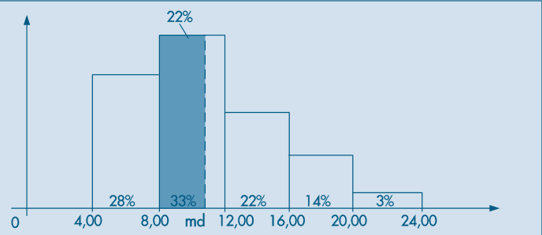

Fonte: Morettin e Bussab (2010).

#### Exemplo 3.7

Uso de pacotes estatísticos (`Minitab`, `SPlus`, `Excel`) para medidas-resumo do `CD-Municípios`. O resumo do Minitab informa:

- $N = 30$;
- média $= 145{,}4$;
- mediana $= 84{,}3$;
- média aparada $= 104{,}7$;
- desvio padrão $= 186{,}6$;
- $q_1 = 63{,}5$;
- $q_3 = 139{,}7$;
- mínimo $= 46{,}3$;
- máximo $= 988{,}8$.

| Medida | Minitab |
| --- | ---: |
| $N$ | 30 |
| Média | 145,4 |
| Mediana | 84,3 |
| Média aparada | 104,7 |
| Desvio padrão | 186,6 |
| Erro padrão | 34,1 |
| Mínimo | 46,3 |
| $q_1$ | 63,5 |
| $q_3$ | 139,7 |
| Máximo | 988,8 |

O livro observa que diferentes aplicativos podem usar convenções distintas para o cálculo dos quantis. No `SPlus`, para os mesmos dados, aparecem:

- $q_1 = 64{,}48$;
- mediana $= 84{,}3$;
- $q_3 = 134{,}3$.

#### Exemplo 3.8

Construção do esquema dos cinco números e do box plot para os 15 maiores municípios do Brasil:

$$
q_1 = 105{,}7,\quad q_2 = 135{,}8,\quad q_3 = 208{,}6.
$$

Os limites do box plot são:

$$
LI = q_1 - 1{,}5\,dq = -48{,}7,
\qquad
LS = q_3 + 1{,}5\,dq = 362{,}9.
$$

Conclusão: distribuição assimétrica à direita, com Rio de Janeiro e São Paulo como pontos exteriores.

O livro destaca que, nesse caso, os pontos exteriores não correspondem a erro de observação, mas a valores reais muito distantes do corpo principal da distribuição.

**Figura 16 - Construção do box plot**

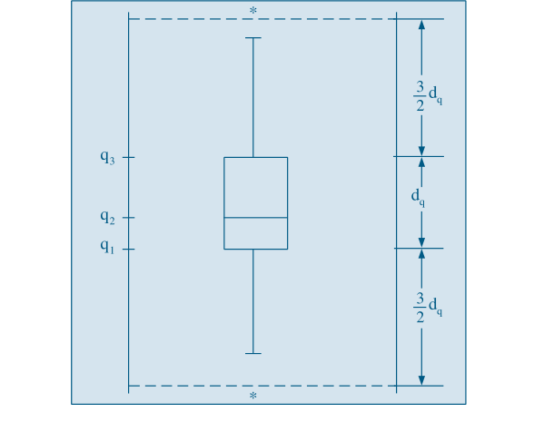

Fonte: Morettin e Bussab (2010).

**Figura 17 - Box plot para os quinze maiores municípios do Brasil**

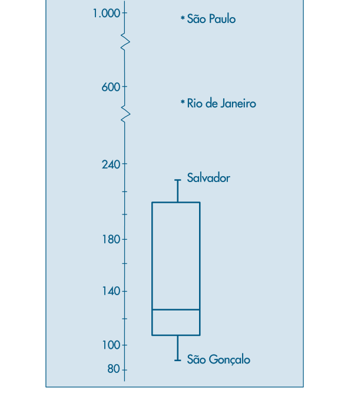

Fonte: Morettin e Bussab (2010).

#### Exemplo 3.9

Exemplo de gráfico de simetria com dados aproximadamente simétricos. São calculados pares $(u_i, v_i)$ em torno da mediana $q_2 = 8$ para verificar proximidade da reta $v = u$.

**Figura 18 - Distribuições assimétricas**

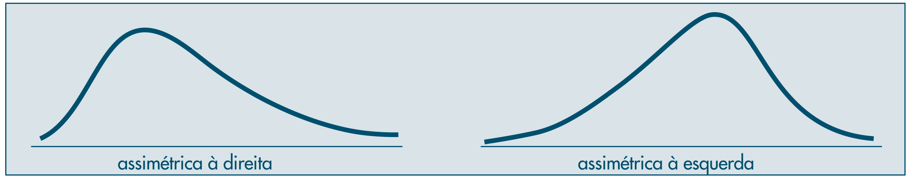

Fonte: Morettin e Bussab (2010).

**Figura 19 - Dados aproximadamente simétricos**

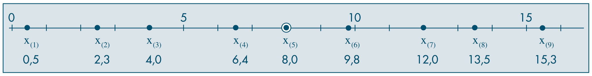

Fonte: Morettin e Bussab (2010).

**Figura 20 - Gráfico de simetria para o CD-Municípios**

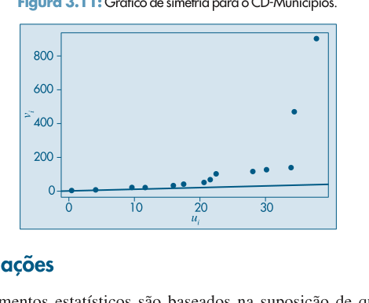

Fonte: Morettin e Bussab (2010).

#### Exemplo 3.10

Aplicação de transformações ao `CD-Municípios` usando valores de $p \in \{0, 1/4, 1/3, 1/2\}$ na família

$$
x^{(p)} =
\begin{cases}
x^p, & p > 0, \\
\ln(x), & p = 0, \\
-x^p, & p < 0.
\end{cases}
$$

Conclusão: a transformação logarítmica ($p=0$) e a raiz cúbica ($p=1/3$) tornam a distribuição mais próxima de uma forma simétrica.

**Figura 21 - Histogramas e box plots para os dados transformados**

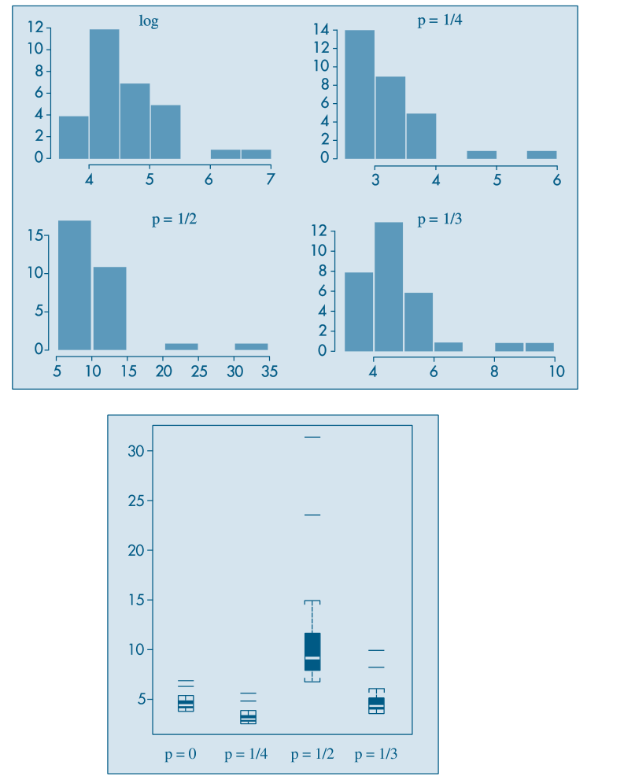

Fonte: Morettin e Bussab (2010).

#### Exemplos computacionais do Capítulo 3

##### Exemplo 2.10 (continuação)

Para o `CD-Notas`:

- média: $5{,}925$;
- mediana: $6{,}000$;
- média aparada: $5{,}911$;
- desvio padrão: $1{,}812$;
- $q_1 = 4{,}625$;
- $q_3 = 7{,}375$;
- distância interquartil: $dq = 2{,}75$.

O box plot e o gráfico de simetria indicam distribuição aproximadamente simétrica e ausência de valores atípicos relevantes.

**Figura 22 - Box plot para o CD-Notas**

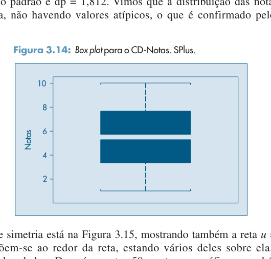

Fonte: Morettin e Bussab (2010).

**Figura 23 - Gráfico de simetria para o CD-Notas**

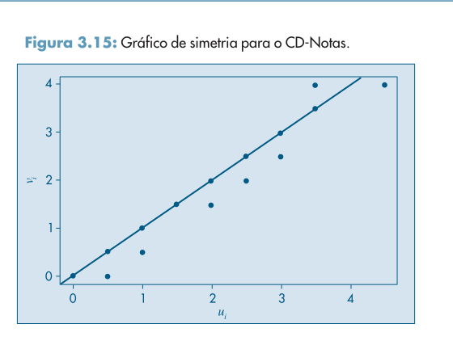

Fonte: Morettin e Bussab (2010).

##### Exemplo 2.11 (continuação)

Para as temperaturas diárias de São Paulo:

- mínimo: $12{,}3$;
- $q_1 = 16$;
- mediana: $17{,}7$;
- média: $17{,}22$;
- $q_3 = 18{,}6$;
- máximo: $21$;
- amplitude: $8{,}7$;
- distância interquartil: $2{,}6$.

O box plot e o gráfico de simetria confirmam assimetria à esquerda e ausência de valores atípicos destacados.

**Figura 24 - Box plot para as temperaturas de São Paulo**

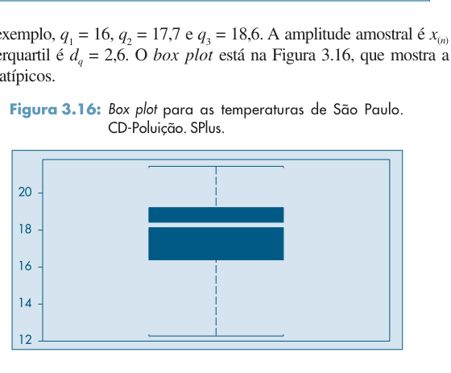

Fonte: Morettin e Bussab (2010).

**Figura 25 - Gráfico de simetria para as temperaturas de São Paulo**

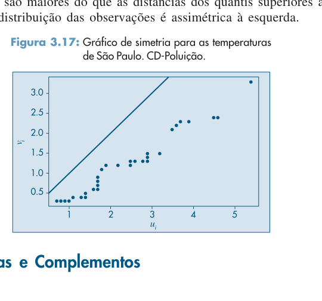

Fonte: Morettin e Bussab (2010).

## Observação de Uso

Nos capítulos 2 e 3, o livro alterna entre:

- dados brutos;
- dados agrupados em classes;
- interpretações gráficas;
- medidas numéricas resumo.

Por isso, quando um valor aparece com o sinal $\approx$, em geral ele foi obtido por aproximação a partir de classes e pontos médios, e não diretamente dos dados individuais.

### Problemas

#### Problemas das Seções 3.1 e 3.2

1. Número de erros de impressão por página em uma amostra de 50 páginas:
   - calcular média;
   - calcular mediana;
   - calcular desvio padrão;
   - representar graficamente;
   - estimar o total esperado de erros em 500 páginas.

2. Taxas de juros de 10 ações:
   - calcular média;
   - mediana;
   - desvio padrão.

3. Número de casas por quarteirão em uma amostra de 50 quarteirões:
   - construir histograma com cinco intervalos;
   - determinar uma medida de posição central;
   - determinar uma medida de dispersão.

4. Questões conceituais:
   - quando a mediana é mais apropriada do que a média;
   - histograma em que média e mediana coincidem;
   - três histogramas com mesma média e variâncias crescentes.

5. Dada uma distribuição representada graficamente:
   - discutir se a média e a mediana são boas medidas de posição.

6. Distribuição do número de filhos em 100 famílias:
   - obter a mediana;
   - obter a moda;
   - discutir dificuldades no cálculo da média e propor uma suposição para calculá-la.

#### Problemas da Seção 3.3 — Quantis Empíricos

7. Obter o esquema dos cinco números para os dados do Problema 3, calcular intervalo interquartil e dispersões inferior e superior, e discutir se a distribuição é normal.

8. Repetir a análise anterior usando os dados do Problema 5 do Capítulo 2.

9. Obter $q_1$, $q_2$, $q_3$, $q(0{,}10)$ e $q(0{,}90)$ para os dados do Problema 3.

10. Para a variável população urbana do `CD-Brasil`, obter:

$$
q(0{,}10),\ q(0{,}25),\ q(0{,}50),\ q(0{,}75),\ q(0{,}80),\ q(0{,}95).
$$

#### Problemas da Seção 3.4 — Box Plots

11. Construir o box plot para os dados do Exemplo 2.3 do Capítulo 2 e interpretar a distribuição.

12. Repetir a questão anterior para os dados do Problema 3 do Capítulo 3.

13. Fazer um box plot para o Problema 10 e comentar:
   - simetria;
   - caudas;
   - presença de valores atípicos.

#### Problemas e Complementos da Seção 3.8

14. Mostrar identidades algébricas envolvendo desvios em torno da média, incluindo:

$$
\sum_{i=1}^n (x_i - \bar x) = 0
$$

e fórmulas equivalentes para variância com dados simples e agrupados.

15. Usar os resultados da questão anterior para calcular as variâncias dos Problemas 1 e 2.

16. Vendas semanais agrupadas em classes:
   - construir histograma;
   - calcular média amostral;
   - calcular desvio padrão;
   - obter a porcentagem entre $\bar x - 2s$ e $\bar x + 2s$;
   - calcular a mediana.

As classes apresentadas são:

- $[30,35)$;
- $[35,40)$;
- $[40,45)$;
- $[45,50)$;
- $[50,55)$;
- $[55,60)$;
- $[60,65)$;
- $[65,70)$.

Tabela-base:

| Vendas semanais | Nº de vendedores |
| --- | ---: |
| $[30,35)$ | 12 |
| $[35,40)$ | 10 |
| $[40,45)$ | 18 |
| $[45,50)$ | 50 |
| $[50,55)$ | 70 |
| $[55,60)$ | 30 |
| $[60,65)$ | 18 |
| $[65,70)$ | 12 |

17. Quantis a partir da função de distribuição empírica suavizada:
   - definir $p_i = (i - 0{,}5)/n$;
   - definir $q(p)$ por interpolação linear;
   - aplicar ao Exemplo 3.5.

O livro obtém, por exemplo:

$$
q(0{,}1) = 2{,}4,\quad
q(0{,}2) = 3{,}6,\quad
q(0{,}25) = 4{,}5,\quad
q(0{,}5) = 8,\quad
q(0{,}75) = 11{,}25.
$$

18. Para os 15 maiores municípios do `CD-Municípios`, calcular:

$$
q(0{,}1),\ q(0{,}2),\ q_1,\ q_2,\ q_3.
$$

19. Número de divórcios por duração do casamento:
   - calcular duração média e mediana;
   - calcular variância e desvio padrão;
   - construir histograma;
   - encontrar $1^\circ$ e $9^\circ$ decis;
   - calcular intervalo interquantil.

Tabela-base:

| Anos de casamento | Nº de divórcios |
| --- | ---: |
| $[0,6)$ | 2800 |
| $[6,12)$ | 1400 |
| $[12,18)$ | 1600 |
| $[18,24)$ | 1150 |
| $[24,30)$ | 1050 |

Correção editorial: os dois primeiros intervalos foram normalizados por continuidade das classes, pois a extração do PDF corrompeu os limites originais.

20. Salários de 120 funcionários do setor administrativo:
   - esboçar histograma;
   - calcular média, variância e desvio padrão;
   - calcular primeiro quartil e mediana;
   - discutir efeitos de dobrar todos os salários;
   - discutir efeitos de somar dois salários mínimos a todos os salários.

Tabela-base:

| Faixa salarial | Freqüência relativa |
| --- | ---: |
| $[0,2)$ | 0,25 |
| $[2,4)$ | 0,40 |
| $[4,6)$ | 0,20 |
| $[6,10)$ | 0,15 |

Correção editorial: os três primeiros intervalos foram ajustados para a forma contínua esperada, pois o OCR inseriu o algarismo `1` antes dos limites superiores.

21. Discutir o efeito sobre mediana, média e desvio padrão quando:
   - cada observação é multiplicada por $2$;
   - soma-se $10$ a cada observação;
   - subtrai-se a média geral de cada observação;
   - centraliza-se e padroniza-se cada observação.

22. Comparação entre duas companhias com informações sobre média, quartil e variância salarial, discutindo probabilidade de salários mais altos e decisão racional de candidatura.

23. Idades de uma amostra-piloto de 10 funcionários:
   - calcular medidas descritivas;
   - discutir qual medida é mais importante para dimensionar o tamanho final da amostra.

24. Consumo diário de leite por famílias, dado em proporções por faixa:
   - montar tabela de frequências;
   - construir histograma;
   - calcular média, mediana, variância e desvio padrão;
   - calcular o primeiro quartil.

25. Distribuição de frequências do salário anual dos moradores de um bairro:
   - construir histograma;
   - calcular média e desvio padrão;
   - comparar homogeneidade com outro bairro via coeficiente de variação;
   - construir função de distribuição acumulada;
   - determinar a faixa salarial dos $10\%$ mais ricos;
   - calcular a riqueza total.

Tabela-base:

| Faixa salarial $(\times 10$ salários mínimos$)$ | Freqüência |
| --- | ---: |
| $[0,2)$ | 10000 |
| $[2,4)$ | 3900 |
| $[4,6)$ | 2000 |
| $[6,8)$ | 1100 |
| $[8,10)$ | 800 |
| $[10,12)$ | 700 |
| $[12,14)$ | 2000 |
| Total | 20500 |

Correção editorial: os intervalos foram reconstruídos pela progressão natural das classes, já que o OCR deslocou o dígito `1` para várias linhas.

26. Dado um histograma, calcular:
   - média;
   - variância;
   - moda;
   - mediana;
   - primeiro quartil.

27. Distribuição do peso de frangos:
   - calcular média;
   - calcular variância;
   - construir histograma;
   - definir limites de categorias com base em quantis;
   - determinar porcentagens abaixo de dois desvios padrão e acima de um desvio padrão e meio.

Tabela-base corrigida por contexto:

| Peso (gramas) | $n_i$ |
| --- | ---: |
| $[960,980)$ | 160 |
| $[980,1000)$ | 160 |
| $[1000,1020)$ | 280 |
| $[1020,1040)$ | 260 |
| $[1040,1060)$ | 160 |
| $[1060,1080)$ | 180 |

Correção editorial: nos dois primeiros intervalos o OCR suprimiu o dígito inicial `9` e `10`.

28. Idade de candidatos a um curso após campanha de divulgação:
   - discutir se a idade média aumentou;
   - aplicar a regra $\bar x - 22 > 2dp(X)/\sqrt{n}$;
   - construir histograma.

Tabela-base:

| Idade | Freqüência | Porcentagem |
| --- | ---: | ---: |
| $[18,20)$ | 18 | 36 |
| $[20,22)$ | 12 | 24 |
| $[22,26)$ | 10 | 20 |
| $[26,30)$ | 8 | 16 |
| $[30,36)$ | 2 | 4 |
| Total | 50 | 100 |

29. Comparar o desempenho de duas corretoras de ações usando percentuais de lucro observados em amostras.

Dados:

| Corretora A | Corretora B |
| ---: | ---: |
| 45 | 60 |
| 54 | 57 |
| 55 | 58 |
| 62 | 55 |
| 70 | 50 |
| 52 | 59 |
| 38 | 48 |
| 64 | 59 |
| 55 | 56 |
| 55 | 56 |
| 55 | 61 |
| 52 | 53 |
| 54 | 59 |
| 48 | 57 |
| 57 | 50 |
| 65 | 55 |
| 60 | 55 |
| 58 | 54 |
| 59 | 51 |
| 56 | — |

30. Propor uma regra de decisão baseada em

$$
F = \frac{\operatorname{var}(X_A)}{\operatorname{var}(X_B)}
$$

para avaliar homogeneidade entre as duas corretoras.

31. Construir box plots para os dados das corretoras A e B e comparar os dois conjuntos.

32. Aplicar o critério baseado em

$$
t = \frac{\bar x_A - \bar x_B}{S_*^2\sqrt{1/n_A + 1/n_B}}
$$

com a regra: se $|t| < 2$, os desempenhos são semelhantes; caso contrário, são diferentes.

33. Investimento em educação por habitante em 10 cidades:
   - calcular uma média inicial;
   - eliminar observações fora de $\bar x \pm 2dp$;
   - calcular a média final como investimento básico.

34. Esboçar histogramas alisados de duas repartições públicas a partir de:
   - mínimo;
   - quartis;
   - mediana;
   - média;
   - máximo;
   - desvio padrão.

35. Esboçar distribuições de salários em duas regiões usando média, desvio padrão, mediana, moda, quartis e extremos, comentando as diferenças principais.

36. Construir o desenho esquemático para os dados do Problema 6 do Capítulo 2 e tirar conclusões sobre a distribuição.

37. Transformar a variável qualitativa `região de procedência` na variável dicotômica

$$
X =
\begin{cases}
1, & \text{capital}, \\
0, & \text{interior ou outra},
\end{cases}
$$

e então:
   - calcular $\bar x$ e $\operatorname{var}(X)$;
   - interpretar $\bar x$;
   - construir um histograma.

38. Padronização de notas do Problema 9 do Capítulo 2:

$$
Z = \frac{X - \bar x}{dp(X)}.
$$

Pede-se:
   - interpretar $Z$;
   - calcular notas padronizadas em Estatística;
   - obter $\bar z$ e $dp(Z)$;
   - identificar casos atípicos;
   - comparar o desempenho relativo do funcionário 1 em Direito, Estatística e Política.

39. Média aparada. Calcular médias aparadas a $10\%$ e $25\%$ para os salários da Tabela 2.1.

40. Coeficiente de variação:

$$
cv = \frac{S}{\bar x} \cdot 100\%.
$$

Calcular para as regiões A e B do Problema 35 e comentar.

41. Desvio absoluto mediano:

$$
dam = \operatorname{med}_{1 \le j \le n}\left|x_j - \operatorname{med}_{1 \le i \le n}(x_i)\right|.
$$

O problema apresenta dados de velocidade do vento e compara:

- média;
- média aparada;
- mediana;
- quartis;
- distância interquartil;
- $dam$;
- desvio padrão.

42. Calcular o desvio absoluto mediano para as populações do `CD-Brasil`.

43. Calcular medidas de posição e dispersão, incluindo média aparada e $dam$, para:
   - variável CO do `CD-Poluição`;
   - salários de mecânicos do `CD-Salários`;
   - variável preço do `CD-Veículos`.

44. Construir histogramas, ramo-e-folhas e desenhos esquemáticos para as variáveis do Problema 43.

45. Fazer um gráfico de quantis e um gráfico de simetria para os dados do Problema 3, discutindo se os dados são simétricos.

46. Para o `CD-Temperaturas`, variável temperatura de Ubatuba:
   - obter gráfico de quantis;
   - obter gráfico de simetria;
   - comentar a simetria.

47. Problema teórico sobre escolha da amplitude de classe $\Delta$ do histograma com base em Freedman e Diaconis:

$$
\Delta \approx 1{,}349\,\tilde S \left(\frac{\log n}{n}\right)^{1/3},
$$

com

$$
\tilde S = \frac{dq}{1{,}349}.
$$

Daí:

$$
\Delta = dq\left(\frac{\log n}{n}\right)^{1/3}.
$$

O número de classes pode ser obtido por

$$
\frac{x_{(n)} - x_{(1)}}{\Delta}.
$$

O problema propõe usar essa regra para vincular a construção do histograma à distância interquartil, tornando a escolha de $\Delta$ mais robusta a valores extremos.

48. Usar o resultado do Problema 47 para construir histogramas para:
   - umidade do `CD-Poluição`;
   - salário dos professores do `CD-Salários`;
   - temperatura de Cananéia no `CD-Temperaturas`.
