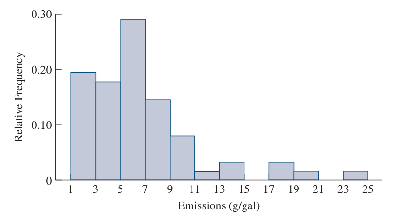
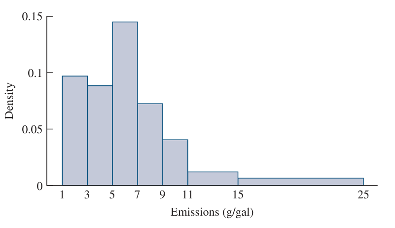
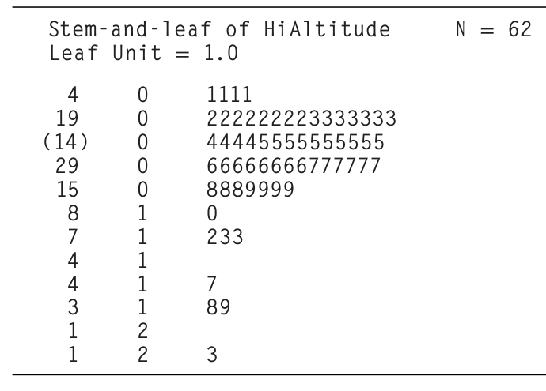
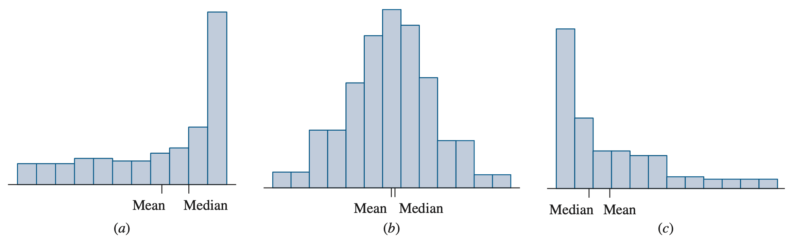
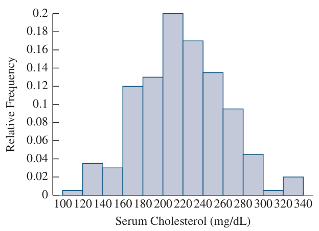
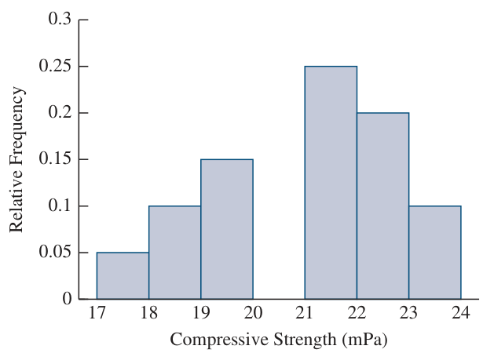
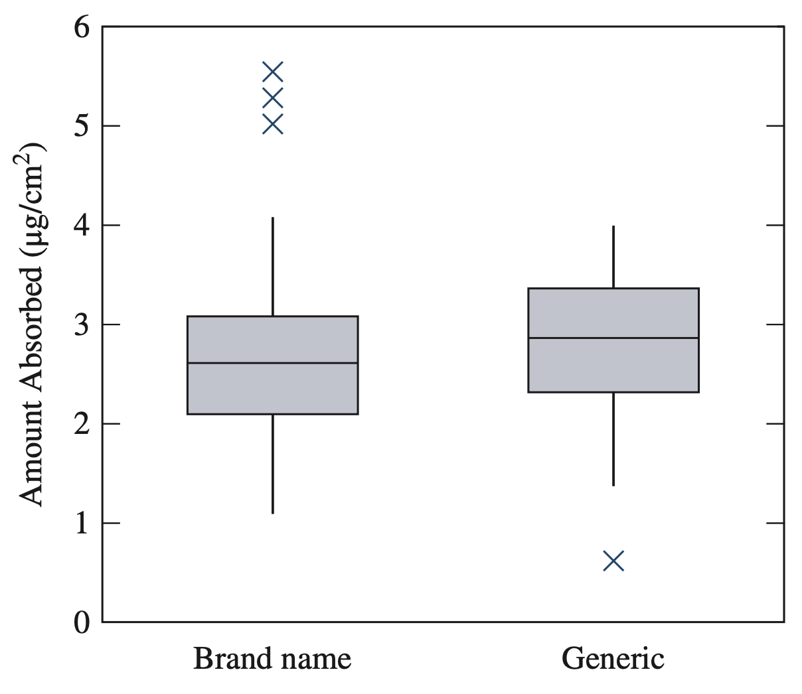
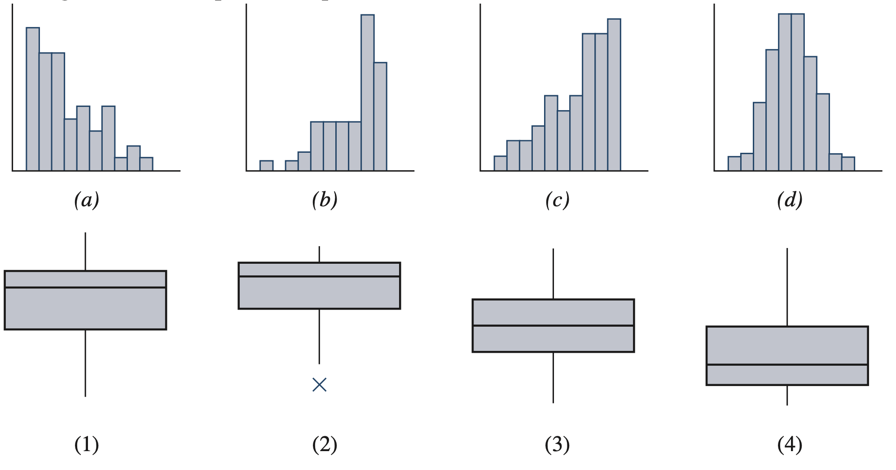

# Exercícios extraídos de Navidi (2024) - Capítulo 1

Fonte: `livros/Navidi 2024 Statistics for Engineers and Scientists.pdf`

## Capítulo 1: Amostragem e Estatística Descritiva

### Exemplos do Capítulo 1

#### Exemplo 1.1

Um grupo de docentes de educação física deseja selecionar uma amostra de 100 estudantes de uma universidade com 20.000 matriculados. Os estudantes são numerados de 1 a 20.000 e um gerador de números aleatórios é usado para selecionar os 100 participantes.

Ponto central: trata-se de uma amostra aleatória simples, pois o mecanismo de seleção é análogo ao de uma loteria.

#### Exemplo 1.2

Uma engenheira da qualidade inspeciona rolos de papel de parede selecionando, a cada hora, os 10 rolos produzidos mais recentemente, durante 5 horas, totalizando 50 rolos.

Ponto central: não se trata de amostra aleatória simples, pois nem todo subconjunto de 50 rolos tem a mesma probabilidade de seleção.

#### Exemplo 1.3

Um inspetor observa que 34 de 40 parafusos amostrados, ou 85%, atendem a uma especificação e conclui que exatamente 85% do lote atendem à especificação.

Ponto central: a conclusão correta é que a proporção populacional provavelmente é próxima de 85%, e não exatamente igual a 85%.

#### Exemplo 1.4

Um segundo inspetor seleciona outra amostra de 40 parafusos do mesmo lote e obtém 90% de conformidade, em vez de 85%.

Ponto central: a diferença decorre de variação amostral; amostras aleatórias distintas extraídas da mesma população naturalmente diferem entre si.

#### Exemplo 1.5

Um geólogo pesa a mesma rocha várias vezes em uma balança de alta sensibilidade e obtém leituras ligeiramente diferentes.

Ponto central: as leituras podem ser tratadas como amostra aleatória simples se as medições forem realizadas sob condições experimentais idênticas. A população é conceitual: o conjunto de todas as leituras possíveis da balança para essa rocha.

#### Exemplo 1.6

Um novo processo químico é executado 50 vezes, e os 50 rendimentos são registrados.

Ponto central: os dados só podem ser tratados como amostra aleatória simples se as execuções ocorrerem sob condições idênticas e não apresentarem diferenças sistemáticas em relação às execuções futuras. Tendência temporal, aprendizado operacional ou dependência serial invalidam essa interpretação.

#### Exemplo 1.7

Um novo processo químico é executado 10 vezes em cada manhã, durante 5 manhãs consecutivas. O gráfico temporal dos rendimentos não apresenta padrão visível. Pergunta-se se os 50 rendimentos podem ser tratados como amostra aleatória simples.

Ponto central: isso depende da população-alvo. Se a utilização futura incluir turnos da manhã e da tarde, a amostra não é representativa. Se o processo for sempre executado apenas pela manhã, então pode ser razoável tratá-la como amostra aleatória simples.

#### Exemplo 1.8

Em um estudo sobre painéis de cobertura, as variáveis registradas são pressão de ruptura, espessura do revestimento, tipo de painel e espécie de madeira.

Ponto central: pressão de ruptura e espessura são variáveis numéricas; tipo de painel e espécie de madeira são variáveis categóricas.

#### Exemplo 1.9

Uma amostra de cinco alturas, em polegadas, é:

$$
65.51,\ 72.30,\ 68.31,\ 67.05,\ 70.68
$$

Tarefa: calcular a média amostral.

Resultado:

$$
\bar{x} = 68.77 \text{ pol}
$$

Tabela-base:

| Observação | Altura (pol) |
| ---: | ---: |
| 1 | 65.51 |
| 2 | 72.30 |
| 3 | 68.31 |
| 4 | 67.05 |
| 5 | 70.68 |

Cálculo explícito:

$$
\bar{x} = \frac{65.51 + 72.30 + 68.31 + 67.05 + 70.68}{5} = 68.77.
$$

#### Exemplo 1.10

Com os dados de altura do Exemplo 1.9, calcular a variância amostral e o desvio-padrão amostral.

Resultados:

$$
s^2 = 7.47665, \qquad s = 2.73
$$

Ponto central: multiplicar todas as observações por uma constante multiplica a média e o desvio-padrão por essa constante e a variância pelo quadrado da constante. Somar uma constante desloca a média, mas não altera variância nem desvio-padrão.

Com base no Exemplo 1.9:

$$
s^2 = \frac{\sum_{i=1}^{n}(x_i-\bar{x})^2}{n-1}, \qquad s = \sqrt{s^2}.
$$

#### Exemplo 1.11

Com os dados de altura do Exemplo 1.9, calcular a mediana amostral.

Resultado:

$$
\text{Mediana} = 68.31
$$

Ordenando os dados:

$$
65.51,\ 67.05,\ 68.31,\ 70.68,\ 72.30.
$$

Como $n=5$, a observação central é a terceira.

#### Exemplo 1.12

Para os seguintes dados de tensão de fratura, em MPa, de 24 misturas asfálticas usinadas a quente,

$$
30,\ 75,\ 79,\ 80,\ 80,\ 105,\ 126,\ 138,\ 149,\ 179,\ 179,\ 191,\ 223,\ 232,\ 232,\ 236,\ 240,\ 242,\ 245,\ 247,\ 254,\ 274,\ 384,\ 470
$$

calcular a média, a mediana e as médias aparadas de 5%, 10% e 20%.

Ponto central: médias aparadas reduzem a influência de valores extremos em relação à média aritmética usual.

Tabela-base dos dados de asfalto:

| Ordem | Valor (MPa) | Ordem | Valor (MPa) |
| ---: | ---: | ---: | ---: |
| 1 | 30 | 13 | 223 |
| 2 | 75 | 14 | 232 |
| 3 | 79 | 15 | 232 |
| 4 | 80 | 16 | 236 |
| 5 | 80 | 17 | 240 |
| 6 | 105 | 18 | 242 |
| 7 | 126 | 19 | 245 |
| 8 | 138 | 20 | 247 |
| 9 | 149 | 21 | 254 |
| 10 | 179 | 22 | 274 |
| 11 | 179 | 23 | 384 |
| 12 | 191 | 24 | 470 |

#### Exemplo 1.13

Com os dados de asfalto do Exemplo 1.12, determinar a moda e a amplitude total.

Resultados:

$$
\text{Modas} = 80,\ 179,\ 232
$$

$$
\text{Amplitude} = 470 - 30 = 440
$$

O conjunto é multimodal, com três modas amostrais.

#### Exemplo 1.14

Com os dados de asfalto do Exemplo 1.12, determinar o primeiro e o terceiro quartis.

Resultados:

$$
Q_1 = 115.5, \qquad Q_3 = 243.5
$$

Esses quartis são obtidos a partir dos dados ordenados do Exemplo 1.12.

#### Exemplo 1.15

Com os dados de asfalto do Exemplo 1.12, determinar o percentil 65.

Resultado:

$$
P_{65} = 238
$$

O percentil é calculado por interpolação entre observações ordenadas próximas da posição correspondente a 65%.

#### Exemplo 1.16

Em uma amostra de 1000 bronzinas de mancal, 910 são conformes, 53 são retrabalhadas e 37 são refugadas.

Tarefa: calcular as frequências e as proporções amostrais.

Resultados:

$$
0.910,\ 0.053,\ 0.037
$$

para as categorias conforme, retrabalhada e refugada, respectivamente.

Tabela-base:

| Categoria | Frequência | Proporção |
| --- | ---: | ---: |
| Conforme | 910 | 0.910 |
| Retrabalhada | 53 | 0.053 |
| Refugada | 37 | 0.037 |
| Total | 1000 | 1.000 |

#### Exemplo 1.17

Usando o histograma das emissões de veículos operando em grande altitude, determinar a proporção de veículos com emissões entre 7 e 11 g/gal.

Resultado:

$$
0.1452 + 0.0806 = 0.2258
$$

O exemplo utiliza áreas de barras do histograma, interpretadas como proporções amostrais.

**Figura 1 - Histograma das emissões em grande altitude com classes de mesma largura**

Fonte: Navidi (2024).

#### Exemplo 1.18

Usando o histograma com amplitudes de classe desiguais para o mesmo conjunto de dados, determinar a proporção de veículos com emissões entre 9 e 15 g/gal.

Resultado:

$$
(2)(0.0403) + (4)(0.0121) = 0.129
$$

Como as amplitudes de classe são desiguais, a proporção é obtida pela área dos retângulos:

- largura $\times$ altura da classe entre 9 e 11;
- largura $\times$ altura da classe entre 11 e 15.

**Figura 2 - Histograma das emissões em grande altitude com classes de larguras desiguais**

Fonte: Navidi (2024).

### Exercícios da Seção 1.1

1. Cada um dos processos a seguir envolve amostragem a partir de uma população. Defina a população e indique se ela é tangível ou conceitual.

   a. Um processo químico é executado 15 vezes, e o rendimento é medido em cada execução.

   b. Um pesquisador de opinião seleciona 1000 eleitores registrados em determinado estado e pergunta em qual candidato pretendem votar para governador.

   c. Em um ensaio clínico para testar um novo fármaco destinado à redução do colesterol, 100 pessoas com níveis elevados de colesterol são recrutadas para utilizar o novo medicamento.

   d. Oito corpos de prova de concreto são produzidos a partir de uma nova formulação, e a resistência à compressão de cada um é medida.

   e. Engenheiros da qualidade precisam estimar a porcentagem de parafusos fabricados em um determinado dia que atendem a uma especificação de resistência. Às 15h, eles selecionam os últimos 100 parafusos fabricados.

2. Se o objetivo fosse estimar a altura média de todos os estudantes de uma universidade, qual das estratégias de amostragem abaixo seria a melhor? Justifique. Observe que nenhum dos métodos constitui amostra aleatória simples.

   i. Medir a altura de 50 estudantes encontrados no ginásio durante jogos intramuros de basquete.

   ii. Medir a altura de todos os estudantes dos cursos de engenharia.

   iii. Medir a altura dos estudantes selecionados escolhendo o primeiro nome de cada página da lista telefônica do campus.

3. Verdadeiro ou falso:

   a. Uma amostra aleatória simples é garantidamente uma representação exata da população da qual foi extraída.

   b. Uma amostra aleatória simples é isenta de qualquer tendência sistemática de diferir da população da qual foi extraída.

4. Uma amostra de 100 estudantes universitários é selecionada dentre todos os estudantes matriculados em uma determinada instituição, e verifica-se que 38 deles participam de esportes intramuros. Verdadeiro ou falso:

   a. A porcentagem de todos os estudantes da instituição que participam de esportes intramuros é 38%.

   b. A porcentagem de estudantes da instituição que participam de esportes intramuros provavelmente é próxima de 38%.

5. Um determinado processo de fabricação de circuitos integrados está em uso há algum tempo, e sabe-se que 12% dos circuitos produzidos são defeituosos. Um novo processo, supostamente capaz de reduzir a proporção de defeituosos, está sendo testado. Em uma amostra aleatória simples de 100 circuitos produzidos pelo novo processo, 12 foram defeituosos.

   a. Um dos engenheiros sugere que o teste prova que o novo processo não é melhor que o processo antigo, já que a proporção de defeituosos na amostra é a mesma. Essa conclusão é justificada? Explique.

   b. Suponha que houvesse apenas 11 circuitos defeituosos na amostra de 100. Isso provaria que o novo processo é melhor? Explique.

   c. Qual resultado constitui evidência mais forte de que o novo processo é melhor: encontrar 11 circuitos defeituosos na amostra ou encontrar 2 circuitos defeituosos?

6. Com referência ao Exercício 5. Verdadeiro ou falso:

   a. Se a proporção de defeituosos na amostra for inferior a 12%, é razoável concluir que o novo processo é melhor.

   b. Se a proporção de defeituosos na amostra for apenas ligeiramente inferior a 12%, essa diferença pode ser inteiramente devida à variação amostral, e não é razoável concluir que o novo processo é melhor.

   c. Se a proporção de defeituosos na amostra for muito inferior a 12%, é muito improvável que a diferença seja inteiramente devida à variação amostral, de modo que é razoável concluir que o novo processo é melhor.

7. Para decidir se uma amostra deve ser tratada como amostra aleatória simples, o que é mais importante: bom conhecimento de estatística ou bom conhecimento do processo gerador dos dados?

8. Um pesquisador da área médica deseja determinar se a prática de exercícios físicos pode reduzir a pressão arterial. Em uma feira de saúde, ele mede a pressão arterial de 100 indivíduos e os entrevista sobre seus hábitos de exercício. Em seguida, divide os indivíduos em dois grupos: aqueles cujo nível usual de exercício é baixo e aqueles cujo nível usual de exercício é alto.

   a. Trata-se de experimento controlado ou estudo observacional?

   b. Os indivíduos do grupo de baixa atividade física apresentaram, em média, pressão arterial consideravelmente mais alta que os do grupo de alta atividade física. O pesquisador conclui que o exercício reduz a pressão arterial. Essa conclusão é bem fundamentada? Explique.

9. Uma pesquisadora da área médica deseja determinar se a prática de exercícios físicos pode reduzir a pressão arterial. Ela recruta 100 pessoas com pressão arterial elevada para participar do estudo. Uma amostra aleatória de 50 delas é designada para seguir um programa de exercícios que inclui natação e corrida diárias. As outras 50 são designadas para evitar atividade física vigorosa. A pressão arterial de todos os 100 indivíduos é medida antes e depois do estudo.

   a. Trata-se de experimento controlado ou estudo observacional?

   b. Em média, os participantes do grupo com exercícios reduziram substancialmente a pressão arterial, enquanto os do grupo sem exercícios não apresentaram redução. A pesquisadora conclui que o exercício reduz a pressão arterial. Essa conclusão é mais bem fundamentada do que a do Exercício 8? Explique.

### Exercícios da Seção 1.2

1. Verdadeiro ou falso: para qualquer lista de números, metade das observações ficará abaixo da média.

2. A média amostral é sempre o valor mais frequente? Em caso afirmativo, explique por quê. Em caso negativo, apresente um exemplo.

3. A média amostral é sempre igual a um dos valores observados na amostra? Em caso afirmativo, explique por quê. Em caso negativo, apresente um exemplo.

4. A mediana amostral é sempre igual a um dos valores observados na amostra? Em caso afirmativo, explique por quê. Em caso negativo, apresente um exemplo.

5. Encontre um tamanho amostral para o qual a mediana sempre seja igual a um dos valores da amostra.

6. Para uma lista de números positivos, é possível que o desvio-padrão seja maior que a média? Em caso afirmativo, apresente um exemplo. Em caso negativo, explique por quê.

7. É possível que o desvio-padrão de uma lista de números seja igual a $0$? Em caso afirmativo, apresente um exemplo. Em caso negativo, explique por quê.

8. Em uma determinada empresa, cada empregado recebeu um aumento de $50$ dólares por semana. Como isso afeta a média salarial? E o desvio-padrão dos salários?

9. Em outra empresa, cada empregado recebeu um reajuste de 5%. Como isso afeta a média salarial? E o desvio-padrão dos salários?

10. Uma amostra de 100 automóveis trafegando em uma rodovia durante o deslocamento matinal foi selecionada, e o número de ocupantes de cada veículo foi registrado. Os resultados foram os seguintes:

| Ocupantes | 1 | 2 | 3 | 4 | 5 |
| --- | ---: | ---: | ---: | ---: | ---: |
| Número de automóveis | 70 | 15 | 10 | 3 | 2 |

   a. Determine a média amostral do número de ocupantes.

   b. Determine o desvio-padrão amostral do número de ocupantes.

   c. Determine a mediana amostral do número de ocupantes.

   d. Calcule o primeiro e o terceiro quartis do número de ocupantes.

   e. Que proporção dos automóveis tinha número de ocupantes superior à média?

   f. Para que proporção dos automóveis o número de ocupantes foi superior à média em mais de um desvio-padrão?

   g. Para que proporção dos automóveis o número de ocupantes ficou dentro de um desvio-padrão da média?

11. Em uma amostra de 20 homens, a altura média foi de $178$ cm. Em uma amostra de 30 mulheres, a altura média foi de $164$ cm. Qual foi a altura média do conjunto dos dois grupos?

12. Cinco jogadores de basquete e 11 jogadores de futebol americano estão treinando em um ginásio. A altura média dos jogadores de basquete é $77.6$ pol., e a altura média de todos os 16 atletas é $74.5$ pol. Qual é a altura média dos jogadores de futebol americano?

13. Uma seguradora examina os registros de condução de 100 segurados. Verifica-se que 80 deles não tiveram acidentes no último ano, 15 tiveram um acidente, 4 tiveram dois acidentes e 1 teve três acidentes.

   a. Determine a média do número de acidentes.

   b. Determine a mediana do número de acidentes.

   c. Qual medida é mais útil para a seguradora, média ou mediana? Explique.

14. Cada um de 16 estudantes mediu a circunferência de uma bola de tênis por quatro métodos distintos:

   Método A: estimar visualmente a circunferência.

   Método B: medir o diâmetro com uma régua e então calcular a circunferência.

   Método C: medir a circunferência com régua e barbante.

   Método D: medir a circunferência rolando a bola ao longo de uma régua.

   Os resultados, em cm, em ordem crescente para cada método, são:

   Método A: 18.0, 18.0, 18.0, 20.0, 22.0, 22.0, 22.5, 23.0, 24.0, 24.0, 25.0, 25.0, 25.0, 25.0, 26.0, 26.4.

   Método B: 18.8, 18.9, 18.9, 19.6, 20.1, 20.4, 20.4, 20.4, 20.4, 20.5, 21.2, 22.0, 22.0, 22.0, 22.0, 23.6.

   Método C: 20.2, 20.5, 20.5, 20.7, 20.8, 20.9, 21.0, 21.0, 21.0, 21.0, 21.0, 21.5, 21.5, 21.5, 21.5, 21.6.

   Método D: 20.0, 20.0, 20.0, 20.0, 20.2, 20.5, 20.5, 20.7, 20.7, 20.7, 21.0, 21.1, 21.5, 21.6, 22.1, 22.3.

   a. Calcule a média amostral para cada método.

   b. Calcule a mediana amostral para cada método.

   c. Calcule a média aparada de 20% para cada método.

   d. Calcule o primeiro e o terceiro quartis para cada método.

   e. Calcule o desvio-padrão amostral para cada método.

   f. Para qual método o desvio-padrão é maior? Por que se deve esperar esse resultado?

   g. Mantidas as demais condições constantes, é preferível que um método de medição apresente desvio-padrão menor ou maior? Ou isso é irrelevante? Explique.

15. Com referência ao Exercício 14.

   a. Se as medições de um dos métodos fossem convertidas para polegadas $\left(1 \text{ pol} = 2.54 \text{ cm}\right)$, como isso afetaria a média, a mediana, os quartis e o desvio-padrão?

   b. Se os estudantes repetissem a medição utilizando uma régua graduada em polegadas, os efeitos sobre média, mediana, quartis e desvio-padrão seriam os mesmos do item (a)? Explique.

16. Há 10 empregados em uma determinada divisão de uma empresa. Seus salários têm média de $70{,}000$, mediana de $55{,}000$ e desvio-padrão de $35{,}000$. Um empregado dessa divisão, cujo salário é $200{,}000$, é transferido para outra divisão. Sem realizar cálculos, indique se cada uma das quantidades abaixo, para os nove empregados restantes, será maior, menor ou igual ao valor anterior.

   a. A média

   b. A mediana

   c. O desvio-padrão

17. Quartis dividem uma amostra em quatro partes aproximadamente iguais. Em geral, uma amostra de tamanho $n$ pode ser dividida em $k$ partes aproximadamente iguais usando os pontos de corte

$$
\left(\frac{i}{k}\right)(n+1), \quad i = 1, \ldots, k-1
$$

   Considere a seguinte amostra ordenada:

$$
2,\ 18,\ 23,\ 41,\ 44,\ 46,\ 49,\ 61,\ 62,\ 74,\ 76,\ 79,\ 82,\ 89,\ 92,\ 95
$$

   a. Tercis dividem uma amostra em três partes. Determine os tercis dessa amostra.

   b. Quintis dividem uma amostra em cinco partes. Determine os quintis dessa amostra.

18. Em cada um dos conjuntos de dados a seguir, indique se o valor discrepante parece certamente decorrer de erro ou se pode, em princípio, ser correto.

   a. O comprimento de uma barra é medido cinco vezes. As leituras, em centímetros, são 48.5, 47.2, 4.91, 49.5, 46.3.

   b. Os preços de cinco automóveis em um pátio de revenda são $25{,}000$, $30{,}000$, $42{,}000$, $110{,}000$, $31{,}000$.

### Quadros auxiliares da Seção 1.2

#### Regras operacionais

Para os exercícios de estatística descritiva desta seção, o capítulo usa as seguintes definições:

$$
\bar{x} = \frac{1}{n}\sum_{i=1}^{n} x_i
$$

$$
s^2 = \frac{1}{n-1}\sum_{i=1}^{n}(x_i-\bar{x})^2,
\qquad
s = \sqrt{s^2}
$$

Para quartis e percentis, o texto usa a posição

$$
\left(\frac{p}{100}\right)(n+1),
$$

fazendo média dos valores vizinhos quando a posição não é inteira.

#### Exercício 10

| Ocupantes | 1 | 2 | 3 | 4 | 5 |
| --- | ---: | ---: | ---: | ---: | ---: |
| Número de automóveis | 70 | 15 | 10 | 3 | 2 |

Resumo útil:

- tamanho amostral: $n = 100$;
- distribuição acumulada:

| Número de ocupantes | Frequência acumulada |
| ---: | ---: |
| 1 | 70 |
| 2 | 85 |
| 3 | 95 |
| 4 | 98 |
| 5 | 100 |

Com isso, já se lê diretamente:

- mediana $= 1$;
- $Q_1 = 1$;
- $Q_3 = 2$.

#### Exercício 11 e Exercício 12

Média combinada de dois grupos:

$$
\bar{x}_{\text{comb}} = \frac{n_1\bar{x}_1 + n_2\bar{x}_2}{n_1+n_2}.
$$

Essa fórmula é a base direta dos Exercícios 11 e 12.

#### Exercício 13

| Nº de acidentes | Frequência |
| ---: | ---: |
| 0 | 80 |
| 1 | 15 |
| 2 | 4 |
| 3 | 1 |

Resumo útil:

- $n=100$;
- a mediana é $0$, pois as 50ª e 51ª observações estão na classe `0 acidentes`.

#### Exercício 14

Dados ordenados por método:

| Método | Medições (cm) |
| --- | --- |
| A | 18.0, 18.0, 18.0, 20.0, 22.0, 22.0, 22.5, 23.0, 24.0, 24.0, 25.0, 25.0, 25.0, 25.0, 26.0, 26.4 |
| B | 18.8, 18.9, 18.9, 19.6, 20.1, 20.4, 20.4, 20.4, 20.4, 20.5, 21.2, 22.0, 22.0, 22.0, 22.0, 23.6 |
| C | 20.2, 20.5, 20.5, 20.7, 20.8, 20.9, 21.0, 21.0, 21.0, 21.0, 21.0, 21.5, 21.5, 21.5, 21.5, 21.6 |
| D | 20.0, 20.0, 20.0, 20.0, 20.2, 20.5, 20.5, 20.7, 20.7, 20.7, 21.0, 21.1, 21.5, 21.6, 22.1, 22.3 |

Resumo útil:

- cada método tem $n=16$;
- para a média aparada de 20%, remove-se aproximadamente $0.20(16)=3.2$, isto é, 3 valores de cada extremidade;
- a mediana é a média entre a 8ª e a 9ª observações;
- $Q_1$ e $Q_3$ usam as posições $0.25(17)=4.25$ e $0.75(17)=12.75$.

#### Exercício 17

Amostra ordenada:

$$
2,\ 18,\ 23,\ 41,\ 44,\ 46,\ 49,\ 61,\ 62,\ 74,\ 76,\ 79,\ 82,\ 89,\ 92,\ 95
$$

Como $n=16$, os pontos de corte são obtidos por

$$
\left(\frac{i}{k}\right)(n+1) = \left(\frac{i}{k}\right)17.
$$

Isso fornece diretamente:

- tercis: posições $\frac{17}{3}$ e $\frac{34}{3}$;
- quintis: posições $\frac{17}{5}, \frac{34}{5}, \frac{51}{5}, \frac{68}{5}$.

### Exercícios da Seção 1.3

1. O clima de Los Angeles é seco na maior parte do tempo, mas pode ser bastante chuvoso no inverno. O mês mais chuvoso do ano é fevereiro. A tabela a seguir apresenta a precipitação anual em Los Angeles, em polegadas, para cada mês de fevereiro de 1965 a 2006.

$$
0.2,\ 3.7,\ 1.2,\ 13.7,\ 1.5,\ 0.2,\ 1.7,\ 0.6,\ 0.1,\ 8.9,\ 1.9,\ 5.5,\ 0.5,\ 3.1,\ 3.1,\ 8.9,\ 8.0,\ 12.7,\ 4.1,\ 0.3,\ 2.6,\ 1.5,\ 8.0,\ 4.6,\ 0.7,\ 0.7,\ 6.6,\ 4.9,\ 0.1,\ 4.4,\ 3.2,\ 11.0,\ 7.9,\ 0.0,\ 1.3,\ 2.4,\ 0.1,\ 2.8,\ 4.9,\ 3.5,\ 6.1,\ 0.1
$$

   a. Construa um diagrama de caule e folhas para esses dados.

   b. Construa um histograma para esses dados.

   c. Construa um diagrama de pontos para esses dados.

   d. Construa um boxplot para esses dados. O boxplot identifica valores discrepantes?

2. Quarenta e cinco espécimes de um determinado tipo de pó foram analisados quanto ao teor de trióxido de enxofre. Os resultados, em porcentagem, estão apresentados abaixo em ordem crescente.

$$
\begin{aligned}
&14.1,\ 14.4,\ 14.7,\ 14.8,\ 15.3,\ 15.6,\ 16.1,\ 16.6,\ 17.3 \\
&14.2,\ 14.4,\ 14.7,\ 14.9,\ 15.3,\ 15.7,\ 16.2,\ 17.2,\ 17.3 \\
&14.3,\ 14.4,\ 14.8,\ 15.0,\ 15.4,\ 15.7,\ 16.4,\ 17.2,\ 17.8 \\
&14.3,\ 14.4,\ 14.8,\ 15.0,\ 15.4,\ 15.9,\ 16.4,\ 17.2,\ 21.9 \\
&14.3,\ 14.6,\ 14.8,\ 15.2,\ 15.5,\ 15.9,\ 16.5,\ 17.2,\ 22.4
\end{aligned}
$$

   a. Construa um diagrama de caule e folhas para esses dados.

   b. Construa um histograma para esses dados.

   c. Construa um diagrama de pontos para esses dados.

   d. Construa um boxplot para esses dados. O boxplot identifica valores discrepantes?

3. Considere a Tabela 1.2 da Seção 1.2. Construa um diagrama de caule e folhas usando o dígito das unidades como caule, para valores maiores ou iguais a 10 o caule terá dois dígitos, e o dígito dos décimos como folha. Quantos caules existem, incluindo os sem folhas? Quais são as vantagens e as desvantagens desse diagrama, em comparação com o da Figura 1.6, na página 26?

**Figura 3 - Diagrama de caule e folhas das emissões em grande altitude**

Fonte: Navidi (2024).

4. A seguir são apresentadas medições das concentrações no solo, em $\text{mg/kg}$, de cromo $(\text{Cr})$ e níquel $(\text{Ni})$ em 20 locais da região de Cleveland, Ohio.

Cr:

$$
34,\ 1,\ 511,\ 2,\ 574,\ 496,\ 322,\ 424,\ 269,\ 140,\ 244,\ 252,\ 76,\ 108,\ 24,\ 38,\ 18,\ 34,\ 30,\ 191
$$

Ni:

$$
23,\ 22,\ 55,\ 39,\ 283,\ 34,\ 159,\ 37,\ 61,\ 34,\ 163,\ 140,\ 32,\ 23,\ 54,\ 837,\ 64,\ 354,\ 376,\ 471
$$

   a. Construa um histograma para cada conjunto de concentrações.

   b. Construa boxplots comparativos para os dois conjuntos de concentrações.

   c. Com base nos boxplots, que diferenças podem ser observadas entre os dois conjuntos?

5. Uma determinada reação foi executada várias vezes com cada um de dois catalisadores, $A$ e $B$. Os catalisadores deveriam controlar o rendimento de um subproduto indesejável. Os resultados, em unidades de rendimento percentual, para 24 execuções com o catalisador $A$ e 20 execuções com o catalisador $B$, são os seguintes:

Catalisador A

$$
4.4,\ 3.4,\ 2.6,\ 3.8,\ 4.9,\ 4.6,\ 5.2,\ 4.7,\ 4.1,\ 2.6,\ 6.7,\ 4.1,\ 3.6,\ 2.9,\ 2.6,\ 4.0,\ 4.3,\ 3.9,\ 4.8,\ 4.5,\ 4.4,\ 3.1,\ 5.7,\ 4.5
$$

Catalisador B

$$
3.4,\ 1.1,\ 2.9,\ 5.5,\ 6.4,\ 5.0,\ 5.8,\ 2.5,\ 3.7,\ 3.8,\ 3.1,\ 1.6,\ 3.5,\ 5.9,\ 6.7,\ 5.2,\ 6.3,\ 2.6,\ 4.3,\ 3.8
$$

   a. Construa um histograma para os rendimentos de cada catalisador.

   b. Construa boxplots comparativos para os rendimentos dos dois catalisadores.

   c. Com base nos boxplots, que diferenças podem ser observadas entre os resultados dos dois catalisadores?

6. Esboce um histograma para o qual:

   a. a média seja maior que a mediana;

   b. a média seja menor que a mediana;

   c. a média seja aproximadamente igual à mediana.

**Figura 4 - Histogramas ilustrando assimetria à esquerda, simetria e assimetria à direita**

Fonte: Navidi (2024).

7. A figura abaixo é um histograma que mostra a distribuição do nível sérico de colesterol em uma amostra de homens. Use o histograma para responder às perguntas a seguir:

**Figura 5 - Histograma do nível sérico de colesterol**

Fonte: Navidi (2024).

   a. A porcentagem de homens com níveis de colesterol acima de $240 \text{ mg/dL}$ está mais próxima de 30%, 50% ou 70%?

   b. Em qual intervalo há mais homens: $240$–$260 \text{ mg/dL}$ ou $280$–$340 \text{ mg/dL}$?

### Quadros auxiliares da Seção 1.3

#### Construções gráficas

Os exercícios desta seção pedem principalmente:

- diagrama de caule e folhas;
- histograma;
- diagrama de pontos;
- boxplot.

Para boxplots, o capítulo trabalha com:

$$
IQR = Q_3 - Q_1
$$

e considera como outlier qualquer ponto cuja distância ao quartil mais próximo seja maior que

$$
1.5\,IQR.
$$

#### Exercício 1

Precipitação em Los Angeles, fevereiro de 1965 a 2006:

$$
0.2,\ 3.7,\ 1.2,\ 13.7,\ 1.5,\ 0.2,\ 1.7,\ 0.6,\ 0.1,\ 8.9,\ 1.9,\ 5.5,\ 0.5,\ 3.1,\ 3.1,\ 8.9,\ 8.0,\ 12.7,\ 4.1,\ 0.3,\ 2.6,\ 1.5,\ 8.0,\ 4.6,\ 0.7,\ 0.7,\ 6.6,\ 4.9,\ 0.1,\ 4.4,\ 3.2,\ 11.0,\ 7.9,\ 0.0,\ 1.3,\ 2.4,\ 0.1,\ 2.8,\ 4.9,\ 3.5,\ 6.1,\ 0.1
$$

Resumo útil:

- $n=42$;
- há vários valores próximos de $0$;
- existem valores altos isolados, como $11.0$, $12.7$ e $13.7$, o que sugere assimetria à direita.

#### Exercício 2

Teor de trióxido de enxofre (%), 45 espécimes:

$$
\begin{aligned}
&14.1,\ 14.4,\ 14.7,\ 14.8,\ 15.3,\ 15.6,\ 16.1,\ 16.6,\ 17.3 \\
&14.2,\ 14.4,\ 14.7,\ 14.9,\ 15.3,\ 15.7,\ 16.2,\ 17.2,\ 17.3 \\
&14.3,\ 14.4,\ 14.8,\ 15.0,\ 15.4,\ 15.7,\ 16.4,\ 17.2,\ 17.8 \\
&14.3,\ 14.4,\ 14.8,\ 15.0,\ 15.4,\ 15.9,\ 16.4,\ 17.2,\ 21.9 \\
&14.3,\ 14.6,\ 14.8,\ 15.2,\ 15.5,\ 15.9,\ 16.5,\ 17.2,\ 22.4
\end{aligned}
$$

Resumo útil:

- $n=45$;
- a massa principal dos dados está entre $14$ e $18$;
- $21.9$ e $22.4$ são fortes candidatos a outliers em boxplot.

#### Exercício 4

Concentrações no solo (mg/kg):

$$
\text{Cr}: 34,\ 1,\ 511,\ 2,\ 574,\ 496,\ 322,\ 424,\ 269,\ 140,\ 244,\ 252,\ 76,\ 108,\ 24,\ 38,\ 18,\ 34,\ 30,\ 191
$$

$$
\text{Ni}: 23,\ 22,\ 55,\ 39,\ 283,\ 34,\ 159,\ 37,\ 61,\ 34,\ 163,\ 140,\ 32,\ 23,\ 54,\ 837,\ 64,\ 354,\ 376,\ 471
$$

Resumo útil:

- ambos os conjuntos têm $n=20$;
- há forte assimetria à direita;
- o valor $837$ em Ni é um candidato evidente a outlier.

#### Exercício 5

Catalisador A:

$$
4.4,\ 3.4,\ 2.6,\ 3.8,\ 4.9,\ 4.6,\ 5.2,\ 4.7,\ 4.1,\ 2.6,\ 6.7,\ 4.1,\ 3.6,\ 2.9,\ 2.6,\ 4.0,\ 4.3,\ 3.9,\ 4.8,\ 4.5,\ 4.4,\ 3.1,\ 5.7,\ 4.5
$$

Catalisador B:

$$
3.4,\ 1.1,\ 2.9,\ 5.5,\ 6.4,\ 5.0,\ 5.8,\ 2.5,\ 3.7,\ 3.8,\ 3.1,\ 1.6,\ 3.5,\ 5.9,\ 6.7,\ 5.2,\ 6.3,\ 2.6,\ 4.3,\ 3.8
$$

Resumo útil:

- o conjunto B parece mais disperso;
- o conjunto A parece mais concentrado ao redor de $4$–$5$;
- esse exercício é uma base direta para boxplots comparativos e para o caule-e-folhas costas-com-costas do Exercício 18.

#### Exercício 11

Ausências escolares em janeiro de 2008:

| Data | Número de ausentes | Data | Número de ausentes | Data | Número de ausentes |
| --- | ---: | --- | ---: | --- | ---: |
| 2 jan. | 65 | 14 jan. | 59 | 23 jan. | 42 |
| 3 jan. | 67 | 15 jan. | 49 | 24 jan. | 45 |
| 4 jan. | 71 | 16 jan. | 42 | 25 jan. | 46 |
| 7 jan. | 57 | 17 jan. | 56 | 28 jan. | 100 |
| 8 jan. | 51 | 18 jan. | 45 | 29 jan. | 59 |
| 9 jan. | 49 | 21 jan. | 77 | 30 jan. | 53 |
| 10 jan. | 44 | 22 jan. | 44 | 31 jan. | 51 |
| 11 jan. | 41 |  |  |  |  |

Resumo útil:

- o valor 100, em 28 de janeiro, é o candidato óbvio a outlier;
- o exercício pede confirmar isso via boxplot.

#### Exercício 15

Resumo estatístico fornecido:

| Estatística | A | B |
| --- | ---: | ---: |
| Mínimo | 0.066 | -2.235 |
| Primeiro quartil | 1.42 | 5.27 |
| Mediana | 2.60 | 8.03 |
| Terceiro quartil | 6.02 | 9.13 |
| Máximo | 10.08 | 10.51 |

Intervalos interquartis:

$$
IQR_A = 6.02 - 1.42 = 4.60,
\qquad
IQR_B = 9.13 - 5.27 = 3.86.
$$

Esses valores são suficientes para esboçar boxplots básicos, mas não para localizar com precisão possíveis outliers segundo todos os critérios usuais.

#### Exercício 17

Dados do asfalto do Exemplo 1.12:

$$
30,\ 75,\ 79,\ 80,\ 80,\ 105,\ 126,\ 138,\ 149,\ 179,\ 179,\ 191,\ 223,\ 232,\ 232,\ 236,\ 240,\ 242,\ 245,\ 247,\ 254,\ 274,\ 384,\ 470
$$

Resumo útil:

$$
Q_1 = 115.5,\qquad Q_3 = 243.5,\qquad IQR = 128.
$$

Limites do boxplot:

$$
Q_1 - 1.5IQR = -76.5,
\qquad
Q_3 + 1.5IQR = 435.5.
$$

Logo, pelo critério do boxplot, $470$ é outlier; $384$ não é outlier por esse critério, embora possa parecer discrepante visualmente.

8. O histograma abaixo apresenta as resistências à compressão de uma amostra de blocos de concreto curados por 28 dias. Um dos retângulos do histograma está faltando. Qual é a sua altura?

**Figura 6 - Histograma com barra ausente para resistência à compressão de blocos de concreto**

Fonte: Navidi (2024).

9. Considere a Tabela 1.4 da Seção 1.3.

   a. Usando os intervalos de classe da tabela, construa um histograma em que as alturas dos retângulos sejam iguais às frequências.

   b. Usando os intervalos de classe da tabela, construa um histograma em que as alturas dos retângulos sejam iguais às densidades.

   c. Compare os histogramas dos itens (a) e (b) com o histograma da Figura 1.8, no qual as alturas representam frequências relativas. As formas dos histogramas são as mesmas?

10. Considere a Tabela 1.5 da Seção 1.3.

   a. Usando os intervalos de classe da tabela, construa um histograma em que as alturas dos retângulos sejam iguais às frequências relativas.

   b. Compare o histograma do item (a) com o histograma da Figura 1.9, no qual as alturas representam densidades. As formas dos histogramas são as mesmas?

   c. Explique por que, nesse caso, as alturas não devem ser definidas como frequências relativas.

   d. Quais classes ficam visualmente superdimensionadas quando as alturas são tomadas como frequências relativas?

11. A tabela a seguir apresenta o número de estudantes ausentes em uma escola de ensino fundamental no noroeste de Montana para cada dia letivo de janeiro de 2008.

| Data | Número de ausentes | Data | Número de ausentes | Data | Número de ausentes |
| --- | ---: | --- | ---: | --- | ---: |
| 2 jan. | 65 | 14 jan. | 59 | 23 jan. | 42 |
| 3 jan. | 67 | 15 jan. | 49 | 24 jan. | 45 |
| 4 jan. | 71 | 16 jan. | 42 | 25 jan. | 46 |
| 7 jan. | 57 | 17 jan. | 56 | 28 jan. | 100 |
| 8 jan. | 51 | 18 jan. | 45 | 29 jan. | 59 |
| 9 jan. | 49 | 21 jan. | 77 | 30 jan. | 53 |
| 10 jan. | 44 | 22 jan. | 44 | 31 jan. | 51 |
| 11 jan. | 41 |  |  |  |  |

   a. Construa um boxplot.

   b. Houve uma nevasca em 27 de janeiro. O número de ausências no dia seguinte foi um valor discrepante?

12. Qual das estatísticas a seguir não pode ser determinada a partir de um boxplot?

   i. Mediana

   ii. Média

   iii. Primeiro quartil

   iv. Terceiro quartil

   v. Amplitude interquartil

13. Uma amostra de 100 resistores tem resistência média de $50\ \Omega$ e desvio-padrão de $5\ \Omega$. Uma segunda amostra de 100 resistores tem resistência média de $100\ \Omega$ e desvio-padrão de $5\ \Omega$. Se as duas amostras forem combinadas, o desvio-padrão das 200 resistências será:

   i. menor que $5\ \Omega$;

   ii. maior que $5\ \Omega$;

   iii. igual a $5\ \Omega$;

   iv. não pode ser determinado com a informação fornecida.

   Dica: não faça cálculos. Apenas esboce, de forma aproximada, histogramas para cada amostra separadamente e depois para a amostra combinada.

14. A seguir são apresentados boxplots comparando a quantidade de nitrato de econazol, em $\mu g/cm^2$, absorvida pela pele para uma pomada antifúngica de marca e uma genérica. Verdadeiro ou falso:

**Figura 7 - Boxplots comparativos da absorção de nitrato de econazol**

Fonte: Navidi (2024).

   a. A mediana da quantidade absorvida para o medicamento de marca é maior que o percentil 25 da quantidade absorvida para o medicamento genérico.

   b. A mediana da quantidade absorvida para o medicamento de marca é maior que a mediana da quantidade absorvida para o medicamento genérico.

   c. Aproximadamente metade dos valores amostrais do medicamento de marca está entre 2 e 3.

   d. A proporção de valores fora da caixa é maior para o medicamento de marca do que para o genérico.

   e. Ambas as amostras apresentam assimetria à direita.

   f. Ambas as amostras contêm valores discrepantes.

15. A seguir são apresentadas estatísticas-resumo para dois conjuntos de dados, $A$ e $B$.

| Estatística | A | B |
| --- | ---: | ---: |
| Mínimo | 0.066 | -2.235 |
| Primeiro quartil | 1.42 | 5.27 |
| Mediana | 2.60 | 8.03 |
| Terceiro quartil | 6.02 | 9.13 |
| Máximo | 10.08 | 10.51 |

   a. Calcule as amplitudes interquartis de $A$ e $B$.

   b. As estatísticas-resumo de $A$ fornecem informação suficiente para construir um boxplot? Em caso afirmativo, construa-o. Em caso negativo, explique por quê.

   c. As estatísticas-resumo de $B$ fornecem informação suficiente para construir um boxplot? Em caso afirmativo, construa-o. Em caso negativo, explique por quê.

16. Associe cada histograma ao boxplot que representa o mesmo conjunto de dados.

**Figura 8 - Associação entre histogramas e boxplots**

Fonte: Navidi (2024).

17. Considere os dados de asfalto do Exemplo 1.12, na página 17.

   a. Construa um boxplot para os dados de asfalto.

   b. Quais valores, se houver, são discrepantes?

   c. Construa um diagrama de pontos para os dados de asfalto.

   d. Para fins de construção de boxplots, um valor discrepante é definido como um ponto cuja distância ao quartil mais próximo seja superior a $1.5\,IQR$. Uma definição mais geral, e menos precisa, considera discrepante qualquer ponto destacado do conjunto principal dos dados. Há valores no conjunto de dados do asfalto que sejam discrepantes sob essa definição geral, mas não sob a definição do boxplot? Em caso afirmativo, quais?

18. Com referência ao Exercício 5, construa um diagrama de caule e folhas bilateral, elaborando uma lista de caules, escrevendo os rendimentos do Catalisador $A$ à direita e os do Catalisador $B$ à esquerda. Com base nesse diagrama, que diferenças podem ser observadas entre os resultados dos dois catalisadores?

19. Em geral, um histograma apresenta assimetria à esquerda quando a mediana é maior que a média e assimetria à direita quando a mediana é menor que a média. Há exceções, contudo. Considere o seguinte conjunto de dados:

$$
0,\ 0,\ 0,\ 0,\ 0,\ 0,\ 0,\ 0,\ 0,\ 0,\ 1,\ 1,\ 1,\ 1,\ 1,\ 1,\ 1,\ 2,\ 2,\ 2,\ 3
$$

   a. Calcule a média e a mediana.

   b. Com base na média e na mediana, seria esperado que o conjunto apresentasse assimetria à esquerda, assimetria à direita ou simetria aproximada? Explique.

   c. Construa um histograma. O histograma tem a forma esperada?

20. Associe cada diagrama de dispersão à afirmação que melhor o descreve.

**Figura 9 - Associação entre diagramas de dispersão e padrões de relação**

Fonte: Navidi (2024).
