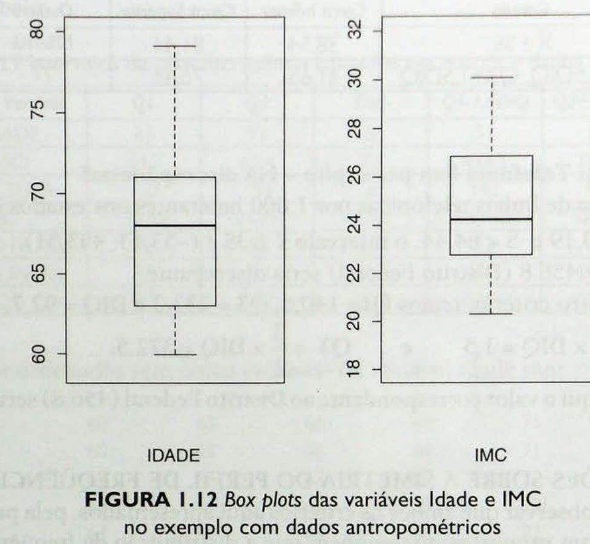
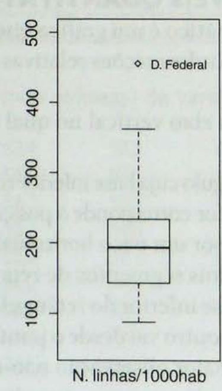
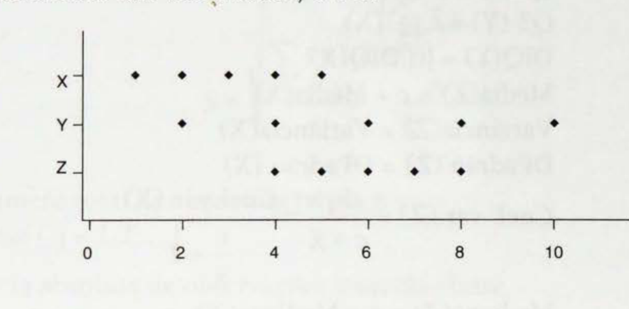
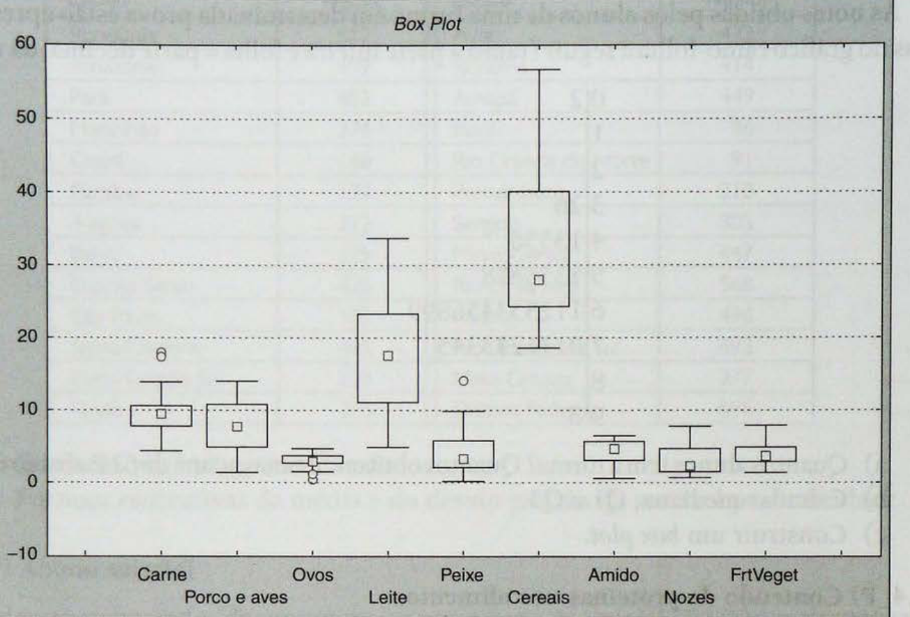

# Exercícios extraídos de Pinheiro et al. (2009) - Capítulo 1

Fonte: `livros/Pinheiro 2009 Estatística básica a arte de trabalhar com dados.pdf`

## Capítulo 1: Análise Exploratória para uma Variável

## Fórmulas úteis para resolver os exercícios

### Medidas de posição

- Média amostral:

$$
\bar{x} = \frac{1}{n}\sum_{i=1}^{n} x_i
$$

em que:

- $\bar{x}$ é a média amostral;
- $n$ é o número de observações;
- $x_i$ é o valor da $i$-ésima observação;
- $i$ é o índice das observações, com $i=1,\ldots,n$.

- Mediana:

Se os dados ordenados são $x_{(1)} \le x_{(2)} \le \cdots \le x_{(n)}$:

$$
\text{Mediana} =
\begin{cases}
x_{\left(\frac{n+1}{2}\right)}, & \text{se } n \text{ é ímpar} \\
\frac{x_{\left(\frac{n}{2}\right)} + x_{\left(\frac{n}{2}+1\right)}}{2}, & \text{se } n \text{ é par}
\end{cases}
$$

em que:

- $x_{(k)}$ representa a $k$-ésima observação após ordenar os dados;
- a mediana coincide com a observação central quando $n$ é ímpar;
- quando $n$ é par, a mediana é a média aritmética das duas observações centrais.

- Quartis:

$$
Q_1 = \text{primeiro quartil}, \qquad Q_2 = \text{mediana}, \qquad Q_3 = \text{terceiro quartil}
$$

em que:

- $Q_1$ é o valor abaixo do qual ficam aproximadamente 25% das observações;
- $Q_2$ coincide com a mediana;
- $Q_3$ é o valor abaixo do qual ficam aproximadamente 75% das observações.

### Medidas de dispersão

- Variância amostral:

$$
s^2 = \frac{1}{n-1}\sum_{i=1}^{n}(x_i-\bar{x})^2
$$

em que:

- $s^2$ é a variância amostral;
- $x_i-\bar{x}$ é o desvio da observação $x_i$ em relação à média;
- $n-1$ é o número de graus de liberdade associado à variância amostral.

- Forma computacional da variância:

$$
s^2 = \frac{\sum_{i=1}^{n} x_i^2 - n\bar{x}^2}{n-1}
$$

em que:

- $\sum_{i=1}^{n} x_i^2$ é a soma dos quadrados das observações;
- $n\bar{x}^2$ é o termo de correção baseado na média amostral;
- os demais símbolos já foram definidos acima.

- Desvio-padrão amostral:

$$
s = \sqrt{s^2}
$$

em que:

- $s$ é o desvio-padrão amostral;
- $s^2$ é a variância amostral.

- Coeficiente de variação:

$$
cv = \frac{s}{\bar{x}}
$$

ou, em percentual,

$$
cv\% = 100\cdot \frac{s}{\bar{x}}
$$

em que:

- $cv$ é o coeficiente de variação em escala relativa;
- $cv\%$ é o coeficiente de variação expresso em porcentagem;
- a razão $\frac{s}{\bar{x}}$ compara a dispersão com o nível médio da variável.

- Distância interquartil:

$$
DIQ = Q_3 - Q_1
$$

em que:

- $DIQ$ é a distância interquartil;
- $Q_3-Q_1$ mede a amplitude da metade central dos dados.

### Dados agrupados em distribuição de freqüências

Se $x_j$ é o ponto médio da classe $j$, $f_j$ sua freqüência e $n = \sum_{j=1}^{J} f_j$:

- Média aproximada:

$$
\bar{x} = \frac{\sum_{j=1}^{J} f_j x_j}{n}
$$

em que:

- $x_j$ é o ponto médio da $j$-ésima classe;
- $f_j$ é a frequência absoluta da $j$-ésima classe;
- $J$ é o número total de classes;
- $\sum_{j=1}^{J} f_j x_j$ é a soma ponderada dos pontos médios pelas frequências.

- Variância amostral aproximada:

$$
s^2 = \frac{\sum_{j=1}^{J} f_j x_j^2 - n\bar{x}^2}{n-1}
$$

em que:

- $\sum_{j=1}^{J} f_j x_j^2$ é a soma ponderada dos quadrados dos pontos médios;
- a expressão fornece uma aproximação da variância amostral para dados agrupados em classes;
- os demais símbolos já foram definidos acima.

- Desvio-padrão aproximado:

$$
s = \sqrt{s^2}
$$

em que:

- $s$ é o desvio-padrão aproximado obtido a partir da variância aproximada.

### Quartis e mediana por interpolação em classes

Se um quantil $Q_p$ está na classe com:

- limite inferior $L$;
- amplitude $h$;
- freqüência acumulada anterior $F_{\text{ant}}$;
- freqüência da classe $f_{\text{classe}}$;
- total $n$;
- proporção acumulada desejada $p$.

Então:

$$
Q_p = L + h \cdot \frac{pn - F_{\text{ant}}}{f_{\text{classe}}}
$$

em que:

- $Q_p$ é o quantil de ordem $p$;
- $L$ é o limite inferior da classe que contém o quantil;
- $h$ é a amplitude da classe;
- $pn$ é a posição teórica do quantil na distribuição agrupada;
- $F_{\text{ant}}$ é a frequência acumulada anterior à classe do quantil;
- $f_{\text{classe}}$ é a frequência da classe que contém o quantil.

Casos particulares:

$$
Q_1 = Q_{0{,}25}, \qquad Q_2 = Q_{0{,}50}, \qquad Q_3 = Q_{0{,}75}
$$

em que:

- $Q_1$, $Q_2$ e $Q_3$ correspondem, respectivamente, aos quantis de ordem $0{,}25$, $0{,}50$ e $0{,}75$.

### Transformações lineares

Se $Y = cX$:

$$
\bar{Y} = c\bar{X}, \qquad s_Y^2 = c^2 s_X^2, \qquad s_Y = |c|s_X
$$

$$
\text{Mediana}(Y) = c\,\text{Mediana}(X), \qquad DIQ(Y) = |c|DIQ(X)
$$

em que:

- $X$ é a variável original e $Y$ é a variável obtida pela multiplicação por uma constante $c$;
- $\bar{X}$ e $\bar{Y}$ são as médias de $X$ e $Y$;
- $s_X^2$ e $s_Y^2$ são as variâncias de $X$ e $Y$;
- $s_X$ e $s_Y$ são os desvios-padrão de $X$ e $Y$;
- $DIQ(X)$ e $DIQ(Y)$ são as distâncias interquartis de $X$ e $Y$.

Se $Z = c + X$:

$$
\bar{Z} = c + \bar{X}, \qquad s_Z^2 = s_X^2, \qquad s_Z = s_X
$$

$$
\text{Mediana}(Z) = c + \text{Mediana}(X), \qquad DIQ(Z) = DIQ(X)
$$

em que:

- $Z$ é a variável transformada por adição da constante $c$ à variável original $X$;
- a soma de uma constante desloca medidas de posição, mas não altera variância, desvio-padrão nem distância interquartil.

### Critérios usuais para valores discrepantes

- Critério baseado em quartis:

$$
\text{Limite inferior} = Q_1 - 1{,}5 \cdot DIQ
$$

$$
\text{Limite superior} = Q_3 + 1{,}5 \cdot DIQ
$$

em que:

- os limites definem a faixa usual de observações segundo a regra do boxplot;
- valores abaixo do limite inferior ou acima do limite superior são candidatos a discrepantes.

- Critério baseado em média e desvio-padrão:

um valor $x$ pode ser considerado discrepante se

$$
|x - \bar{x}| > 3s
$$

em que:

- $x$ é a observação sob avaliação;
- $|x-\bar{x}|$ é a distância absoluta entre a observação e a média;
- $3s$ é o limiar de três desvios-padrão em torno da média.

### Freqüência relativa e acumulada

- Freqüência relativa da classe $j$:

$$
fr_j = \frac{f_j}{n}
$$

em que:

- $fr_j$ é a frequência relativa da classe $j$;
- $f_j$ é a frequência absoluta da classe $j$;
- $n$ é o total de observações.

- Freqüência acumulada:

$$
F_j = \sum_{k=1}^{j} f_k
$$

em que:

- $F_j$ é a frequência acumulada até a classe $j$;
- $k$ é o índice de soma das classes da primeira até a classe $j$.

- Freqüência relativa acumulada:

$$
FR_j = \frac{F_j}{n}
$$

em que:

- $FR_j$ é a frequência relativa acumulada até a classe $j$;
- $F_j$ é a frequência acumulada correspondente.

### Observações finais

- Em histogramas, a área das barras representa freqüências ou freqüências relativas.
- Em gráficos ramo-e-folhas, a ordenação dos dados ajuda a identificar mediana, quartis, assimetria e possíveis outliers.
- Em box plots, a caixa vai de $Q_1$ a $Q_3$, a linha interna marca a mediana, e os pontos fora dos limites usuais são candidatos a discrepantes.

## Quadros auxiliares do capítulo 1

### Tabela 1.1 - Imóveis à venda

| Nº da Obs. | Bairro | Tipo | Nº de quartos | Preço |
| ---: | --- | --- | --- | ---: |
| 1 | Barra | Apto. | 2 | 165 |
| 2 | Barra | Apto. | 3 | 240 |
| 3 | Barra | Cobt. | - | 158 |
| 4 | Barra | Sala | - | 150 |
| 5 | Botafogo | Apto. | 2 | 59 |
| 6 | Catete | Apto. | 1 | 54 |
| 7 | Centro | Sala | - | 35 |
| 8 | Copacabana | Apto. | 2 | 83 |
| 9 | Copacabana | Apto. | 3 | 180 |
| 10 | Copacabana | Apto. | 4+ | 85 |
| 11 | Flamengo | Apto. | 1 | 58 |
| 12 | Flamengo | Cobt. | - | 120 |
| 13 | Gávea | Apto. | 4+ | 250 |
| 14 | Ipanema | Apto. | 3 | 130 |
| 15 | Jacarepaguá | Apto. | 3 | 90 |
| 16 | Lagoa | Apto. | 2 | 130 |
| 17 | Laranjeiras | Apto. | 2 | 68 |
| 18 | Laranjeiras | Apto. | 4+ | 360 |
| 19 | Leblon | Apto. | 3 | 300 |
| 20 | Leblon | Apto. | 4+ | 600 |
| 21 | Maracanã | Apto. | 3 | 137 |
| 22 | Recreio | Cobt. | - | 240 |
| 23 | São Conrado | Casa | 4+ | 650 |
| 24 | Tijuca | Apto. | 2 | 49 |
| 25 | Tijuca | Apto. | 2 | 95 |
| 26 | Tijuca | Casa | 4+ | 170 |
| 27 | Vila Isabel | Apto. | 2 | 57 |

Resumo útil:

- variável `Tipo` é qualitativa nominal;
- variável `Preço` é quantitativa contínua;
- os maiores preços são $600$ e $650$, candidatos naturais a valores discrepantes em boxplot.

### Tabelas 1.3 e 1.4 - Dados antropométricos

Distribuições de freqüências apresentadas no texto:

| Categoria | Freqüência | Percentuais |
| --- | ---: | ---: |
| Ativa | 22 | 48,89 |
| Sedentária | 23 | 51,11 |
| Total | 45 | 100,00 |

| Classe RCQ | Freqüência | Percentuais |
| --- | ---: | ---: |
| Pequeno Risco | 5 | 11,11 |
| Médio Risco | 20 | 44,44 |
| Grande Risco | 20 | 44,44 |
| Total | 45 | 100,00 |

Essas tabelas sustentam a leitura de gráficos de barras e setores para variáveis qualitativas.

### Medidas resistentes e boxplot

O capítulo usa:

$$
DIQ = Q_3 - Q_1
$$

e o critério:

$$
\text{LI} = Q_1 - 1{,}5 \cdot DIQ,
\qquad
\text{LS} = Q_3 + 1{,}5 \cdot DIQ.
$$

Valores fora desses limites são tratados como discrepantes pelo critério resistente.

**Figura 1 - Box plots das variáveis idade e IMC**



Fonte: Pinheiro et al. (2009).

**Figura 2 - Box plot da telefonia fixa per capita**



Fonte: Pinheiro et al. (2009).

### Exemplo 1.2_R) Permanência hospitalar

Tabela-base já usada no exercício resolvido:

| Permanência (dias) | Ponto médio $(x_j)$ | Freqüência simples $(f_j)$ |
| --- | ---: | ---: |
| 0 a 10 | 5 | 70 |
| 10 a 20 | 15 | 69 |
| 20 a 30 | 25 | 90 |
| 30 a 40 | 35 | 43 |
| 40 a 50 | 45 | 43 |
| 50 a 60 | 55 | 31 |
| 60 a 70 | 65 | 16 |
| 70 a 80 | 75 | 7 |
| 80 a 90 | 85 | 0 |
| 90 a 100 | 95 | 1 |
| **Total** |  | **370** |

Resumo útil:

- $n = 370$;
- a classe modal é `20 a 30`;
- a mediana e os quartis devem ser obtidos por interpolação em classes.

### Exercício 1.3_P - Notas em ramo-folha

Ramo-folha fornecido:

```text
0 2
1
2
3 26
4 13556
5 1355678
6 112334456899
7 0111233345
8
9 8
```

Resumo útil:

- ramo = parte inteira;
- folha = parte decimal;
- total de observações obtido pela contagem de folhas;
- mediana e quartis podem ser lidos diretamente após ordenar pelos ramos.

### Exercício 1.4_P - Conteúdo de proteínas

| Alimento | Proteínas | Alimento | Proteínas |
| --- | ---: | --- | ---: |
| Bife, sem gordura | 32,6 | Azeitona | 0 |
| Molho (vegetais) | 2 | Ervilha em lata | 6 |
| Pirulito de amendoim | 0 | Ameixa | 0,5 |
| Cobert. queijo Parm./alho | 2 | Arroz branco | 3 |
| Tempero apimentado (lata) | 18 | Salmão defumado | 20,7 |
| Milho em lata | 2,7 | Sopa de arroz e galinha | 3 |
| Caramelo dinamarquês | 3 | Morango (em xarope) | 0 |
| Pimenta com alho | 0,3 | Peito de peru | 248,1 |
| Sorvete de morango | 1 | Iogurte de pêssego | 8 |
| Entr.: Macarrão queijo | 13 |  |  |

Resumo útil:

- o valor $248{,}1$ é um fortíssimo candidato a discrepante;
- o exercício pede explicitamente o critério resistente, logo o foco está em mediana, quartis e $DIQ$.

### Exercício 1.5_P - Produtividade do feijão

| Estado | Produtividade (kg/ha) | Estado | Produtividade (kg/ha) |
| --- | ---: | --- | ---: |
| Rondônia | 512 | Acre | 472 |
| Amazonas | 499 | Roraima | 414 |
| Pará | 452 | Amapá | 449 |
| Maranhão | 274 | Piauí | 86 |
| Ceará | 148 | Rio Grande do Norte | 91 |
| Paraíba | 137 | Pernambuco | 210 |
| Alagoas | 272 | Sergipe | 305 |
| Bahia | 229 | Minas Gerais | 447 |
| Espírito Santo | 426 | Rio de Janeiro | 568 |
| São Paulo | 585 | Paraná | 496 |
| Santa Catarina | 465 | Rio Grande do Sul | 493 |
| Mato Grosso do Sul | 528 | Mato Grosso | 277 |
| Goiás | 393 | Distrito Federal | 596 |

Resumo útil:

- são 26 valores;
- o histograma deve mostrar forte contraste entre estados de baixa e alta produtividade;
- a média e o desvio-padrão podem ser estimados diretamente da lista.

### Exercício 1.7_P - Porosidade

| Classes | Freqüência absoluta simples | Classes | Freqüência absoluta simples |
| --- | ---: | --- | ---: |
| 0 a 5 | 0 | 25 a 30 | 192 |
| 5 a 10 | 2 | 30 a 35 | 150 |
| 10 a 15 | 4 | 35 a 40 | 64 |
| 15 a 20 | 20 | 40 a 45 | 36 |
| 20 a 25 | 45 | 45 a 50 | 8 |

Resumo útil:

- a soma das freqüências é $521$;
- a concentração principal está entre `25 a 35`;
- as medidas pedidas devem ser obtidas por pontos médios e interpolação em classes.

### Exercício 1.8_P - Densidade populacional

| Estado | Densidade (habit./km$^2$) | Estado | Densidade (habit./km$^2$) |
| --- | ---: | --- | ---: |
| Rondônia | 2,02 | Acre | 1,97 |
| Amazonas | 0,92 | Roraima | 0,34 |
| Pará | 2,77 | Amapá | 1,26 |
| Maranhão | 12,31 | Piauí | 8,52 |
| Ceará | 36,02 | R. G. do Norte | 35,8 |
| Paraíba | 49,14 | Pernambuco | 62,49 |
| Alagoas | 71,7 | Sergipe | 51,84 |
| Bahia | 16,88 | Minas Gerais | 22,96 |
| Espírito Santo | 94,37 | Rio de Janeiro | 260,74 |
| São Paulo | 101,25 | Paraná | 38,33 |
| Santa Catarina | 38,00 | Rio Grande do Sul | 29,06 |
| Mato Grosso do Sul | 3,91 | Mato Grosso | 1,29 |
| Goiás | 6,01 | Distrito Federal | 203,94 |

Resumo útil:

- o capítulo já informa:

$$
\sum x = 1153{,}84, \qquad \sum x^2 = 150326{,}3774.
$$

- Rio de Janeiro, São Paulo e Distrito Federal são candidatos naturais a discrepantes na escala original;
- o objetivo dos itens (d) e (e) é avaliar como transformações reduzem a assimetria.

### Exercício 1.10_P - Estudo epidemiológico

Variáveis observadas:

| Nome | Unidades | Comentários |
| --- | --- | --- |
| Colesterol | mg% | Aproximado para o inteiro mais próximo |
| Status socioeconômico | nenhuma | $1 =$ alto, $\ldots$, $5 =$ baixo |
| Peso | lb | Aproximado para o inteiro mais próximo |
| Ano do falecimento | nenhum | $0 =$ vivo, senão ano da morte |

Resumo útil:

- são 40 observações;
- `Ano do falecimento` mistura muitos zeros com alguns anos específicos, logo tende a ser fortemente assimétrica;
- `Status socioeconômico` é ordinal, enquanto as demais variáveis principais tratadas numericamente são quantitativas.

### Exercícios resolvidos

#### 1.1_R) Variável mais constante e variável vezes constante

Considere o conjunto de dados a seguir:

| Obs. | $X$ | $Y$ | $Z$ |
| ---: | ---: | ---: | ---: |
| 1 | 1 | 2 | 4 |
| 2 | 2 | 4 | 5 |
| 3 | 3 | 6 | 6 |
| 4 | 4 | 8 | 7 |
| 5 | 5 | 10 | 8 |

a) Para cada uma das variáveis $X$, $Y$, $Z$, calcule: média, variância, desvio-padrão, coeficiente de variação ($cv$), mediana ($Q_2$), $Q_1$, $Q_3$, $DIQ = Q_3 - Q_1$.

b) Faça um gráfico, como o da Figura 1.11, localizando no eixo horizontal, graduado de 1 a 10, as coordenadas dos pontos e no eixo vertical três níveis: $X$, $Y$ e $Z$. Analise visualmente a relação entre as três variáveis em termos de centralidade e dispersão.

**Figura 3 - Gráfico simultâneo das variáveis X, Y e Z**



Fonte: Pinheiro et al. (2009).

c) Verifique que relação matemática existe entre as variáveis $Y$ e $X$ e faça o mesmo com relação às variáveis $Z$ e $X$. Em seguida, verifique que relação matemática existe entre os valores das medidas de centralidade e de dispersão relativas às variáveis $Y$ e $Z$ e as mesmas medidas para $X$.

d) Como se poderia generalizar as constatações do item (c) para o caso de variáveis do tipo $Y = cX$ e $Z = c + X$?

#### 1.2_R) Tempo de permanência em hospital - Análise diretamente a partir da distribuição de freqüências

Há determinadas situações em que não se tem acesso aos dados individuais, mas está disponível uma distribuição de freqüências da variável de interesse, como na tabela a seguir.

Distribuição de freqüências do tempo de permanência na última internação referente a uma amostra de pacientes do Hospital Espírita de Porto Alegre nos quatro primeiros meses de 1996:

| Permanência (dias) | Ponto médio $(x_j)$ | Freqüência simples $(f_j)$ |
| --- | ---: | ---: |
| 0 a 10 | 5 | 70 |
| 10 a 20 | 15 | 69 |
| 20 a 30 | 25 | 90 |
| 30 a 40 | 35 | 43 |
| 40 a 50 | 45 | 43 |
| 50 a 60 | 55 | 31 |
| 60 a 70 | 65 | 16 |
| 70 a 80 | 75 | 7 |
| 80 a 90 | 85 | 0 |
| 90 a 100 | 95 | 1 |
| **Total** |  | **370** |

Como determinar as medidas de centralidade e de dispersão em uma tal situação?

#### 1.3_R) Consumo de proteínas em países europeus

Obs.: Este exercício foi resolvido com o uso do computador.

A tabela a seguir contém, para cada um de vários países da Europa, estimativas do consumo diário de proteína em gramas *per capita* por tipo de alimento.

| País | Carne | Porco e aves | Ovos | Leite | Peixe | Cereais | Amido | Nozes | Frutas e vegetais |
| --- | ---: | ---: | ---: | ---: | ---: | ---: | ---: | ---: | ---: |
| Albânia | 10,1 | 1,4 | 0,5 | 8,9 | 0,2 | 42,3 | 0,6 | 5,5 | 1,7 |
| Áustria | 8,9 | 14,0 | 4,3 | 19,9 | 2,1 | 28,0 | 3,6 | 1,3 | 4,3 |
| Bélgica/Luxemb. | 13,5 | 9,3 | 4,1 | 17,5 | 4,5 | 26,6 | 5,7 | 2,1 | 4,0 |
| Bulgária | 7,8 | 6,0 | 1,6 | 8,3 | 1,2 | 56,7 | 1,1 | 3,7 | 4,2 |
| Tchecoslováquia | 9,7 | 11,4 | 2,8 | 12,5 | 2,0 | 34,3 | 5,0 | 1,1 | 4,0 |
| Dinamarca | 10,6 | 10,8 | 3,7 | 25,0 | 9,9 | 21,9 | 4,8 | 0,7 | 2,4 |
| Alemanha Oriental | 8,4 | 11,6 | 3,7 | 11,1 | 5,4 | 24,6 | 6,5 | 0,8 | 3,6 |
| Finlândia | 9,5 | 4,9 | 2,7 | 33,7 | 5,8 | 26,3 | 5,1 | 1,0 | 1,4 |
| França | 18,0 | 9,9 | 3,3 | 19,5 | 5,7 | 28,1 | 2,8 | 2,4 | 6,5 |
| Grécia | 10,2 | 3,0 | 2,8 | 17,6 | 5,9 | 41,7 | 2,2 | 7,8 | 6,5 |
| Hungria | 5,3 | 12,4 | 2,9 | 9,7 | 0,3 | 40,1 | 4,0 | 5,4 | 4,2 |
| Irlanda | 13,9 | 10,0 | 4,7 | 25,8 | 2,2 | 24,0 | 6,2 | 1,6 | 2,9 |
| Itália | 9,0 | 5,1 | 2,9 | 13,7 | 3,4 | 36,8 | 2,1 | 4,3 | 6,7 |
| Holanda | 9,5 | 13,6 | 3,6 | 23,4 | 2,5 | 22,4 | 4,2 | 1,8 | 3,7 |
| Noruega | 9,4 | 4,7 | 2,7 | 23,3 | 9,7 | 23,0 | 4,6 | 1,6 | 2,7 |
| Polônia | 6,9 | 10,2 | 2,7 | 19,3 | 3,0 | 36,1 | 5,9 | 2,0 | 6,6 |
| Portugal | 6,2 | 3,7 | 1,1 | 4,9 | 14,2 | 27,0 | 5,9 | 4,7 | 7,9 |
| Romênia | 6,2 | 6,3 | 1,5 | 11,1 | 1,0 | 49,6 | 3,1 | 5,3 | 2,8 |
| Espanha | 7,1 | 3,4 | 3,1 | 8,6 | 7,0 | 29,2 | 5,7 | 5,9 | 7,2 |
| Suécia | 9,9 | 7,8 | 3,5 | 24,7 | 7,5 | 19,5 | 3,7 | 1,4 | 2,0 |
| Suíça | 13,1 | 10,1 | 3,1 | 23,8 | 2,3 | 25,6 | 2,8 | 2,4 | 4,9 |
| Reino Unido | 17,4 | 5,7 | 4,7 | 20,6 | 4,3 | 24,3 | 4,7 | 3,4 | 3,3 |
| Rússia | 9,3 | 4,6 | 2,1 | 16,6 | 3,0 | 43,6 | 6,4 | 3,4 | 2,9 |
| Alemanha Ocidental | 11,4 | 12,5 | 4,1 | 18,8 | 3,4 | 18,6 | 5,2 | 1,5 | 3,8 |
| Iugoslávia | 4,4 | 5,0 | 1,2 | 9,5 | 0,6 | 55,9 | 3,0 | 5,7 | 3,2 |

a) Determine, para cada uma das nove variáveis anteriores: a média, a mediana, o desvio-padrão, o 1º quartil, o 3º quartil, a distância interquartil, o coeficiente de variação usual ($cv_1$) e o quociente entre a distância interquartil e a mediana ($cv_2$).

b) Faça um box plot simultâneo para todas as variáveis e extraia conclusões.

**Figura 4 - Box plots simultâneos do consumo de proteínas**



Fonte: Pinheiro et al. (2009).

### Exercícios propostos

#### 1.1_P) Imóveis anunciados para venda

Usando os dados da Tabela 1.1 obtenha:

a) um gráfico de barras para a variável Tipo de Imóvel.

b) um ramo-folha e um box plot para a variável Preço.

#### 1.2_P) O impacto da mudança de um único valor sobre a média e sobre a mediana

Suponha que estávamos trabalhando com um conjunto de $n$ observações relativas a uma determinada variável quantitativa, onde $n > 2$. Foram calculadas a média aritmética e a mediana desses dados. Em seguida, o valor da maior entre todas essas $n$ observações sofreu um aumento.

Como resultado disso:

a) Tanto a média quanto a mediana aumentam?

b) Tanto a média quanto a mediana não se alteram.

c) A média não se altera e a mediana aumenta?

d) A média aumenta e a mediana não se altera?

e) Nada se pode afirmar sobre a mudança na mediana?

#### 1.3_P) Notas de uma prova

As notas obtidas pelos alunos de uma turma em determinada prova estão apresentadas no gráfico ramo-folha a seguir (ramo = parte inteira e folha = parte decimal da nota):

```text
0 2
1
2
3 26
4 13556
5 1355678
6 112334456899
7 0111233345
8
9 8
```

a) Quantos alunos tem a turma? Quantos obtiveram notas acima de 6? E abaixo de 4?

b) Calcular mediana, $Q_1$ e $Q_3$.

c) Construir um box plot.

#### 1.4_P) Conteúdo de proteínas nos alimentos

A tabela a seguir contém, para cada alimento de uma amostra de 19 alimentos, o valor da variável Conteúdo de Proteínas (em g).

| Alimento | Proteínas | Alimento | Proteínas |
| --- | ---: | --- | ---: |
| Bife, sem gordura | 32,6 | Azeitona | 0 |
| Molho (vegetais) | 2 | Ervilha em lata | 6 |
| Pirulito de amendoim | 0 | Ameixa | 0,5 |
| Cobert. queijo Parm./alho | 2 | Arroz branco | 3 |
| Tempero apimentado (lata) | 18 | Salmão defumado | 20,7 |
| Milho em lata | 2,7 | Sopa de arroz e galinha | 3 |
| Caramelo dinamarquês | 3 | Morango (em xarope) | 0 |
| Pimenta com alho | 0,3 | Peito de peru | 248,1 |
| Sorvete de morango | 1 | Iogurte de pêssego | 8 |
| Entr.: Macarrão queijo | 13 |  |  |

a) Faça um gráfico ramo-folha para esses dados. Sugestão: use ramo = número de dezenas.

b) Determine a mediana e o intervalo interquartil.

c) Aponte as observações discrepantes, usando o critério que se baseia em medidas resistentes.

d) Qual seria uma possível explicação para o fato surpreendente de que o conteúdo de proteínas relativo ao peito de peru seja tão alto neste caso?

#### 1.5_P) Produtividade de plantações de feijão

A tabela a seguir fornece a produtividade das plantações de feijão, em quilos por hectare, nos diversos estados do Brasil em 1980.

| Estado | Produtividade (kg/ha) | Estado | Produtividade (kg/ha) |
| --- | ---: | --- | ---: |
| Rondônia | 512 | Acre | 472 |
| Amazonas | 499 | Roraima | 414 |
| Pará | 452 | Amapá | 449 |
| Maranhão | 274 | Piauí | 86 |
| Ceará | 148 | Rio Grande do Norte | 91 |
| Paraíba | 137 | Pernambuco | 210 |
| Alagoas | 272 | Sergipe | 305 |
| Bahia | 229 | Minas Gerais | 447 |
| Espírito Santo | 426 | Rio de Janeiro | 568 |
| São Paulo | 585 | Paraná | 496 |
| Santa Catarina | 465 | Rio Grande do Sul | 493 |
| Mato Grosso do Sul | 528 | Mato Grosso | 277 |
| Goiás | 393 | Distrito Federal | 596 |

a) Construa um histograma dos dados.

b) Forneça estimativas da média e do desvio-padrão da variável produtividade.

#### 1.6_P) Abono salarial

Todos os empregados de uma empresa passaram a ganhar $R\$300{,}00$ a mais mensalmente a partir de uma certa data.

O que se pode afirmar com respeito ao efeito dessa decisão sobre a variável salário dos empregados?

a) O coeficiente de variação diminuiu.

b) Tanto a média como o desvio-padrão aumentaram em $R\$300{,}00$.

c) Tanto a média como o desvio-padrão não se alteraram.

d) O coeficiente de variação não se alterou.

e) O coeficiente de variação aumentou.

#### 1.7_P) Análise da variável porosidade

Um determinado arquivo de dados contém 521 observações que são localidades, caracterizadas por latitude, longitude e profundidade, e 5 variáveis, que são medições de propriedades físicas e geológicas do solo em diferentes localizações de uma região rica em petróleo.

A tabela a seguir contém a distribuição de freqüências da variável Porosidade.

| Classes | Freqüência absoluta simples | Classes | Freqüência absoluta simples |
| --- | ---: | --- | ---: |
| 0 a 5 | 0 | 25 a 30 | 192 |
| 5 a 10 | 2 | 30 a 35 | 150 |
| 10 a 15 | 4 | 35 a 40 | 64 |
| 15 a 20 | 20 | 40 a 45 | 36 |
| 20 a 25 | 45 | 45 a 50 | 8 |

a) Calcule a média e o desvio-padrão dessa variável.

b) Que percentagem das observações está entre $\bar{x} - 5$ e $\bar{x} + 5$?

c) Calcule a mediana e a distância interquartil dessa variável.

#### 1.8_P) Densidade populacional em cada estado do Brasil

Os dados a seguir se referem à densidade populacional de cada estado do Brasil conforme apurado no censo de 1980.

| Estado | Densidade (habit./km$^2$) | Estado | Densidade (habit./km$^2$) |
| --- | ---: | --- | ---: |
| Rondônia | 2,02 | Acre | 1,97 |
| Amazonas | 0,92 | Roraima | 0,34 |
| Pará | 2,77 | Amapá | 1,26 |
| Maranhão | 12,31 | Piauí | 8,52 |
| Ceará | 36,02 | R. G. do Norte | 35,8 |
| Paraíba | 49,14 | Pernambuco | 62,49 |
| Alagoas | 71,7 | Sergipe | 51,84 |
| Bahia | 16,88 | Minas Gerais | 22,96 |
| Espírito Santo | 94,37 | Rio de Janeiro | 260,74 |
| São Paulo | 101,25 | Paraná | 38,33 |
| Santa Catarina | 38,00 | Rio Grande do Sul | 29,06 |
| Mato Grosso do Sul | 3,91 | Mato Grosso | 1,29 |
| Goiás | 6,01 | Distrito Federal | 203,94 |

a) Calcule a média e o desvio-padrão da variável densidade.

b) Suponha que um determinado valor da variável pode ser considerado discrepante dos demais se a distância entre esse valor e a média for maior que 3 desvios-padrão. Quais dos estados se enquadram nessa categoria de valores discrepantes?

c) Construa um box plot para esses dados.

d) Construa um box plot para as raízes quadradas desses dados.

e) Construa um box plot para os logaritmos desses dados.

f) Compare esses box plots quanto ao seu grau de simetria.

Obs.: para esses dados, $\sum x = 1153{,}84$ e $\sum x^2 = 150326{,}3774$.


#### 1.9_P) Número de acomodações por estabelecimento hoteleiro no Rio de Janeiro

Usando os dados da Tabela 2.9, construa uma nova variável que corresponde ao número de acomodações por estabelecimento em cada município do estado do Rio de Janeiro e verifique se ela apresenta observações discrepantes, por ambos os critérios aqui apresentados.

#### 1.10_P) Estudo epidemiológico sobre doenças coronarianas

Fonte: Afifi e Azen.

Os dados aqui utilizados se referem a um estudo sobre doenças coronarianas realizado no Condado de Los Angeles, nos Estados Unidos. Trata-se de uma amostra com $n = 40$ empregados desse condado para os quais somente algumas das variáveis medidas foram aqui consideradas.

Descrição das variáveis:

| Nome | Unidades | Comentários |
| --- | --- | --- |
| Colesterol | mg% | Aproximado para o inteiro mais próximo |
| Status socioeconômico | nenhuma | $1 =$ alto, $\ldots$, $5 =$ baixo |
| Peso | lb | Aproximado para o inteiro mais próximo |
| Ano do falecimento | nenhum | $0 =$ vivo, senão ano da morte |

Aqui estão os dados:

| Colesterol | Status SE | Peso | Ano Falec | Colesterol | Status SE | Peso | Ano Falec |
| ---: | ---: | ---: | ---: | ---: | ---: | ---: | ---: |
| 243 | 3 | 138 | 66 | 328 | 2 | 137 | 63 |
| 185 | 3 | 152 | 66 | 207 | 5 | 188 | 0 |
| 254 | 2 | 179 | 64 | 325 | 4 | 114 | 0 |
| 328 | 3 | 194 | 0 | 250 | 5 | 207 | 0 |
| 271 | 3 | 164 | 65 | 290 | 2 | 178 | 0 |
| 321 | 3 | 169 | 0 | 210 | 5 | 179 | 0 |
| 314 | 1 | 176 | 0 | 260 | 2 | 169 | 0 |
| 243 | 4 | 146 | 0 | 310 | 2 | 138 | 0 |
| 226 | 3 | 167 | 0 | 220 | 3 | 160 | 0 |
| 334 | 3 | 154 | 0 | 190 | 3 | 187 | 0 |
| 339 | 5 | 149 | 0 | 260 | 5 | 194 | 0 |
| 385 | 3 | 202 | 0 | 210 | 3 | 188 | 0 |
| 295 | 4 | 194 | 0 | 220 | 1 | 178 | 0 |
| 158 | 1 | 224 | 68 | 260 | 4 | 186 | 0 |
| 226 | 2 | 145 | 63 | 230 | 3 | 204 | 0 |
| 187 | 5 | 170 | 66 | 300 | 4 | 202 | 0 |
| 258 | 3 | 126 | 64 | 230 | 3 | 122 | 0 |
| 273 | 3 | 163 | 64 | 220 | 2 | 149 | 0 |
| 300 | 1 | 144 | 64 | 180 | 3 | 142 | 0 |
| 224 | 3 | 125 | 65 | 260 | 3 | 152 | 0 |

a) Construa um histograma para cada uma dessas variáveis.

b) Determine a média e a mediana de cada uma dessas variáveis.

c) Determine o desvio-padrão e a distância interquartil de cada uma das variáveis anteriores.
