# Barbetta (2010) - Capítulo 11: Correlação e Regressão

Fonte: `livros/Barbetta_2010.pdf`

## Exemplos

### Exemplo 11.1 - Massas cerâmicas: correlação entre retração, resistência e absorção

No processo de queima de massa cerâmica para pavimento, corpos de prova foram avaliados por três variáveis:

- $X_1 =$ retração linear (%);
- $X_2 =$ resistência mecânica (MPa);
- $X_3 =$ absorção de água (%).

Os resultados de 18 ensaios são:

| Ensaio | $X_1$ | $X_2$ | $X_3$ | Ensaio | $X_1$ | $X_2$ | $X_3$ |
| ---: | ---: | ---: | ---: | ---: | ---: | ---: | ---: |
| 1 | 8,70 | 38,42 | 5,54 | 10 | 13,24 | 60,24 | 0,58 |
| 2 | 11,68 | 46,93 | 2,83 | 11 | 9,10 | 40,58 | 3,64 |
| 3 | 8,30 | 38,05 | 5,58 | 12 | 8,33 | 41,07 | 5,87 |
| 4 | 12,00 | 47,04 | 1,10 | 13 | 11,34 | 41,94 | 3,32 |
| 5 | 9,50 | 50,90 | 0,64 | 14 | 7,48 | 35,53 | 6,00 |
| 6 | 8,58 | 34,10 | 7,25 | 15 | 12,68 | 38,42 | 0,36 |
| 7 | 10,68 | 48,23 | 1,88 | 16 | 8,76 | 45,26 | 4,14 |
| 8 | 6,32 | 27,74 | 9,92 | 17 | 9,93 | 40,70 | 5,48 |
| 9 | 8,20 | 39,20 | 5,63 | 18 | 6,50 | 29,66 | 8,98 |

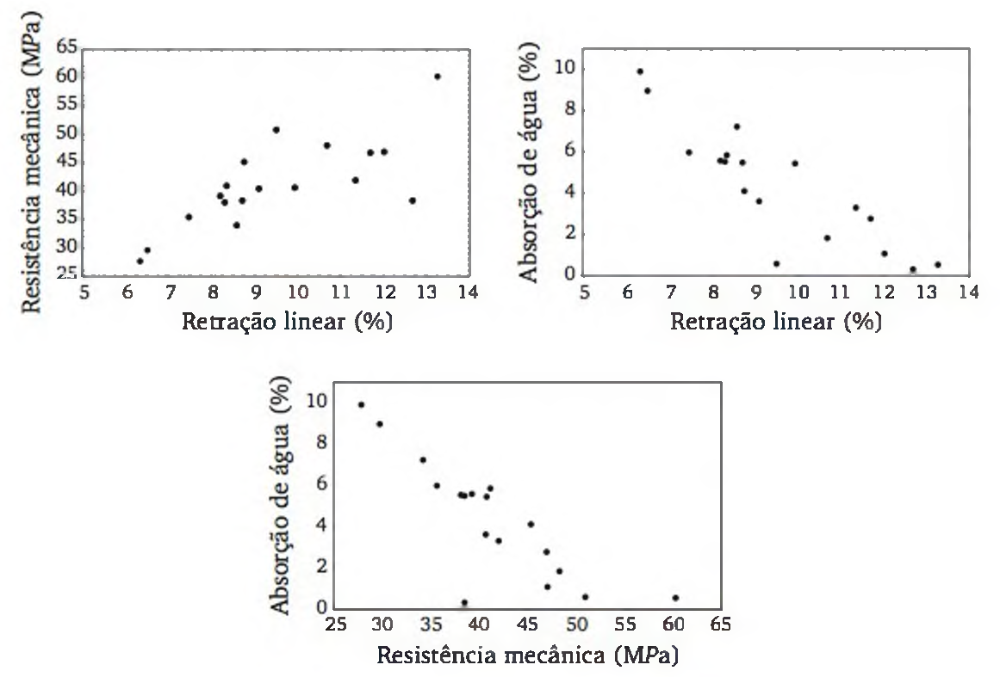

A Figura 11.1 sugere correlação positiva entre resistência mecânica e retração linear, correlação negativa entre absorção de água e retração linear, e correlação negativa entre resistência mecânica e absorção de água.

Com as 18 observações, os coeficientes de correlação de Pearson são:

| Variável | Retração linear | Resistência mecânica | Absorção de água |
| --- | ---: | ---: | ---: |
| Retração linear | 1,00 | 0,75 | -0,88 |
| Resistência mecânica | 0,75 | 1,00 | -0,84 |
| Absorção de água | -0,88 | -0,84 | 1,00 |

Entre resistência mecânica e retração linear, a correlação é positiva de moderada a forte. Entre retração linear e absorção de água, e entre resistência mecânica e absorção de água, as correlações são negativas fortes.

### Padronização, interpretação e força da correlação

Para reduzir o efeito da unidade de medida, os dados podem ser padronizados por:

$$
x_i'=\frac{x_i-\bar{x}}{s_x},
\qquad
y_i'=\frac{y_i-\bar{y}}{s_y}.
$$

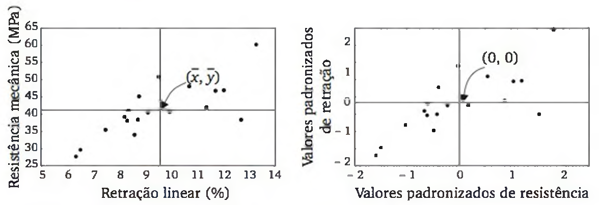

O coeficiente de correlação linear de Pearson pode ser escrito, em termos de valores padronizados, como:

$$
r=\frac{\sum_{i=1}^{n}x_i'y_i'}{n-1}.
$$

Para três observações $(3,6)$, $(4,4)$ e $(5,2)$, temos $\bar{x}=4$, $\bar{y}=4$, $s_x=1$ e $s_y=2$. Os pares padronizados são $(-1,1)$, $(0,0)$ e $(1,-1)$.

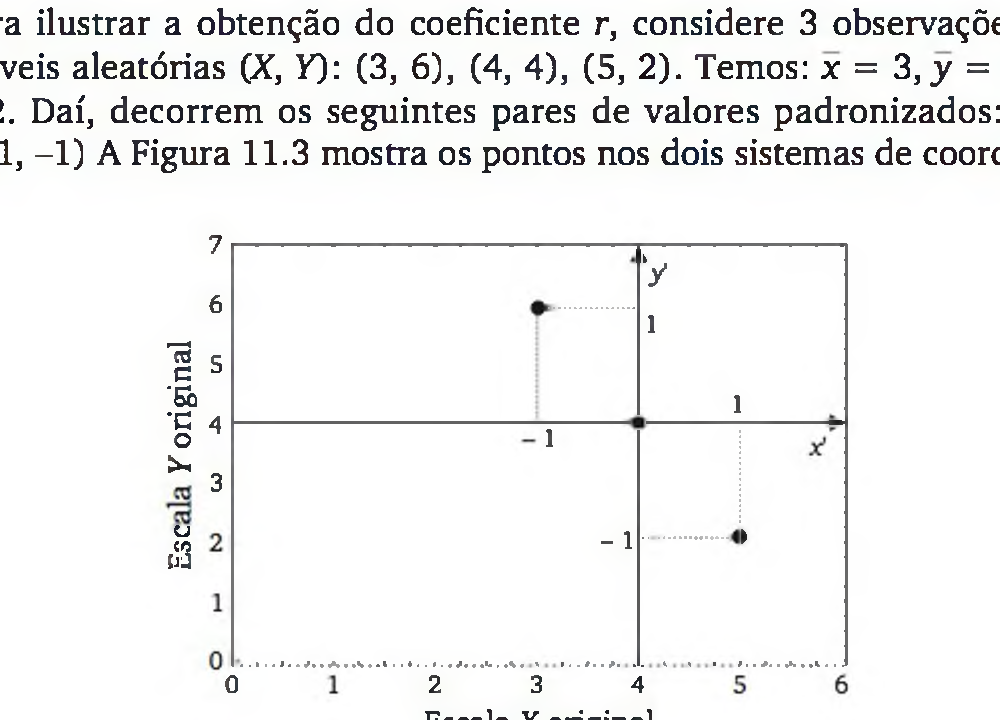

Assim:

$$
r=\frac{(-1)(1)+(0)(0)+(1)(-1)}{2}=-1.
$$

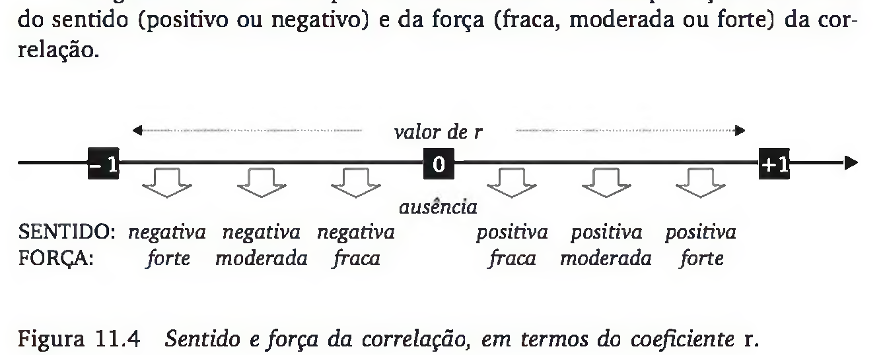

Uma forma operacional de calcular $r$ é:

$$
r=
\frac{n\sum x_i y_i-\left(\sum x_i\right)\left(\sum y_i\right)}
{\sqrt{n\sum x_i^2-\left(\sum x_i\right)^2}\sqrt{n\sum y_i^2-\left(\sum y_i\right)^2}}.
$$

### Exemplo 11.2 - Aditivo e octanagem da gasolina

Considere um experimento em que se analisa a octanagem da gasolina ($Y$) em função da adição de um novo aditivo ($X$). Foram realizados ensaios com os percentuais de 1, 2, 3, 4, 5 e 6% de aditivo.

| $x$ | $y$ |
| ---: | ---: |
| 1 | 80,5 |
| 2 | 81,6 |
| 3 | 82,1 |
| 4 | 83,7 |
| 5 | 83,9 |
| 6 | 85,0 |

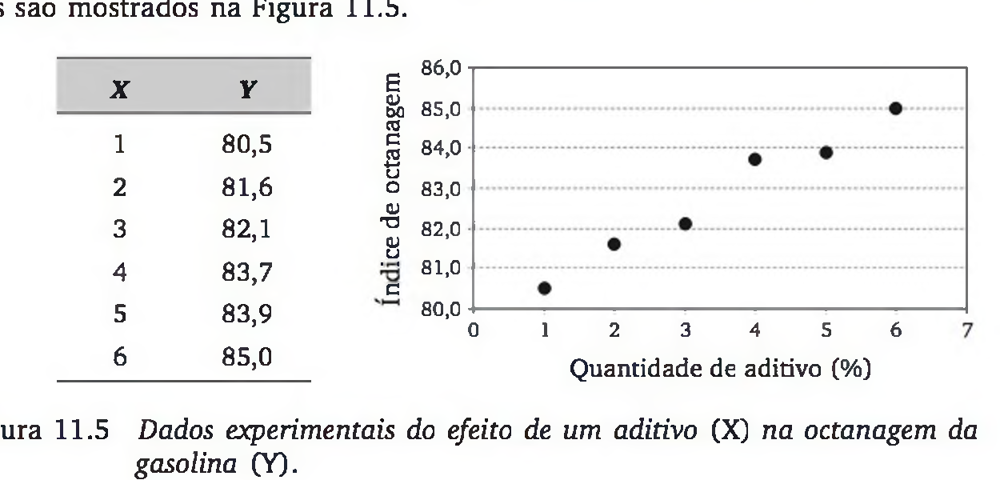

O modelo de regressão linear simples é:

$$
Y_i=\alpha+\beta x_i+\varepsilon_i.
$$

As estimativas por mínimos quadrados são:

$$
b=\frac{n\sum x_i y_i-\left(\sum x_i\right)\left(\sum y_i\right)}
{n\sum x_i^2-\left(\sum x_i\right)^2},
$$

$$
a=\frac{\sum y_i-b\sum x_i}{n}.
$$

Tabela de cálculos intermediários:

| Ensaio $(i)$ | $x_i$ | $y_i$ | $x_i^2$ | $x_i y_i$ |
| ---: | ---: | ---: | ---: | ---: |
| 1 | 1 | 80,5 | 1 | 80,5 |
| 2 | 2 | 81,6 | 4 | 163,2 |
| 3 | 3 | 82,1 | 9 | 246,3 |
| 4 | 4 | 83,7 | 16 | 334,8 |
| 5 | 5 | 83,9 | 25 | 419,5 |
| 6 | 6 | 85,0 | 36 | 510,0 |
| **Soma** | **21** | **496,8** | **91** | **1.754,3** |

Logo:

$$
b=\frac{6(1754{,}3)-(21)(496{,}8)}{6(91)-21^2}
=\frac{93}{105}=0{,}886,
$$

$$
a=\frac{496{,}8-(0{,}886)(21)}{6}=79{,}7.
$$

A reta ajustada é:

$$
\hat{y}=79{,}7+0{,}886x.
$$

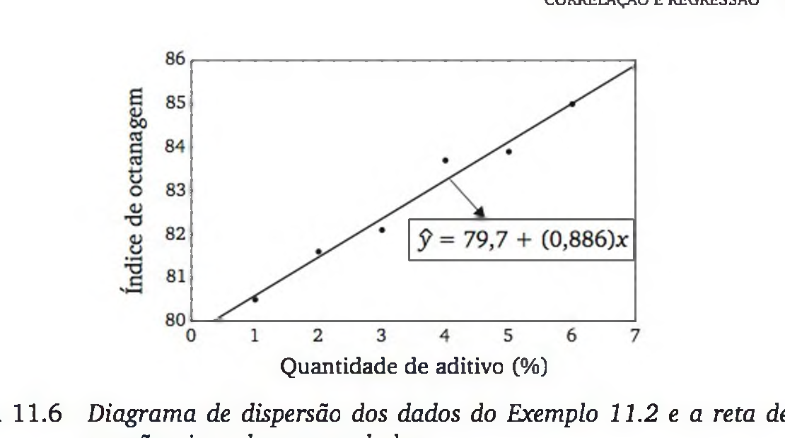

Para $x=5{,}5\%$ de aditivo, a octanagem esperada é:

$$
\hat{y}=79{,}7+0{,}886(5{,}5)=84{,}573.
$$

Valores preditos e resíduos:

| $x_i$ | $y_i$ | $\hat{y}_i$ | $e_i=y_i-\hat{y}_i$ |
| ---: | ---: | ---: | ---: |
| 1 | 80,5 | 80,586 | -0,086 |
| 2 | 81,6 | 81,472 | 0,128 |
| 3 | 82,1 | 82,358 | -0,258 |
| 4 | 83,7 | 83,244 | 0,456 |
| 5 | 83,9 | 84,130 | -0,230 |
| 6 | 85,0 | 85,016 | -0,016 |

A cada 1% a mais do novo aditivo, espera-se aumento de 0,886 no índice de octanagem. O modelo deve ser usado apenas no intervalo ensaiado, de 1 a 6% de aditivo.

#### Decomposição de variação e Anova

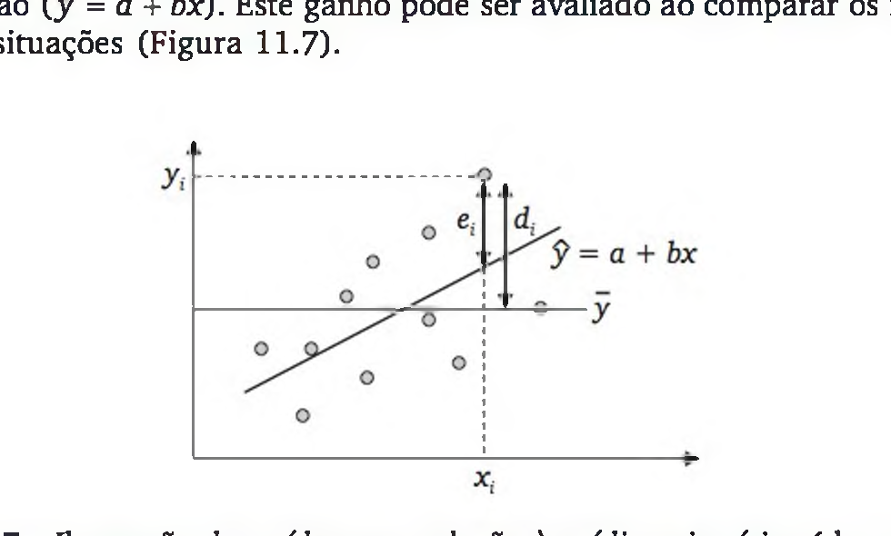

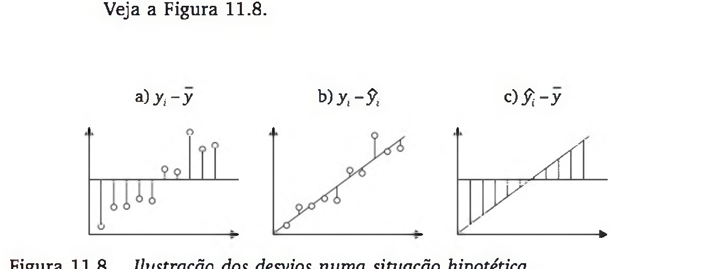

O coeficiente de determinação é:

$$
R^2=\frac{\text{variação explicada}}{\text{variação total}}.
$$

Para o Exemplo 11.2:

| $x_i$ | $y_i$ | $\bar{y}$ | $\hat{y}_i$ | $y_i-\bar{y}$ | $y_i-\hat{y}_i$ | $\hat{y}_i-\bar{y}$ | $(y_i-\bar{y})^2$ | $(y_i-\hat{y}_i)^2$ | $(\hat{y}_i-\bar{y})^2$ |
| ---: | ---: | ---: | ---: | ---: | ---: | ---: | ---: | ---: | ---: |
| 1 | 80,5 | 82,8 | 80,59 | -2,3 | -0,09 | -2,21 | 5,29 | 0,01 | 4,90 |
| 2 | 81,6 | 82,8 | 81,47 | -1,2 | 0,13 | -1,33 | 1,44 | 0,02 | 1,77 |
| 3 | 82,1 | 82,8 | 82,36 | -0,7 | -0,26 | -0,44 | 0,49 | 0,07 | 0,20 |
| 4 | 83,7 | 82,8 | 83,24 | 0,9 | 0,46 | 0,44 | 0,81 | 0,21 | 0,20 |
| 5 | 83,9 | 82,8 | 84,13 | 1,1 | -0,23 | 1,33 | 1,21 | 0,05 | 1,77 |
| 6 | 85,0 | 82,8 | 85,01 | 2,2 | -0,01 | 2,21 | 4,84 | 0,00 | 4,90 |
| **Soma de quadrados** | | | | | | | **14,08** | **0,35** | **13,73** |

$$
R^2=\frac{13{,}73}{14{,}08}=0{,}975.
$$

Tabela geral de Anova da regressão linear simples:

| Fonte de variação | gl | SQ | QM | Razão $F$ |
| --- | ---: | ---: | ---: | ---: |
| Regressão | 1 | $SQR=\sum(\hat{y}_i-\bar{y})^2$ | $QMR=SQR/1$ | $F=QMR/QME$ |
| Erro | $n-2$ | $SQE=\sum(y_i-\hat{y}_i)^2$ | $QME=SQE/(n-2)$ | |
| Total | $n-1$ | $SQT=\sum(y_i-\bar{y})^2$ | $QMT=SQT/(n-1)$ | |

Tabela da Anova para o Exemplo 11.2:

| Fonte de variação | gl | SQ | MQ | Razão $F$ |
| --- | ---: | ---: | ---: | ---: |
| Regressão | 1 | 13,73 | 13,729 | 156,26 |
| Erro | 4 | 0,35 | 0,088 | |
| Total | 5 | 14,08 | | |

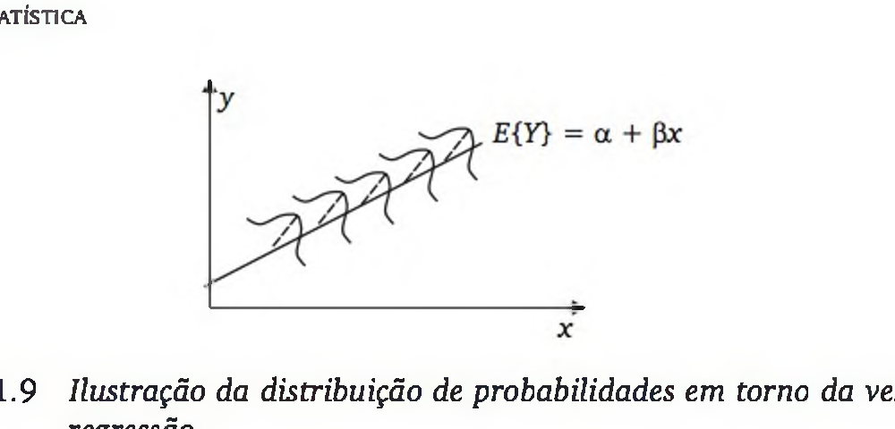

Com nível de significância de 5%, para $gl=1$ e $gl=4$, o valor crítico é $F_c=7{,}71$. Como $F=156{,}26>7{,}71$, rejeita-se $H_0:\beta=0$.

### Exemplo 11.3 - Preço de revenda de automóveis seminovos

O anexo do capítulo contém dados de 142 automóveis seminovos, incluindo modelo, preço de revenda, preço do modelo novo, tempo de uso e quilometragem.

Primeiro, estabelece-se um modelo entre:

- $Y =$ preço de revenda;
- $X =$ preço do correspondente modelo 0 km.

Resultados da regressão simples:

| Estatística de regressão | Valor |
| --- | ---: |
| R múltiplo | 0,889 |
| R-quadrado | 0,791 |
| R-quadrado ajustado | 0,789 |
| Erro padrão | 1778,484 |
| Observações | 142 |

Anova:

| Fonte | SQ | gl | QM | $F$ | Valor $p$ |
| --- | ---: | ---: | ---: | ---: | ---: |
| Regressão | $1{,}67 \times 10^9$ | 1 | $1{,}67 \times 10^9$ | 528,5782 | $2{,}22 \times 10^{-49}$ |
| Resíduo | $4{,}43 \times 10^8$ | 140 | 3163004 | | |
| Total | $2{,}11 \times 10^9$ | 141 | | | |

Coeficientes:

| Termo | Coeficiente | Erro padrão | Estat. $t$ | Valor $p$ | Inferior 95% | Superior 95% |
| --- | ---: | ---: | ---: | ---: | ---: | ---: |
| Interseção | 2654,11 | 431,22 | 6,155 | $7{,}46 \times 10^{-9}$ | 1801,56 | 3506,67 |
| Valor novo | 0,476 | 0,021 | 22,991 | $2{,}22 \times 10^{-49}$ | 0,43 | 0,52 |

Cerca de 79% da variação do preço de revenda pode ser explicada por uma relação linear com o preço do automóvel 0 km.

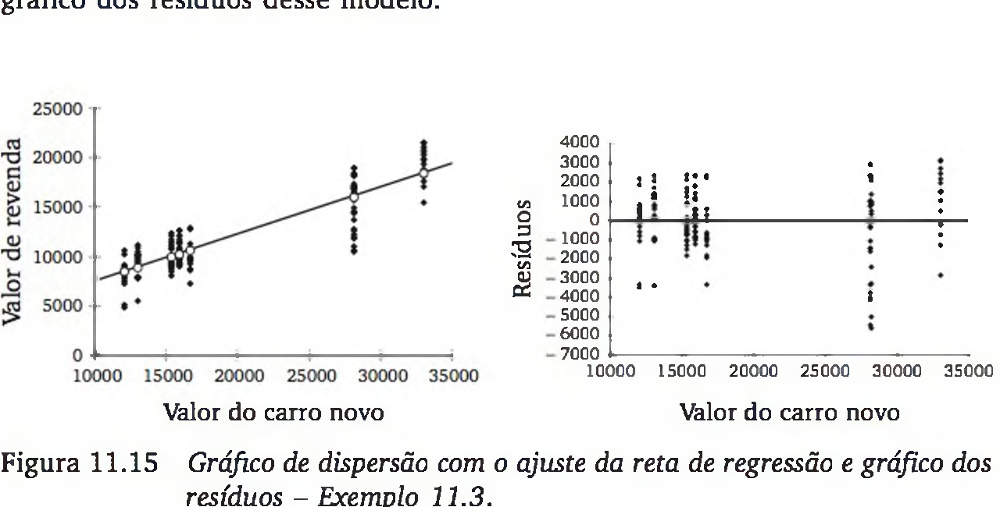

O gráfico sugere que o modelo linear simples não viola fortemente as suposições, embora haja concentração de valores pequenos. Uma transformação logarítmica em $X$ e $Y$ foi tentada, mas reduziu $R^2$ e piorou o gráfico de resíduos; por isso, o modelo original foi mantido.

### Diagnóstico gráfico e transformações

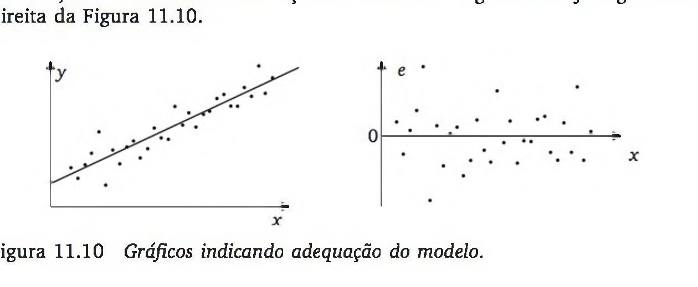

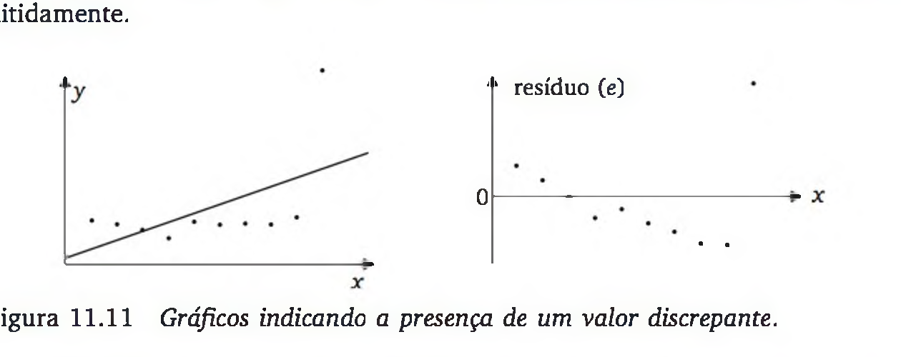

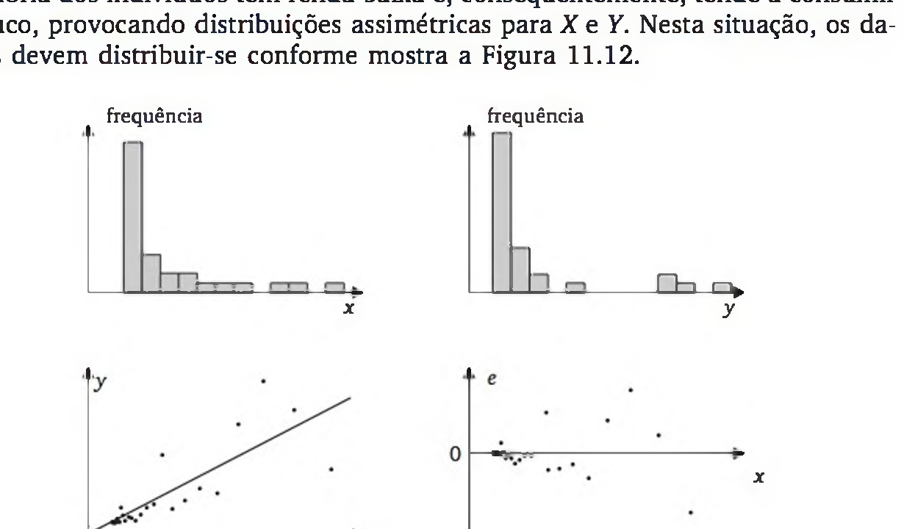

Em situações como a Figura 11.12, recomenda-se aplicar transformação logarítmica em $X$ e $Y$:

$$
\log(y_i)=\alpha+\beta\log(x_i)+\varepsilon_i.
$$

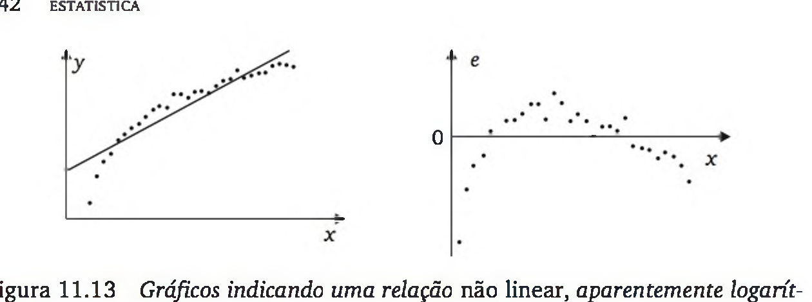

Quando $Y$ cresce rapidamente para valores pequenos de $X$ e lentamente para valores grandes de $X$, pode-se usar:

$$
y_i=\alpha+\beta\log(x_i)+\varepsilon_i.
$$

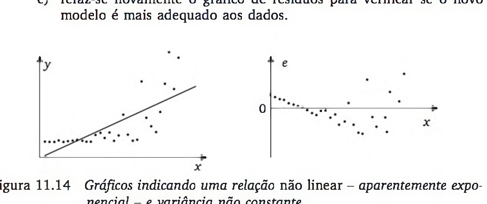

Quando há relação não linear e aumento da variância à medida que $X$ aumenta, recomenda-se transformação logarítmica apenas em $Y$:

$$
\log(y_i)=\alpha+\beta x_i+\varepsilon_i.
$$

### Exemplo 11.5 - Regressão múltipla para preço de revenda

Com os dados dos 142 automóveis, constrói-se um modelo para explicar:

$$
Y=\text{preço de revenda de automóveis seminovos}
$$

em função de:

- $X_1 =$ preço do correspondente modelo 0 km;
- $X_2 =$ tempo de uso, em anos completos;
- $X_3 =$ quilometragem, em milhares de km.

Resultados da regressão múltipla:

| Estatística de regressão | Valor |
| --- | ---: |
| R múltiplo | 0,961 |
| R-quadrado | 0,923 |
| R-quadrado ajustado | 0,921 |
| Erro padrão | 1087 |
| Observações | 142 |

Anova:

| Fonte | gl | SQ | QM | $F$ | Valor $p$ |
| --- | ---: | ---: | ---: | ---: | ---: |
| Regressão | 3 | $1{,}95 \times 10^9$ | $6{,}51 \times 10^8$ | 550,27 | $1{,}52 \times 10^{-76}$ |
| Resíduo | 138 | $1{,}63 \times 10^8$ | 1182186 | | |
| Total | 141 | $2{,}11 \times 10^9$ | | | |

Coeficientes:

| Termo | Coeficiente | Erro padrão | Estat. $t$ | Valor $p$ | Inferior 95% | Superior 95% |
| --- | ---: | ---: | ---: | ---: | ---: | ---: |
| Interseção | 6240,13 | 352,11 | 17,722 | $2{,}25 \times 10^{-37}$ | 5543,89 | 6936,36 |
| Valor novo | 0,48 | 0,01 | 37,448 | $3{,}61 \times 10^{-74}$ | 0,45 | 0,50 |
| Tempo uso | -432,92 | 136,64 | -3,168 | 0,0019 | -703,10 | -162,75 |
| Quilometragem | -45,11 | 9,00 | -5,014 | $1{,}61 \times 10^{-6}$ | -62,90 | -27,32 |

O modelo ajustado é:

$$
\hat{y}=6240+0{,}48x_1-433x_2-45{,}1x_3.
$$

Para um carro cujo preço novo é R$ 16.000,00, com 2 anos de uso e 50 mil quilômetros:

$$
\hat{y}=6240+(0{,}48)(16000)-(433)(2)-(45{,}1)(50)=10779.
$$

Logo, o preço de revenda predito é R$ 10.779,00.

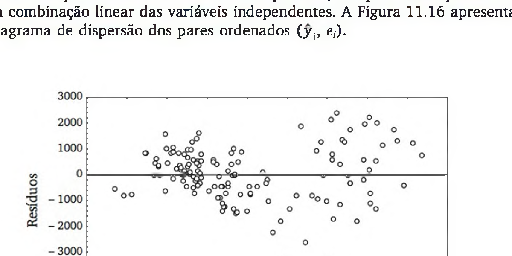

O gráfico de resíduos sugere certo padrão e aumento de dispersão para valores preditos maiores, indicando que uma transformação logarítmica na variável dependente pode tornar o modelo mais adequado.

## Exercícios

### Exercícios da seção 11.2

1. Calcule o coeficiente de correlação de Pearson entre retração linear (%) e resistência mecânica (MPa) para as 5 primeiras observações apresentadas no Exemplo 11.1. Apenas com estas observações, o teste estatístico detecta correlação real entre as duas variáveis?

2. Com respeito aos 23 alunos de uma turma de estatística, foram observadas as variáveis número de faltas e nota final na disciplina. Esses dados acusaram correlação de Pearson $r=-0{,}56$. Comente as frases:

   a) "Como $r=-0{,}56$ (correlação negativa moderada), nenhum aluno com grande número de faltas tirou nota alta."

   b) "Como as duas variáveis são correlacionadas, bastaria usar uma delas como critério de avaliação, pois uma acarreta a outra."

   c) "Os dados observados mostraram uma leve tendência de que a nota final se relaciona inversamente com o número de faltas, ou seja, os alunos frequentadores tiveram, em geral, melhor desempenho nas avaliações do que os alunos que faltaram muito."

3. Sejam $X=$ nota na prova do vestibular de matemática e $Y=$ nota final na disciplina de cálculo. Estas variáveis foram observadas em 20 alunos, ao final do primeiro período letivo de um curso de engenharia:

| $X$ | $Y$ | $X$ | $Y$ | $X$ | $Y$ | $X$ | $Y$ | $X$ | $Y$ |
| ---: | ---: | ---: | ---: | ---: | ---: | ---: | ---: | ---: | ---: |
| 39 | 65 | 43 | 78 | 21 | 52 | 64 | 82 | 65 | 88 |
| 57 | 92 | 47 | 89 | 28 | 73 | 75 | 98 | 47 | 71 |
| 34 | 56 | 52 | 75 | 35 | 50 | 30 | 50 | 28 | 52 |
| 40 | 70 | 70 | 50 | 80 | 90 | 32 | 58 | 67 | 88 |

   a) Calcule a correlação entre a nota no vestibular de matemática e a nota na disciplina de cálculo. Interprete o resultado.

   b) Construa um diagrama de dispersão e verifique se algum aluno foge ao comportamento geral dos demais (ponto discrepante).

   c) Retire o valor discrepante e recalcule o coeficiente de correlação.

   d) Interprete a correlação recalculada e avalie se ela é significativamente diferente de zero.

4. No desenvolvimento computacional de um escalonador, foram realizados testes em 16 condições experimentais diferentes. O desempenho foi observado pela quantidade de trabalho executado em processamento de textos ($X_1$), processamento interativo de dados ($X_2$) e processamento de dados em batch ($X_3$). A matriz de correlações foi:

|  | $X_1$ | $X_2$ | $X_3$ |
| --- | ---: | ---: | ---: |
| $X_1$ | 1,00 | 0,18 | 0,86 |
| $X_2$ | 0,18 | 1,00 | 0,02 |
| $X_3$ | 0,86 | 0,02 | 1,00 |

Que informações podem ser extraídas dessa matriz de correlações? Há evidências de que nas situações em que o desempenho é melhor para um atributo, ele também tende a ser melhor em outro?

### Exercícios da seção 11.3

5. Um administrador de uma grande sorveteria anotou por longo período a temperatura média diária, em °C ($X$), e o volume de vendas diárias de sorvete, em kg ($Y$). Foi ajustada a equação:

$$
\hat{y}=0{,}5+1{,}8x,\qquad R^2=0{,}80.
$$

   a) Qual é o consumo esperado de sorvete num dia de 27°C?

   b) Qual é o incremento esperado nas vendas de sorvete a cada 1°C de aumento da temperatura?

6. No processo de queima de massa cerâmica, avaliou-se o efeito da temperatura do forno ($X$) sobre a resistência mecânica da massa queimada ($Y$). Foram realizados 6 ensaios com níveis de temperatura equidistantes, designados por 1, 2, 3, 4, 5 e 6. Os valores de resistência mecânica (MPa) foram 41, 42, 50, 53, 54 e 60. Pede-se:

   a) As estimativas de $\alpha$ e $\beta$ da equação de regressão $E(Y)=\alpha+\beta x$.

   b) O coeficiente $R^2$.

   c) O desvio padrão dos resíduos, $s_e$.

   d) O teste estatístico $H_0:\beta=0$.

7. A tabela a seguir relaciona os pesos, em centenas de kg, e as taxas de rendimento de combustível em rodovia (km/litro), numa amostra de 10 carros de passeio novos:

| Peso | 12 | 13 | 14 | 14 | 16 | 18 | 19 | 22 | 24 | 26 |
| ---: | ---: | ---: | ---: | ---: | ---: | ---: | ---: | ---: | ---: | ---: |
| Rendimento | 16 | 14 | 14 | 13 | 11 | 12 | 9 | 9 | 8 | 6 |

   a) Calcule o coeficiente de correlação de Pearson.

   b) Considerando o resultado do item (a), como você avalia o relacionamento entre peso e rendimento?

   c) Para estabelecer uma equação de regressão, qual deve ser a variável dependente e qual deve ser a variável independente? Justifique.

   d) Estabeleça a equação de regressão.

   e) Apresente o diagrama de dispersão e a reta de regressão obtida.

   f) Você considera adequado o ajuste do modelo de regressão? Dê uma medida dessa adequação e interprete-a.

   g) Qual é o rendimento esperado para um carro de 2.000 kg? Justifique. Lembrete: os dados de peso estão em centenas de kg.

   h) Você considera seu estudo capaz de predizer o rendimento esperado de um veículo com peso de 7.000 kg? Justifique.

8. Para verificar a viabilidade de incluir resíduos da queima de carvão mineral na composição do cimento, foram feitos ensaios com cimento contendo de 0 a 9% de cinza de carvão e medida a resistência à compressão (MPa), após 28 dias:

| Carvão (%) | 0 | 1 | 2 | 3 | 4 | 5 | 6 | 7 | 8 | 9 |
| ---: | ---: | ---: | ---: | ---: | ---: | ---: | ---: | ---: | ---: | ---: |
| Resistência (MPa) | 38,5 | 40,2 | 42,1 | 37,5 | 41,1 | 36,9 | 38,2 | 36,7 | 39,5 | 35,9 |

   a) Estabeleça a equação de regressão.

   b) Calcule $R^2$.

   c) Teste se o coeficiente angular pode ser zero. Use $\alpha=0{,}05$.

   d) Os resultados mostram evidência de que o uso de cinza de carvão mineral na composição do cimento diminui sua resistência aos 28 dias?

9. Um estudo foi desenvolvido para verificar o quanto o comprimento de um cabo da porta serial de microcomputadores influencia a qualidade da transmissão de dados, medida pelo número de falhas em 100.000 lotes de dados transmitidos (taxa de falha):

| Comprimento do cabo (m) | 8 | 8 | 9 | 9 | 10 | 10 | 11 | 11 | 12 | 12 | 13 | 13 | 14 | 14 | 15 |
| ---: | ---: | ---: | ---: | ---: | ---: | ---: | ---: | ---: | ---: | ---: | ---: | ---: | ---: | ---: | ---: |
| Taxa de falha | 2,2 | 2,1 | 3,0 | 2,9 | 4,1 | 4,5 | 6,2 | 5,9 | 9,8 | 8,7 | 12,5 | 13,1 | 19,3 | 17,4 | 28,2 |

   a) Estabeleça a equação de regressão.

   b) Faça a análise dos resíduos e verifique se o modelo linear é adequado.

   c) Qual é a transformação sugerida pelo gráfico dos resíduos?

   d) Faça uma análise de regressão com os dados transformados.

10. A partir de um levantamento de 397 apartamentos em Criciúma-SC, realizou-se uma regressão entre área total ($m^2$) e valor. Como essas variáveis tinham distribuições assimétricas à direita, foram feitas transformações logarítmicas em ambas antes da regressão. O modelo ajustado foi:

$$
\log_{10}(\text{valor})=1{,}60+1{,}38\log_{10}(\text{área}),
\qquad R^2=0{,}89.
$$

Interprete o valor de $R^2$ e o coeficiente 1,38.
