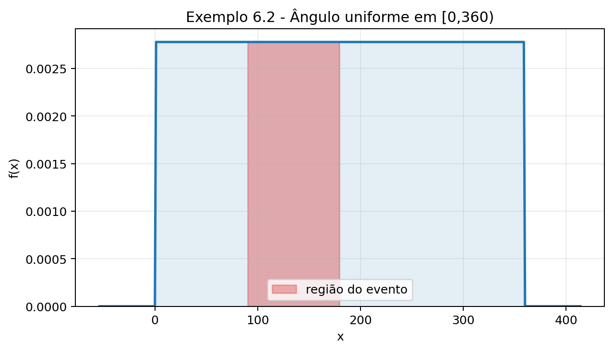
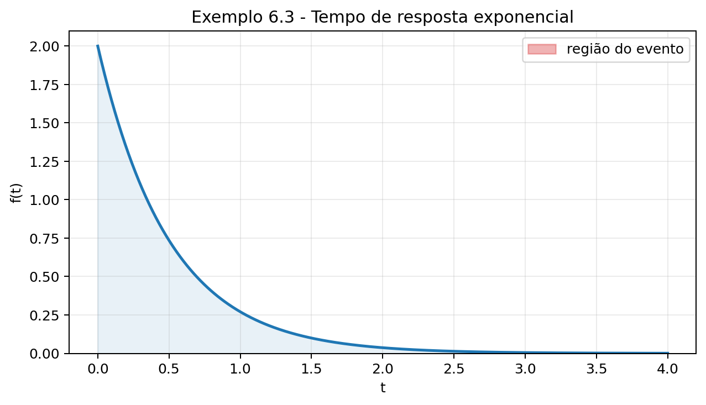
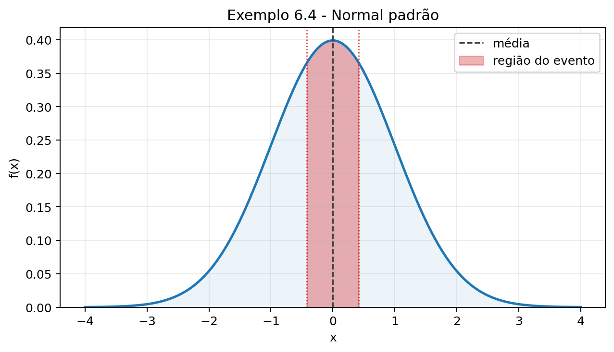
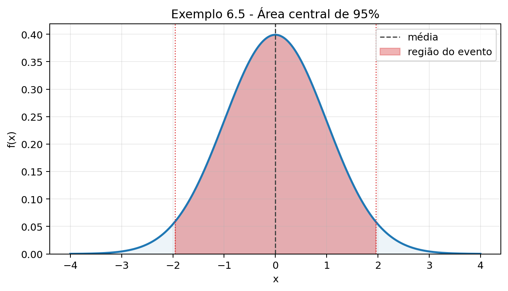
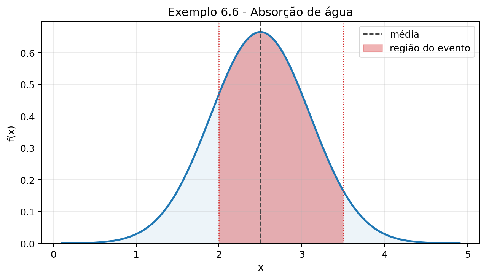
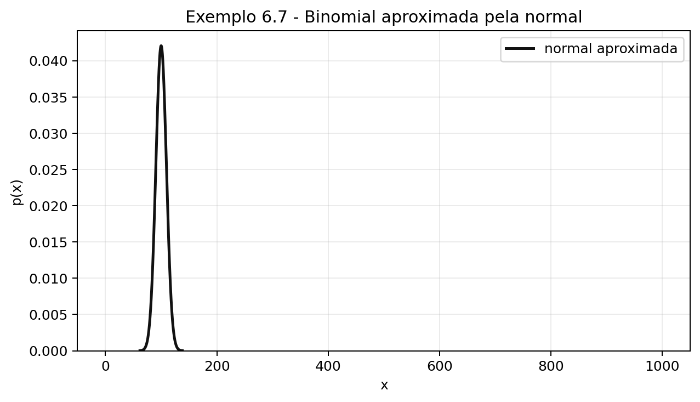
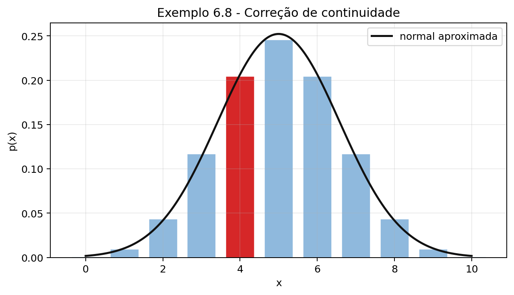

# Barbetta (2010) - Capítulo 6: Variáveis Aleatórias Contínuas

Fonte: `livros/Barbetta_2010  Estatística  para cursos de engenharia e informática.pdf`

Observação didática: os enunciados abaixo foram reescritos em paráfrase fiel, preservando dados, hipóteses, unidades e perguntas necessárias para resolver os exercícios do capítulo.

## Fórmulas úteis

### Variável aleatória contínua

Para uma variável aleatória contínua $X$, as probabilidades são calculadas por áreas sob a função densidade $f(x)$:

Variáveis:

- $X$: variável aleatória contínua;
- $x$: valor possível da variável;
- $a$ e $b$: limites do intervalo de interesse, com $a<b$;
- $f(x)$: função densidade de probabilidade.

$$
P(a < X < b) = \int_a^b f(x)\,dx
\tag{6.1}
$$

A densidade deve satisfazer:

$$
f(x) \ge 0
\tag{6.2}
$$

$$
\int_{-\infty}^{+\infty} f(x)\,dx = 1
\tag{6.3}
$$

### Função de distribuição acumulada

Variáveis:

- $F(x)$: função de distribuição acumulada;
- $X$: variável aleatória contínua;
- $x$: ponto em que a acumulada é avaliada;
- $a$ e $b$: limites de intervalo, com $a<b$;
- $f(x)$: função densidade associada a $F(x)$.

$$
F(x) = P(X \le x)
\tag{6.4}
$$

Para $a < b$:

$$
P(X < a) = F(a)
\tag{6.5}
$$

$$
P(X > b) = 1 - F(b)
\tag{6.6}
$$

$$
P(a < X < b) = F(b) - F(a)
\tag{6.7}
$$

Quando $F$ é derivável:

$$
f(x) = F'(x)
\tag{6.8}
$$

### Valor esperado e variância

Variáveis:

- $X$: variável aleatória contínua;
- $x$: valor possível de $X$;
- $f(x)$: função densidade;
- $E(X)$: valor esperado ou média de $X$;
- $E(X^2)$: valor esperado do quadrado de $X$;
- $V(X)$: variância de $X$.

$$
E(X)=\int_{-\infty}^{+\infty} x f(x)\,dx
\tag{6.9}
$$

$$
E(X^2)=\int_{-\infty}^{+\infty} x^2 f(x)\,dx
\tag{6.10}
$$

$$
V(X)=E(X^2)-[E(X)]^2
\tag{6.11}
$$

### Distribuição uniforme contínua

Se $X \sim U(a,b)$:

Variáveis:

- $X$: variável aleatória com distribuição uniforme contínua;
- $a$: limite inferior do intervalo;
- $b$: limite superior do intervalo, com $b>a$;
- $x$: valor possível de $X$;
- $f(x)$: função densidade;
- $F(x)$: função de distribuição acumulada;
- $E(X)$: valor esperado;
- $V(X)$: variância.

$$
f(x)=\frac{1}{b-a}, \quad a \le x \le b
\tag{6.12}
$$

$$
F(x)=
\begin{cases}
0, & x<a \\
\frac{x-a}{b-a}, & a \le x \le b \\
1, & x>b
\end{cases}
\tag{6.13}
$$

$$
E(X)=\frac{a+b}{2}
\tag{6.14}
$$

$$
V(X)=\frac{(b-a)^2}{12}
\tag{6.15}
$$

### Distribuição exponencial

Se $T$ tem distribuição exponencial com taxa $\lambda > 0$:

Variáveis:

- $T$: variável aleatória contínua que representa tempo, distância ou intervalo até a próxima ocorrência;
- $t$: valor observado de tempo, distância ou intervalo, com $t>0$;
- $\lambda$: taxa média de ocorrência por unidade;
- $F(t)$: função de distribuição acumulada;
- $f(t)$: função densidade;
- $E(T)$: valor esperado;
- $V(T)$: variância;
- $s$: tempo ou intervalo já transcorrido, usado na propriedade de falta de memória.

$$
F(t)=P(T<t)=1-e^{-\lambda t}, \quad t>0
\tag{6.16}
$$

$$
P(T>t)=e^{-\lambda t}
\tag{6.17}
$$

$$
f(t)=\lambda e^{-\lambda t}, \quad t>0
\tag{6.18}
$$

$$
E(T)=\frac{1}{\lambda}
\tag{6.19}
$$

$$
V(T)=\frac{1}{\lambda^2}
\tag{6.20}
$$

A distribuição exponencial tem a propriedade de falta de memória:

$$
P(T>s+t \mid T>s)=P(T>t)
\tag{6.21}
$$

Em termos didáticos, isso significa que, se o evento ainda não ocorreu até o tempo $s$, a probabilidade de esperar mais $t$ unidades é a mesma de esperar $t$ unidades desde o início. Essa hipótese só é adequada quando a taxa de ocorrência pode ser considerada constante ao longo do tempo.

### Distribuição normal

Se $X \sim N(\mu,\sigma^2)$, então:

Variáveis:

- $X$: variável aleatória com distribuição normal;
- $\mu$: média da distribuição normal;
- $\sigma$: desvio padrão, com $\sigma>0$;
- $\sigma^2$: variância;
- $Z$: variável normal padrão;
- $a$ e $b$: limites do intervalo de interesse;
- $n$: número de ensaios em uma binomial;
- $p$: probabilidade de sucesso em uma binomial;
- $\lambda$: parâmetro da Poisson, igual à média e à variância.

$$
Z=\frac{X-\mu}{\sigma} \sim N(0,1)
\tag{6.22}
$$

Assim:

$$
P(a<X<b)=P\left(\frac{a-\mu}{\sigma}<Z<\frac{b-\mu}{\sigma}\right)
\tag{6.23}
$$

Para aproximações normais:

- binomial:

$$
\mu=np
\tag{6.24}
$$

$$
\sigma=\sqrt{np(1-p)}
\tag{6.25}
$$

- Poisson:

$$
\mu=\lambda
\tag{6.26}
$$

$$
\sigma=\sqrt{\lambda}
\tag{6.27}
$$

- use correção de continuidade ao aproximar eventos discretos por uma variável contínua.

## Exemplos

### Exemplo 6.1 - Do discreto ao contínuo no experimento do ponteiro

Considere um círculo dividido em setores e um ponteiro que gira até parar em algum ponto. Quando há poucos setores, a variável "setor apontado" é discreta e pode ser representada por probabilidades pontuais. À medida que o número de setores aumenta, cada probabilidade individual diminui.

No limite, pode-se estudar a variável contínua $X =$ ângulo no qual o ponteiro para, em graus. Se não houver região preferencial, a distribuição é uniforme no intervalo $[0,360)$.

Nesse caso, probabilidades passam a ser calculadas por áreas:

$$
P(a<X<b)=\frac{b-a}{360}
$$

### Exemplo 6.2 - Densidade uniforme para o ângulo do ponteiro

Se $X$ é o ângulo formado pelo ponteiro em relação à horizontal e todos os intervalos de mesma amplitude são igualmente prováveis, então:

$$
f(x)=
\begin{cases}
\frac{1}{360}, & 0 \le x < 360 \\
0, & \text{caso contrário}
\end{cases}
$$

Assim, por exemplo:

$$
P(90<X<180)=\frac{180-90}{360}=\frac{1}{4}
$$

### Exemplo 6.3 - Tempo de resposta exponencial

Seja $T$ o tempo de resposta, em minutos, de uma consulta a um banco de dados. Suponha:

$$
f(t)=
\begin{cases}
2e^{-2t}, & t>0 \\
0, & t<0
\end{cases}
$$

Essa é uma distribuição exponencial com taxa $\lambda=2$.

A probabilidade de a resposta demorar mais do que 3 minutos é:

$$
P(T>3)=e^{-2\cdot 3}=e^{-6}
$$

Também:

$$
P(2<T<3)=P(T>2)-P(T>3)=e^{-4}-e^{-6}
$$

Para essa distribuição:

$$
E(T)=\frac{1}{2}
$$

$$
V(T)=\frac{1}{4}
$$

### Exemplo 6.4 - Áreas na normal padrão

Se $Z \sim N(0,1)$, as probabilidades são áreas sob a curva normal padrão. Usando simetria e tabela de cauda superior:

$$
P(Z<0{,}42)=1-P(Z>0{,}42)
$$

$$
P(Z<-0{,}42)=P(Z>0{,}42)
$$

$$
P(-0{,}42<Z<0{,}42)=1-2P(Z>0{,}42)
$$

### Exemplo 6.5 - Valor crítico central da normal padrão

Deseja-se encontrar $z$ tal que:

$$
P(-z<Z<z)=0{,}95
$$

Como a curva normal padrão é simétrica, cada cauda fica com área:

$$
\frac{1-0{,}95}{2}=0{,}025
$$

Logo, procura-se $z$ tal que $P(Z>z)=0{,}025$, obtendo:

$$
z \approx 1{,}96
$$

### Exemplo 6.6 - Absorção de água em piso cerâmico

Suponha que a absorção de água, em percentual, de certo piso cerâmico seja normal com média $2{,}5$ e desvio padrão $0{,}6$. Queremos calcular:

$$
P(2<X<3{,}5)
$$

Padronizando:

$$
z_1=\frac{2-2{,}5}{0{,}6}\approx -0{,}83
$$

$$
z_2=\frac{3{,}5-2{,}5}{0{,}6}\approx 1{,}67
$$

Logo:

$$
P(2<X<3{,}5)=P(-0{,}83<Z<1{,}67)\approx 0{,}7492
$$

### Exemplo 6.7 - Aproximação normal à binomial

Historicamente, 10% dos pisos cerâmicos de uma linha de produção apresentam defeito leve. Para uma produção diária de 1000 unidades, seja $Y$ o número de unidades com defeito.

Então:

$$
Y \sim \mathrm{Binomial}(1000,0{,}1)
$$

Como $np=100$ e $n(1-p)=900$, a aproximação normal é adequada:

$$
\mu=np=100
$$

$$
\sigma=\sqrt{np(1-p)}=\sqrt{90}
$$

Para estimar $P(Y>120)$, usa-se uma normal com média $100$ e variância $90$.

### Exemplo 6.8 - Correção de continuidade

Se $Y$ é o número de caras em 10 lançamentos de uma moeda honesta, então:

$$
Y \sim \mathrm{Binomial}(10,0{,}5)
$$

Para aproximar $P(Y=4)$ pela normal, não se usa apenas o ponto $4$, pois a normal é contínua. Usa-se o intervalo:

$$
P(Y=4) \approx P(3{,}5<X<4{,}5)
$$

com:

$$
\mu=5
$$

$$
\sigma=\sqrt{2{,}5}
$$

## Exercícios

### Exercícios da seção 6.1

1. Um ponto é escolhido aleatoriamente no intervalo $[0,1]$.

   a) Apresente uma função densidade para esse experimento.

   b) Obtenha a função de distribuição acumulada.

   c) Calcule o valor esperado e a variância.

2. Um sistema computacional executa certa tarefa em um tempo entre 20 e 24 segundos. Suponha distribuição uniforme nesse intervalo, isto é, subintervalos de mesma amplitude têm a mesma probabilidade.

   a) Descreva graficamente e algebricamente a função densidade.

   b) Calcule $P(X>23)$.

   c) Calcule $E(X)$.

   d) Calcule $V(X)$.

3. Retome o exercício anterior, mas agora suponha que tempos próximos de 22 segundos sejam mais prováveis, com densidade simétrica, linearmente crescente até 22 e linearmente decrescente até 24.

   a) Descreva graficamente e algebricamente a função densidade.

   b) Calcule $P(X>23)$.

   c) Calcule $E(X)$.

   d) Calcule $V(X)$.

   e) Compare os resultados com os do exercício uniforme. As diferenças são razoáveis?

4. Seja $X$ uma variável aleatória com função acumulada:

$$
F(x)=
\begin{cases}
1-e^{-x}, & x>0 \\
0, & x<0
\end{cases}
$$

   Obtenha a função densidade de $X$.

5. Seja $X$ uma variável aleatória com densidade:

$$
f(x)=
\begin{cases}
x, & 0<x<1 \\
2-x, & 1<x<2 \\
0, & \text{caso contrário}
\end{cases}
$$

   Calcule:

   a) $P(0<X<1/2)$.

   b) $P(0<X<1)$.

   c) $P(1/3<X<3/2)$.

   d) $E(X)$.

   e) $V(X)$.

### Exercícios da seção 6.2.2

6. O tempo de vida, em horas, de um transistor segue distribuição exponencial. O tempo médio de vida é 500 horas.

   a) Calcule a probabilidade de o transistor durar mais do que 500 horas.

   b) Calcule a probabilidade de durar entre 300 e 1000 horas.

   c) Sabendo que o transistor já durou 500 horas, calcule a probabilidade de durar mais 500 horas.

7. Mostre, usando probabilidade condicional, que para $s,t>0$ e $T$ exponencial vale:

$$
P(T>s+t \mid T>s)=P(T>t)
$$

   Explique por que essa propriedade é chamada de falta de memória e por que pode ser inadequada para itens sujeitos à fadiga.

### Exercícios da seção 6.2.3

8. Seja $Z \sim N(0,1)$. Calcule:

   a) $P(Z>1{,}65)$.

   b) $P(Z<1{,}65)$.

   c) $P(-1<Z<1)$.

   d) $P(-2<Z<2)$.

   e) $P(-3<Z<3)$.

   f) $P(Z>6)$.

   g) O valor de $z$ tal que $P(-z<Z<z)=0{,}90$.

   h) O valor de $z$ tal que $P(-z<Z<z)=0{,}99$.

9. O tempo de resposta de um algoritmo segue distribuição normal com média 23 segundos e desvio padrão 4 segundos.

   a) Calcule a probabilidade de o tempo de resposta ser menor do que 25 segundos.

   b) Calcule a probabilidade de o tempo ficar entre 20 e 30 segundos.

10. O peso líquido de certo produto tem média 900 g e desvio padrão 10 g. A embalagem tem média 100 g e desvio padrão 4 g. Suponha independência e normalidade.

   a) Calcule a probabilidade de o peso bruto ser superior a 1020 g.

   b) Calcule a probabilidade de o peso bruto estar entre 980 g e 1020 g.

### Exercícios da seção 6.3

11. De um lote de produtos manufaturados, extraem-se 100 itens ao acaso. Suponha que 10% dos itens sejam defeituosos.

   a) Calcule a probabilidade de 12 itens serem defeituosos, usando aproximação normal.

   b) Calcule a probabilidade de mais do que 12 itens serem defeituosos, usando aproximação normal.

12. Uma empresa de auxílio à lista telefônica recebe, em média, sete solicitações por minuto, segundo uma distribuição de Poisson. Calcule a probabilidade de ocorrerem mais de 80 solicitações nos próximos 10 minutos, usando aproximação normal.

### Exercícios complementares

13. O setor de manutenção de uma empresa constatou que um equipamento apresenta, em média, 0,75 falha por ano. O tempo entre falhas segue distribuição exponencial. Calcule a probabilidade de o equipamento não falhar no próximo ano.

14. A vida útil de certo componente eletrônico tem média de 10.000 horas e distribuição exponencial. Qual é a porcentagem esperada de componentes que falharão antes de 10.000 horas?

15. A vida útil de certo componente eletrônico tem média de 10.000 horas e distribuição exponencial. Após quantas horas se espera que 25% dos componentes tenham falhado?

16. Na fabricação de fios de linha para costura, ocorre em média um defeito a cada 100 metros, segundo uma distribuição de Poisson.

   a) Calcule a probabilidade de o próximo defeito ocorrer após 120 metros.

   b) Calcule quantos metros podem ser percorridos para que a probabilidade de aparecer algum defeito seja 10%.

17. Em um laticínio, a temperatura do pasteurizador deveria ser 75°C. Temperaturas abaixo de 70°C podem ser problemáticas. Observações indicam que a temperatura segue distribuição normal com média 75,4°C e desvio padrão 2,2°C.

   a) Calcule a probabilidade de a temperatura ficar abaixo de 70°C.

   b) Em 500 utilizações, calcule aproximadamente a probabilidade de mais de cinco temperaturas ficarem abaixo de 70°C.

18. O tempo para um sistema computacional executar uma tarefa segue distribuição normal com média 320 segundos e desvio padrão 7 segundos.

   a) Calcule a probabilidade de a tarefa ser executada entre 310 e 330 segundos.

   b) Se a tarefa for executada 200 vezes, calcule a probabilidade de ela demorar mais de 325 segundos em pelo menos 50 vezes.

19. Um exame de múltipla escolha tem questões com quatro alternativas cada uma. Para aprovação, é necessário acertar pelo menos 50% das questões.

   a) Para um exame com 10 questões, calcule a probabilidade de aprovação de um candidato que responde apenas por palpite.

   b) Repita para um exame com 100 questões.

20. Em horário de maior movimento, um sistema de banco de dados recebe, em média, 100 requisições por minuto, segundo uma distribuição de Poisson. Calcule a probabilidade de ocorrerem mais de 120 requisições no próximo minuto, usando aproximação normal com correção de continuidade.

21. Os dados históricos de uma rede de computadores sugerem que as conexões, em horário normal, seguem uma distribuição de Poisson com média de cinco conexões por minuto. Calcule $t_0$ tal que haja probabilidade 0,90 de ocorrer ao menos uma conexão antes de $t_0$.

22. O padrão de qualidade recomenda que pontos impressos por uma impressora tenham diâmetro entre 3,7 mm e 4,3 mm. A impressora produz pontos com diâmetro médio 4 mm e desvio padrão 0,19 mm. Suponha distribuição normal.

   a) Calcule a probabilidade de um ponto estar dentro do padrão.

   b) Calcule qual deveria ser o desvio padrão para que essa probabilidade fosse 95%.

23. A resistência à compressão de certo cimento segue distribuição normal com média 5800 kg/cm² e desvio padrão 180 kg/cm².

   a) Calcule a probabilidade de resistência inferior a 5600 kg/cm².

   b) Calcule a probabilidade de resistência entre 5600 kg/cm² e 5950 kg/cm².

   c) Calcule a probabilidade de resistência superior a 6000 kg/cm², sabendo que já resistiu a 5600 kg/cm².

   d) Para garantir 95% de probabilidade de resistência acima de certo valor, determine o valor máximo dessa pressão.

24. Uma empresa fabrica dois tipos de monitores de vídeo. As durabilidades seguem distribuições normais:

| Monitor | Média (anos) | Desvio padrão (anos) | Garantia | Lucro se não falha | Perda se falha na garantia |
| --- | ---: | ---: | ---: | ---: | ---: |
| M1 | 6 | 2,3 | 2 anos | R$ 100,00 | R$ 300,00 |
| M2 | 8 | 2,8 | 3 anos | R$ 200,00 | R$ 800,00 |

   Em média, qual monitor gera maior lucro?
