# Respostas dos exercícios de Barbetta (2010), capítulo 6

Fonte dos enunciados: `exs/und2/barbetta_cap6.md`

Conferência com o gabarito do livro: páginas 358-359 do PDF, seção "Capítulo 6".

Observações de conferência:

- Exercício 8(b): o OCR do gabarito indicou `-0,9505`, mas o valor coerente para $P(Z<1{,}65)$ é $0{,}9505$.
- Exercício 8(e): o resultado esperado é aproximadamente $0{,}9974$; o valor aparece deslocado no OCR do gabarito.
- Exercício 16 não apareceu claramente no trecho de gabarito extraído; a solução abaixo foi calculada pelas fórmulas do capítulo.
- Exercícios 17(b), 18(b) e 24 podem apresentar pequenas diferenças conforme o uso de tabela normal arredondada ou cálculo computacional.

## Fórmulas usadas

### Distribuição uniforme contínua

Se $X \sim U(a,b)$:

$$
f(x)=\frac{1}{b-a}, \quad a \le x \le b
$$

$$
E(X)=\frac{a+b}{2}
$$

$$
V(X)=\frac{(b-a)^2}{12}
$$

### Distribuição exponencial

Se $T \sim \operatorname{Exponencial}(\lambda)$:

$$
P(T>t)=e^{-\lambda t}
$$

$$
P(T<t)=1-e^{-\lambda t}
$$

$$
E(T)=\frac{1}{\lambda}
$$

$$
V(T)=\frac{1}{\lambda^2}
$$

### Distribuição normal

Se $X \sim N(\mu,\sigma^2)$:

$$
Z=\frac{X-\mu}{\sigma}
$$

### Aproximação normal

Para $Y \sim \operatorname{Binomial}(n,p)$:

$$
\mu=np
$$

$$
\sigma=\sqrt{np(1-p)}
$$

Para $Y \sim \operatorname{Poisson}(\lambda)$:

$$
\mu=\lambda
$$

$$
\sigma=\sqrt{\lambda}
$$

Ao aproximar variável discreta por normal, usa-se correção de continuidade.

## Respostas dos exemplos

### Exemplo 6.1

Quando o número de setores do círculo aumenta indefinidamente, a variável "setor apontado" deixa de ser conveniente como variável discreta. A variável contínua natural passa a ser o ângulo $X$.

Para variável contínua:

$$
P(X=x)=0
$$

Probabilidades relevantes são probabilidades de intervalos.

### Exemplo 6.2

Se o ponteiro não tem direção preferencial:

$$
X \sim U(0,360)
$$

Logo:

$$
f(x)=\frac{1}{360}, \quad 0 \le x < 360
$$

e, para $0 \le a < b < 360$:

$$
P(a<X<b)=\frac{b-a}{360}
$$

### Exemplo 6.3

Temos $T \sim \operatorname{Exponencial}(2)$.

$$
P(T>3)=e^{-2\cdot 3}=e^{-6}=0{,}002479
$$

$$
P(2<T<3)=e^{-4}-e^{-6}=0{,}0158
$$

$$
E(T)=\frac{1}{2}=0{,}5
$$

$$
V(T)=\frac{1}{2^2}=0{,}25
$$

### Exemplo 6.4

Para $Z \sim N(0,1)$:

$$
P(Z<0{,}42)=0{,}6628
$$

$$
P(Z<-0{,}42)=0{,}3372
$$

$$
P(-0{,}42<Z<0{,}42)=0{,}3256
$$

### Exemplo 6.5

Queremos:

$$
P(-z<Z<z)=0{,}95
$$

Cada cauda tem área $0{,}025$. Pela tabela normal:

$$
z=1{,}96
$$

### Exemplo 6.6

Temos $X \sim N(2{,}5,0{,}6^2)$.

$$
z_1=\frac{2-2{,}5}{0{,}6}=-0{,}83
$$

$$
z_2=\frac{3{,}5-2{,}5}{0{,}6}=1{,}67
$$

Logo:

$$
P(2<X<3{,}5)=P(-0{,}83<Z<1{,}67)=0{,}7492
$$

### Exemplo 6.7

Para $Y \sim \operatorname{Binomial}(1000,0{,}1)$:

$$
\mu=np=100
$$

$$
\sigma=\sqrt{np(1-p)}=\sqrt{90}
$$

Sem correção de continuidade, como apresentado no exemplo:

$$
z=\frac{120-100}{\sqrt{90}}=2{,}11
$$

$$
P(Y>120)\approx P(Z>2{,}11)=0{,}0174
$$

### Exemplo 6.8

Para $Y \sim \operatorname{Binomial}(10,0{,}5)$:

$$
\mu=5
$$

$$
\sigma=\sqrt{2{,}5}
$$

Com correção de continuidade:

$$
P(Y=4)\approx P(3{,}5<X<4{,}5)
$$

Padronizando:

$$
z_1=\frac{3{,}5-5}{\sqrt{2{,}5}}=-0{,}95
$$

$$
z_2=\frac{4{,}5-5}{\sqrt{2{,}5}}=-0{,}32
$$

$$
P(Y=4)\approx P(-0{,}95<Z<-0{,}32)=0{,}2034
$$

## Exercício 1

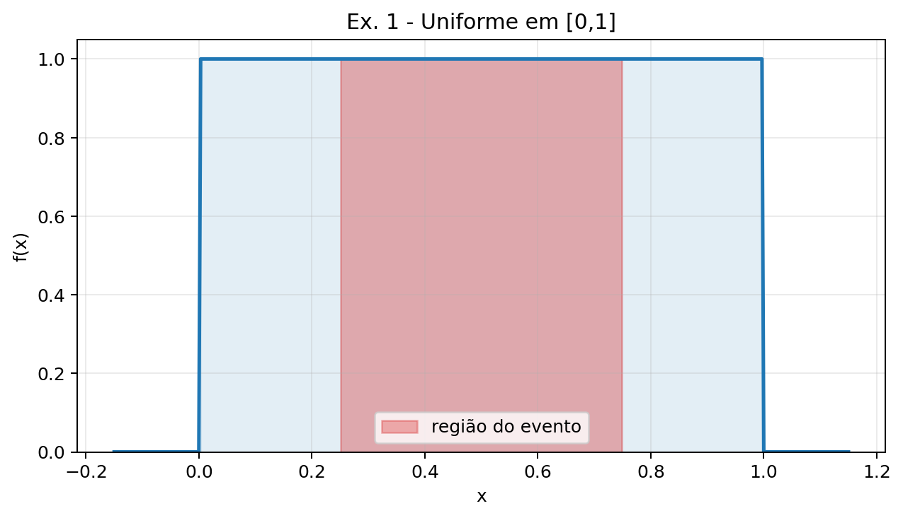

Como o ponto é escolhido aleatoriamente em $[0,1]$, temos $X \sim U(0,1)$.

### a)

$$
f(x)=
\begin{cases}
1, & 0 \le x \le 1 \\
0, & \text{caso contrário}
\end{cases}
$$

### b)

$$
F(x)=
\begin{cases}
0, & x<0 \\
x, & 0 \le x \le 1 \\
1, & x>1
\end{cases}
$$

### c)

$$
E(X)=\frac{0+1}{2}=\frac{1}{2}
$$

$$
V(X)=\frac{(1-0)^2}{12}=\frac{1}{12}
$$

## Exercício 2

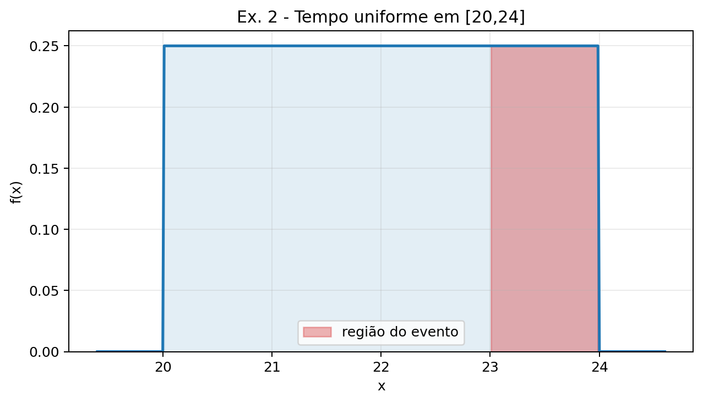

Temos $X \sim U(20,24)$.

### a)

$$
f(x)=
\begin{cases}
\frac{1}{4}, & 20 \le x \le 24 \\
0, & \text{caso contrário}
\end{cases}
$$

Graficamente, a densidade é um retângulo de base 4 e altura $1/4$.

### b)

$$
P(X>23)=\frac{24-23}{24-20}=\frac{1}{4}=0{,}25
$$

### c)

$$
E(X)=\frac{20+24}{2}=22
$$

### d)

$$
V(X)=\frac{(24-20)^2}{12}=\frac{16}{12}=\frac{4}{3}
$$

## Exercício 3

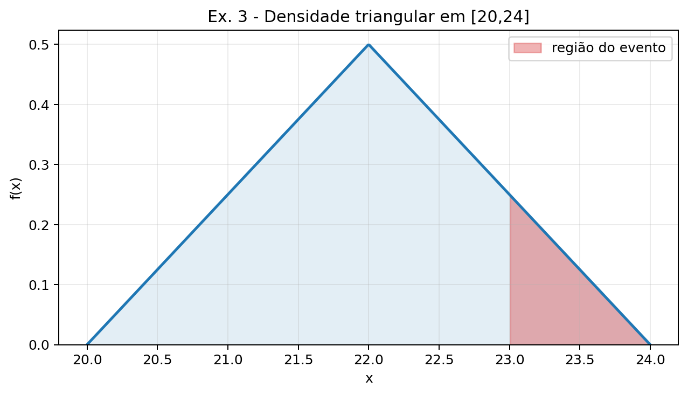

A densidade triangular simétrica em $[20,24]$, com pico em $22$, tem altura máxima $1/2$, pois a área do triângulo deve ser 1.

### a)

$$
f(x)=
\begin{cases}
\frac{x-20}{4}, & 20<x<22 \\
\frac{24-x}{4}, & 22<x<24 \\
0, & \text{caso contrário}
\end{cases}
$$

Graficamente, a densidade é um triângulo com base de 20 a 24 e vértice em $(22,1/2)$.

### b)

Para $23<X<24$, a área é um pequeno triângulo de base 1 e altura $1/4$:

$$
P(X>23)=\frac{1\cdot (1/4)}{2}=\frac{1}{8}=0{,}125
$$

### c)

Por simetria:

$$
E(X)=22
$$

### d)

Para uma distribuição triangular simétrica com extremos 20 e 24:

$$
V(X)=\frac{(24-20)^2}{24}=\frac{16}{24}=\frac{2}{3}
$$

### e)

A média é igual à do caso uniforme, pois ambas as distribuições são simétricas em torno de 22. A variância é menor no caso triangular, pois há maior concentração de probabilidade perto de 22. Também é razoável que $P(X>23)$ seja menor que na uniforme, pois a densidade diminui na extremidade direita.

## Exercício 4

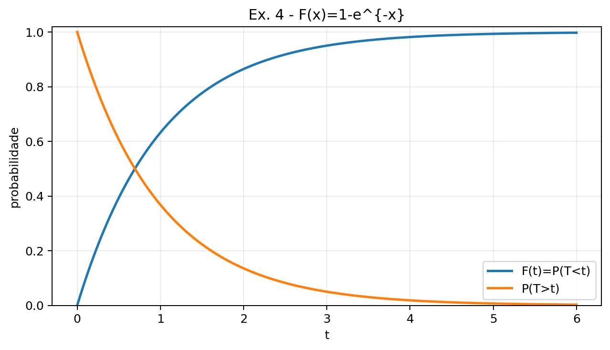

A densidade é a derivada da acumulada:

$$
F(x)=1-e^{-x}, \quad x>0
$$

Logo:

$$
f(x)=F'(x)=e^{-x}, \quad x>0
$$

Assim:

$$
f(x)=
\begin{cases}
e^{-x}, & x>0 \\
0, & x<0
\end{cases}
$$

## Exercício 5

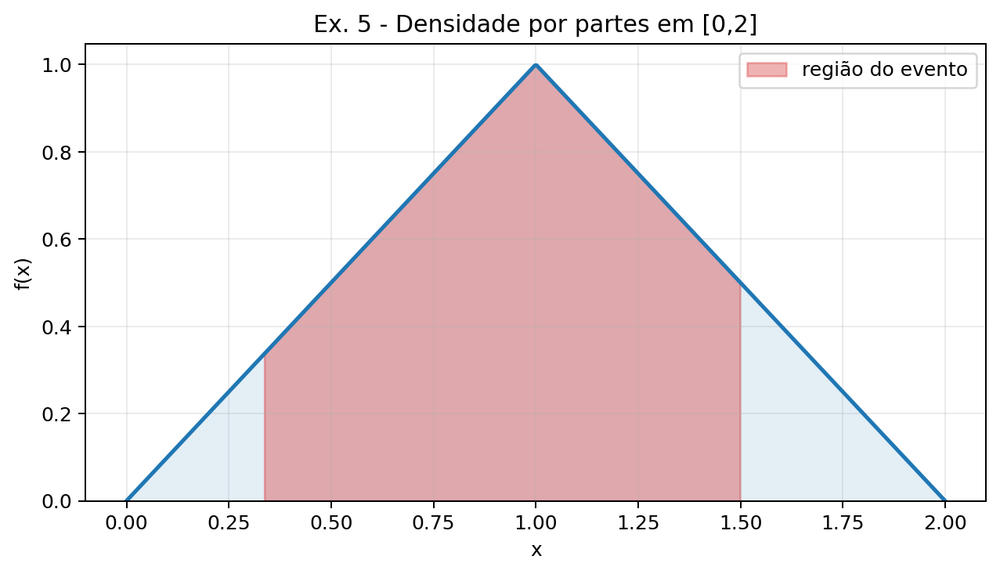

A densidade é:

$$
f(x)=
\begin{cases}
x, & 0<x<1 \\
2-x, & 1<x<2 \\
0, & \text{caso contrário}
\end{cases}
$$

### a)

$$
P(0<X<1/2)=\int_0^{1/2}x\,dx
$$

$$
P(0<X<1/2)=\left[\frac{x^2}{2}\right]_0^{1/2}
=\frac{1}{8}
$$

### b)

$$
P(0<X<1)=\int_0^1 x\,dx=\frac{1}{2}
$$

### c)

$$
P(1/3<X<3/2)
=\int_{1/3}^{1}x\,dx+\int_1^{3/2}(2-x)\,dx
$$

Primeira parte:

$$
\int_{1/3}^{1}x\,dx
=\left[\frac{x^2}{2}\right]_{1/3}^{1}
=\frac{1}{2}-\frac{1}{18}
=\frac{4}{9}
$$

Segunda parte:

$$
\int_1^{3/2}(2-x)\,dx
=\left[2x-\frac{x^2}{2}\right]_1^{3/2}
=\frac{15}{8}-\frac{3}{2}
=\frac{3}{8}
$$

Logo:

$$
P(1/3<X<3/2)=\frac{4}{9}+\frac{3}{8}
=\frac{59}{72}
$$

### d)

Por simetria da densidade em torno de 1:

$$
E(X)=1
$$

### e)

Esta é uma distribuição triangular simétrica em $[0,2]$. Assim:

$$
V(X)=\frac{(2-0)^2}{24}=\frac{1}{6}
$$

## Exercício 6

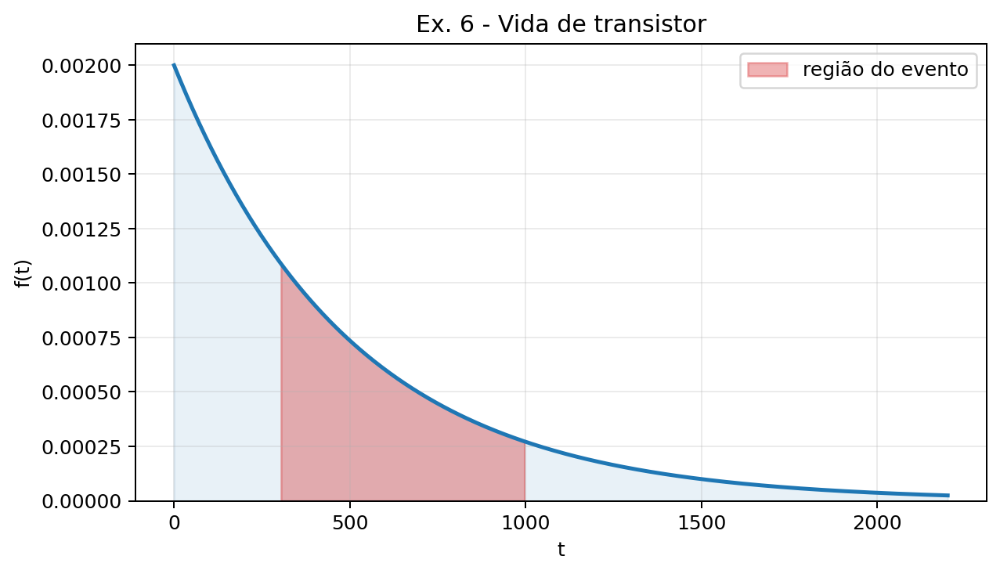

Como $E(T)=500$:

$$
\lambda=\frac{1}{500}
$$

### a)

$$
P(T>500)=e^{-(1/500)500}=e^{-1}=0{,}3679
$$

### b)

$$
P(300<T<1000)=P(T>300)-P(T>1000)
$$

$$
P(300<T<1000)=e^{-300/500}-e^{-1000/500}
$$

$$
P(300<T<1000)=e^{-0{,}6}-e^{-2}=0{,}4135
$$

### c)

Pela falta de memória da exponencial:

$$
P(T>1000 \mid T>500)=P(T>500)=e^{-1}=0{,}3679
$$

## Exercício 7

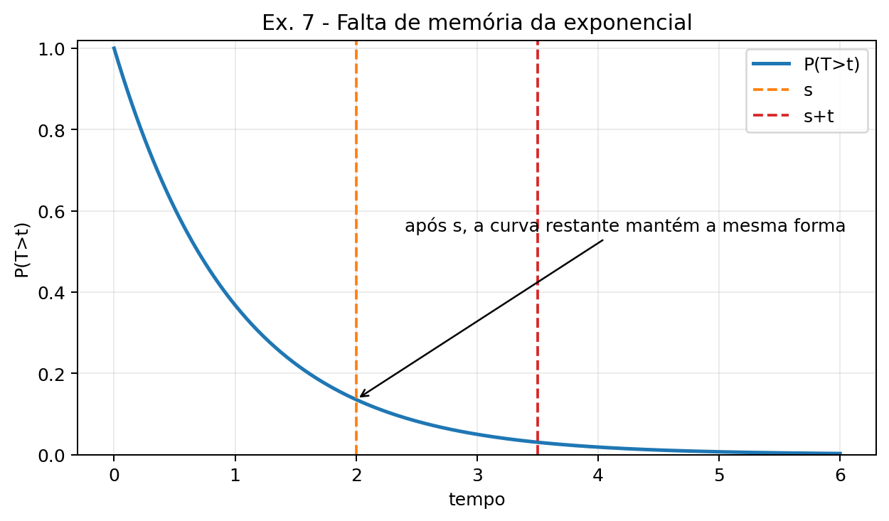

Pela definição de probabilidade condicional:

$$
P(T>s+t \mid T>s)=\frac{P(T>s+t \cap T>s)}{P(T>s)}
$$

Como $s,t>0$, o evento $\{T>s+t\}$ está contido em $\{T>s\}$. Logo:

$$
P(T>s+t \mid T>s)=\frac{P(T>s+t)}{P(T>s)}
$$

Para $T$ exponencial:

$$
P(T>u)=e^{-\lambda u}
$$

Então:

$$
P(T>s+t \mid T>s)
=\frac{e^{-\lambda(s+t)}}{e^{-\lambda s}}
=e^{-\lambda t}
$$

Mas:

$$
P(T>t)=e^{-\lambda t}
$$

Portanto:

$$
P(T>s+t \mid T>s)=P(T>t)
$$

Essa propriedade é chamada de falta de memória porque o tempo já transcorrido não altera a probabilidade restante. Isso pode ser inadequado para itens sujeitos à fadiga, pois nesses casos o risco tende a mudar com o envelhecimento.

## Exercício 8

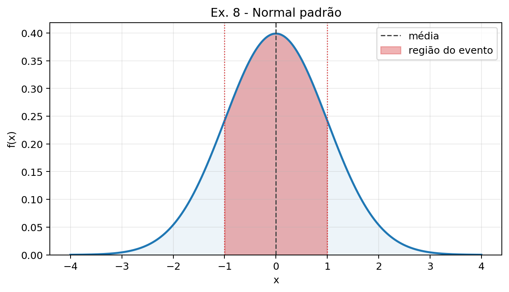

Se $Z \sim N(0,1)$:

### a)

$$
P(Z>1{,}65)=0{,}0495
$$

### b)

$$
P(Z<1{,}65)=1-P(Z>1{,}65)=1-0{,}0495=0{,}9505
$$

### c)

$$
P(-1<Z<1)=0{,}6826
$$

### d)

$$
P(-2<Z<2)=0{,}955
$$

### e)

$$
P(-3<Z<3)=0{,}9974
$$

### f)

$$
P(Z>6)\approx 0
$$

### g)

Queremos $P(-z<Z<z)=0{,}90$. Cada cauda tem área $0{,}05$.

$$
z\approx 1{,}65
$$

### h)

Queremos $P(-z<Z<z)=0{,}99$. Cada cauda tem área $0{,}005$.

$$
z\approx 2{,}58
$$

## Exercício 9

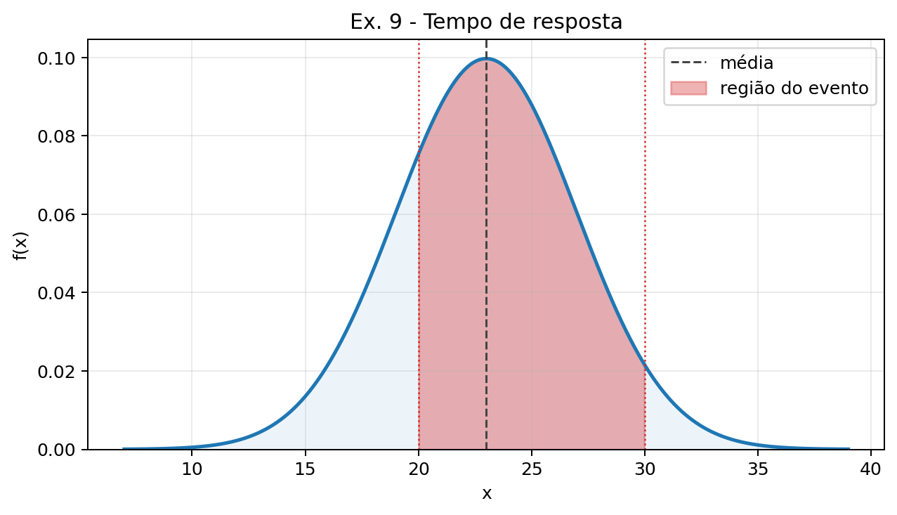

Temos $X \sim N(23,4^2)$.

### a)

$$
z=\frac{25-23}{4}=0{,}5
$$

$$
P(X<25)=P(Z<0{,}5)=0{,}6915
$$

### b)

$$
z_1=\frac{20-23}{4}=-0{,}75
$$

$$
z_2=\frac{30-23}{4}=1{,}75
$$

$$
P(20<X<30)=P(-0{,}75<Z<1{,}75)=0{,}7333
$$

## Exercício 10

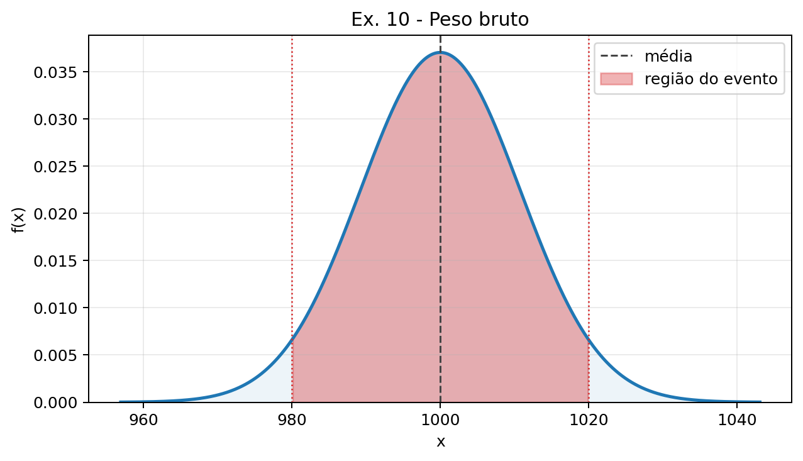

Seja $B=X_1+X_2$ o peso bruto. Como $X_1$ e $X_2$ são normais independentes:

$$
B \sim N(900+100, 10^2+4^2)
$$

Logo:

$$
\mu_B=1000
$$

$$
\sigma_B=\sqrt{116}=10{,}7703
$$

### a)

$$
z=\frac{1020-1000}{\sqrt{116}}=1{,}86
$$

$$
P(B>1020)=P(Z>1{,}86)=0{,}0314
$$

### b)

$$
z_1=\frac{980-1000}{\sqrt{116}}=-1{,}86
$$

$$
z_2=\frac{1020-1000}{\sqrt{116}}=1{,}86
$$

$$
P(980<B<1020)=P(-1{,}86<Z<1{,}86)=0{,}9372
$$

## Exercício 11

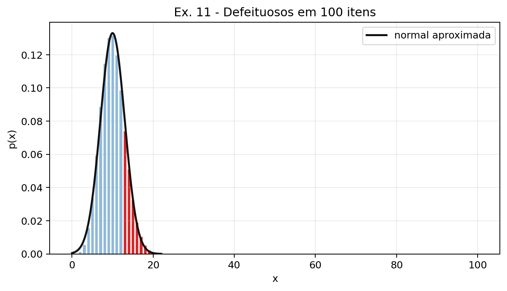

Seja $Y$ o número de defeituosos. Temos $Y \sim \operatorname{Binomial}(100,0{,}1)$.

Como:

$$
np=10
$$

$$
n(1-p)=90
$$

usamos aproximação normal com:

$$
\mu=10
$$

$$
\sigma=\sqrt{100\cdot 0{,}1\cdot 0{,}9}=3
$$

### a)

Com correção de continuidade:

$$
P(Y=12)\approx P(11{,}5<X<12{,}5)
$$

$$
z_1=\frac{11{,}5-10}{3}=0{,}50
$$

$$
z_2=\frac{12{,}5-10}{3}=0{,}83
$$

$$
P(Y=12)\approx P(0{,}50<Z<0{,}83)=0{,}1052
$$

### b)

$$
P(Y>12)\approx P(X>12{,}5)
$$

$$
z=\frac{12{,}5-10}{3}=0{,}83
$$

$$
P(Y>12)\approx P(Z>0{,}83)=0{,}2033
$$

## Exercício 12

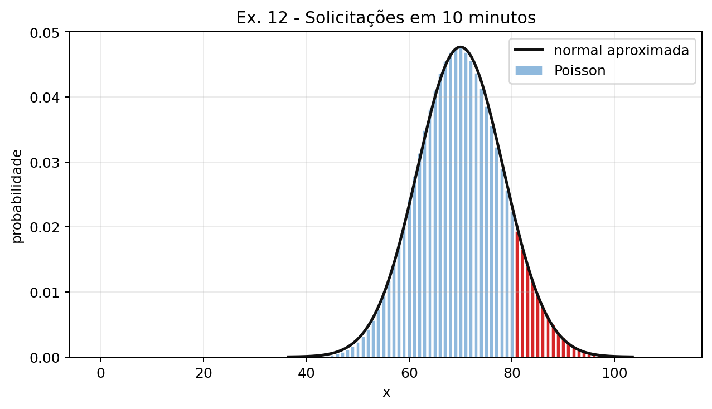

Nos próximos 10 minutos:

$$
\lambda=7\cdot 10=70
$$

Usando aproximação normal à Poisson:

$$
\mu=70
$$

$$
\sigma=\sqrt{70}
$$

Com correção de continuidade:

$$
P(Y>80)\approx P(X>80{,}5)
$$

$$
z=\frac{80{,}5-70}{\sqrt{70}}=1{,}26
$$

$$
P(Y>80)\approx P(Z>1{,}26)=0{,}1056
$$

## Exercício 13

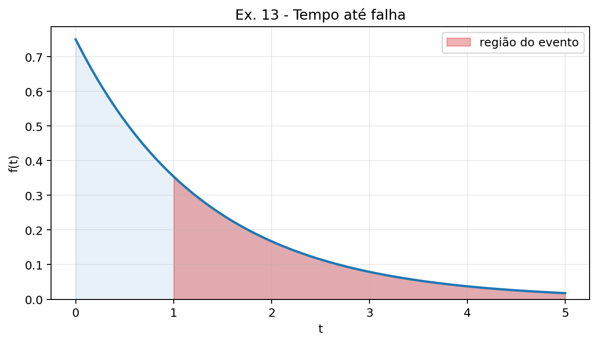

A taxa é:

$$
\lambda=0{,}75
$$

Queremos a probabilidade de não falhar no próximo ano:

$$
P(T>1)=e^{-0{,}75\cdot 1}=0{,}4724
$$

## Exercício 14

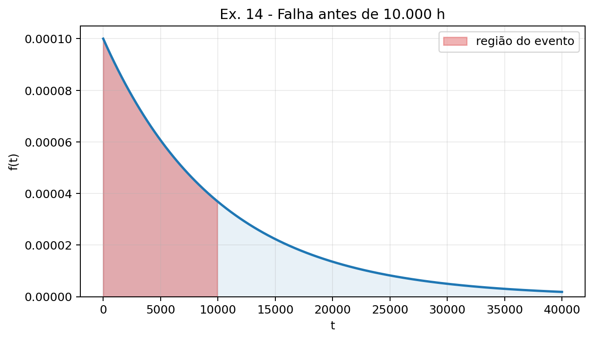

Como a vida média é 10.000 horas:

$$
\lambda=\frac{1}{10000}
$$

Queremos:

$$
P(T<10000)=1-e^{-10000/10000}
$$

$$
P(T<10000)=1-e^{-1}=0{,}6321
$$

Assim, espera-se que cerca de 63,21% dos componentes falhem antes de 10.000 horas.

## Exercício 15

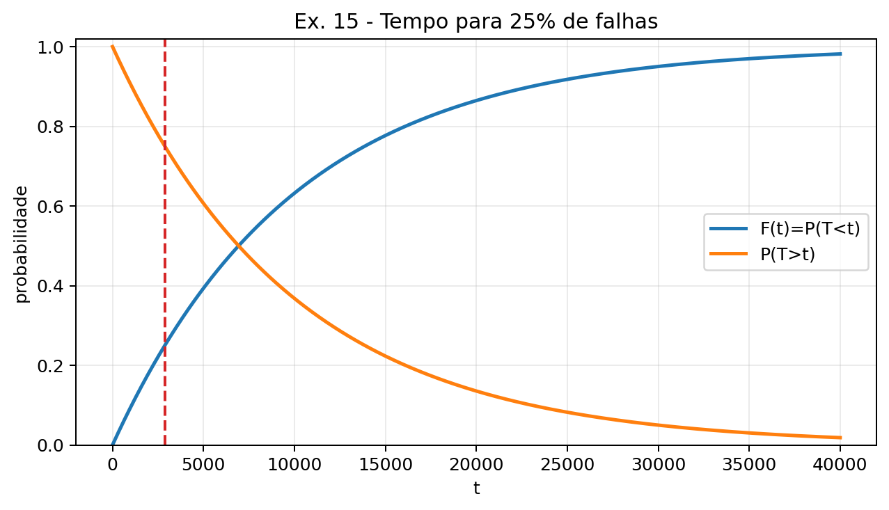

Queremos $t$ tal que:

$$
P(T<t)=0{,}25
$$

Como:

$$
P(T<t)=1-e^{-t/10000}
$$

temos:

$$
1-e^{-t/10000}=0{,}25
$$

$$
e^{-t/10000}=0{,}75
$$

$$
t=-10000\ln(0{,}75)
$$

$$
t=2876{,}82
$$

Arredondando:

$$
t\approx 2877 \text{ horas}
$$

## Exercício 16

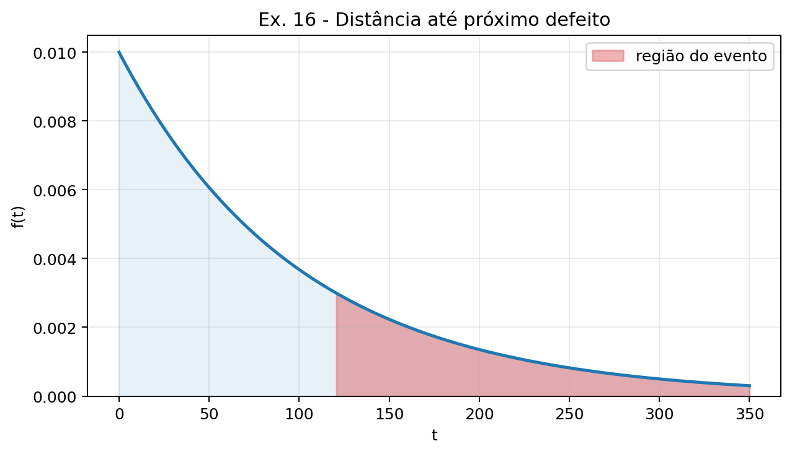

Como ocorre em média um defeito a cada 100 metros, a taxa é:

$$
\lambda=\frac{1}{100}=0{,}01
$$

### a)

Queremos que o próximo defeito ocorra após 120 metros:

$$
P(T>120)=e^{-0{,}01\cdot 120}=e^{-1{,}2}=0{,}3010
$$

### b)

Queremos $t$ tal que:

$$
P(T<t)=0{,}10
$$

Então:

$$
1-e^{-0{,}01t}=0{,}10
$$

$$
e^{-0{,}01t}=0{,}90
$$

$$
t=\frac{-\ln(0{,}90)}{0{,}01}=10{,}54
$$

Logo, a distância é aproximadamente:

$$
10{,}54 \text{ m}
$$

## Exercício 17

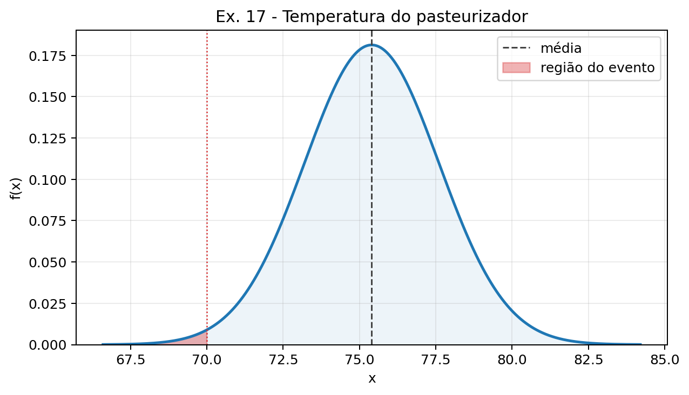

Temos $X \sim N(75{,}4,2{,}2^2)$.

### a)

$$
z=\frac{70-75{,}4}{2{,}2}=-2{,}45
$$

$$
P(X<70)=P(Z<-2{,}45)=0{,}0071
$$

### b)

Se $p=0{,}0071$ é a probabilidade de uma utilização ficar abaixo de 70°C, em 500 utilizações:

$$
Y \sim \operatorname{Binomial}(500,p)
$$

Usando aproximação normal:

$$
\mu=500p\approx 3{,}55
$$

$$
\sigma=\sqrt{500p(1-p)}\approx 1{,}88
$$

Com correção de continuidade:

$$
P(Y>5)\approx P(X>5{,}5)
$$

$$
z=\frac{5{,}5-3{,}55}{1{,}88}\approx 1{,}04
$$

$$
P(Y>5)\approx 0{,}15
$$

## Exercício 18

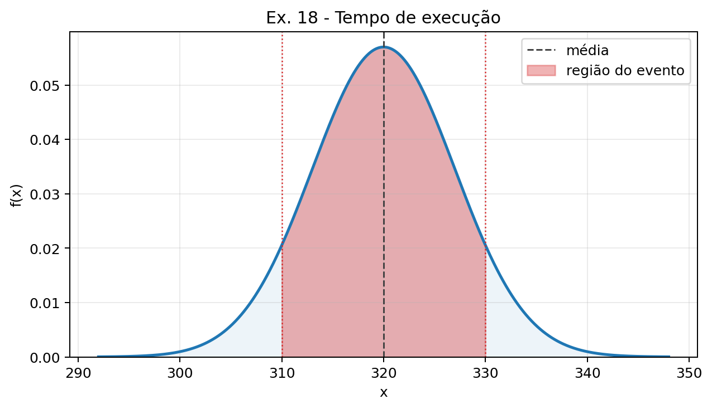

Temos $X \sim N(320,7^2)$.

### a)

$$
z_1=\frac{310-320}{7}=-1{,}43
$$

$$
z_2=\frac{330-320}{7}=1{,}43
$$

$$
P(310<X<330)=P(-1{,}43<Z<1{,}43)=0{,}8472
$$

### b)

Primeiro:

$$
p=P(X>325)
$$

$$
z=\frac{325-320}{7}=0{,}71
$$

Pela tabela, $p\approx 0{,}2389$.

Se $Y$ é o número de execuções acima de 325 segundos em 200 repetições:

$$
Y \sim \operatorname{Binomial}(200,0{,}2389)
$$

O gabarito registra:

$$
P(Y\ge 50)=0{,}3859
$$

Observação: usando cálculo computacional com $p$ não arredondado a partir da normal, obtém-se valor próximo, mas não idêntico, devido ao arredondamento de tabela.

## Exercício 19

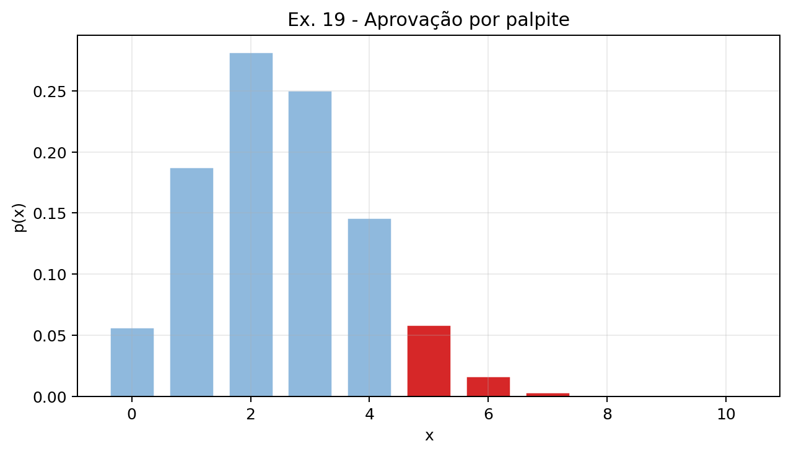

Em cada questão, a probabilidade de acerto por palpite é:

$$
p=\frac{1}{4}=0{,}25
$$

### a)

Para 10 questões, aprovação exige pelo menos 5 acertos:

$$
Y \sim \operatorname{Binomial}(10,0{,}25)
$$

$$
P(Y\ge 5)=1-P(Y\le 4)
$$

$$
P(Y\ge 5)=0{,}0781
$$

### b)

Para 100 questões, aprovação exige pelo menos 50 acertos:

$$
Y \sim \operatorname{Binomial}(100,0{,}25)
$$

$$
P(Y\ge 50)\approx 0
$$

## Exercício 20

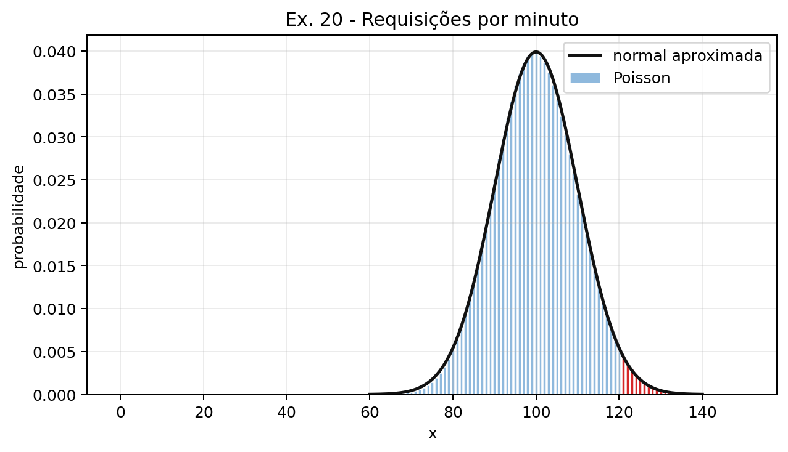

Temos $Y \sim \operatorname{Poisson}(100)$.

Usando aproximação normal:

$$
\mu=100
$$

$$
\sigma=\sqrt{100}=10
$$

Com correção de continuidade:

$$
P(Y>120)\approx P(X>120{,}5)
$$

$$
z=\frac{120{,}5-100}{10}=2{,}05
$$

$$
P(Y>120)\approx P(Z>2{,}05)=0{,}0202
$$

## Exercício 21

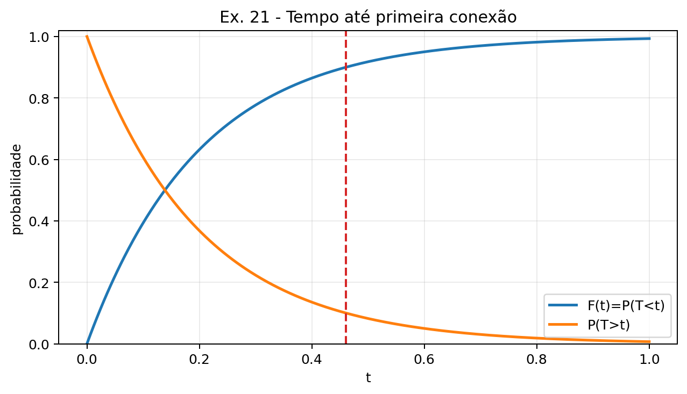

A taxa é:

$$
\lambda=5 \text{ conexões por minuto}
$$

Queremos:

$$
P(T<t_0)=0{,}90
$$

Como $T$ é o tempo até a primeira conexão:

$$
1-e^{-5t_0}=0{,}90
$$

$$
e^{-5t_0}=0{,}10
$$

$$
t_0=\frac{-\ln(0{,}10)}{5}=0{,}4605 \text{ minuto}
$$

Convertendo para segundos:

$$
0{,}4605\cdot 60=27{,}63
$$

Logo:

$$
t_0=27{,}63 \text{ segundos}
$$

## Exercício 22

Temos $X \sim N(4,0{,}19^2)$.

### a)

Queremos:

$$
P(3{,}7<X<4{,}3)
$$

Padronizando:

$$
z_1=\frac{3{,}7-4}{0{,}19}=-1{,}58
$$

$$
z_2=\frac{4{,}3-4}{0{,}19}=1{,}58
$$

$$
P(3{,}7<X<4{,}3)=P(-1{,}58<Z<1{,}58)=0{,}8858
$$

### b)

Queremos que:

$$
P(3{,}7<X<4{,}3)=0{,}95
$$

Como o intervalo é simétrico em torno da média 4:

$$
P\left(-\frac{0{,}3}{\sigma}<Z<\frac{0{,}3}{\sigma}\right)=0{,}95
$$

Logo:

$$
\frac{0{,}3}{\sigma}=1{,}96
$$

$$
\sigma=\frac{0{,}3}{1{,}96}=0{,}153
$$

O desvio padrão deveria ser aproximadamente:

$$
0{,}153 \text{ mm}
$$

## Exercício 23

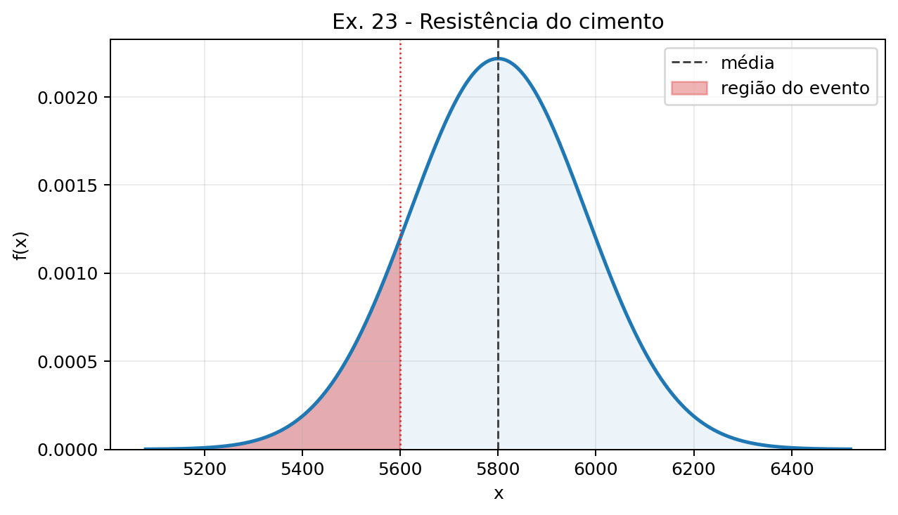

Temos $X \sim N(5800,180^2)$.

### a)

$$
z=\frac{5600-5800}{180}=-1{,}11
$$

$$
P(X<5600)=P(Z<-1{,}11)=0{,}1335
$$

### b)

$$
z_1=\frac{5600-5800}{180}=-1{,}11
$$

$$
z_2=\frac{5950-5800}{180}=0{,}83
$$

$$
P(5600<X<5950)=P(-1{,}11<Z<0{,}83)=0{,}6632
$$

### c)

Queremos:

$$
P(X>6000 \mid X>5600)
$$

Como $\{X>6000\}$ está contido em $\{X>5600\}$:

$$
P(X>6000 \mid X>5600)=\frac{P(X>6000)}{P(X>5600)}
$$

$$
z_{6000}=\frac{6000-5800}{180}=1{,}11
$$

$$
z_{5600}=\frac{5600-5800}{180}=-1{,}11
$$

$$
P(X>6000 \mid X>5600)
=\frac{P(Z>1{,}11)}{P(Z>-1{,}11)}
$$

$$
P(X>6000 \mid X>5600)=0{,}1541
$$

### d)

Queremos um valor $x$ tal que:

$$
P(X>x)=0{,}95
$$

Então:

$$
P(X<x)=0{,}05
$$

Pela tabela normal:

$$
z\approx -1{,}64
$$

Logo:

$$
x=5800+(-1{,}64)\cdot 180
$$

$$
x\approx 5504
$$

Portanto, a pressão máxima para garantir 95% de probabilidade de resistência é aproximadamente:

$$
5504 \text{ kg/cm}^2
$$

## Exercício 24

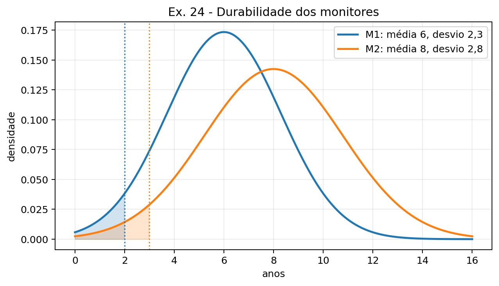

Para cada monitor, calcula-se a probabilidade de falha dentro do período de garantia. Depois, calcula-se o lucro esperado.

### Monitor M1

Durabilidade:

$$
X_1 \sim N(6,2{,}3^2)
$$

Garantia: 2 anos.

$$
z=\frac{2-6}{2{,}3}=-1{,}74
$$

Pela tabela:

$$
P(X_1<2)\approx 0{,}0409
$$

Então:

$$
E(M1)=100\cdot P(X_1\ge 2)-300\cdot P(X_1<2)
$$

$$
E(M1)\approx 100(0{,}9591)-300(0{,}0409)
$$

$$
E(M1)\approx R\$ 83{,}64
$$

### Monitor M2

Durabilidade:

$$
X_2 \sim N(8,2{,}8^2)
$$

Garantia: 3 anos.

$$
z=\frac{3-8}{2{,}8}=-1{,}79
$$

Pela tabela:

$$
P(X_2<3)\approx 0{,}0367
$$

Então:

$$
E(M2)=200\cdot P(X_2\ge 3)-800\cdot P(X_2<3)
$$

$$
E(M2)\approx 200(0{,}9633)-800(0{,}0367)
$$

$$
E(M2)\approx R\$ 163{,}30
$$

### Decisão

Como:

$$
E(M2)>E(M1)
$$

o monitor com maior lucro esperado é:

$$
\boxed{M2}
$$

Essa decisão compara médias de longo prazo. Ela não significa que o monitor M2 sempre dará maior lucro em cada venda individual.
